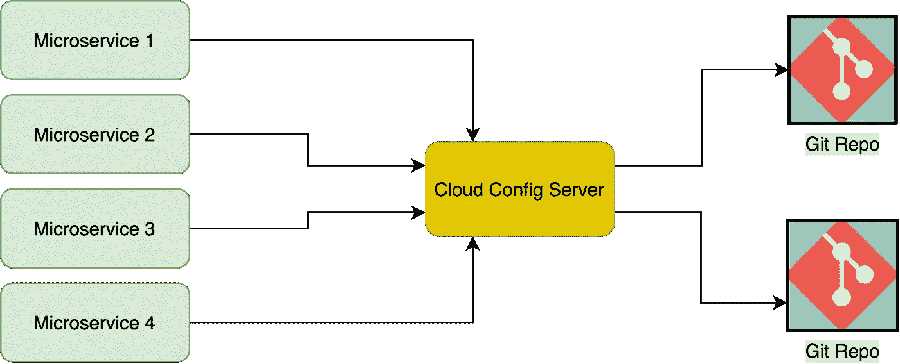

# Spring 云配置简介

> 原文：<https://medium.com/geekculture/introduction-to-spring-cloud-config-a5919335fea?source=collection_archive---------10----------------------->

开发应用程序的最佳实践是使其松散耦合。我们应该能够添加新的功能，属性，而不影响它的其他现有的功能。随着我们的应用程序发展成不同的微服务、模块，管理应用程序的属性变得很困难。哪个属性用于开发平台，哪个属性用于生产构建。随着属性的变化，我们必须重新构建、重新测试并再次部署应用程序。



Services connecting to config server for a single source of providing properties.

如果我们能够将所有的配置从不同服务的逻辑中分离出来，并且所有的服务都能够动态地读取应用程序，那该有多好。有不同的方法，比如 Spring Cloud Config、Consul、Zookeeper 等等。在本文中，我们将使用 Spring cloud-config 来集中管理应用程序的属性和配置。回购的详细代码可以在 [**这里**](https://github.com/ruminder-hub/spring_cloud_config) 找到，配置服务器和客户端代码可以在这个 [**链接**](https://github.com/ruminder-hub/medium/tree/main/spring_cloud_config) 找到。

## 优势

一致性:它是配置的唯一真理。
**省时**:您不需要重新部署应用程序，因为更改是动态进行的。
**基于配置文件的配置:**可以根据配置文件设置不同的配置。

## **配置来源:**

我们可以将所有配置放入一个微服务中，所有服务都可以从中获取数据。但是我们如何将配置放入其中呢？如果我们将它添加到源代码中，那么每当我们做出更改时，我们都需要重新部署它。我们可以使用数据库，这是一种可能性。然而，我们在这里使用 git repo 作为配置的来源。Spring Cloud config 从 git repo 获取配置，任何服务都可以从中获取。

## Git 回购

要创建一个 repo 并添加属性，请执行以下命令

```
mkdir configuration_repo
cd configuration_repo
git init .
echo logging.level.root: INFO > config-client-production.properties
echo logging.level.root: DEBUG > config-client-development.properties
git add .
git commit -m "Initialization of properties"
git push
```

我们已经基于概要文件创建了两个不同的配置文件。在代码中增加了更多的属性，你可以在这里 **勾选 [**。**](https://github.com/ruminder-hub/spring_cloud_config)**

## Spring 云配置服务器

我们已经创建了配置服务器接收属性的源。现在我们需要创建一个配置服务器，它将有助于微服务的配置。创建一个添加了 spring config server 依赖项的 spring 项目。如果您在创建项目后添加了 spring-cloud-config-server 依赖项。您必须在 dependencyManagement 中添加 spring-cloud 依赖项。将@EnableConfigServer 批注添加到 Spring boot 应用程序类。

```
@SpringBootApplication
@EnableConfigServer
public class SpringCloudConfigServerApplication {
   public static void main(String[] args) {
     SpringApplication.*run*(SpringCloudConfigServerApplication.class, args);
   }
}
```

现在我们需要指定路径/URL，配置服务器将从这里读取属性文件中的文件。我们可以使用 file、ssh 或 HTTP 来指定 git repo 路径。

```
spring.application.name=cloud-config-server
server.port=8888
spring.cloud.config.server.git.uri=https://github.com/ruminder-hub/spring_cloud_config
```

我在这里使用 HTTP 地址，你可以通过改变路径来使用文件。你可以在我的代码中用注释找到其他选项。要验证其工作，请使用以下网址之一。

```
/{application}/{profile}[/{label}]
/{application}-{profile}.yml
/{label}/{application}-{profile}.yml
/{application}-{profile}.properties
/{label}/{application}-{profile}.properties
```

application 代表文件名，profile 代表您想要使用的概要文件，label 是 branch name。
**curl http://localhost:8888/config-client/development/main**

****如果您使用带有标签的 URL，则必须提供分支名称，如果不提供，它将默认为 master(在 GitHub 中是默认的)，但是 GitHub 已经将其更改为 main，因此您需要在路径中提供 main。* *********

## Spring 云配置客户端

不，我们将创建微服务，它将使用来自配置服务器的配置。要做到这一点，服务必须声明自己是 spring config 服务器的客户机。为此，添加了依赖关系**spring-cloud-starter-config**。将以下值添加到属性文件中。

```
spring.application.name=config-client spring.profiles.active=development
spring.cloud.config.uri=http://localhost:8888
```

我们正在设置应用程序和配置文件的名称，以了解获取配置的 git repo 的确切文件。

*   现在，即使我们设置了这些属性，服务**也不会工作**。原因:Github 已经将默认分支更改为 **main** 但是 spring 仍然认为主分支是默认的。所以需要再设置一个属性**spring . cloud . config . label = main。**
*   如果您使用的是最新版本的 spring boot，请使用 spring . config . import = config server:http://localhost:8888，而不是 config.URL。
*   要测试，请使用不同级别的 API 打印日志并打印 database_name 来创建控制器。这里的 可以找到[的代码。](https://github.com/ruminder-hub/medium/blob/main/spring_cloud_config/spring_cloud_config_client/src/main/java/com/ruminderhub/spring_cloud_config_client/SpringCloudConfigClientApplication.java)

## 要点

*   为了减少从远程获取配置的延迟，服务会在第一次获取后制作属性的本地副本。
*   您可以为不同的应用程序设置不同的 git repo。
*   您可以控制您的服务检查配置服务器是否有任何属性更改的频率。设置**刷新率**的值
*   有可能配置的本地副本被破坏，即使获取了最新的副本也无法更新它。为此，您可以使用 **force-pull** 来强制更新配置。

从上面的文章中，我相信你会对在你的项目中使用 Spring Cloud Config 有更好的理解。如果你有任何问题，请在聊天中发表。谢了。