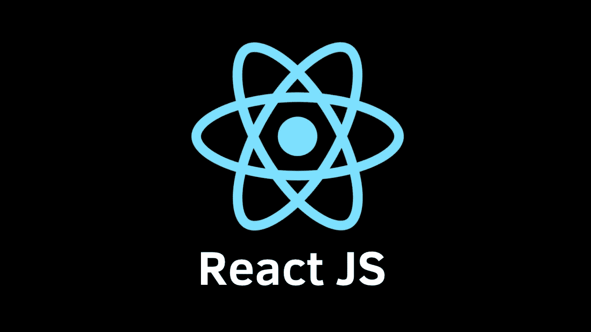

# React 入门教程:第 2 部分

> 原文：<https://medium.com/geekculture/introductory-tutorial-to-react-part-2-b176db2496a8?source=collection_archive---------18----------------------->

本教程旨在为 React 提供一个清晰的介绍(假设没有先验知识)



确保从本教程的第 1 部分开始，点击[此处](https://sarahkatharinabuehler.medium.com/introductory-tutorial-to-react-part-1-3468f37bea5a)。

# 完成游戏

我们现在有了井字游戏的基本构件。为了有一个完整的游戏，我们现在需要在棋盘上交替放置“X”和“O ”,我们需要一种方法来确定赢家。

为了检查赢家，我们需要将每个方块的值存储在一个位置。最好的方法是将它存储在母板组件中，而不是每个方块中。通过传递一个道具，Board 组件可以告诉每个方块显示什么，就像我们向每个方块传递一个数字一样。

> "要从多个子组件收集数据，或者让两个子组件相互通信，您需要在它们的父组件中声明共享状态。父组件可以通过使用 props 将状态传递回子组件；这使子组件彼此保持同步，并与父组件保持同步。

这听起来可能很复杂，但是你会看到很多概念，比如道具传递，在前面的步骤中都很熟悉！

所以我们要做的第一件事，就是给 Board 组件添加一个状态。让我们调用当前状态方块和函数 updateSquares(稍后指定),并将初始值设置为与 9 个方块对应的 9 个空字段的数组:

```
const Board = () => {
   **const [squares, updateSquares] = useState(Array(9).fill())**
```

请记住我们在开始时所做的:在 Board 组件中，我们使用`<Square value={props.index}`将价值道具(索引 0 到 8)作为`value`从 Board 传递到 Square 组件。让我们再次使用道具传递机制，让 value 反映棋盘当前状态数组的索引`squares:`

```
const TicTacToeSquare = props => {
   return(<Square value={**squares[props.index]**} />)}
```

接下来，我们需要改变当一个方块被点击时会发生什么。记住一个状态钩子对于定义它的组件总是私有的，所以我们需要为 Square 创建一个方法来更新棋盘的状态。相反，我们将把一个函数从 Board 传递到 square，并让 Square 在单击 Square 时调用该函数。为了将事件处理程序 **onClick** 作为道具传递给子组件，我们使用函数 **handleClick，**，稍后我们将指定该函数:

```
const TicTacToeSquare = props => {
   return(<Square value={squares[props.index]} **onClick={() => handleClick(props.index)**}/>)}
```

现在我们将两个道具从棋盘传到方块:`value`和`onClick`。因此，我们需要对 Square 组件进行以下更改:删除`useState`表达式和`const click`，并将状态`value`替换为`props.value`，因为 Square 不再跟踪游戏的状态！将`onClick{click}`内的`click`换成从板上传下来的`props.onClick,`；

```
const Square = (props) => {
  return (
     <button className="square" onClick={**props.onClick**}> 
   **  {props.value}** 
     </button>
)}
```

在这个阶段刷新浏览器会抛出一个错误，因为**板组件**中的某些东西还没有定义。试着去经历它，并为自己找出它可能是什么。*提示:这与下面的 useState 挂钩有关。*

```
const [squares, updateSquares] = useState(Array(9).fill())
```

答案是，我们还没有定义`updateSquares`函数应该如何更新`squares`状态。让我们现在就在**板组件**中进行。

我们现在要做的是使用**扩展操作符** ( [阅读更多关于它的内容](https://developer.mozilla.org/en-US/docs/Web/JavaScript/Reference/Operators/Spread_syntax))，它允许我们将 ***作为状态数组*** 的副本，或者作为替代，进行数组切片(我们现在不使用它，但是可以随意阅读[阅读更多关于它的内容](https://developer.mozilla.org/en-US/docs/Web/JavaScript/Reference/Global_Objects/Array/slice))。这样，我们可以创建一个正方形的副本，并将其赋给一个新变量，我们可以用“X”替换它的属性，然后将它赋给之前在 useState 钩子中未定义的`updateSquares`函数。在不变性小节中，我们将简要解释为什么我们创建一个正方形数组的副本，而不是修改原始数组。

现在，实施这些更改:

```
const Board = () => {
 **const handleClick = (props) => {
   const newSquares = [...squares]
   newSquares[props] = "X"
   updateSquares(newSquares) }**
```

***我们的浏览器现在发生了什么？***

其实和以前一样。当我们点击棋盘上的一个方块时，它会被填充一个 x。

***但是后台发生了什么？***

1.  当用户点击其中一个方块时，在方块的`return()`表达式中指定的`onClick`事件处理程序被激活。
2.  这个事件处理程序依次调用`props.onClick()`，它是 Board 组件中指定的`onClick`道具。
3.  由于棋盘将函数`handleClick(props.index)`传递给`onClick`，当用户点击一个方块时，该函数被调用。
4.  因此，当 handleClick 函数被调用时，会生成一个状态数组的副本，并用 X 填充(注意，只有那些被单击的方块)。这意味着所有方块的状态现在存储在棋盘组件中，而不是单独的方块组件中，这允许我们在未来确定游戏的赢家。

> 因为方形组件不再保持状态，所以方形组件从 Board 组件接收值，并在它们被单击时通知 Board 组件。用 React 术语来说，方形组件现在是**控制的组件**。董事会对他们有完全的控制权。

## 不变

通常有两种方法来改变数据。

1.  *通过直接改变数据的值来改变数据。示例:*

```
const player = {score: 1, name: 'Jeff'};
player.score = 2;
// Now player is {score: 2, name: 'Jeff'}
```

1.  *用具有所需更改的新副本替换*数据。示例:

```
const player = {score: 1, name: 'Jeff'};
const newPlayer = {...player, score: 2};
// using object spread syntax
```

现在，创建新副本的好处是什么？

***撤销和重做*** :避免直接的数据突变可以让我们保持游戏历史的先前版本不变，以便我们可以访问它们，例如当用户想要撤销和重做某些动作时。

***检测变更*** :我们可以很容易地检查以前的版本是否与变更后的版本不同

***确定组件何时需要重新渲染。***

# 现在回到游戏

我们现在需要修复井字游戏中的一个明显缺陷:不能在棋盘上标记“O”。

默认情况下，我们将继续保留第一步“X”。为此，我们在 Board 组件中创建了另一个 useState 钩子，并将初始状态变量设置为`true.`

```
const [xisNext, updateXisNext] = useState(true)
```

现在我们可以使用一个新概念:使用 JavaScript **条件操作符** `[condition ? true : false](https://developer.mozilla.org/en/docs/Web/JavaScript/Reference/Operators/Conditional_Operator)`的内联 if-else 条件呈现。首先，我们希望在 handleClick 函数中指定，每当单击一个正方形时，如果 xisNext 为 true(在游戏开始时，它总是为 true)，则浏览器上的 newSquares 数组中的值将为 X。否则，如果是**假**，那么被点击的方块中就会出现 O。现在，我们如何让 xisNext 在每秒点击时为假？通过使用 updateXisNext 函数用当前 XisNext 的逻辑 not 更新状态。

> 感叹号("！")符号是**的逻辑“非”运算符**。放在布尔值的前面，它反转该值，返回相反的值。如 ***！true*** 返回 false。

```
const handleClick = (props) => {
    const newSquares = [...squares]
    newSquares[props] = **xisNext? "X" : "O"**
    updateSquares(newSquares)
    **updateXisNext(!xisNext)** }
```

让我们也改变棋盘上的“状态”文本，以便它显示哪个玩家有下一轮:

```
const status = `Next player: ${xisNext? "X" : "O"}`
```

> ${}用于将变量插入字符串，并将其解释为字符串

# 宣布获胜者

现在，我们应该显示什么时候游戏赢了，没有更多的机会了。请记住，方块索引的格式如下:
0 1 2
3 4 5
6 7 8

让我们声明一个新函数，并将其命名为 **calculateWinner** 和输入 **squares。**基于方块的格式，我们确定所有的**获胜组合**，并将它们声明为一个变量(我们称之为 **lines** )，我们可以迭代通过该变量来查看输入的方块数组是否有一条全是 X 或全是 O 的线(即，赢)。

```
function calculateWinner(squares) {
 const lines = [
 [0, 1, 2],
 [3, 4, 5],
 [6, 7, 8],
 [0, 3, 6],
 [1, 4, 7],
 [2, 5, 8], 
 [0, 4, 8],
 [2, 4, 6],] }
```

所以接下来我们用一个 *for 循环和 if 语句*来指定: **For** 每一行****行数组****上面的【a，b，c】被定义为 ***行*** 以便标记列的位置然后**如果**正方形数组中位置[a]的值等于位置[b]和[c],则返回正方形[a]位置的值。如果输入方块数组中不包含任何赢线组合，则返回 **null。像往常一样，有不止一种方法可以做到这一点，尝试不同的方法是非常有帮助的！****

```
**for (let line of lines) {
  if (squares[a] === squares[b] && squares[a] === squares[c])
  return squares[a]}
  return null }**
```

**二者择一地**

```
**for (let line of lines) {
  const [a, b, c] = line
  const equal = squares[a] === squares[b] && squares[a] === squares[c]
  return(equal? squares[a] : squares[''])}**
```

**现在，让我解释一下上面代码中的一些内容:**

*   **我们使用`[**let**](https://developer.mozilla.org/en/docs/Web/JavaScript/Reference/Statements/let)` *行的行*而不是`const`，因为变量**行**将被重新分配。**
*   **如果用逻辑 **& &** 运算符:如果在& &之前指定的条件是`true`，那么`&&`之后的元素将出现在输出中。如果是`false`，React 会忽略并跳过它。**
*   **=== (Triple equals)是 JavaScript 中的一个**严格相等比较运算符**，它为不同类型的值返回 false。如果我们用===来比较 2 和“2”，那么它将返回一个假值。使用两个等号将返回 true，因为在进行比较之前，字符串“2”被转换为数字 2。**
*   **语法*相等？squares[a] : squares['']* 表示如果 equal 为**真**，则执行 *squares[a]* 否则执行 *squares['']* (为空字段)**
*   **在 JSX 中不能有 JS 变量声明或循环，所以我们需要把它指定为一个函数，在返回表达式中调用。**

**接下来我们调用棋盘中的`calculateWinner(squares)`来检查玩家是否赢了。如果一个玩家赢了，我们可以显示文本，如“赢家:X”或“赢家:O”。我们将用下面几行代码替换公告板中的`status`声明:**

```
**const winner = calculateWinner(squares)
const status = winner? `Winner: ${winner}` : `Next player: ${xisNext ? 'X' : 'O'}`**
```

**我们现在可以改变棋盘的`handleClick`功能，如果有人赢了游戏或者一个方块已经被 X 或 O 填满，我们可以忽略一次点击而提前返回:**

```
**const handleClick = (props) => {
   const newSquares = [...squares]
   const winnerDeclared = Boolean(calculateWinner(newSquares))
   const squareFilled = Boolean(newSquares[props])
   if (winnerDeclared || squareFilled) return
   newSquares[props] = xisNext? "X" : "O"
   updateSquares(newSquares)
   updateXisNext(!xisNext)}**
```

> **注意:对于任何非空、非零、对象或数组，Boolean()将返回 true，而如果正方形是空的，则返回 false，因为在正方形数组的副本中还没有计算出获胜者。**
> 
> **逻辑**或**运算符:`*(a || b)*`如果`*a*`为真则不计算`*b*`并返回`*a*`，如果为假则计算并返回`*b.*`**

# **存储移动历史**

**作为最后一个练习，让我们能够“及时回到”游戏中的前一步。**

**还记得我们如何使用`[...squares]`在每次点击后复制一个正方形数组，而不是改变它。这允许我们存储`squares`数组的每个过去版本，并在已经发生的回合之间导航。我们将过去的`squares`数组存储在另一个名为`history`的数组中，该数组代表从第一步到最后一步棋的所有棋盘状态。它应该具有以下结构:**

```
**history = [
  // Before first move
  {
    squares: [
      null, null, null,
      null, null, null,
      null, null, null,
    ]
  },
  // After first move
  {
    squares: [
      null, null, null,
      null, 'X', null,
      null, null, null,
    ]
  },]**
```

**遵循与上次提升状态相同的逻辑，我们希望将`history`状态存储在棋盘的父组件:游戏组件中。这给了游戏组件对棋盘数据的完全控制权，并让它指示棋盘呈现来自`history`的先前移动。**

**首先，我们将使用如上所示的结构来设置游戏组件的初始状态:**

```
**const Game = () => {
   const initialHistory = [{ squares: Array(9).fill(null) }];
   const [history, setHistory] = useState(initialHistory);
   const [xIsNext, setXIsNext] = useState(true);**
```

**接下来，我们将让棋盘组件接收来自游戏组件的`squares`和`onClick`道具。因为我们现在有了一个用于许多方块的单击处理程序，我们需要将每个方块的位置传递给`onClick`处理程序来指示哪个方块被单击了。以下是转换电路板组件所需的步骤:**

*   **删除板上的`useState`表情。**
*   **将板的`renderSquare`中的`squares[i]`替换为`props.squares[i]`。**
*   **将板的`renderSquare`中的`handleClick(i)`替换为`props.onClick(i)`。**

```
**const Board = (props) => {
   const TicTacToeSquare = (number) => {
   return(<Square value={props.squares[number.index]}
   onClick={() => props.onClick(number.index)}/>)}return ( 
   <div> 
   <div className="board-row">
   <TicTacToeSquare index={0} />
...**
```

**我们需要将`handleClick`功能从棋盘组件转移到游戏组件。我们还需要修改`handleClick`，因为游戏组件的状态结构不同。在游戏的`handleClick`功能中，我们将新的历史条目连接到历史上。**

```
**const handleClick = i => {
    const currentStep = history[history.length - 1];
    const newSquares = [...currentStep.squares];

    const winnerDeclared = Boolean(calculateWinner(newSquares));
    const squareAlreadyFilled = Boolean(newSquares[i]);
    if (winnerDeclared || squareAlreadyFilled) return;

    newSquares[i] = xIsNext ? 'X' : 'O';
    const newHistory = [...history, {squares: newSquares}]; setHistory(newHistory);
    setXIsNext(!xIsNext);**
```

**我们上面所做的看起来很复杂，所以让我解释一下:**

*   **历史以数组的形式提供了棋盘每一步棋的“屏幕截图”，其中包含当前被 O 或 x 占据的方格。然后**history[history . length-1]**仅从历史中获取最后一步棋，其中包含一个包含所有当前被占据方格的数组。这被分配给一个新的变量 currentStep。**
*   **然后我们在制作 currentStep 的副本时使用…currentStep.squares，因为我们想要提取在历史中用 squares 指定的**数组**，并将其分配给一个新的数组 newSquares。**
*   **为了指定 winnerDeclared，我们在 newSquares 上使用 **calculateWinner** 函数，以确定最后一步棋的方格数组中是否有赢家。我们再次将它设为布尔值，如果有则返回 true，如果没有则返回 false(即函数返回 null)。**
*   **为了指定 squareAlreadyFilled，我们使用 newSquares[i],因为每当点击一个空的**正方形时，它返回 null，这作为布尔值是假的，而对于一个被占用的**正方形，当转换为布尔值时，它返回 X 或 O，这是真的。******
*   ****if(winner declared | | squareAlreadyFilled)返回；**意味着如果这两种情况中的任何一种是真的，我们就提前返回，不再允许点击**
*   **With **newSquares[i] = xIsNext？x ':' O '；我们确保值在 X 和 O 之间交替，并被重新分配给新方块中的每个方块，这样新方块就可以被重新分配为 squares: Array****
*   **然后，我们将 newSquares 添加回 **{squares: newSquares}** 中，并使用 **…history** 将其添加到新的历史副本中，我们称之为 **newHistory。****
*   **所有这些，使用 setHistory(newHistory)用其更新函数 **setHistory** 更新**状态历史**为 **newHistory****

> ****为什么 history.length — 1？因为 Javascript 数组是从 0 开始的，这意味着如果你有一个包含 5 个条目的数组，你将使用索引 0 到 4 来访问它们。我们减去一，得到最后一个索引。****

**然后，我们通过添加以下内容来更新游戏组件，以使用最近的历史条目来确定和显示游戏的状态:**

```
**const currentStep = history[history.length - 1];
  const winner = calculateWinner(currentStep.squares);
  const status = winner
    ? `Winner: ${winner}`
    : `Next player: ${xIsNext ? 'X' : 'O'}`;**
```

**在游戏组件的返回表达式中，我们更新了以下内容，以反映我们在上面所做的更改:**

```
**return (
    <div className="game">
      <div className="game-board">
        <Board
 **squares={currentStep.squares} 
          onClick={i => handleClick(i)}**
        />
      </div>
      <div className="game-info">
        <div>{**status**}</div>
        <ol>{}</ol>
      </div>
    </div>
  );**
```

**此时，板组件只需要`renderSquare`函数和`return`表达式。游戏的状态和`handleClick`功能应该在游戏组件中。**

*****注:*** 我最初有一个错误，因为我把父组件 Game 的道具调用和内部道具 index 的调用搞混了，index 来自元素 TicTacToeSquare，它代表一个用户定义的组件。既然我们已经将 squares 和 onClick 之类的道具从游戏组件传递到了棋盘上，我们需要使用一个单独的名称(例如，number，但它可以被称为任何东西)来传递到用户定义的 TicTacToeSquare 中。然后我们可以使用 number.index 分别从 TicTacToeSquare 到 props 调用道具索引，后者调用。正方形和。来自游戏组件的 onClick。**

```
**const TicTacToeSquare = (number) => {
   return(
   <Square 
   value={props.squares[number.index]}
   onClick={() => props.onClick(number.index)}/> )}**
```

# *****恭喜恭喜！*****

**您已经在 web 浏览器中创建了一个井字游戏，更重要的是，您还学习了 react 编程的一些基础知识和逻辑。**

***我将在这里停止教程，但如果你想知道如何在浏览器上显示历史作为过去移动的列表，请使用 Tom Bowden 的* [*剩余指令*](/@tombowden_8885/tutorial-intro-to-react-with-hooks-89b331f54b50) *。***