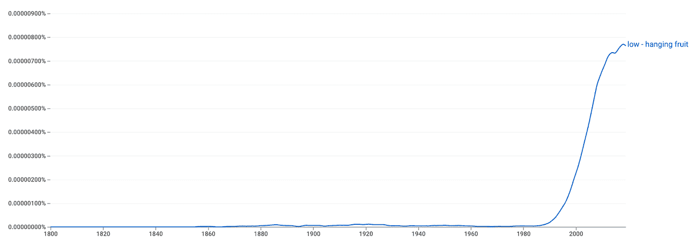
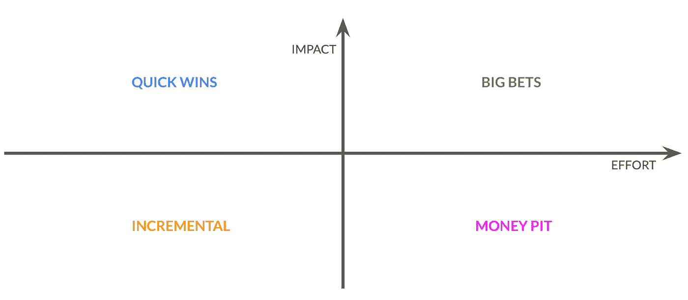
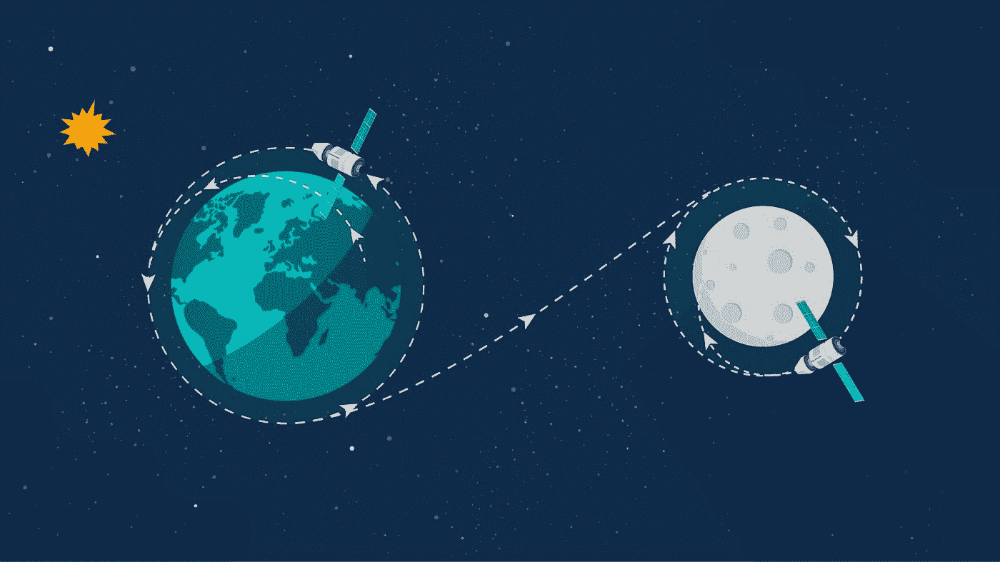

# 是时候重新思考……‘低垂的果实’了吗？

> 原文：<https://medium.com/geekculture/is-it-time-to-rethink-low-hanging-fruit-4742bb429ff?source=collection_archive---------8----------------------->

Is that piece of fruit you’re reaching for quite as delicious as it looks? (Illustration by Ben Piggott at @apt_pseudonym)

在这个由三部分组成的系列[的第二部分](/geekculture/is-it-time-to-rethink-data-is-the-new-oil-6a7aa32dbeb9)中，我将检查短语“[低处悬挂的果实](https://dictionary.cambridge.org/dictionary/english/low-hanging-fruit)”。用来形容先做最简单、最容易的事情，比喻想象出天堂的景象；丰富美味的食物，可以摘下来吃，不用停下脚步。在现代商业用语中，这一短语的力量已经被诸如“[影响/努力矩阵](https://miro.com/templates/impact-effort-matrix/)”这样的技术所强化，这有助于引导决策者走向“速赢”。

以我的经验来看,“低垂的果实”这个短语在各种规模和部门的组织中无处不在，但它最常用于当更大的挑战被认为——有意或无意地——太难以应对时。例如，当我最近与一家大型食品零售商合作时，我目睹了整个团队小心翼翼地绕过一个古老而多变的系统，就好像它是一颗未爆炸的炸弹。人们经常表示担心，如果他们接触到遗留代码的任何一行，他们就有可能毁掉整个业务。

在这种情况下，组织可能不可避免地会沉迷于简单快捷的想法，这些想法不会干扰他们业务中复杂的部分。但这种谨慎是有代价的:也就是说，推迟解决更难的问题，以产生有意义的结果，比如创造可持续的竞争优势来源。简而言之，我观察到组织浪费了太多时间追求低回报，而忽略了更有价值的——如果更难实现的话——结果。

# **【果实低垂】**

虽然短语“低垂的果实”的起源可以追溯到 17 世纪，但这个隐喻的第一次重要使用是在诗人 P. J .卡瓦诺 1968 年发表在《卫报》的一篇文章中。正如你从下面的 NGram 中看到的，这个短语在 20 世纪 90 年代初突然出现，从那以后迅速发展。

*图 1:显示短语“低垂的果实”随时间变化的用法的 NGram】*

不可否认，这个比喻很普遍，但它有用吗？这篇文章的灵感来自于我对低垂的果实的思考，以及每年秋天我们出去摘黑莓时我妈妈常说的话。她告诉我要避开灌木上最低的浆果，因为它们最有可能被动物尿过。回想起来，这是个绝妙的建议。

我认为这个比喻在检验中有缺陷还有其他原因。最低挂的水果，如草莓，需要非常努力才能收获。这篇文章详细分析了专业水果采摘者的技术，指出他们总是

> “……从采摘较高的水果开始，有几个原因。在高处的水果有更多的阳光照射，这意味着在大多数情况下，它更成熟，可以吃了。此外，当摘水果的人从树顶开始摘水果时，他们这边有重力。当他们的包变重时，他们可以向下走，而不是向上爬。最后，挂得较低的水果容易被虫子损坏、碰伤或不熟。”

但是我是不是太字面意思了？这些与水果相关的细节对在现代组织中工作的人真的重要吗？这些人试图做出好的优先顺序决定。

# **赛车垫底**

正如我上面提到的，自 90 年代初以来,“低挂果实”一词的使用加速，部分原因是“影响/努力矩阵”的普遍存在，这可能是管理咨询中最普遍的技术:

*图 2:影响/工作矩阵示例*

这个看似简单的 2x2 网格允许团队和个人根据附加值和所需的努力对他们的想法进行分类。我已经无数次地使用过它，当要求团队投票选出他们组织的最佳下一步时。不可避免地，投票倾向于聚集在“速赢”象限。换句话说，人们总是选择挂得最低的水果。

“速赢”如果能鼓励组织开始解决更大、更难的问题，那就太棒了。但我开始怀疑“影响/努力矩阵”更多时候是一种干扰。首先，这项技术包含了批改作业时固有的偏见。也就是说，如果[你碰巧喜欢一个想法](https://methods.sagepub.com/reference/encyclopedia-of-survey-research-methods/n537.xml)，并且/或者它首先是你的，你更有可能认为水果比其他人的更容易摘到。除此之外，还有规模的问题——矩阵意味着快速获胜的影响可与“大赌注”相媲美。这种情况很少发生。

# **一小步一大步**

众所周知，月亮是奶酪做的，不是水果。但是请原谅我。

阿波罗任务不仅是人类最伟大的事业，也被许多人认为是敏捷思维的缩影。登月当然证明了当我们摘到最高最硬的水果时会取得什么样的成就。事实上，甘乃迪总统在莱斯大学的著名演讲中[承认了正在尝试的事情的难度:](https://er.jsc.nasa.gov/seh/ricetalk.htm)

> “我们在这十年里选择去月球和做其他的事情， ***不是因为它们容易，而是因为它们难*** 【我强调】

然而，自 1972 年以来，人类还没有重返月球。我想到，那些为阿波罗计划的成功做出贡献的 40 万名令人难以置信的献身精神的男男女女，由于害怕被俄国人抢先登上月球而受到激励，最终却摘到了尽可能低的挂着的果子。也就是说，他们实现了第一个人登上月球的紧迫的短期目标，但代价是一个更艰难、更有价值的结果，即大规模的可负担得起的月球旅行。

*图 3:登月原始计划(*studioleeroy.com[设计](http://studioleeroy.com/))

最初的登月计划与阿波罗时代最终发生的事情非常不同，也更加雄心勃勃。宇航员将被发射到近地轨道的空间站，登上另一艘飞船，穿梭到月球轨道的第二个空间站，并从那里降落到月球。投资这样的基础设施几乎可以保证未来几十年以边际成本定期去月球旅行。取而代之的是，美国国家航空航天局的工程师们——为了寻求最快最简单的方法来实现他们的目标——将他们的努力倾注在一系列一次性的“登月计划”上。这样，他们创造了最昂贵、最不可持续的到达月球并安全返回地球的方式。这就是为什么 20 次阿波罗任务中只有 17 次完成了；这就是我们将近 50 年没有踏上月球的原因。

# **最后的想法**

我们学到了什么？

“低垂的果实”的比喻是不可取的，因为除了(有时)更容易、更快收获之外，没有理由认为低垂的果实更好。事实上，挂得更高的水果通常更成熟、更有营养。

实现一个想法的估计价值需要多少努力通常是主观的，容易产生偏见和错误，正如其他人所指出的:

> 你离水果越远，它看起来就越低。

总是伸手拿最底层的水果可能在短期内看起来有效，但从长远来看，可能会分散我们对更有价值的——如果更难实现的——结果的注意力。不受限制的渐进主义的诱惑——把时间、精力和资源花在逐渐优化不重要的事情上——意味着我们经常错过完全重新思考事情的机会。在与一家初创公司的首席执行官讨论这篇文章时，他告诉我:

> “在早期阶段，我们经常会想，我们是否在业务和产品开发活动中花了太多时间追求‘速赢’。在我们的情况下——包括必须不断吸引资金来继续交易——不可避免地会偏向短期主义。但回顾过去六个月的努力，我们意识到我们几乎停留在了与开始时完全相同的位置。”

所以，下次你发现自己指着影响/努力矩阵的“速赢”象限左上角的便笺时，花点时间问问自己:我是否有以错误的方式、错误的理由追求错误的事情的危险？或者换一种说法，这块低挂的水果真的有看起来那么好吃吗？

大卫·考克斯是平等专家公司的首席顾问