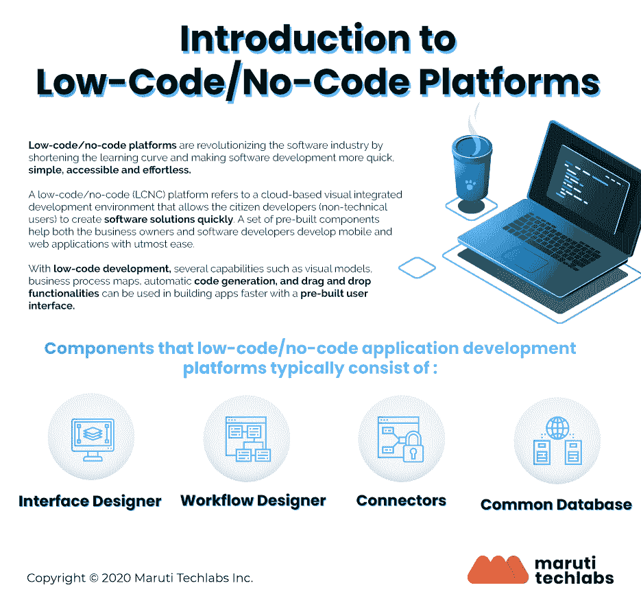
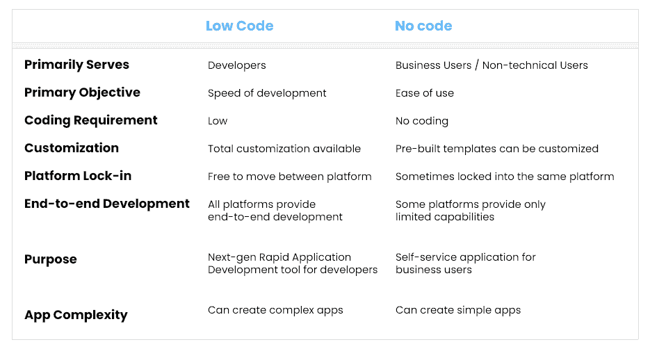
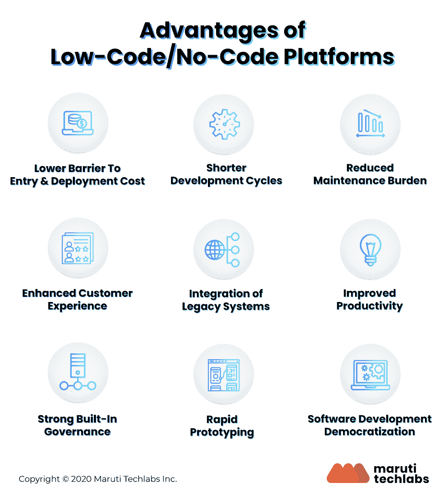
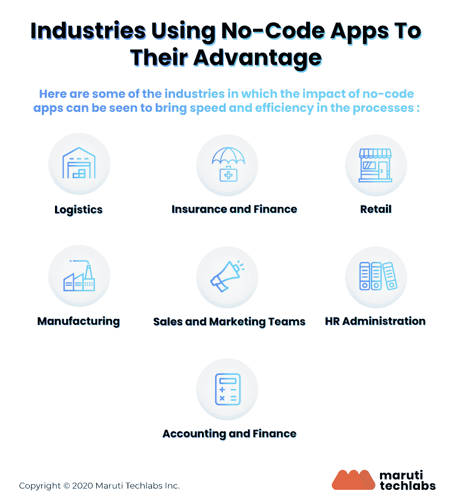

# 低代码无代码是软件开发的未来吗？

> 原文：<https://medium.com/geekculture/is-low-code-no-code-the-future-of-software-development-7b4ea6b64130?source=collection_archive---------3----------------------->

## 多年来，软件开发一直是一个精细而复杂的过程。

但是低代码/无代码开发的引入正在将软件开发变成一个周转时间更短的更简单的过程。

在软件开发行业中，低代码/无代码平台使得高质量和更快的交付成为可能。让我们了解什么是低代码/无代码开发，为什么它正在获得动力，以及它如何改变软件空间。

> 低代码/无代码平台缩短了学习曲线，使软件开发更加快速、简单、易用和轻松，从而彻底改变了软件行业。

低代码/无代码(LCNC)平台是指基于云的可视化集成开发环境，允许[公民开发者](https://marutitech.com/what-is-a-citizen-developer/)(非技术用户)快速创建软件解决方案。一组预构建的组件帮助企业所有者和软件开发人员极其轻松地开发移动和 web 应用程序。

借助低代码开发，可视化模型、业务流程图、自动代码生成和拖放功能等多种功能可以通过预构建的用户界面更快地构建应用。

最重要的是，通过这种方法，应用程序可以在所有设备上同时部署。它使得使用图形用户界面(GUI)变得很方便，该界面允许将组件和第三方应用程序接口(API)连接在一起并进行测试。

# 为什么低码这个概念正在兴起？

根据[最近的 Forrester 报告](https://www.forrester.com/report/The+Forrester+Wave+LowCode+Development+Platforms+For+ADD+Professionals+Q1+2019/-/E-RES144387)，低代码市场将达到 40%的年增长率，预计到 2022 年支出将达到 212 亿美元。

这是巨大的！

低代码模式兴起的一个最突出的原因是更快的交付能力和更大的创新。在快速发展的世界中，数字创新在业务增长中发挥着关键作用，速度和创新可以完全改变企业的游戏规则。

这种模式受欢迎的一些主要原因包括

*   通过加速构建应用程序的整个开发过程，低代码使 IT 团队更有生产力。
*   低代码平台的健壮敏捷转化为容易适应的过程和更快可部署的解决方案。
*   通过低代码开发，非技术用户可以创建和修改应用程序、功能和流程，从而减轻开发人员的压力
*   使用 LCNC 方法，开发人员可以更快地构建应用程序，因为它免除了他们逐行编写代码的需要。

# 低代码/无代码平台的发展

虽然低代码/无代码开发的概念诞生于 2014 年，当时这个短语首次被提出，但它的根源可以追溯到 20 世纪 90 年代。

低代码/无代码平台的起源可以追溯到早期的[快速应用程序开发](https://marutitech.com/rapid-application-development/) (RAD)工具，如 Lotus Notes、Microsoft Access 和 Excel，这些工具将一些类似开发的功能交给了没有技术背景的业务用户。

但是，与早期的 RAD 工具不同，早期的 RAD 工具需要用户对开发环境和业务应用程序都有透彻的理解才能构建功能，低代码和无代码选项通过它们的拖放功能更加流畅。

[由于开发项目所需周转时间的增加和可用的熟练软件开发人员数量的减少，低代码平台](https://marutitech.com/best-low-code-platforms/)从一开始就以指数速度增长。

低代码/无代码应用程序开发平台通常包括以下组件

*   *界面设计师*
*   *工作流设计器*
*   *连接器*
*   *公共数据库*

# 低代码和无代码开发平台的区别

一般来说，无代码平台是专门的或独特类型的低代码云平台，其中所需的可视化组件处理各种特定于行业的功能，不需要任何编码知识。而低代码平台可能需要内部开发人员的一些帮助，以便对后端代码进行少量更改，从而使新应用程序与其他商业软件兼容。

虽然无代码平台用于创建应用程序和点解决方案来处理更简单的功能，但低代码平台也可以用于处理作为公司核心系统一部分或运行关键流程的应用程序的创建。

不管构建它的平台是什么(无代码或低代码)，业务应用程序主要是为解决大型和小型组织面临的持续问题而设计的。LCNC 方法提供了一种灵活的方式来工作和装备开发团队，以在移动和数据驱动的环境中脱颖而出。

[低代码和无代码平台](https://marutitech.com/best-low-code-platforms/)还可以帮助提高客户满意度，并启动整个组织的数字化转型，因为它们提供了一些强大的功能，包括实时报告仪表板，以揭示趋势和管理项目。

# 低代码/无代码平台的优势

在当今的商业环境中，企业不断试图减少他们需求的周转时间。低代码/无代码现象为组织提供了多种好处。其中一些将在下面讨论

*   **降低准入门槛、部署时间和成本**

LCNC 平台为非 IT 专业人员提供了更好的问题解决能力，使他们能够轻松快速地创建业务应用程序(包括 web 和移动应用程序)，帮助他们完成日常工作。该方法降低了准入门槛、部署时间和成本。这仅仅是因为完全开发不需要专业的编码人员。

> 低代码/无代码平台的另一个优势是它们提供的应用程序的开发和交付速度。这在当今的数字时代尤为重要，因为组织需要快速工作以满足客户需求。

*   **加快开发周期**

低代码/无代码应用程序开发有助于加快开发周期，降低创新门槛。没有编码经验的非技术人员现在可以轻松地构建和创建数字产品。该平台最棒的地方在于，它允许在几分钟内创建功能良好的产品和视觉上有吸引力的设计，而不是一次花费数周。

*   **减轻维护负担**

低代码开发通过从日常开发中抽象出多个繁琐的任务来减轻软件维护的负担。与传统开发相比，使用标准化的、预先测试的和现成的组件，需要处理的集成问题要少得多。它允许开发人员减少维护时间，并专注于更具创新性的任务，从而带来更大的商业价值。

*   **提升客户体验**

低代码/无代码平台自动化了对客户体验至关重要的多项操作。应用程序开发的灵活性和强大的业务流程功能有助于构建更好的应用程序，从而改善整体客户体验。

*   **遗留系统的集成**

除了增加应用程序开发的灵活性，低代码平台也可用于集成遗留的大型机系统。遗留集成带来了多种好处，包括更快的开发、快速适应新需求的能力以及更具弹性的解决方案。

*   **跨团队提高生产力**

低代码/无代码平台有助于弥合 IT 和业务团队之间的差距，允许他们解决影响公司的实际问题。使用 LCNC 方法，业务团队可以创建他们自己的应用程序，而不必等待开发人员。它消除了对复杂代码的需求，增加了对更多团队成员的访问，从而提高了生产率。

*   **强大的内置治理**

低代码平台有助于自动化由组织中的专业 IT 团队管理和监控的治理功能。这意味着，虽然用户可以根据组织要求开发应用程序，但没有 IT 部门的最终批准，他们不能部署。

> 另请阅读:[低代码/无代码开发与传统开发的详细分析](https://marutitech.com/no-code-low-code-vs-traditional-development/)

# 谁可以使用低代码/无代码应用？

任何 LCNC 应用程序使用的亮点是其多功能性。他们可以帮助个人专业人士以及各种规模和行业的企业。它们的共同点是能够带来强大的数字能力。

以下是所有人都可以从[低代码无代码开发](https://marutitech.com/low-code-no-code-development/)服务中受益的列表，这些服务可以创建最适合解决他们日常业务流程中的差距的移动、web 和业务应用程序

*   **大企业**

对于大型企业来说，支持或反对创建应用程序的主要考虑因素是所涉及的时间，因为它需要多个利益相关方的投入和批准。

企业可以从低代码和无代码应用中受益，因为它们可以由大型组织中几乎每个团队成员创建、维护和更新。无需 IT 部门的任何输入和监督，这些应用程序有助于加快内部流程，并提高整体运营效率。

*   **小企业**

小公司发现很难在内部雇佣开发人员或从第三方外包，主要是因为财务限制。借助低代码/无代码应用，小企业主可以享受到应用带来的好处和价值，从而在无需大量投资的情况下提高客户参与度。

*   **专业人士**

个人专业人士，包括自由职业者和顾问，也可以从应用的低代码/无代码创建中受益。除了使用低代码开发来以不同的方式优化他们的操作之外，个人专业人员也从低代码开发中受益，因为需要较少的努力和投资。

# 利用无代码应用的优势——行业和用例

LCNC 平台主要用于开发旨在提高运营效率的应用。例如，将手动和纸质流程计算机化所需的应用程序。此外，它们还可以用来实现遗留系统的现代化，以帮助组织推进数字化转型或支持更新的创新技术，如组织设置中的人工智能和物联网。

下面是一些行业，在这些行业中，可以看到无代码应用程序带来的速度和效率。

*   **物流**

由于无代码应用的快速使用，交通行业已经在经历数字化转型。许多物流企业已经在使用的无代码应用程序的功能包括库存管理、商品条形码扫描和交付通知。

此外，在定制应用的帮助下，物流公司还可以无缝管理供应链会计。

*   **保险和金融**

由于应用程序创建、部署和维护的低成本以及安全和双向的数据处理等因素，保险和金融行业正在快速采用无代码应用程序。特别是对于金融部门，低代码应用程序可以帮助金融专家在没有开发知识的情况下创建数据驱动的应用程序。

*   **零售**

说到零售部门，库存管理是企业需要关注的主要任务之一。通过消除数小时的分拣、计数和报告的麻烦，无代码应用程序正在帮助行业彻底创新库存管理流程。

大多数零售企业在数据电子表格的基础上创建库存应用程序，这些数据电子表格也有 QR 码和条形码。它允许他们建立专门针对其运营需求的系统。低代码应用可以为零售企业提供许多附加功能，如到期日通知和自动补货报告，以推动平稳的销售流程。

*   **制造**

有许多制造过程已经在使用无代码应用程序。例如，基于订单管理、质量保证、ERP 或 Excel 数据以及发票创建的定制应用程序可以帮助制造企业以优化的方式处理多种业务运营。

*   **销售和营销团队**

从一开始为销售或营销团队开发应用程序可能是一项繁琐的任务。借助低代码或无代码应用平台，营销和销售人员可以轻松创建工具/应用，自动完成日常任务。

*   **人力资源管理**

寻求可扩展、可行且经济实惠的人力资源自动化的公司肯定能从无代码应用中受益。有多个流程，包括员工入职和绩效评估，可以通过用户友好且易于创建的应用程序进行优化。这些可以用来满足人力资源团队的确切需求和流程。

*   **会计与财务**

无代码应用对会计和财务团队有很大的帮助。这些应用在这个领域有多种用途，包括利润和费用分析、应收账款收集、工资和发票报告、自动报告等。

# 可以使用 LCNC 构建的各种应用程序

通常，您可以使用低代码开发来创建应用程序。这些应用可以大致分为 3 类，即

## a.门户和网络应用

使用低代码平台，您可以轻松构建面向客户的 web 应用程序，帮助您在后台和前台之间架起一座桥梁，尤其是当应用程序需要公开使用时。

## b.后台办公应用程序

LCNC 平台允许您通过构建一个仅使用后台模块的后台应用程序来改善您组织的内部运营。此外，它还提供了管理供内部使用的业务数据的功能。

## c.移动应用

您可以构建一个移动应用程序并定制前端，特别是针对智能手机和平板电脑等移动设备。

无需安装软件，该应用程序完全基于网络，让您可以完全访问网络浏览器的所有元素。

# 选择正确的低代码/无代码平台

在选择合适的 LCNC 平台时，首要要求是进行彻底的研究。以下是在选择低代码平台时需要优先考虑的一些要点

*   确定代表组织关键领域和功能的需求
*   牢记您组织的具体目标，向平台传达您的确切需求
*   确定您需要的平台的各种功能
*   根据潜在供应商解决您的定制需求和个人挑战的效率和效果，列出他们的名单
*   选择一个能为您的组织提供最佳整体价值的 LCNC 平台

低代码/无代码开发平台的兴起是各种好处的结果，如降低效率、维护可靠的 IT 治理、降低管理成本以及增强业务经理的能力。

虽然低代码/无代码开发平台可能无法解决所有类型的开发挑战，但它们确实证明了软件开发的几个阶段可以被简化和缩短。借助[低代码开发](https://marutitech.com/software-prototyping-services/)服务，您的公司可以更快地创新和应对快速变化的业务环境。