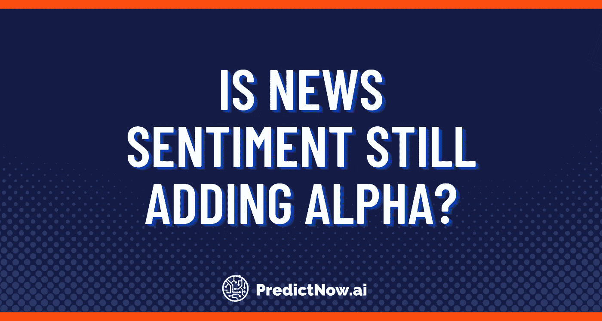
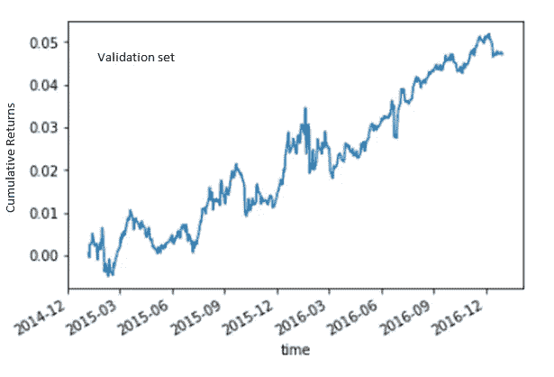
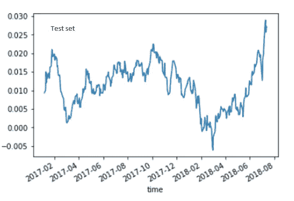

# 新闻情绪还在加阿尔法吗？

> 原文：<https://medium.com/geekculture/is-news-sentiment-still-adding-alpha-54635e45635b?source=collection_archive---------23----------------------->

*陈伟霆*[罗杰·亨特 ](http://www.qtscm.com/principals/)

如今，几乎不可能在参加量化交易会议时不被数据供应商的传单和关于新闻情绪的小组讨论轰炸。我们在 QTS 的团队过去曾努力尝试从这些数据中提取价值，但结果并不明显。但是测试预处理的替代数据的主要难题是:空结果是由于这些数据中缺少 alpha 值，还是供应商预处理的数据有问题？像许多定量分析师一样，我们没有时间自己构建一个自然语言处理引擎，将原始新闻故事转化为情感和相关性分数(尽管 NLP 是我们中一个人当年的专长)，我们依赖数据供应商为我们完成这项工作。事实上，我们不能从一个这样的供应商那里获得太多的阿尔法值，这并不意味着新闻情绪总体上是无用的。

因此，当我们听说资产超过 400 亿美元的对冲基金 Two 适马在 Kaggle 赞助了一场[新闻情绪竞赛，免费提供来自汤森路透的情绪数据进行测试时，我们感到有些兴奋。这些数据始于 2007 年，涵盖了约 2000 只美国股票(日交易金额约为 100 万美元或以上的股票)，并辅以 Intrinio 提供的这些股票的价格和交易量。最后，我们将从行业领先的新闻情感数据来源中寻找 alpha！](https://www.kaggle.com/c/two-sigma-financial-news)

竞争的评估标准实际上是用户构建的持有 10 天以上的股票头寸的市场中性投资组合的夏普比率。(所谓市场中性，我们指的是零贝塔。虽然这不是两个适马的说法，但可以从统计上和数学上证明他们的标准与我们的说法是等价的。)这是利用新闻情绪的交易策略的“阿尔法”夏普比率，即超额收益。

设计一个简单的交易策略，用经过预处理的新闻情绪分数来测试 alpha，这似乎很简单，但卡格尔和两个适马一起让这项研究变得异常繁琐和耗时。以下是卡格勒夫妇的一些常见抱怨，我们经历了他们所有人的痛苦:

1.  由于不允许任何人将珍贵的新闻数据下载到自己的电脑上进行分析，研究只能通过运行在 Kaggle 服务器上的 Jupyter Notebook 进行。任何尝试过 Jupyter Notebook 的人都知道，它是一个非常棒的实时协作和演示平台，但却是一个非常笨拙的调试平台
2.  Jupyter Notebook 不仅是高效研究和软件开发的次优工具，而且我们只能使用 4 个 CPU 和非常有限的内存来进行研究。GPU 访问被阻止，祝你好运运行你的深度学习模型。即使是简单的数据预处理也会多次杀死我们的内核(由于内存问题),以至于当我们完成时，我们的头发已经变得稀疏了。
3.  如果闲置几个小时，Kaggle 会杀死一个内核。祝你一夜之间训练出一个机器学习模型，而不是凌晨 3 点起床及时保存结果。
4.  您不能将任何补充数据上传到内核。忘记使用你最喜欢的市场指数作为输入，或者用你最喜欢的 ETP 对冲你的投资组合。
5.  没有“证券主数据库”来为每家公司指定唯一的标识符并将新闻数据与价格数据联系起来。

最后一点需要详细说明。价格数据使用公司的两个标识符:assetCode 和 assetName，这两个标识符都不能用作公司的唯一标识符。一个资产名称(如 Alphabet)可以映射到多个资产代码(如 GOOG)。o 和 GOOGL.O .我们需要跟踪 GOOG。o 和 GOOGL。o 分开，因为它们有不同的价格历史。这带来了 CRSP 等工业级数据库所没有的困难，需要我们设计自己的算法来创建唯一标识符。我们通过发现每个资产名称的多个资产代码的历史是否在时间上重叠来做到这一点。如果是这样，我们将每个资产代码视为不同的唯一标识符。如果不是，那么我们就使用最后一个已知的 assetCode 作为唯一标识符。在后一种情况下，我们还通过检查一个资产代码的结尾和另一个资产代码的开头之间的差距是否很小，以及价格是否合理，来检查“连接”多个资产代码是否有意义。只有大约 150 个案例，这些都可以从外部检查。另一方面，新闻数据只有 assetName 作为惟一的标识符，就像 GOOG 等不同类别的股票一样。o 和 GOOGL。o 都受到 Alphabet 上同样消息的影响。因此，每条新闻都可能映射到多个价格历史。

价格数据也相当嘈杂，卡格勒花了很多时间用外部来源的好数据替换坏数据。(如上所述，这在算法上无法实现，因为数据既不能下载也不能上传到内核。耗时的手动纠正错误数据的过程似乎是为了折磨参与者。)很难确定新闻数据是否包含坏数据，但至少，一些重要新闻情绪特征的统计数据的时间序列图显示没有结构性突变(不像我们之前测试的另一家供应商的数据。)

为了避免过度拟合，我们首先尝试了两个最明显的数字新闻特征:情绪和相关性。对于每个新闻项目，前者的范围从-1 到 1，后者从 0 到 1。将它们组合成一个单一特征的最简单和最明智的方法是将它们相乘。但是由于一只股票每天可能有许多新闻，而我们每天只做一次预测，所以我们需要某种方法来聚合一天或多天的这个特征。我们计算了过去 5 天内该特征的简单移动平均值(5 是该模型的唯一参数，根据 20070101 至 20141231 的训练数据进行了优化)。最后，预测模型也和我们想象的一样简单:如果移动平均线是正的，就买股票，如果是负的就做空。所有交易信号的资金分配是一致的。正如我们上面提到的，本次比赛的评估标准意味着我们必须在 t+1 日开市时进入此类头寸，在午夜(UTC 时区)之前了解 t 日的所有新闻情绪数据。该头寸必须持有 10 个交易日，并在 t+11 日开市时退出，投资组合的任何净 beta 必须用适当数量的市场指数对冲。从 20150101 到 20161231 的验证集的 alpha 约为每年 2.3%，夏普比率为 1，令人鼓舞。从 20170101 到 20180731 的样本外测试集的α略低，为每年 1.8%，夏普比率为 0.75。你可能会认为这只是一个小的下降，直到你看一看他们各自的权益曲线:

数据科学中的一句陈词滥调证实了这一点:一张图胜过千言万语。(也许你听说过安斯科姆的四重奏？)我们很乐意投资一个在验证集中看起来像这样的策略，但是我们绝不会在测试集中这样做。我们对验证集做了什么样的过度拟合，导致了测试集中如此多的“方差”(在偏差-方差的意义上)？诚实的回答是:没有。正如我们上面所讨论的，策略是仅基于训练集指定的，并且唯一的参数(5)也是纯粹基于该数据优化的。验证集实际上是一个样本外测试集，与“测试集”没有什么不同。在这种情况下，我们在机器学习超参数优化的预期中区分了验证和测试集，这实际上并没有用于这个简单的新闻策略。

我们将在后面对测试集的性能下降进行更多的评论。现在，让我们解决另一个问题:分类特征能提高验证集中的性能吗？我们从两个分类特征开始，这两个特征在所有新闻条目中最为丰富，也最为直观重要:标题标签和受众。

headlineTag 功能是单个令牌(例如“BUZZ”)，有 163 个唯一令牌。观众特征是一组标记(例如{'O '，' OIL '，' Z'})，并且有 191 个唯一的标记。处理这种分类特征的最自然的方法是使用“one-hot-encoding”:这些标记中的每一个都将在特征矩阵中获得自己的列，如果一个新闻项目包含这样的标记，则相应的列将获得“True”值(否则为“False”)。一键编码还允许我们在某个回顾期内对多个新闻条目进行这些特征的聚合。为此，我们决定使用 OR 运算符对最近一个交易日的数据进行汇总(而不是对数字特征进行 5 天回顾)。即，只要一个新闻项目包含最近一天内的令牌，我们就将该每日特征设置为真。在尝试使用该特征矩阵构建预测模型之前，我们使用在 LightGBM 中实现的增强随机森林将它们的特征重要性与其他现有特征进行了比较。

与价格特征(回报)相比，这些分类特征在前 5 个特征中找不到。但是更令人震惊的是，LightGBM 将 assetCode 作为最重要的特性返回了！这是使用训练数据进行特征重要性排序的常见谬误(这个问题由 [Larkin](https://www.kaggle.com/marketneutral/the-fallacy-of-encoding-assetcode) 强调)。)如果一个分类器知道 GOOG 在样本中有很大的夏普比率，它当然会预测 GOOG 无论如何都有正的剩余收益！计算特性重要性的正确方法是使用验证数据或交叉验证来应用[平均降低准确度](https://www.amazon.com/Advances-Financial-Machine-Learning-Marcos/dp/1119482089/ref=as_sl_pc_tf_til?tag=quantitativet-20&linkCode=w00&linkId=d7381a1bc4fd7adf25c210b2967e15be&creativeASIN=1119482089) (MDA )(参见我们的[内核](http://www.kaggle.com/chanep/assetcode-with-mda-using-random-data),证明一旦我们这样做，assetCode 就不再是一个重要的特性。)或者，我们可以从特征重要性排序中手动排除在股票历史中保持不变的特征。一旦我们做到这一点，我们发现最重要的功能是

与价格特征相比，这些分类新闻特征不太重要，我们发现将它们添加到上面的简单新闻策略中并不能提高性能。

因此，让我们回到为什么我们的简单新闻策略在从验证到测试集的过程中性能如此下降的问题上来。(我们应该注意到，不仅仅是我们无法从新闻数据中提取太多价值。由其他 Kagglers 发布的大多数其他内核也没有显示出在生成 alpha 时加入新闻特性的任何好处。具有复杂机器学习算法的复杂价格特征被许多已经发布其内核的领先参赛者使用。)我们已经排除了过度拟合，因为没有从验证集中提取额外的信息。其他的可能性是运气不好，政权更迭，或者阿尔法衰变。对比两条股票曲线，运气不佳似乎是一个不太可能的解释。鉴于该策略仅使用新闻特征，而不使用宏观经济、价格或市场结构特征，政权更迭似乎也不太可能。阿尔法衰减似乎是一个可能的罪魁祸首——我们的意思是阿尔法衰减是因为来自其他交易者的竞争，他们使用相同的特征来产生信号。最近发表的一篇学术论文( [Beckers，2018](https://jpm.iijournals.com/content/45/2/58) )为这一猜想提供了支持。基于对大多数使用新闻情绪数据发布的策略的元研究，作者发现，2003 年至 2007 年，此类策略产生的信息比率为 0.76，但 2008 年至 2017 年仅为 0.25，下降了 66%！

这是否意味着我们应该放弃新闻情感作为一个特征？不一定。我们的预测范围被限定为 10 天。当然，如果有这样的数据，我们应该测试其他的地平线。当我们在一次会议上总结我们的发现时，一位听众提出，如果我们小心选择哪个国家(印度？)，或者哪个板块(国防相关股？)，或者哪个市值(仙股？)我们把它应用到。由于两个适马的限制，我们只对市值排名前 2000 的美国股票进行了研究，但在你自己的新闻情绪研究中，你没有理由必须遵守这些限制。

更多关于我们工作的信息，请访问

*关于作者:*

Ernie 是著名的量化对冲基金经理和量化金融作家。此前，他曾在 IBM T.J. Watson Research Center 的人类语言技术小组、摩根士丹利的数据挖掘和人工智能小组以及瑞士瑞信银行的 Horizon Trading Group 应用过他的专业知识。

Roger 是一家科学软件公司的创始人和前任首席执行官，该公司被 Thomson Reuters 收购。他公司的软件目前正在美国美联储使用。罗杰以前是新墨西哥州立大学的数学教授，他在澳大利亚国立大学获得了数学博士学位。彭博商业周刊的一篇文章对罗杰进行了描述。