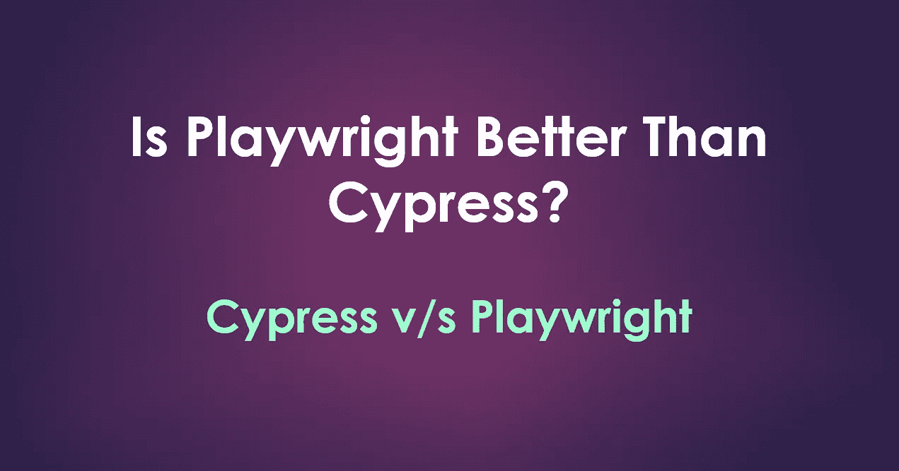

# 剧作家比赛普拉斯好吗？剧作家 vs 赛普拉斯

> 原文：<https://medium.com/geekculture/is-playwright-better-than-cypress-playwright-vs-cypress-151bd65a224f?source=collection_archive---------0----------------------->

就在一年前，Cypress 是市场的领导者，并因其独特的功能而广受欢迎。但 Cypress 的权衡和其他承诺的功能并没有像许多用户预期的那样发挥作用。正如预期的那样，现代用户不准备回到 selenium，他们期待的是替代解决方案。然而，Cypress 没有强大的竞争对手，不知何故，用户适应了 Cypress。

但今天，剧作家已经成为 Cypress 的强大竞争对手，尽管剧作家在 2020 年发布了第一版，但它提供了许多功能，并克服了 Cypress 的几乎所有权衡。因此，剧作家是现在的趋势，看起来像是未来的自动化框架。

## **赛普拉斯有哪些用户不喜欢的地方？**

**iFrame 限制:** Cypress 可能非常适合现代应用程序，但是有许多组织仍然在使用混合模型，他们正在为他们的组织寻找一个单一的框架，因为我们知道在组织内部维护多个框架是很困难的。Cypress 并不完全支持 iFrame，要做到这一点很有挑战性。

**跨来源/第三方登录问题:** Cypress 告诉自己不自动化第三方登录场景的原因，但对于端到端测试来说这很重要，Cypress 建议第三方登录应该通过 API 等。但是我们遇到过这样的情况，组织不得不仅仅为了测试自动化而修改他们的登录，并且在他们的组织内部集成 Cypress。测试自动化是测试的一部分，许多组织不想投资他们的资源和精力定制他们的登录过程来集成 Cypress。

如果您使用第三方登录解决方案，如 SSO 或任何身份管理解决方案，通过自动化来管理它们是一项具有挑战性的任务，因为 Cypress 不允许在同一个脚本中跨域。

**多窗口/标签支持:**同样 Cypress 不支持多窗口或标签，Cypress 为此给出了一个变通办法，删除了 target 属性。作为一名测试人员，人们希望像最终用户一样复制相同的场景，但是这似乎有点像黑客，许多用户并不相信。

**浏览器支持:** Cypress 仍在研究如何支持 Safari 浏览器，有很多 Mac 用户使用 Safari，测试人员希望在所有浏览器上运行测试，我们不应局限于几套浏览器。

**并行浏览器测试:**如果您在本地测试，您只能运行一个带有 Cypress 的浏览器实例，并行浏览器测试受到 Cypress 的限制。许多用户不想花时间一个接一个地执行测试。

页面对象模式:页面对象模式被许多组织和测试工具所实践，然而，Cypress 并不鼓励这样做，尽管我们可以通过一些定制来实现页面对象模式。Cypress 想出了[应用动作](https://www.cypress.io/blog/2019/01/03/stop-using-page-objects-and-start-using-app-actions/)，而不是页面对象

**Edge Case Sceanrios:** 许多用户受困于文件上传、下载等边缘场景，我们不能依赖第三方插件，从组织的角度来看，这也不是一个好主意。

**CI/CD 集成问题:**如果组织使用第三方托管代理，您需要在每次运行时首先动态安装 Cypress，安装时间有时会超过 10 到 15 分钟，如果您的组织按时间支付构建代理，您可能最终会为安装 Cypress 支付额外费用。

**Async/Await 问题:**在 Cypress 内部使用 Async/Await 会使 Cypress 测试以一种奇怪的方式运行，这是现代框架所没有预料到的。

**测试分组和测试套件:**那些不想创建测试套件的人，那些想从量角器中迁移出来的人正在寻找类似量角器的功能，然而，Cypress 已经在市场上存在很多年了，却没有想到这个简单的功能。

XPath: Cypress 很好地支持定位器，但是对于 XPath，你需要依赖插件。

**依赖关系:**如果你正在使用 Cypress，你最终会添加越来越多的第三方插件，因为许多功能并不被 Cypress 本身所支持，这是许多用户不喜欢的。用户不确定长的第三方插件是否被支持，并且随着 Cypress 发布新版本，管理他们的版本升级是一项困难的工作。

**调试:** Cypress 直接从 Visual Studio 代码中移除了调试支持，需要依赖开发者工具，以及自己的调试器。有些用户喜欢它，但有些不喜欢。

**自动等待:** Cypress 文档说，它在执行任何操作之前都要等待元素加载，但是在很多情况下，它并没有像预期的那样工作

当谈到端到端测试或测试自动化时，许多用户寻找类似的功能，如 Selenium，但是 Cypress 并没有满足他们所有的期望。

Cypress 当时是领导者，他们应该更多地关注 git hub 问题，而不是建议变通办法和第三方插件，这是许多用户不喜欢的。

现在，时代变了，用户有了一个简单的选择，剧作家来了。

剧作家在提供新功能方面很积极，在一年内它已经发展了很多，现在它看起来像成熟的框架。剧作家是开源的，但是由微软管理。

**为什么人们喜欢剧作家？**

**没有 iFrame 限制:**不像 Cypress，剧作家没有在 iFrame 方面限制你，它允许你用 iFrame 做任何动作

**不再有跨来源的限制:**不像 Cypress，剧作家不要求你坚持一个单一的领域，就像你在你能导航的任何地方都有浏览器实例，并且自动化它们。

浏览器支持:目前，剧作家支持 Chromium、Firefox 和 Web toolkit (Safari)

**并行执行支持:**剧作家支持测试的并行执行

**Xpath 支持:**不需要为 Xpath 安装额外的插件，剧作家已经在你安装剧作家包的时候为你准备好了。

**Visual Studio 代码调试:**你可以用 Visual Studio 代码配置你的剧作家框架，并在里面调试它们，还有开发者工具。

**CI/CD 集成:** CI/CD 集成就像任何其他测试框架一样，在那里也能顺利运行。

自动等待:剧作家有一个内置的自动等待机制，它还提供自定义等待选项。

多窗口支持:剧作家允许你使用多个标签页/窗口并控制它们

**上传和下载文件:**剧作家提供了许多选项来控制文件的上传和下载，你不再需要在你的框架中安装第三方插件。

页面对象模型:剧作家直接支持页面对象模式，它甚至有关于如何实现这些的文档，这很好。

## **剧作家的独特之处**

剧作家的上述特征是在与赛普拉斯的比较中讨论的，除了那些我们在现代自动化框架中很少发现的剧作家的独特特征

**多语言支持:**剧作家支持 JavaScript，C#，Java，Python 编程语言你不限于单一语言。

你可以用剧作家代码来记录你的测试，当你开始使用代码时，它会为你生成一个测试脚本。

**在 Windows 上测试 Safari:**当你安装剧作家框架时，它也会安装一套类似 chrome、Firefox、Webkit 等浏览器。Webkit 浏览器是 Safari 的开源版本，你可以在 windows 机器上运行 Webkit 浏览器，这意味着你是在 windows 机器上测试 Safari 的功能。

**仿真设备:**你可以通过使用一个命令来仿真设备并运行你的测试。

**生成 PDF :** 你可以使用剧作家生成 PDF，这是一个独特的功能相比，另一个框架。

**测试重试次数:**你可以指定测试的重试次数，这是一个常见的功能，剧作家也提供了。

《诱惑报告》:剧作家正在提供许多人正在寻找的《诱惑报告》整合功能。

剧作家给用户提供了更多的功能，而不是限制，这使得剧作家成为独一无二的框架。剧作家正在积极地推出新功能和解决问题，所以我们不能停止期待更多的功能。

我应该选择剧作家而不是柏树吗？

许多用户会问这个问题，但是只有您和您的组织可以得到这个问题的答案，我们不知道您的应用，我们不知道您的要求，我们只能列出我们的优点和缺点。对某些剧作家来说，柏树比剧作家更好看。你需要通过分析找到最适合的。

*注意:本文中表达的观点是个人观点，仅限于知识。我试图比较两个框架的特性和局限性，这篇文章不是赞助的，我与 Cypress 和剧作家都没有关系，这篇文章旨在帮助社区。观点可能因人而异。这个世界上没有什么是完美的，这个宇宙中的一切都有它自己的优点和缺点。*