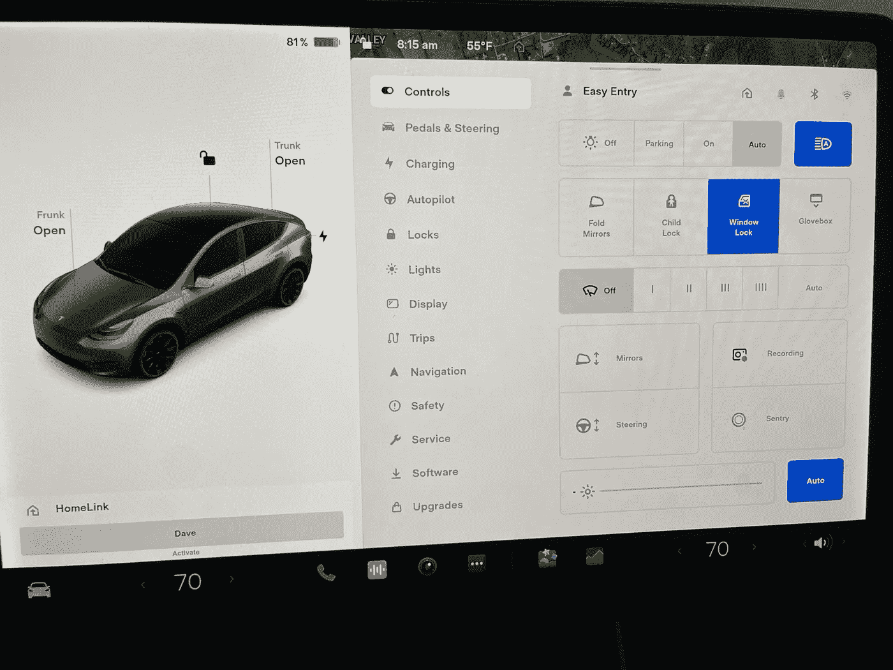

# 特斯拉的 v11 更新…是不是设计不好？

> 原文：<https://medium.com/geekculture/is-teslas-v11-update-bad-design-1af36b13228b?source=collection_archive---------1----------------------->

即使是最好的设计团队也会犯的错误，以及如何避免。

[Screenshot](https://www.reddit.com/r/teslamotors/comments/rnm9tf/v_110_update_process_images/) via Reddit user u/ClarksonianPause

经过几个月的期待，特斯拉终于为他们的车辆发布了一个闪亮的新 UI 更新——v11 来了！特斯拉司机争相安装更新，兴奋地玩着它。但是随着他们开始花更多的时间在这上面，一个压倒性的共识开始形成:

*他们讨厌它。*

这些熟悉旧界面的司机发现，许多常见的交互方式现在不同了，这意味着他们现在需要花精力学习如何以新的方式做事。雪上加霜的是，他们学习的新方法通常并不比旧方法简单——在许多情况下，它们实际上比 T4 更难。

这里发生了什么事？自从 UI 设计主管 Pawel Pietryka 离开后，特斯拉的设计团队[走下坡路了吗？公司是否把好看放在可用性之上？这是一个准备不足的新设计领导者的作品吗？他们在想什么？！](https://www.reddit.com/r/teslamotors/comments/rpvjtr/comment/hq6u10q/?utm_source=reddit&utm_medium=web2x&context=3)

这些是沮丧的司机在互联网上提出的真实问题。即使以特斯拉粉丝的标准来看，人们的反应也很强烈——很多人都被激怒了。

# 发生了什么事？

从设计的角度来看，这很大程度上是影响*前期工作*和*长期工作*的变化的结果。这听起来很专业，但实际上很简单。

有了之前的 v10 界面，新的特斯拉司机面临着学习挑战。这个界面被许多一次性的解决方案所困扰，使它变得更加混乱和难以学习。这些新司机不知道如何查看他们的里程表、雨刷设置或轮胎压力，这是可以原谅的，所有这些都奇怪地集中在一个界面上，只有当他们在屏幕上一个没有标记的角落滑动时才会出现。有很多前期工作——在你了解它之前，它是令人困惑的。

特斯拉的设计师几乎肯定不希望新司机面临这么大的困难，所以他们将界面重新组织成更清晰、更符合逻辑的组:设置菜单、应用菜单等等。这意味着向前发展，新车手将更容易达到速度。前期工作减少了。

> 这就像被要求参加一个如何少赚钱的课程——花更多的努力却得不到回报。

不幸的是，这也意味着*现有的*驱动程序将再次面临解决问题。他们实际上被分配了一个学习任务，继续使用他们已经在使用的东西。不过，这本质上并不坏。通常，人们会容忍被要求学习一种新的做事方法，只要他们能看到随着时间的推移，这将如何帮助他们节省大量的精力或不舒服。

然而，在这种情况下，新的做事方式没有帮助。尽管他们在学习这些功能上付出了努力，但许多功能需要*比以前付出更多的努力。这就像是被要求去上一门如何让*少赚*钱的课程——为了一个*负回报*付出更多努力。*

换句话说，虽然前期工作*减少了，但长期工作*却增加了。**

A video on the backlash to the new UI changes

# 所以很糟糕，是吗？

这个界面是设计上的失败吗？这是一个混合的包。首先，新用户在快速使用新的 v11 UI 时确实没有那么多问题要解决——易学性得到了提高。除了对新用户的真正好处之外，对开发团队来说也有很多好处。拥有一个更加结构化的框架使得开发和维护特性变得更加容易。这些都是设计的胜利。

另一方面，特斯拉的设计师忽略了充分解决用户界面的人体工程学问题。尽管有 v10 的学习曲线，这些沮丧的车主知道旧系统的无数捷径。用户越是使用某样东西，可学性就变得越不重要。相反，这些司机关心的是人体工程学——他们环境的长期日常效率和舒适度。

> 用户越是使用某样东西，可学性就变得越不重要。相反，这些司机关心的是人体工程学——他们环境的长期日常效率和舒适度。

对于特斯拉的团队来说，要真正做到这一点，他们需要确保旧界面中的每一个广泛使用的交互都有一种在新界面中完成的方式——用同样多的精力*或更少的精力*。这是他们没有做到的。相反，这些司机被要求花费精力学习新的方式，如果他们没有得到一些回报，他们会感到不安。

# 把这件事做好

幸运的是，对于特斯拉来说，他们可以做很多事情来解决这个问题，包括以下内容:

*   他们可以在底部栏的应用程序快捷方式旁边，为设置提供[自定义一键快捷方式。这可以通过可定制的图标和位置，轻松访问以前只需轻触即可完成的相同设置。](https://twitter.com/deleetdesign/status/1481300424800018444)
*   他们可以扩展语音控制，直接访问大量设置，只需一句话。再加上更好的自然语言支持和离线车内语音处理，使这项工作更加一致。
*   他们可以让司机访问可调图标滑动或长按快捷键，这减少了视觉混乱，并将分散注意力的屏幕输入数量减少到只有一个。
*   他们可以让司机定制自己的[多点触摸全屏手势](https://twitter.com/deleetdesign/status/1487530992520904716?s=21)(例如，从屏幕上的任何地方，用三个手指向右滑动以打开乘客座椅加热器，用五个手指向下滑动以打开手套箱，等等。).这使得司机可以快速触发大量命令，而无需将眼睛离开路面或暂停谈话。

是的，这些变化需要努力去学习，但是随着时间的推移，它们会极大地减少人体工程学的工作量。

# 设计师的关键要点

对于像特斯拉这样的设计团队来说，这些是关键的经验:

*   可用性比可学性更重要。你还需要考虑长期的人体工程学。这些对现有用户很重要，所以一定要让[明白其中的区别](https://uxdesign.cc/get-out-of-my-way-part-1-how-to-design-tools-users-truly-love-by-improving-ui-ergonomics-cbdbcba97b81)，否则可能会激怒你的用户。
*   用户将学习某样东西的过程视为他们为了获得回报而付出的努力:即减少努力，更长期。让用户付出前期努力来换取长期更努力的工作感觉像是不公平的交易——或者更糟，是一种背叛。
*   当重新设计现有工具的 UI 时，找出常见的任务，找出完成它们的最简单的方法，并确保新的 UI 允许以相同或更少的人类工程学努力来完成它们*。*

总的来说，我的观点是，尽管有这些小问题，新的 v11 UI 提供了实质性的好处，无论是对开发团队还是对许多正在经历界面学习过程的新驱动程序。如果幸运的话，特斯拉的团队将很快解决此后一直存在的问题——人体工程学问题。

你怎么想呢?你喜欢 v11 的界面吗？你认为特斯拉应该立即做出哪些改变？在以前的版本中，你觉得哪种事情更容易？期待你的想法。

汉斯·范·德·布鲁根是一名居住在加利福尼亚的设计师。他之前曾在 LinkedIn 和网飞工作，并在许多初创公司领导设计。

在 Twitter 和 Medium 上关注汉斯。

**得到这本书:** 如果你喜欢这本书，你可能也会喜欢我即将出版的关于设计和可用性的书，名为*可学性是不够的*。在[book.hansv.com](http://book.hansv.com)了解更多信息并加入邮件列表获取更新

Learn more at [book.hansv.com](http://book.hansv.com)