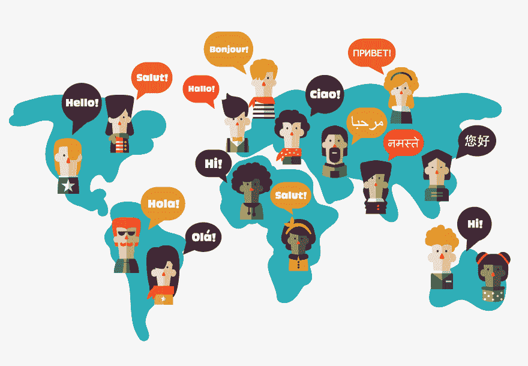
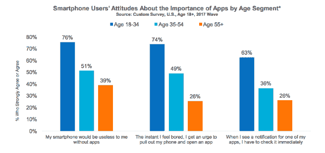
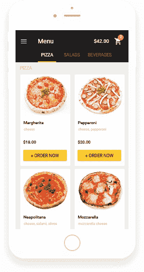

# 应用程序内部的语音是 UI/UX 的下一个大事件吗？

> 原文：<https://medium.com/geekculture/is-voice-inside-apps-the-next-big-thing-in-ui-ux-f2ebde72c38b?source=collection_archive---------38----------------------->

*为什么很多 app 突然增加了应用内语音助手？这对他们的语音商务野心有帮助吗？*

# 沿着语音助手的记忆之路前行

‍

语音助手的旅程可以分为两个阶段:

**第一阶段**是向消费者介绍使用语音在应用程序中执行任务的想法。这个阶段见证了 Alexa 和 Google Home 等流行的语音辅助设备和技术的兴起。他们设法让人们意识到，在执行日常行动和任务时，需要更多地使用声音。

**第二阶段**是关于语音成为一种普遍的交互模式，具有更多功能和不同的上下文。它标志着语音技术领域正在发生的转变——从智能语音设备到应用程序内部的语音。应用内语音助手是下一件大事，并且越来越受欢迎。

Understanding the Voice Assistant Journey: Phase 1 and Phase 2\. Courtesy: [Slang Labs](https://www.slanglabs.in/voice-assistants)

**为什么应用内语音助手会流行起来？**

随着当前的科维德疫情限制人们呆在家里，智能手机的使用量出现了增长。2020 年 6 月，[全球零售电商流量](https://www.statista.com/statistics/1112595/covid-19-impact-retail-e-commerce-site-traffic-global/)录得 220 亿次月访问量，杂货、服装等日常用品需求最高。Statista 的这份[报告用数据补充了事实。](https://www.statista.com/topics/871/online-shopping/)

[根据 BigCommerce](https://www.bigcommerce.com/blog/mobile-commerce/#why-does-mobile-commerce-matter) 的一份报告，到 2021 年，移动电子商务销售额预计将占电子商务总销售额的 54%。语音购物正在塑造移动商务的未来。然而，像亚马逊 Echo 和 Google Home 这样的智能设备只是用于娱乐和家庭自动化，而不是购物。 [TechCrunch 在 2020 年](https://techcrunch.com/2020/02/04/shopping-via-smart-speakers-is-not-taking-off-report-suggests/?guccounter=1&guce_referrer=aHR0cHM6Ly93d3cuZ29vZ2xlLmNvbS8&guce_referrer_sig=AQAAABWTdl0lF9nitpnr-Etcq9ENXiQ2CXhAaEiJtqorX8VrEui66WeqBdc5LifEtghS1aLBz1M6LBYfq4Yu8wc0dP7gOjKgE0ORT9YfyW795DFZ2k5CW1yt9yoHFNcDkObIIVsAkNGWGFn5Ln-ZW2Dm8tzCROyO2M8GfFTjDDehBXCq)发布的一份报告称，81%的用户使用这种设备听音乐，而大约 70%的用户使用这种设备进行查询，包括询问天气等。

同样，[普华永道](https://www.pwc.com/us/en/services/consulting/library/consumer-intelligence-series/voice-assistants.html)的一份报告称，像谷歌助手和 Siri 这样的通用语音助手仍然被用于一般用途，如设置闹钟、安排事件、打电话等。被调查的用户中只有 10%用它来购买或订购东西。

拥有应用程序的主要商业巨头已经理解了这种支持商业使用和推动在线电子商务流量的需求，因此将他们的语音商务战略集中在具有专用应用程序内语音助手的智能手机上。甚至谷歌助手和 Alexa 也在侵占应用内语音助手的趋势，并正在转变策略。

**为什么品牌要添加应用内语音助手？**

***Leading brands who are winning customers with custom in-App Voice Assistants. Courtesy:*** [*Slang Labs*](https://www.slanglabs.in/voice-assistants)

**减少思维到行动的延迟**

‍You:想一件事，你几乎可以立刻完成。当你可以说出你想要的东西，而不用担心如何通过一系列单独的点击来传达你想要分享的东西时，这是很神奇的。"*往购物车里添加 2 公斤西红柿*" "比"*快多了找到搜索图标，点击，输入 t..o..m..a..t..o..e..s”(希望自动完成将启动，否则)，滚动，然后单击添加数量，然后转到购物车*。

# 打破进入壁垒

虽然我们大多数人(阅读这篇博客的人)可能对现代 UI 范例——菜单、按钮、文本框等——感到舒适。—对于许多其他人(首先使用移动设备的人、不太懂技术的人、老年人等。)，可能会相当吓人。一个按钮并不意味着“点击它”菜单图标本身并不意味着“发现或导航到其他功能”视觉效果有时没有吸收当地的美学，理解应用程序变得更加复杂。

“思想实验——我们的父母中有多少人可以使用我们开发的应用程序？”

***声音*** 则相反，并不威吓。它不需要任何额外的训练。你不需要教你的父母如何使用语音。他们已经是专业人士了，就像你一样。

# 选择的语言

***Serving the World with Multilingual Voice Assistants.*** *Courtesy:* [*ITITranslate*](https://blog.ititranslates.com/2020/03/05/commonly-spoken-dialects-across-the-globe/)

用户的‍The 语言是语音处理得更好的一个关键制约因素。即使用户熟悉 UI 元素并且能够浏览应用程序，他们也会被屏幕上的语言吓倒。

这里还有一个思维实验——把手机的语言设置改成你不知道的语言。重启你的手机。尝试将设置改回英语。你认为你能轻松地做这件事吗？如果这款手机有一个可以理解英语的语音界面(“*将语言改为英语*”)，你会使用它还是仍然尝试使用触摸来执行这个操作？

# 这是自然的

我们(嗯，大多数人)生来就有用声音交流的能力。想象一下做一些简单的事情，比如买一包糖。如果你和我一样，我想这将是你的旅程— *“嗯..我应该选择哪个菜单项？…去杂货店……点击..点击..点击..点击..一个完成了..加入购物车..非常..忘记改变数量了…呃，让我们从购物车中移除商品，然后再返回…..这太乏味了”。*

相比之下，通过*“向购物车添加 2 千克糖”或“将糖的数量从 2 千克改为 3 千克”也可以做到这一点。*

用起来不是感觉更自然更舒服吗？

# 易接近

根据世卫组织的数据，全球约有 2.85 亿视力障碍者:3900 万人失明，2.46 亿人视力低下(重度或中度视力障碍)。一个应用内语音助手为视障人士提供了一个独立生活和购买必需品的解决方案，无需寻求他人的帮助来操作智能手机。

此外，无障碍仅限于不知道如何操作智能手机的视力受损者(人口统计:55 岁以上)。对他们来说，用他们的母语与他们的应用程序对话比学习一些对他们来说非常新的东西要容易得多。语音使他们更容易要求完成一些事情，并增加了支持他们的视觉提示。下次你的祖父母不需要知道如何打字就可以在网上订购一个。他们需要知道如何发音。

# 那么，基于语音的 UX 是否意味着基于触摸的 UX 将变得无用？

一点也不。基于触摸/图形用户界面的应用仍有其魅力，原因如下:

# 可发现性

发现和增加助手的能力(技能或动作)目前是一个挑战。有 30K 多个语音应用程序，但大多数人都没有意识到它们的存在。

# **情境意识**

当使用移动应用程序时，用户通常很好地理解上下文和应用程序功能。视觉结构(按钮、菜单等)。)也给出了关于什么是可能的足够的线索。相比之下，与特定的 Alexa 技能交谈，然后努力了解它的能力。

[ComScore Mobile Report — 2017](https://www.comscore.com/Insights/Presentations-and-Whitepapers/2017/The-2017-US-Mobile-App-Report)

# 仅 UI 功能

‍:有很多视觉效果直接胜过声音的用例。一个这样的例子是任何需要列表的东西。

你:*“我想订一份披萨。”*

助理:*“当然可以。你想要什么样的披萨？”*

你:*“我的素食选择是什么？”*

助手*:“你可以点一份田园蔬菜，一份农场新鲜蔬菜，一份地中海蔬菜……”*

你可能走神了，当第三个被说的时候，你不记得第一个了。

这就是 UI 列表非常有意义的地方。想象一下，对上述请求的响应是这样的

‍*Courtesy:* [*Upmenu.com*](https://www.upmenu.com/blog/online-pizza-ordering-system/)

# Privacy‍

当客户与应用程序交互时，他们是在信任应用程序。他们的输入(他们的意图)和品牌的回应都基于两者之间的信任关系。但是如果中间有一个助手，他同时处理输入和输出，并且知道你是谁(因为你登录了助手)，就会引发隐私问题。对用户和品牌来说都是如此——因为他们信任那些了解他们(跨品牌)和品牌的很多细节的人，因为他们将自己客户的细节分享给其他人。

最好的方法是走中间道路——建立在触觉和声音这两个世界的最佳状态上。应用内语音助手必须增强用户体验，使其感觉像是辅助性的，而不是武断的。当语音不是在应用程序中完成特定任务的最佳选择时，例如，在列出项目时，让用户退回到使用基于触摸的 GUI。反之亦然。这种和谐将确保应用程序用户不会因为只使用一种交互模式而感到负担——这是亚马逊 Echo 等智能设备或谷歌助手等通用语音助手所缺乏的。

> ***多模态用户体验是应用内语音助手从其他语音解决方案中脱颖而出的原因。***

# 革命现在开始…

***“预测未来最好的方法就是发明它。****艾伦·凯响亮的话语说明了一切。Slang Labs 已经通过建立 Slang CONVA——世界上第一个语音助手即服务平台——向未来迈出了第一步。Slang CONVA 使企业能够快速轻松地集成准确的多语言应用内语音助手，并使他们能够在几天内取悦客户。*

*领先的电子商务巨头，如 [Big Basket](https://www.slanglabs.in/blog/voice-to-cart-powering-your-ecommerce-app-with-voice) 、 [Udaan](https://www.slanglabs.in/blog/voice-assistant-in-apps-udaan-b2b) 和 Procter & Gamble，已经开始在他们的电子商务应用程序中添加这种体验，使用这个平台，因为他们知道语音辅助 UX 是技术和交互设计领域的下一个大事件*。**

**你也准备好使用它了吗？**