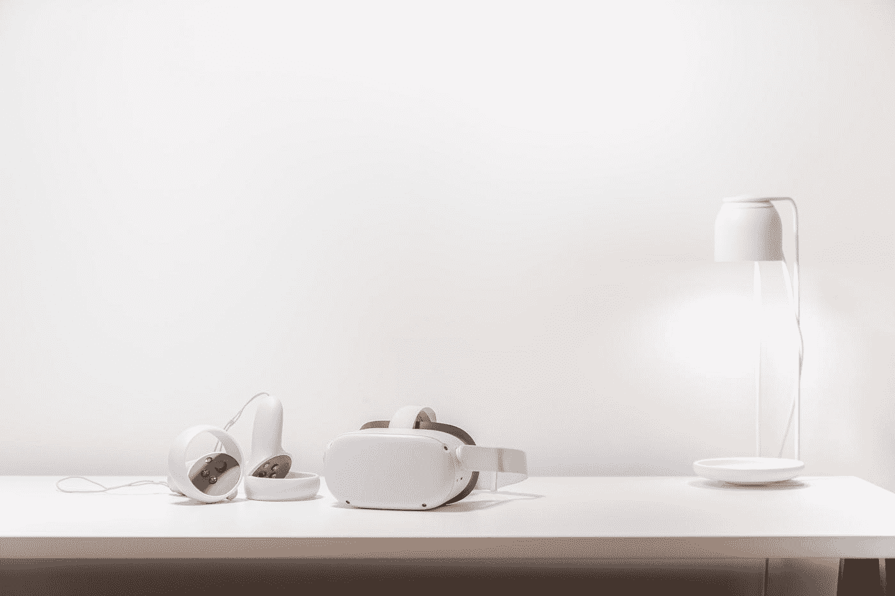

# VR 是噱头还是营销的未来？围绕虚拟现实及其营销用途的坦诚讨论

> 原文：<https://medium.com/geekculture/is-vr-a-gimmick-or-the-future-of-marketing-an-honest-discussion-around-vr-and-its-marketing-use-8fcfa858fd10?source=collection_archive---------14----------------------->

VR 是营销的未来吗？或者只是一个噱头

Photo by [Vinicius "amnx" Amano](https://unsplash.com/@viniciusamano?utm_source=medium&utm_medium=referral) on [Unsplash](https://unsplash.com?utm_source=medium&utm_medium=referral)

虚拟现实可能仍然是一项新兴技术，但公司已经在试图找出如何将其作为一种营销工具。这似乎是一个噱头，但它是吗？虚拟现实是否是一个噱头还没有定论，但就其潜力进行公开、诚实的讨论是很重要的。
博文:VR 是噱头还是营销的未来？

# 什么是 VR？

虚拟现实是现在的热门话题。Oculus Rift Kickstarter 已经过去几年了，现在我们看到脸书以 20 亿美元收购了 Oculus Rift。虽然看起来似乎有许多新公司正在进入虚拟现实，但这项技术自 20 世纪 50 年代以来就已经存在，并被用于许多不同的行业，如医学、房地产、化学，甚至军事。但是什么是 VR 呢？它是用来做什么的？它是如何工作的？是什么让它如此特别？这些是我在这篇文章中试图回答的一些问题。但首先，我们来谈谈 VR 到底是什么。

# VR 目前是如何被用于营销的？

虚拟现实已经存在了相当长的一段时间，但它真正接触大众是在最近一年左右。事实上，第一款虚拟现实耳机诞生于 20 世纪 60 年代，但它笨重而昂贵，从未被认为有任何价值。然而现在，虚拟现实可以用来创造以前不可能的体验，而且现在虚拟现实变得更加实惠，它正在被纳入各种不同的行业，包括营销。虚拟现实(VR)是计算机生成的三维图像或环境的模拟，可以由一个人使用特殊的电子设备，如内部带有屏幕的头盔或装有传感器的手套，以看似真实或物理的方式进行交互。

虚拟现实和增强现实席卷了营销界。据预测，AR/VR 市场将在未来四年左右的时间内达到 1500 亿美元。脸书、谷歌和微软等巨头公司正在投入大量资金开发成功的虚拟现实耳机。然而，并不是所有人都对 AR 的未来感到兴奋。在很多业内人士看来，AR/VR 只是一个噱头。他们认为这是浪费时间和金钱，与其说这是一个真正的商业工具，不如说这是一个科幻概念。要明白 VR 和 AR 不一样，这一点很重要。VR 代表虚拟现实，是一个完全由计算机生成的环境。AR 代表增强现实，是数字和现实世界的混合。对于 VR 最有效的使用方式是什么，也是众说纷纭。有些人认为最好的用途是创造一个完全数字化的体验。其他人认为，最好将现实世界和计算机生成的世界混合在一起。

虚拟现实可能是视频游戏中的下一个大事件，但它也正被用来以一些令人惊讶的方式营销品牌和产品。你可能已经意识到虚拟现实目前在视频游戏领域的应用。视频游戏行业的许多主要玩家正在他们的游戏中使用虚拟现实。但你知道吗，虚拟现实也被用于跨行业的产品和服务营销？没错，VR 正在被当做一种营销工具。

Photo by [Merakist](https://unsplash.com/@merakist?utm_source=medium&utm_medium=referral) on [Unsplash](https://unsplash.com?utm_source=medium&utm_medium=referral)

# VR 在未来是如何被用于营销的？

虚拟现实可能不再是一个新概念，但它仍然是一个非常令人兴奋的概念，尤其是对营销人员来说。虚拟现实对消费者的视觉冲击是不可否认的。仅仅是沉浸在虚拟世界的想法，就足以让你觉得自己置身于一个完全不同的地方。随着技术的进步，不再是笨重的耳机和电线限制了体验。现在，虚拟现实比以往任何时候都更容易获得，更便携，更实惠。问题是:VR 在未来是如何被用于营销的？虚拟现实营销并不是什么新鲜事。事实上，它已经存在一段时间了。营销人员一直在寻找增强客户体验的方法。虚拟现实营销的引入让品牌可以做到这一点。通过为消费者提供身临其境的体验，品牌可以以一种新的方式将他们的产品展示在客户面前。这种体验让顾客能够以一种简单的视频或图像无法做到的方式探索产品。虚拟现实营销是将产品带入生活。它允许消费者以一种他们在现实生活中永远无法做到的方式去探索它。

它已经存在了一段时间，但还没有像智能手机和平板电脑那样成为家庭必需品。有一点是肯定的，虚拟现实(VR)将成为下一个大事件。它正在越来越多的地方被慢慢使用，并且有一系列不同的方式可以用来营销业务。目前，虚拟现实的主要用途是在游戏中，但用不了多久，它也将用于许多其他地方。

# VR 是噱头还是未来？

营销的未来在于不同的地方，不同的企业。对于一些人来说，这是在增强现实或人工智能中。对其他人来说，这是在虚拟现实中。对于那些熟悉这个术语的人来说，虚拟现实或 VR 是指当你戴上耳机或其他设备时，你正在体验所谓的虚拟世界。用户可以从他们的耳机中看到图像，并感觉他们是这个世界的一部分。

虚拟现实(VR)是过去几年中最热门的技术之一。以至于许多企业已经开始开发视频游戏应用程序或进行 3D 模型和模拟的方法。许多商家称之为营销的未来，但这是真的吗？让我们讨论一下为什么你应该使用虚拟现实，以及将来你可以用它做什么。

虚拟现实(VR)是一个已经存在了几年的趋势性话题。很多人对 VR 很熟悉，但是 VR 对营销的有意义的应用还是一个谜。这篇文章将帮助你决定你是否应该投资虚拟现实。首先，一点背景。虚拟现实通常被称为模拟真实生活或想象体验的沉浸式体验。它是计算机生成的 3D 环境模拟，可以通过特殊的电子设备进行交互，如 VR 耳机。VR 包括耳机，但也可以在 2D 屏幕上体验，如手机或平板电脑。

虚拟现实(VR)——自 20 世纪 80 年代以来，有多少变化，有多少保持不变？当你想到虚拟现实(VR)时，你可能会想象一个戴上耳机，进入一个新的令人兴奋的世界。但 VR 不是这样的。至少，现在还没有。今天，虚拟现实是一种身临其境、引人入胜的体验，它提供了一种身临其境的感觉，让个人沉浸在一个数字创造的世界中。虚拟现实是一种令人兴奋的体验世界的新方式，有可能改变你的旅行、学习等方式。

Photo by [Alexas_Fotos](https://unsplash.com/@alexas_fotos?utm_source=medium&utm_medium=referral) on [Unsplash](https://unsplash.com?utm_source=medium&utm_medium=referral)

> **结论—**

在我们看来，虚拟现实是相当长一段时间以来最令人兴奋的创新之一，对于营销人员来说，这是一个让消费者比以往任何时候都更关注品牌的机会。我们已经看到一些营销人员已经在利用这项技术，它只会继续增长。如果你想了解更多关于 VR 的知识，欢迎随时联系我们。