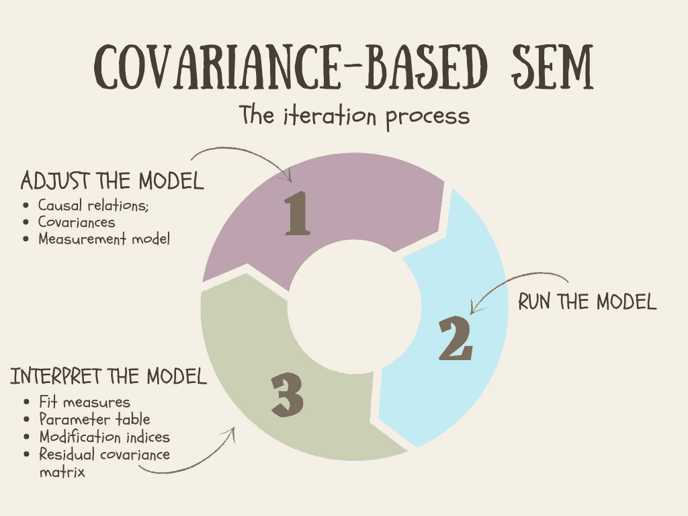
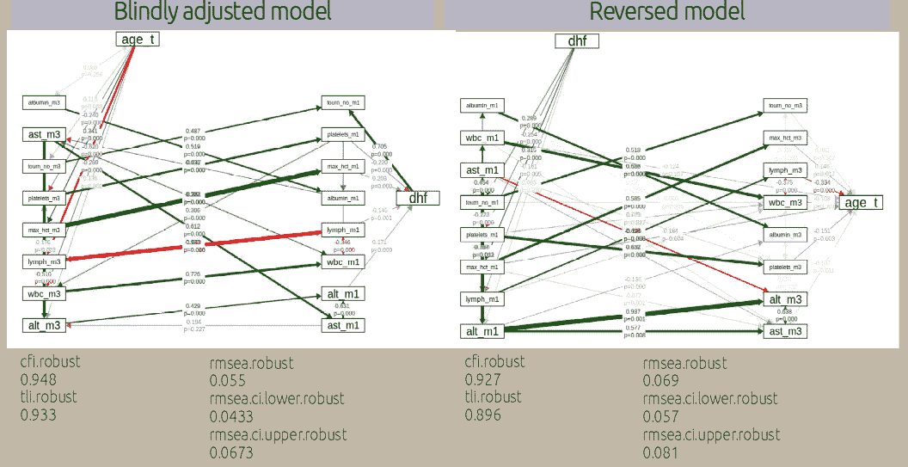

# 基于协方差的结构方程模型中的迭代:解释和调整

> 原文：<https://medium.com/geekculture/iteration-in-cb-sem-e03b97dd2bab?source=collection_archive---------6----------------------->

## 使用纵向数据的基于协方差的 SEM 示例

# 介绍

结构方程模型(SEM)已经成为数据分析中一种非常方便的工具，可以对复杂的关系进行建模，如涉及时间上的测量序列(****【数据】**)或部分结果(**中介**)分析。但与一些花哨的方法不同(至少大多数人认为如此)，该方法不是盲目的、自动的，需要大量分析师的解释和干预。**

**这篇文章的目的是说明这种对上下文知识和逻辑的考虑是多么重要，以及忽视它们的风险。在这个过程中，这篇文章通过描述主要的分析输出以及如何解释它们来说明这样的迭代点是如何发生的。**

**也许你已经读过 SEM 和它的潜力，或者你已经使用过它，并试图理解它的输出是如何解释的。我写这篇文章是为了帮助那些开始使用 SEM 的人。我想你已经:**

*   **熟悉回归分析及其解释方法；**
*   **什么是结构方程模型或路径分析的基本概念，或至少它们的目标；**
*   **至少，对什么是介质有一个基本的定义；**
*   **可取的:至少对如何在任何工具中执行它以获得主要输出有所了解。我在这里使用 R 的 Lavaan 进行说明，但是没有对它的编码进行完整的解释。重点是工具报告的内容。其他工具的输出将是相似的。**

**当一个人开始学习任何分析方法，并且已经瞥见了工具是如何工作的，也许主要的困难是如何解释结果。有些方法，比如 SEM，需要人为干预每个交互。并且您需要解释并决定如何调整模型，以进入下一个迭代。下图说明了这一点。**

****

**The iteration process in Covariance-Based SEM (Generated using Canva.com)**

****文档的结构****

**[案例](#578b)
[初始模型及结果](#1b37)
[概念模型的重新规范](#b197)
∘ [残差协方差](#dbac)
∘ [修正指标](#1083)
∘ [非显著路径的去除](#2f21)
∘ [进一步调整](#989c)
[最终调整后的模型](#e625)
[无意义模型也能很好地拟合](#8790)**

# **情况**

**我们将探索一个评估登革热病毒(DENV)感染演变的数据集，特别是登革出血热(DHF)，这是一种严重的后果，其特征是发热、液体从血液渗漏到组织(血浆渗漏)、血小板计数减少(血小板减少症)，以及其他因素，导致出血或瘀伤的可能性增加(出血素质)。在三个时刻监测血小板计数和肝脏参数，如 ALT，以模拟登革热疾病中表型的进展。数据结构如下:**

```
str(data)

## 'data.frame':	257 obs. of  22 variables:
##  $ age2        : chr  "12-13" "4-5" "4-5" "8-9" ...
##  $ sex         : num  1 1 2 2 1 1 1 1 2 2 ...
##  $ dengue      : num  1 1 0 1 1 0 1 1 1 1 ...
##  $ dhf         : num  1 0 0 0 0 0 0 0 0 0 ...
##  $ dhf34       : num  0 0 0 0 0 0 0 0 0 0 ...
##  $ ast_m3      : num  25 38 27 167 29 39 32 48 36 35 ...
##  $ alt_m3      : num  10 14 9 109 13 15 10 23 18 16 ...
##  $ wbc_m3      : num  3600 7200 9200 2200 9500 8000 5200 ...
##  $ lymph_m3    : num  16 21 13 34 7 21 16 18 37 11 ...
##  $ albumin_m3  : num  4.5 5.6 4.6 4.8 5 5.9 4.6 3.9 4 4.2 ...
##  $ max_hct_m3  : num  42.5 38 37 40 38 40 42.5 39 38 40 ...
##  $ platelets_m3: num  271000 272000 216000 227000 204000 ...
##  $ tourn_no_m3 : num  21 21 10 21 5 8 21 4 6 4 ...
##  $ ast_m1      : num  53 36 26 248 34 35 43 43 240 97 ...
##  $ alt_m1      : num  15 14 11 174 14 11 9 24 126 28 ...
##  $ wbc_m1      : num  2300 5100 3800 1600 6500 7300 2800 3800 ...
##  $ lymph_m1    : num  32 60 41 39 61 45 24 35 42 32 ...
##  $ albumin_m1  : num  4.3 4.6 3.7 4.5 4.9 4.9 3.9 3.8 4.4 4.5 ...
##  $ max_hct_m1  : num  43 39 37 40 36 37 41 39 38 45 ...
##  $ platelets_m1: num  73000 263000 200000 116000 163000 ...
##  $ tourn_no_m1 : num  21 21 0 21 2 4 21 20 14 21 ...
##  $ age_t       : num  12 4 4 8 6 4 8 8 4 6 ...
```

**在这个数据集中，我们看到:**

*   **DHF 的最终结果(登革出血热)，是否发生(1 级)或未发生(0 级)；**
*   **相同的参数(如血小板计数和 ALT 水平)在特定时期内被监测和评估多次:以`m1`结尾的变量代表事件前一天评估的测量值，以`_m3`结尾的变量代表事件前三天测量的测量值。**
*   **结果不能用一个单一的参数来描述，而是用一组互补的，可能是多重共线的参数来描述。**

**随时间推移对测量进行连续评估:**

*   **能够捕捉结果变得明显的时间变化(例如，症状或特定条件的出现，如肝毒性)；**
*   **根据定义，连续的测量当然是相关的；**
*   **值得注意的是，事件导致改善或恶化，但最终的结果水平也取决于最初的措施。**

# **初始模型和结果**

**该分析通过基于协方差的 SEM (CB-SEM)和 R's package `lavaan`中的 MLR 估计器进行。**

```
library(lavaan)
fit=sem(model=model, data=data,std.ov=TRUE,estimator="MLR",fixed.x = FALSE)
```

**其中:**

*   **`std.ov=TRUE`代表标准化观测变量；**
*   **我们有几个备选方案，但使用的估计量是使用“Huber-White”稳健标准误差(`estimator="MLR"`)的最大似然法；**
*   **选择`fixed.x = FALSE`是为了将所有协变量视为显示随机效应，并利用它们获得均值和方差的估计值。**

****初始模型****

**有一些图形工具，我们可以用图形来设置它们。但是我们使用的是基于代码的工具，Lavaan。我们遵循以下标准:**

*   ****DHF(登革出血热)之间的因果关系**(由操作员`~`确定)和事件前 1 天的措施(`m1`):**

```
model="
  dhf~ast_m1+alt_m1+wbc_m1+lymph_m1+albumin_m1+max_hct_m1+platelets_m1+tourn_no_m1
...
```

*   **事件前 1 天的措施可能受到事件前 3 天(`m3`)的相应措施的影响。这使得先前的`m1`措施**中介**。我们通过添加一个因果关系来指定它，例如，`ast_m3`度量对`ast_m1`的影响:**

```
...
  ast_m1~ast_m3  
  alt_m1~alt_m3
  wbc_m1~wbc_m3
  lymph_m1~lymph_m3
  albumin_m1~albumin_m3
  max_hct_m1~max_hct_m3
  platelets_m1~platelets_m3
  tourn_no_m1~tourn_no_m3
...
```

*   **关于`age_t`在`m3`的措施中的影响的假设，使得最后一个也是**的中介**。在公式中有明确的规定，比如增加一个`age_t`影响`alt_m3`的因果关系。**

```
...
  alt_m3~age_t
  wbc_m3~age_t
  lymph_m3~age_t
  max_hct_m3~age_t
  platelets_m3~age_t
  tourn_no_m3~age_t
...
```

**为了看看它是如何显示的，让我们看看使用 R 的包“semPlots”生成的可视化，对每个变量的坐标进行了一些调整，还为路径添加了 p 值(请参考这里的完整代码)。**

****

**Initial model: no relationships among the different biomarkers are enabled**

**看看 SEM 的妙处:它多么适合分析**纵向数据**的目的！注意变量(`m1`和`m3`)的顺序测量值之间的关联是如何产生的。**

**但是我们需要检查模型是否与数据结构很好地吻合。没有很好的拟合，我们还不能使用结果。因此，让我们来研究一下拟合度和参数表。**

## **报告的结果**

**下面的
总结了拟合测量和参数估计。**

```
summary(fit, fit.measures=TRUE)
```

**完整的输出可在这里[获得，但让我们分几部分来探究:](https://tomoegusberti.github.io/collections/SEM_Examples/1_Park2018_iteration)**

****配合测量块****

**当“`fit.measures=TRUE`”不在对`summary`的请求中时，第一个块可以更短，它讲述了模型:**

```
lavaan 0.6-12 ended normally after 1 iterations

  Estimator                                         ML
  Optimization method                           NLMINB
  Number of model parameters                        43

  Number of observations                           257

Model Test User Model:
                                              Standard      Robust
  Test Statistic                               935.588     688.731
  Degrees of freedom                               128         128
  P-value (Chi-square)                           0.000       0.000
  Scaling correction factor                                  1.358
    Yuan-Bentler correction (Mplus variant)                       

Model Test Baseline Model:

  Test statistic                              2022.763    1286.756
  Degrees of freedom                               150         150
  P-value                                        0.000       0.000
  Scaling correction factor                                  1.572

User Model versus Baseline Model:

  Comparative Fit Index (CFI)                    0.569       0.507
  Tucker-Lewis Index (TLI)                       0.495       0.422

  Robust Comparative Fit Index (CFI)                         0.574
  Robust Tucker-Lewis Index (TLI)                            0.500

...

Root Mean Square Error of Approximation:

  RMSEA                                          0.157       0.131
  90 Percent confidence interval - lower         0.147       0.122
  90 Percent confidence interval - upper         0.166       0.139
  P-value RMSEA <= 0.05                          0.000       0.000

  Robust RMSEA                                               0.152
  90 Percent confidence interval - lower                     0.141
  90 Percent confidence interval - upper                     0.163

...
```

**除其他外，它报告说:**

1.  **使用的估计量是`ML`，正如我们之前调用函数`sem`时指定的；**
2.  **模型参数的数量；**
3.  **和适合度**

**当应用稳健方法时，每个拟合度量都伴随有其稳健的对应物。**

****参数表块****

**第二块包括估计的参数。首先，回归(或路径)系数相关块(此处简称):**

```
...

Regressions:
                   Estimate  Std.Err  z-value  P(>|z|)
  dhf ~                                               
    ast_m1            0.076    0.112    0.674    0.500
    alt_m1            0.082    0.104    0.784    0.433
    wbc_m1            0.006    0.057    0.101    0.920
    lymph_m1         -0.082    0.058   -1.411    0.158
    albumin_m1        0.022    0.059    0.379    0.704
    max_hct_m1        0.186    0.058    3.224    0.001
    platelets_m1     -0.215    0.064   -3.358    0.001
    tourn_no_m1       0.156    0.058    2.665    0.008
  ast_m1 ~                                            
    ast_m3            0.611    0.111    5.506    0.000
  alt_m1 ~                                            
    alt_m3            0.639    0.185    3.450    0.001
  wbc_m1 ~                                            
    wbc_m3            0.735    0.051   14.423    0.000
...
```

**我们看到几条路径的 p 值高于 0.05(假设这是我们正在考虑的显著性水平)。所以看起来在`m1`变量和`DHF`之间的一些路径可以被排除以释放一些自由度。**

**我们仍然有**协方差**和**方差**块。请注意，该包将模型中未指定的**协方差**视为自由的，并对其进行报告(或者至少是其中的一些)。**

```
Covariances:
                   Estimate  Std.Err  z-value  P(>|z|)
  ast_m3 ~~                                           
    albumin_m3       -0.188    0.080   -2.360    0.018
    age_t            -0.036    0.060   -0.594    0.553
  albumin_m3 ~~                                       
    age_t             0.068    0.060    1.136    0.256
...
```

**我们看到一些协方差是不显著的(p 值高于 0.05)，正如那里报道的。请注意，在由于模型中缺少某些协方差而导致拟合很差的情况下，不会报告此类协方差。**

**稍后将详细讨论与 fit 相关的主题。现在，让我们花点时间来讨论一些盲目的初步猜测是如何徒劳无功的。这个工具，至少在那个特定函数(`sem`)中，释放了引导报告的协方差，该引导报告指导后来的调整。但并不是所有的功能或工具都是如此。举例来说，除了在模型中指定的变量(正交性)，有一些方法可以强制所有变量之间没有相关性。除非特别说明，否则变量的正交性在某些工具上是默认设置的，尤其是那些面向图形/界面的工具。而且，在这种情况下，可能会抛出错误消息，因为模型无法收敛。**

```
fit_forcedOrth=lavaan(model=model, data=data,std.ov=TRUE,estimator="MLR",fixed.x = FALSE,orthogonal.x=TRUE)
```

```
Error in Sigma.inv * sample.cov : non-conformable arrays
```

**出于这样的原因，我们不能忽视甚至遵循从更饱和的模型开始的方法的可能性。这意味着让所有非因果关联自由测试协方差的显著性。如果你的样本大小不是一个限制，这是一个可行的选择。但事实并非总是如此。即使没有显示错误消息，用有限的样本量进行分析也会导致不稳定的结果。因此，花时间绘制初始模型至关重要。**

## **适合度量**

**还可以通过以下方式评估适合度:**

```
fitmeasures(fit)
```

**你可以在这里找到完整的输出。但是在下面的小节中，我们将分部分探讨输出的一些要点:**

****卡方:****

```
...
        npar      fmin      chisq        df       pvalue 
      43.000     1.820    935.588   128.000        0.000 
  baseline.chisq     baseline.df   baseline.pvalue         
        2022.763         150.000             0.000 
... 
```

*   **我们可以说卡方是 CB-SEM 的传统拟合度量，并提供了相关的测试。并相应地衡量模型与数据的吻合程度。**
*   **测试的零假设是:**

> **H0:模型隐含的协方差矩阵适合观察到的(数据)协方差矩阵。**

*   **我们看到两个卡方度量和相应的测试:一个名称中有“baseline ”,另一个名称中没有。这里测试的基线模型是假设所有变量彼此不相关(也没有因果关系)(协方差为零)。**
*   **注意(非基线)卡方如何低于基线模型。这是因为该模型更接近于饱和模型(如果饱和将为零)。**
*   **基线模型卡方非常重要，因为该模型在变量之间启用了几条路径，但仍有一些路径缺失。**
*   **注意卡方对样本大小和偏离多元正态性很敏感。因此，拒绝拟合的零假设( *p* < .001)可能是有用的，但是我们也应该考虑其他拟合度量。**

**目前，其他适合的措施是首选。让我们看看他们…**

****AIC 和 BIC 的信息标准****

**熟悉一些高级回归模型的人会熟悉 AIC(阿凯克信息准则)和 BIC(贝叶斯信息准则):**

```
...
        aic               bic 
  12098.136         12250.747 
...
```

**它们是相对的量度，虽然对比较相关模型有用，但没有临界值来直接解释模型是否合适。**

****一些“调整后的适合度”，如 CFI 和 TLI:****

**这些测量没有相关联的测试，但是被标准化为具有从零到一的范围。**

```
 cfi            tli           ifi   
        0.569          0.495         0.574
...
        rmsea rmsea.ci.lower   rmsea.ci.upper rmsea.pvalue 
        0.157          0.147            0.166        0.000
          gfi           agfi             pgfi          mfi 
        0.746          0.661            0.558        0.208
```

**当观察到高于 0.95 或 0.90 的值时，相对拟合度量通常被解释为良好拟合:**

*   **CFI(比较适合指数)；**
*   **TLI(塔克-路易斯指数)；**
*   **IFI(增量拟合指数)；**
*   **GFI(拟合优度指数)**

****绝对适合度测量****

**还有两个有趣的绝对适合度。他们的解读基本上是更小，更好。通常，使用 0.05 的截止值:**

*   **RMSEA(近似值的均方根误差)；**
*   **SRMR(标准化均方根残差)；**

## **解释**

**根据定义，模型拟合指数基于观察到的和模型隐含的方差-协方差矩阵之间的差异。但是有不同的尝试来捕捉这种偏差/拟合，也试图说明样本大小或模型复杂性的影响。我们不会详细讨论它们是如何计算的，但下表总结了用于解释的常用临界值:**

**Fit measures and cut-off values**

**结果显示模型不太适合(注意 RMSEA =0.157，p = 0.000，CFI = 0.569，TLI = 0.495)，需要调整。**

# **概念模型的重新规范**

**因此，考虑到拟合度，我们知道模型需要调整。但是需要哪个修改呢？我们如何知道哪条路径丢失了？**

**我们有两种方法:残差协方差和修正指数。让我们在接下来的几节中看看它们。**

## **剩余协方差**

**我们提到过拟合度是隐含协方差矩阵和观测协方差矩阵之间的拟合度。这种比较的残差可以被分析:**

```
lavResiduals(fit,zstat=TRUE, type='cor')
```

**我们要求将协方差矩阵转换成相关性和附加的标准化残差表。以下是部分输出:**

```
...

$cov.z
             dhf    ast_m1 alt_m1 wbc_m1 lymp_1 albm_1 mx_h_1 pltl_1 trn__1 alt_m3 wbc_m3 ...
dhf           0.000                                                                                                         
ast_m1        0.817  0.000                                                                                                  
alt_m1        2.319  0.987  0.000                                                                                           
wbc_m1       -3.128 -0.938 -1.460  0.000                                                                                    
lymph_m1     -0.858 -0.236 -0.498 -3.061  0.000                                                                             
albumin_m1   -2.324 -0.147 -1.148 -0.517  0.409  0.000                                                                      
max_hct_m1    2.544 -0.530  0.746 -2.567 -1.675 -0.136  0.000                                                               
platelets_m1 -2.586 -2.537 -2.295  3.431 -1.332  3.419 -3.356  0.000                                                        
tourn_no_m1   4.914  1.684  1.730 -2.588 -2.630 -2.083  3.143 -3.111  0.000                                                 
alt_m3        1.591  0.998  0.000 -0.716 -0.370 -1.515  0.955 -1.958  1.499  0.000                                          
wbc_m3       -2.682 -2.265 -2.181  0.000 -2.944  1.109 -1.642  3.369 -2.855 -2.109  0.000
```

**这个想法是:**

*   **将具有高残差的像元视为丢失路径的指示，例如:*淋巴 _m1* 和*白细胞 _m1 中的:-3.061。***
*   **请注意模型中存在的关联(以及显著的关联)如何显示残差协方差为零，就像 alt_m1~alt_m3 之间的关联**

**但是这里的解释是复杂的，基于这个矩阵进行调整有时会非常混乱。当删除或添加一条路径时，所有的残差协方差矩阵都会改变，因此，必须一步一步地进行。特别是在较大的协方差矩阵中，很难找到较高的残差；从何说起。并且残差不能有效地表达修改如何反映在整体拟合度中。**

## **修改指数**

**对于进一步的调整，修改指数更容易计算，并且是修改对适合度的影响的更直接的测量:**

```
modificationindices(fit, standardized = TRUE)%>%arrange(-mi)%>%head()
```

**这里，我们还根据修改索引(从高到低)排列了行。**

```
Description:df [383 x 8]

       lhs   op         rhs           mi      epc sepc.lv sepc.all sepc.nox
1   alt_m3    ~       ast_m3     144.348    0.746   0.746    0.746    0.748
2   ast_m3    ~       alt_m3     136.768    0.720   0.720    0.720    0.720
3   alt_m1    ~       ast_m1     136.180    0.560   0.560    0.560    0.560
4   ast_m1   ~~       alt_m1     126.805    0.426   0.426    0.702    0.702
5   ast_m3    ~       alt_m1     114.892    0.658   0.658    0.658    0.658
6   ast_m1    ~       alt_m1      51.312    0.354   0.354    0.354    0.354
7   wbc_m3    ~ platelets_m1      49.241    0.437   0.437    0.437    0.437
8  lymph_m3   ~       wbc_m3      47.503   -0.411  -0.411   -0.411   -0.411
9   wbc_m3   ~~     lymph_m3      47.503   -0.395  -0.395   -0.430   -0.430
10  wbc_m3    ~     lymph_m3      47.503   -0.450  -0.450   -0.450   -0.450
```

**该表中的每一行代表残差协方差矩阵中的一对组合像元。修改指数表示该行中呈现的关系将如何改进模型的程度。**

1.  **高`mi`表示模型中可能缺少路径…**
2.  **如果因果关系没有什么意义，它可以是协方差。**
3.  **如果协方差和路径都没有意义，一定不能盲目包含。相反，必须考虑数据的所有上下文。**

*   **也许有一些隐藏的原因，有一个虚假的相关性。**
*   **或者可能一个度量模型没有评估它应该是什么。**

**请注意，在当前情况下，有迹象表明要在时间 1 和时间 3 时添加 AST 和 ALT 测量值之间的关联，指向以下备选方案:**

*   **alt_m3 ~ ast_m3 (ast_m3 为改变 alt _ m3)；**
*   **ast_m3 ~ alt_m3 (alt_m3 为改变 ast _ m3)；**
*   **alt_m1 ~ ast_m1 (ast_m1 为改变 alt _ m1)；**
*   **ast_m1 ~ alt_m1 (alt_m1 为改变 ast _ m1)；**

**因此，研究结果指出了一个迄今为止我们一直忽略的联系:同一时间点的不同测量值相互关联的可能性。但是请注意，上述关系在理论上没有什么意义。众所周知，当涉及肝毒性或肝脏炎症过程时，这两种酶都会增加。但预计它们之间没有因果关系。**

**炎症过程是两种酶升高的共同原因。因此，有意义的是以下内容:**

*   **ast_m1 ~~ alt_m1(两个酶水平之间的协方差)**

**然而，考虑到随时间的演变，考虑第 3 天 AST 对第 1 天 ALT 的影响也是合理的，但不考虑以下情况:**

*   **alt_m3 ~ ast_m1(事件前 1 天测量，作为事件前 3 天测量的原因)**

**注意，该算法可以识别关联，但不能识别方向性。因为矩阵中的协方差显示的就是:关联。方向性必须通过考虑上下文和理论观点来定义。**

**我们还有其他几行显示了一对具有高修改指数的关系，但是，我们不是试图一起调整并打乱分析，而是一步一步地进行这样的调整，逐步添加一些关系/路径，主要是当后续行引用相同的变量时。**

## ****非重要路径的去除****

**我们不会在这里显示所有的步骤，但是，除了上面的调整，我们还可以排除一些不重要的路径。与汇总函数一起提取参数表的另一个代码是:**

```
parameterestimates(fit,standardized = TRUE)
```

**并且结果将具有表格格式。这个表更完整，列名略有不同。**

1.  **`~`是表示两个变量之间的关联是回归的运算符；**

*   **左手边(LHS) —例如。`dhf`(在`dhf ~ alt_m1)`中，因变量**
*   **右侧(RHS) —例如。`alt_m1`(在`dhf ~ alt_m1)`中，自变量**
*   **并且估计值用于**回归系数**。**

**2.当 LHS 和 RHS 是不同的变量时(如在`ast_m1 ~~ albumin_m1`)，操作符`~~`显示了对**协方差**的估计；**

**3.以及**方差**，当双方引用同一个变量，且运算符为`~~`(类似于`age_t ~~ age_t`)时；**

**4.估计列指的是点估计(回归系数、协方差或方差)；**

**5.`se`或`Std.Err`表示系数的标准误差，`z-value`和`pvalue`(或`P(>|z|)`)表示此处应用的参数显著性的 T 检验。无效假设和替代假设将用于回归系数:**

> **H0:β= 0；哈:β≠0**

**6.此外，还给出估计的置信区间。**

**7.我们已经用标准化的观察变量(`std.ov=TRUE`)进行了所有的分析，但是我们也为标准化的系数单独列:`std.lv`(仅标准化的潜在变量)；`std.all`(潜在变量和观察变量均标准化)；以及`std.nox`(完全标准化的解决方案)。**

**以下是部分输出:**

```
 lhs op          rhs    est    se      z  pvalue ci.lower ci.upper
1     dhf  ~       ast_m1  0.076 0.112  0.674   0.500   -0.144    0.295 
2     dhf  ~       alt_m1  0.082 0.104  0.784   0.433   -0.122    0.285 
3     dhf  ~       wbc_m1  0.006 0.057  0.101   0.920   -0.107    0.118 
4     dhf  ~     lymph_m1 -0.082 0.058 -1.411   0.158   -0.195    0.032 
5     dhf  ~   albumin_m1  0.022 0.059  0.379   0.704   -0.093    0.138 
6     dhf  ~   max_hct_m1  0.186 0.058  3.224   0.001    0.073    0.299 
7     dhf  ~ platelets_m1 -0.215 0.064 -3.358   0.001   -0.341   -0.090 
8     dhf  ~  tourn_no_m1  0.156 0.058  2.665   0.008    0.041    0.270 
9  ast_m1  ~       ast_m3  0.802 0.117  6.856   0.000    0.573    1.031 
10 ast_m1  ~       alt_m3 -0.258 0.064 -4.022   0.000   -0.383   -0.132
...
```

**可以排除与下列变量对`dhf`的影响相对应的路径，因为它们不显著:`ast_m1`、`alt_m1`、`wbc_m1`、`albumin_m1`。`dhf`的结果因果方程为:**

```
dhf~alt_m1+max_hct_m1+platelets_m1+tourn_no_m1
```

**建议删除不重要的路径。CB-SEM 中的调整过程旨在用最小或最大约束模型拟合观察模型。它使自由度增加。可以想象，调整可以更好地描绘一些路径，其中高标准误差掩盖了重要或不重要的路径。**

## **进一步调整**

**其他听起来合理的调整包括:**

*   **时间-1d 时的血小板水平受到时间-3d 时的白细胞计数的影响:**

```
platelets_m1~wbc_m3
```

*   **淋巴细胞和所有白细胞计数相互关联:**

```
lymph_m1 ~~ wbc_m1
```

*   **m3 的血小板和白蛋白水平以及 ALT 和 AST 水平也影响 m1 的肝毒性。**

```
ast_m1~ast_m3 + alt_m3+platelets_m3
alt_m1~alt_m3 + ast_m3+albumin_m3
```

*   **最初没有考虑，但合理:年龄和血细胞比容或白细胞的影响，认为可能不是直接的因果关系**

```
wbc_m1+max_hct_m1+tourn_no_m1 ~age_t
```

*   **影响后期血细胞比容水平的肝毒性或肝脏炎症过程**

```
max_hct_m1~max_hct_m3+ast_m3
```

# **最终调整模型**

**我们不会展示所有的步骤，但是下面展示了几个迭代之后的最终模型:**

```
library(lavaan)
model="
  dhf~alt_m1+lymph_m1+max_hct_m1+platelets_m1
  ast_m1~ast_m3  + alt_m3
  alt_m1~alt_m3 + ast_m3
  wbc_m1~wbc_m3
  lymph_m1~lymph_m3
  albumin_m1~albumin_m3
  max_hct_m1~max_hct_m3
  platelets_m1~platelets_m3
  tourn_no_m1~tourn_no_m3

  alt_m3~age_t
  wbc_m3~age_t
  lymph_m3~age_t
  max_hct_m3~age_t
  platelets_m3~age_t
  tourn_no_m3~age_t

  ast_m1~~alt_m1
  ast_m3~~alt_m3  
  "
fit=sem(model=model, data=data,std.ov=TRUE,estimator="MLR",fixed.x = FALSE)
```

****

**Adjusted Model**

**请注意贴合度是如何显著提高的:**

```
fitmeasures(fit)[c('cfi.robust','tli.robust','rmsea.robust','rmsea.ci.lower.robust' , 'rmsea.ci.upper.robust')]
```

```
cfi.robust  tlili.robust  rmsea.robust rmsea.ci.lower.robust rmsea.ci.upper.robust 
0.93149480  0.89890495    0.06814811            0.05613666            0.08017566
```

**以及修改索引现在如何显示较低的值:**

```
modificationindices(fit,standardized = TRUE)%>%arrange(-mi)
```

```
 lhs   op       rhs     mi   epc  sepc.lv sepc.all sepc.nox
1   lymph_m3    ~    wbc_m3 14.937 -0.777  -0.777   -0.756   -0.756
2     alt_m1    ~    ast_m1 12.800  1.849   1.849    1.833    1.833
3   lymph_m1   ~~  lymph_m3 10.959 -0.364  -0.364   -0.432   -0.432
4 albumin_m3    ~    alt_m1 10.678 -0.236  -0.236   -0.234   -0.234
```

**如果我们认为有必要，进一步的调整是可能的。但是这个想法并不是夸大地调整，因为过度拟合也是一种可能的和不理想的情况。**

# **无意义的模型也能很好地拟合**

**为了强调盲目调整模型的观点，表明无意义模型也能很好地拟合，以及关于模型中关联类型的决定必须权衡所有的上下文和理论观点，我们在下面几行中说明了无意义模型也能很好地拟合:**

****

**Nonsense models can also show a good fit**

**在图的右侧，我们有一个“盲目调整模型”,盲目地跟随修改指数。在左边，我们有一个关于因果关系的完全相反的模型。**

**盲目调整的模型包含奇怪的路径，如:**

```
wbc_m3 ~ platelets_m1
```

**事件发生前 3 天观察到的测量值(白细胞计数)作为独立变量出现在前一天收集的测量值(血小板计数)中。后一项措施不能成为前一项措施的原因，只能是结果！**

**两种模式都有废话。但是看看合身度。它们看起来很合适！**

**为什么？怎么可能呢？因为模型隐含矩阵，在这两种情况下，都是和调整后的模型一样的！**

**毕竟，正如大体上已经说过的:**

> **相关性和协方差都不是因果关系**

**对于每个数据隐含的协方差矩阵，可能有大量的替代模型可以显示良好的拟合。因此，**

> **无意义的模型也能显示出很好的契合度**

**上述观点在任何数据分析方法中都是有意义的…顺便说一下…但是在这里，我们需要注意谁必须是 SEM 分析的一部分。相关团队不仅需要能够解释 p 值或拟合测量值，还需要能够了解数据集中变量之间的关系是否有意义。这通常需要对上下文和特定相关知识领域的了解。**

**在这里的插图中，讨论的是什么是生物标记，以及由于涉及的生理现象，它们如何相互关联。因此，人们需要了解生理学和生物化学分析。**

**但是，即使是生物医学数据，也经常涉及到社会经济和背景因素。例如:假设数据是从两家不同的医院生成的……当我们对它们进行控制时(以‘以防万一’的逻辑),我们观察到它们会导致不同的模型。是不是意味着医院改变了所有的生理现象？不，当然不是。但有一种可能性是，与医院有混淆…可能一个是私立医院，另一个是公立医院，社会经济因素导致不同的营养因素，这些因素会影响结果…或者资源，或治疗方案在它们之间有所不同，一个可能更有效地抑制不良结果…我们必须知道收集的人群的所有细节，样本是如何构成的，数据是如何收集的，以及任何可能最终混淆所有背景的可能背景因素。**

# ****考虑备注****

**这篇文章的主要观点是:**

1.  **结构方程建模是一个迭代过程。但这种迭代不是由机器执行的，而是由人类执行的，不仅使用逻辑或数学/统计原理，还使用领域和上下文中的显性和隐性知识。**
2.  **在结构方程建模期间的任何迭代中:**

*   **不要仅仅依赖于路径系数的显著性检验。SEM 的重点是模型。路径和协方差只是其中的一部分。**
*   **彻底评估:(I)至少 3 个拟合度量(最好不要在这个计数中计算卡方检验)和(ii)修正指数**
*   **但最重要的是，思考研究中的问题/现象，超越统计数据进行解释，不要忘记使用任何类型的信息，甚至是对研究背景的直觉。**

**上述讨论集中在“事后模型修改”上，并遵循我们认为可接受的方法。注意，有些 SEM 实践者和理论家主张不应该进行这种事后调整，但是所有概念模型都应该在分析之前进行绘制和假设。在这种情况下，在分析中没有人工干预意义上的迭代周期。这里所做的所有考虑都应该在进行分析之前进行，甚至最好是在收集数据之前。**

**这里讨论的方法认为，审议必须在这两个时刻进行。在之前的分析中，必须考虑背景和理论因素来建立初始的概念模型。在分析过程中，迭代方法通过开放地关注修改指数，可以进一步理解数据样本，甚至研究中的现象，包括不可预见的模式、混杂条件等。**

# **进一步阅读**

**舒马赫和洛马克斯(2010 年)。*结构方程建模初学者指南*(第三版)。劳特利奇:泰勒&弗朗西斯集团。**

## **笔记**

**1-本文中使用的数据可从激发上述案例的以下论文中获得:Park，s .，Srikiatkhachorn，a .，Kalayanarooj，s .，Macareo，l .，Green，s .，Friedman，J. F .，& Rothman，A. L. (2018)。使用结构方程模型预测登革热疾病表型。PLoS 被忽视的热带疾病，12(10)，1–14。https://doi.org/10.1371/journal.pntd.0006799**

**2-该病例包括对登革热疾病表型的进展进行建模，部分复制了由 [Park 等人(2018)](https://doi.org/10.1371/journal.pntd.0006799) 提出的 SEM 分析。最初，作者使用了使用 Mplus 8 统计软件的 SEM。SEM 参数使用加权最小二乘均值和方差调整估计量以及θ参数进行估计。为了简单起见，我们在这篇文章中还没有讨论加权模型，并且只考虑两个时间点。因此，请注意这不是一个精确的复制。出于说明的目的，我们在调整模型和分析时有很大的自由度。**

**3.同样为了简单起见，输出被缩短了，在下面的 GitHub 页面上完整地保留了原始代码和输出:**

**[](https://tomoegusberti.github.io/collections/SEM_Examples/1_Park2018_iteration) [## 1 _ CB 结构方程建模中的迭代周期

### 登革热疾病表型进展的建模。SEM 分析的复制，见:Park，S…

tomoegusberti.github.io](https://tomoegusberti.github.io/collections/SEM_Examples/1_Park2018_iteration) 

4.这篇文章没有探索潜在的可变结构。最终，我们只是处理路径分析，以关注交互过程中与路径相关的主要决策。包含潜在变量会带来更大的复杂性，这里不做探讨…**