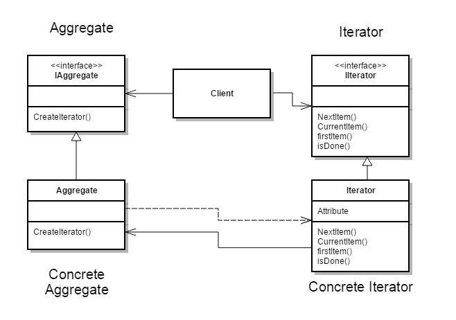

# 如何用 C++编写迭代器

> 原文：<https://medium.com/geekculture/iterator-design-pattern-in-c-42caec84bfc?source=collection_archive---------3----------------------->

## 目录:

*   简短的介绍
*   什么是迭代器
*   如何编写迭代器
*   让我们看看我们如何能建立一个！
*   结论

# **简短介绍**

如果你花了一些时间来学习设计模式，你很可能会遇到一个参考或人们只是说看一下"*4 人组*"的书，这是指这本书: ***由 Erich Gamma，Richard Helm，Ralph Johnson 和 John Vlissides*** 编写的可重用面向对象软件的设计模式元素，正如你可以看出的，这是一个满嘴的东西，因此*" 4 人组*"的表达就诞生了。

# **什么是迭代器？**

迭代器的定义有点模糊，没有解释太多:“*提供了一种顺序访问聚合对象元素的方法，而不暴露底层表示*”。

从这个定义的第一部分我们可以理解，迭代器将访问一个集合的元素，而这个集合将保存某种序列中的数据，例如，一个整数数组是一个保存序列中的整数的集合。当你可以简单地增加指针时，你为什么还要关心创建一种不同的方法来访问数组中的元素呢？你可能会问，像树、图和列表这样的复杂集合不是那么容易迭代的。不是所有的东西都需要迭代器实现，何时创建迭代器取决于你自己。

那么第二部分呢:“*不暴露下划线表示*”，**这是什么意思**？对于一个保存整数的简单数组，我们知道为每个元素分配的内存是连续的，我们只需从第一个元素开始递增指针来遍历数组，要做到这一点，您不必关心数组是如何构造的，因为您知道对于任何数组，您只需使用一个 *for-loop* 来遍历每个元素。

现在回到这个问题，当数据结构复杂时，要知道如何迭代它，你必须理解它是如何编写的，这可能很困难，更不用说你要花时间来确保你做对了，但是一个**迭代器**很容易使用，你不关心结构是如何编写的，因为所有迭代器都以相同的方式使用。

**例如:**

*vector 类公开了一个迭代器:*

迭代器的伟大之处在于，通过上面的代码，你可以简单地将数据结构从一个向量改变为一个集合或者一个列表，甚至一个映射(任何你能想到的结构),它将以完全相同的方式工作。

# **如何写迭代器？**

现在，我们有希望理解什么是迭代器，我们可以看一个在单链表上实现迭代器的例子。

就像复习一样，*单链表*是一种线性数据结构，然而，与数组不同，元素**而不是**存储在连续的内存块中，它们可以存储在内存中任何有空间的地方，并且每个元素都有一个指向下一个元素的指针。

*注意，在这个练习中，我们将使用智能指针(特别是 unique_ptr ),这样我们就不必担心为存储的数据手动释放内存。如果你不熟悉智能指针，有很多关于它们的很棒的信息。*

## 好吧，我们首先要做什么？

我们需要某种结构来存储一些数据和到下一个元素的链接:

然后，我们需要编写一个类来表示我们的列表，因为我们不太关心我们的数据是什么类型，我们将创建一个模板类，可以接受所有类型的数据。

在下面的代码中，我添加了一个节点作为内部类，在大多数情况下，这是没问题的，因为这个节点是特定于我们的结构的:

你可能已经注意到了，我添加了一个 head，它总是列表中的第一个节点，我们在 size 中记录列表中元素的数量。跟踪列表中元素的数量有助于确定列表是否为空，而不必遍历列表，为此，我们可以构建以下两种方法:

现在，我们可以考虑列表可以做什么，像任何数据结构一样，列表应该能够向列表添加元素，这可以是以下操作:添加到列表的前面，添加到列表的后面，并在某个位置插入元素。

添加到前端非常简单，我们只需检查列表是否为空，在这种情况下我们创建头部，如果列表不为空，我们创建一个指向头部的新节点，然后我们将头部重置为新节点并增加大小:

添加到后面包括遍历列表，因为除了头部之外，我们不能直接访问任何元素:

我们将在稍后讨论迭代器实现时讨论元素的插入。

列表还应该能够移除一个元素并清除整个列表。

*我在这里只添加了 clear 方法，你可以根据这个例子考虑如何移除一个元素*:

在某些情况下，颠倒列表是有用的。对许多人来说，颠倒列表并不是一件简单的事情，我自己也很难理解这个想法。当我们需要反转列表时，或者至少在我看来这是有意义的，会发生什么，就是改变链接的方向，这意味着 head 现在将链接到 null，head 的下一个节点将指向 head，依此类推，直到我们到达将被设置回 head 的最后一个节点:

我们谈论了一些有趣的东西，但我们也必须谈论一些我们必须在列表中写入的必要内容，以便它正常工作，我指的是 5 的**规则，我们不能逃避它，因为我们的数据不是微不足道的。规则 5 规定，如果你创建了其中的一个:复制构造函数，复制赋值操作符，移动构造函数，移动赋值操作符，或者析构函数，那么你必须创建所有的 5 个。**

除了 5 语义规则之外，我想添加一个特殊的构造函数，让大多数人更容易使用我们的结构。构造函数将从初始化列表中创建一个元素列表。

初始化列表是 C++中最重要的东西之一，它看起来像这样: *{ 1，2，3，4，3432，43，4，32 }*——你可能已经见过很多次了。因此，让我们看看如何实现它:

你可能会问自己:“*我们为什么不直接用 push_front 或者 push_back 呢？*“—嗯，向前推会返回列表，但顺序相反，与给定的初始化列表不同。 *Push_back* 将是一个 **O(n )** 操作，因为我们必须将列表中的每个元素重新定位到后面。

现在，在我们开始实际实现迭代器之前，让我们来讨论一下打印列表中的每个元素的第一个想法是什么。首先要做的是构建一个简单的方法来遍历列表并打印每个元素，因为我们已经知道如何遍历它。

**那就这么办吧！**这里有一个简单的方法，只打印出每个节点:

为了成功地将节点转换为字符串，我将添加一个转换操作符到节点结构中，该操作符将使用一个自定义的 *to_string* 函数，该函数可以将任何可转换的内容转换为字符串:

助手命名空间如下所示:

使用 *printList* list 方法很简单:

这很好，但是如果我们只想打印“两个”呢？然后，我们将需要创建另一个方法来查找它，然后打印它，这并不是那么糟糕，只有两个方法，**现在，**如果我们想要打印所有以字母“o”开头的元素，或者如果我们想要从所有元素中创建一个大字符串…我想你现在明白了吧！

如果有一些东西可以访问元素，也许还可以与来自 *<算法>* 标准头文件的优秀实现一起使用，这不是很好吗？为此，我们需要**迭代器**。

# 让我们看看我们如何能建立一个！

我们必须考虑如何遍历列表，如何暴露某个元素以及如何比较元素。现在，当你想一想，遍历列表只是访问下一个元素，直到我们到达一个 *nullptr* ，加上我们不能在任何方向遍历列表，因为我们只有单向访问。访问一个元素意味着访问它的数据成员，最终比较元素意味着一个元素是否与另一个元素相同。

因为我们只向一个方向移动，重载*“++”操作符*就足够了，访问一个元素基本上意味着解引用一个指针，因此重载*“*”操作符*也是需要的。比较可以是“==”或“！= "但我们会重载*"！= "运算符*所以我们可以用它来查看我们是否到达了列表的末尾。

我们需要创建一个迭代器类(或结构),它从列表中获取指向 head 元素的指针:

迭代器结构将作为 LinkedList 类的一部分嵌套，就像我们对节点所做的那样，因为这是这个 LinkedList 的迭代器。(不一定是)

这个列表必须实现两个重要的方法:

1.begin() —将返回一个用 head 元素初始化的迭代器

2.end() —将返回 ***nullptr*** ，这将表示结束

现在我们可以使用迭代器来遍历列表，就像我们通常使用简单的向量一样:

此时，我们创建的迭代器不能修改链表，所有元素返回的是 ***const*** ，因此这可以认为是和 ***const*** 迭代器。但是我们可以对迭代器类做一些简单的修改，这样我们也可以在迭代时插入一个元素:

我们必须将 ***LinkedList*** 作为友元类添加到迭代器中，以便它可以访问其私有成员: ***友元类 LinkedList*** 并从 ***迭代器中移除***const***:【previous _ node】***和 ***迭代器::current_node*** 。

最后，我们将添加一个新方法，在指定位置之前插入一个新元素:

作为该方法的概述，我们可以看到，因为我们将下一个节点从当前节点移动到 ***新节点- >下一个*** 节点，我们不能再返回这个位置，因此我们必须从这个位置返回一个新的迭代器。这样我们不会使迭代器失效，我们可以继续遍历。

完整的代码可以在这里查看:

# **结论**

构建迭代器将简化给定数据结构的代码，因为迭代器负责遍历结构而不是结构本身，结构的唯一职责是为迭代器提供开始和结束。

您可以构建各种类型的遍历(例如:正向、反向、按序、前向),并且可以通过改变迭代器在这些类型的遍历之间切换。

因为迭代器跟踪自己的遍历状态，所以一次可以在同一个数据结构上应用多个遍历。如果需要，您可以延迟一次迭代，稍后再继续。

# 链接

 [## 设计模式

### 捕捉关于面向对象软件设计的丰富经验，四个顶尖的设计师提出了一个面向对象软件设计的概念

books.google.ro](https://books.google.ro/books/about/Design_Patterns.html?id=6oHuKQe3TjQC&printsec=frontcover&source=kp_read_button&redir_esc=y#v=onepage&q&f=false)