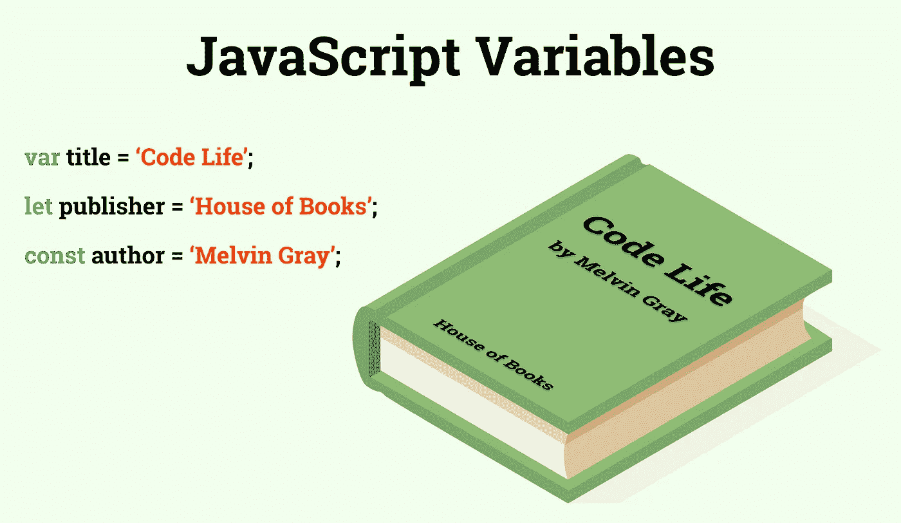

# JavaScript 变量

> 原文：<https://medium.com/geekculture/javascript-variables-aa551d40b6da?source=collection_archive---------23----------------------->

变量是用 JavaScript 或任何编程语言编程的一个基本方面。理解什么是变量以及使用变量时会发生什么是很重要。在很长一段时间里，JavaScript 通常只有一种方法来声明变量，即使用关键字`var`。自从 ES6 (ES2015)的到来，关键字`let`和`const`已经可以进行变量声明了。将这些特性添加到语言中的想法是，通过作用域的概念，提供控制变量如何声明、赋值以及对 JavaScript 程序的其他部分可见的方法。



**Javascript Variables**

本文主要关注 JavaScript 中变量的基础知识——也称为[声明](https://developer.mozilla.org/en-US/docs/Web/JavaScript/Reference/Statements#declarations)——以及它们的使用示例。变量的核心概念是提供一种方法来声明和存储可以在程序中使用的值。声明一个变量就像给一个值一个指针，可以反复使用这个指针来引用存储在这个指针上的值。这种功能

可以使用`var`、`let`和`const`关键字来声明变量。

# 定义变量

变量声明`var`从一开始就和 javascript 一起使用。`var`变量(还有`let`和`const`变量)用于存储不同类型的数据。变量可以存储字符串、数字、布尔值、对象、函数等数据。

```
var myName = 'bob';
var myAge = 34;
var clubMember = true;
var schoolSupplies = ['pencil', 'notebook', 'pen', 'eraser'];
var schoolSchedule = {
  math: 'Advanced Algebra',
  science: 'Physics',
  literature: 'Modern Chinese Literature',
};
var sayHello = function () {
  console.log('hello');
};
```

上面的例子显示了可以存储在变量中的不同类型的数据。上面所有的变量都用关键字`var`声明。用`var`在任何其他代码块之外声明一个变量，将它放在**全局范围**内，这意味着变量可以从程序的任何其他部分访问，并且在程序内全局可用。

```
var myName = 'bob';function studentProfile() {
  console.log(`student name: ${myName}`);
}studentProfile(); // student name: bob - variable 'myName' is part of the global scope
```

在函数代码块中使用`var`声明的变量——称为**函数作用域**——只能在函数内部访问。一个例外是当一个变量被赋值但没有使用`var`关键字声明时，如下图`testResults`所示。像这样赋值允许在函数外部访问变量。

```
function getStudentGrade() {
  testResults = [75, 86, 93, 87];
  var testResultsAverage =
    testResults.reduce((a, b) => a + b) / testResults.length;
  return testResultsAverage;
}console.log(testResults); // 85.25 - variable 'testResults' is part of the global scope
```

在逻辑代码块中使用`var`声明的变量——称为**块范围**(例如。`if..else` ) -可从街区外进入。

```
if (true) {
  var newName = 'ned';
}console.log(newName); // ned - variable 'newName' is part of the global scope
```

# 让

变量声明`let`在很多方面与`var`相似，但是在访问和范围方面有一些关键的不同。使用`let`在全局范围内声明的变量可以在程序的任何地方被访问。这种行为就像`var`变量声明所发生的一样。

```
let studentName = 'melvin';function greetStudent() {
  console.log(`Greetings, ${studentName}!`);
}
```

同样，就像使用`var`一样，在函数范围内使用`let`声明的变量只能在函数范围内访问，当试图在函数范围外访问时会导致错误。

```
function chooseClub() {
  let clubSelection = 'chess club';
  console.log(clubSelection);
}console.log(clubSelection); // ERROR - 'clubSelection' is only accessible within the function scope
```

然而，当使用块作用域时，在块内用`let`声明的任何变量在块外都是*而不是*可访问的，这将导致错误。这是与用`var`关键字声明的变量的一个关键区别，这些变量可以在块外访问。

```
if (10 > 5) {
  let answer = 'Ten is greater than five';
}console.log(answer); // ERROR - 'answer' is only accessible within the block scope
```

# 常数

变量声明`const`旨在用于不会改变的数据——换句话说，将保持不变的数据。就像使用`var`和`let`一样，在使用`const`的函数或块之外声明的变量对于全局范围是可用的。

```
const friendName = 'Kalvin';function sayFriendName() {
  console.log(`Hi, ${friendName}!`);
}sayFriendName(); // Hi, Kalvin! - variable 'friendName' is part of the global scope
```

就像用`let`声明的变量一样，用`const`声明的变量在函数作用域或块作用域之外都是不可访问的，会导致错误。

```
function getLunch() {
  const specialMeal = 'pasta';
}console.log(specialMeal); // ERROR - 'specialMeal' is only accessible within the function scopeif ('pizza' === 'pizza') {
  const favoriteFood = 'cheese pizza';
}console.log(favoriteFood); // ERROR - 'favoriteFood' is only accessible within the block scope
```

关于使用用`const`声明的变量的一个重要注意事项是它们不能被重新分配。这适用于包含数值、数组或对象的数据的`const`变量。

```
// VALUE
const courseLength = '2 hours';courseLength = 120; // ERROR - 'courseLength' cannot be reassigned// ARRAY
const courseTitles = ['Intro to Math', 'English Literature', 'Biology'];courseTitles = ['Physical Education', 'Chemistry', 'Spanish I']; // ERROR = 'courseTitles' cannot be reassigned// OBJECT
const courseProfile = {
  name: 'Chemistry',
  days: ['Monday', 'Wednesday'],
  time: '9:30am',
  instructor: 'Gil',
};courseProfile = {
  name: 'German Literature',
  days: ['Friday'],
  time: '14:00',
  instructor: 'Bob',
}; // ERROR - 'courseProfile' cannot be reassigned
```

然而，需要注意的一点是`const`确实允许数组和对象中的数据被改变。

```
// ARRAY
const weekDays = ['Monday', 'Tuesday', 'Wednesday', 'Thursday', 'Friday'];weekDays.push('Strangeday');console.log(weekDays); // [ 'Monday', 'Tuesday', 'Wednesday', 'Thursday', 'Friday', 'Strangeday' ]// OBJECT
const mathAssignment = {
  partOne: 'Read the textbook',
  partTwo: 'Complete the homework questions',
};mathAssignment.partThree = 'Take the quiz';console.log(mathAssignment); // { partOne: 'Read the textbook', partTwo: 'Complete the homework questions', partThree: 'Take the quiz' }
```

# 结论

变量在 JavaScript 程序中无处不在。可能出现的一个问题是不同作用域中的变量具有相同的名称。当分配给一个变量的值无意中被其他变量覆盖时，这会产生问题。这是一种可能不会产生错误信息，但仍会导致问题的问题。同样，在程序运行过程中，许多赋值都是在不需要改变的情况下创建的。然而，有可能无意中覆盖变量的值，导致程序出现问题。

添加`let`和`const`是为了解决其中的一些问题。它们已经成为有用的工具，帮助开发人员编写限制数据可见性和修改的代码，从而帮助开发人员避免可能导致大问题的小错误。