# 只需点击接受:暗示的黑暗模式

> 原文：<https://medium.com/geekculture/just-click-accept-dark-patterns-of-suggestion-80c3003693de?source=collection_archive---------9----------------------->

Image from [TechDetoxBox.com](https://www.techdetoxbox.com/weapons-of-digital-manipulation/just-click-accept-dark-patterns-of-suggestion/)

在美国一个大机场等待航班的时候，我和我的孩子决定去吃点东西。当我掏出信用卡付款时，我震惊地发现密码本向我索要小费，甚至还提示了金额。在一家没有服务员的快餐店。

我没有留下小费，因为我不喜欢被人操纵。你可能也不喜欢它。

我们的选择是由我们的环境塑造的，许多选择不是有意识地做出的。相反，我们只是按照提示行事——采取建议我们采取的行动。

界面设计控制着交互。我们不能像和一个人争论一样和它争论。我们要么接受，要么拒绝屏幕的建议。接受总是容易的，但拒绝往往是困难或不可能的——这绝非偶然。

> **数字技术充满了黑暗模式——操纵设计技术来欺骗用户做一些有益于商业的事情。**
> 
> 有时只是简单地…建议一下。

# 强迫小费和慈善结账

结账时强行收取小费是为了让顾客感到羞愧而顺从，从而为企业赚更多的钱。如果你在屏幕上点击“不”，收银员和你后面的每个人都会看到你是一个多么吝啬的混蛋。

拒绝尴尬和内疚。没人在乎。

慈善结账是另一种技巧。有些商店会提示你将购物金额四舍五入到最接近的整数。当我在最近的宠物商店为我的猫购买食物时，我面临着捐赠的大按钮和拒绝的小按钮:

我并不是说我们应该总是很吝啬，拒绝给小费或捐款——只是说我们应该认识到，要求免费的钱违反了顾客和商家之间的隐性契约。我是来买产品的，不是来捐给慈善机构的。

> 顺便说一句，你不能在自己的纳税申报单上申请结账捐赠。你只是在帮助商人节省税款。

也许，要成为真正的慈善，我们可以独立选择我们的慈善机构，捐赠更多的零钱。

# 设计造成的混乱

这是我孩子学校的注册天才截图。看起来很无辜？但愿如此。这是一个雷区:

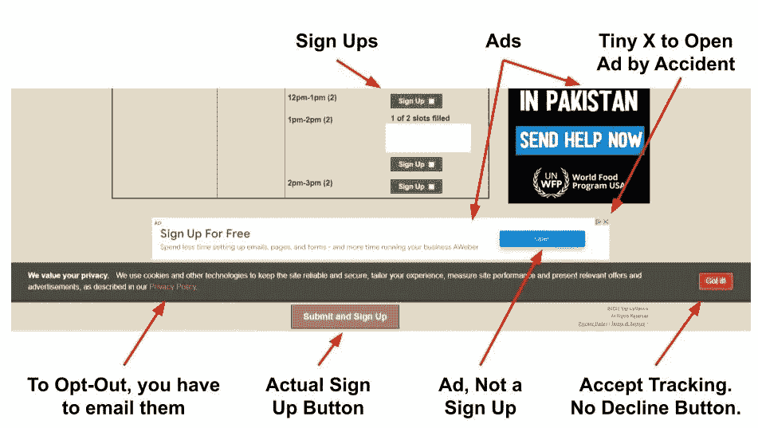

有 3 个不同的按钮，其中只有一个是真正的注册，很容易与其他两个混淆:一个伪装的广告和同意分享您的数据进行跟踪和广告。没有拒绝的选择，除非你想发邮件给他们的隐私部门，等待答复。

**这里的广告看起来像内容和导航**——你以为你点击了过程中的下一步，但你点击的是一个偷偷摸摸的广告。试图用一个小小的 X 关闭它可能会导致点击广告，这将为网站赚钱——这是故意混淆设计的全部要点。

# 将懒惰武器化

我丈夫分享了他最近在纽约充值地铁卡的经历。机器按以下顺序给出了建议金额:40-30-20 美元。而不是相反。有多少人会盲目点击并花费超过他们需要的东西？

进化设计我们保存精神能量。我们更喜欢阻力最小的方式——这是一种表达我们懒惰的巧妙方式。人脑只占我们身体质量的 2%，却消耗了我们 20%的能量。你有没有注意到每次你坐下来学习或工作时，你会感到饿？那是你的大脑，渴望能量。由于我们的大脑能量效率如此之低，所以尽可能通过简单的方法来保存它是进化上的明智之举。

做决定是很累的——除非我们自动做决定。我们不想思考，我们有更好的，有趣的和放松的事情要做。我们屏幕上的这些建议看起来足够好了。

> 点击“购买”。点击“接受”。点击“同意”。

# 号召行动，光明而美丽

我们希望我们的数字体验简单易行。但是，当对平台有利可图的东西对我们不利时，就变得不道德了——比如不小心买了我们不需要的东西。

我们的注意力被开发者希望我们看到的东西所吸引。期望的最终结果是通过接口的最容易的路径，有时是唯一的路径。

最有利可图的选择是一个明亮的位于中央的“行动号召”按钮，它将用户带到预定的结果。它利用了我们的认知[突出偏见](https://en.wikipedia.org/wiki/Salience_(neuroscience)#Salience_bias)——人类倾向于关注环境中突出的事物。

我们的进化设计让我们想尽可能少地工作。这对我们的史前祖先来说非常有意义，因为他们不知道下一顿饭从哪里来。今天，我们仍然喜欢避免额外的工作，我们技术的设计者也很乐意提供界面，只需要我们最少的努力。

> 因此，我们点击行动号召，沿着阻力最小的路径前进——远离他们不想让我们选择的选项——比如隐私。

# 违约的力量

你读过条款和条件吗？有多少次你接受了“隐私政策”却没有意识到它实际上是一个[监控政策](https://www.techdetoxbox.com/digital-wellbeing/keep-your-home-dumb-the-trojan-horse-of-surveillance/)？

只要平台在技术上符合必要的法律披露，欺骗人们交出数据的欺骗性用户界面就不违法——即使这种披露像大多数“条款和条件”一样是隐藏的和令人困惑的。

几乎你登陆的每个网站都会要求你接受他们的 cookie 政策，通常是通过点击一个大而突出的按钮。Cookies 是放置在您设备上的文件，用于跟踪您个人的浏览历史。Cookies 可以在您的数字环境中实现有针对性的行为广告，用最“相关”的广告修改您的行为，让您购买、点击、查看或投票购买广告商支付的任何东西。

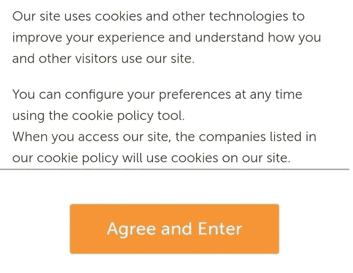

> “个性化广告体验”是对算法奴役的一个花哨的称呼。一个诚实的问题应该是:“你希望我们跟踪你做的每一件事，并用它来对付你吗？”

毫不奇怪，选择退出 cookies 的选项受阻。如果你想拒绝他们，你必须搜索设置来手动禁用。我还没有看到一个大的“全部拒绝”按钮。

> 违约不容易撤销。

# 自动选择加入——祝你尝试退出时好运

界面的黑暗心理让你交出你的数据、金钱和时间，而不是保留它们。只有让选择加入和选择退出变得同样容易，这种情况才能得到补救，但这将违背[注意力经济](https://www.techdetoxbox.com/weapons-of-digital-manipulation/how-attention-economy-works/)的利益。

选择加入通常是默认发生的——但是选择退出你没有要求的东西需要通过选项进行耗时的寻宝。要选择退出，你必须克服“用户体验”设计者给你设置的多重障碍。

他们的目标是保持现状:对他们有利可图。平台希望你选择的动作被设置为默认选项。选择退出过程尽可能地让人不舒服。

备选方案藏在不明显的地方(底部菜单、小字免责声明、条款和条件)。即使你设法找到它们，它们也很难破译。

> 选择退出是隐藏的设计。

这里有一个例子说明选择退出是多么耗时。默认情况下，LinkedIn 正在收集和分享所有可以收集和分享的关于我们的数据。有一种方法可以挽回一些隐私，但他们的选择退出过程包括一个 3 到 4 层的复杂菜单。在选择退出的过程中，这些是有意设置的“减速带”,您必须单击每个单独的设置:

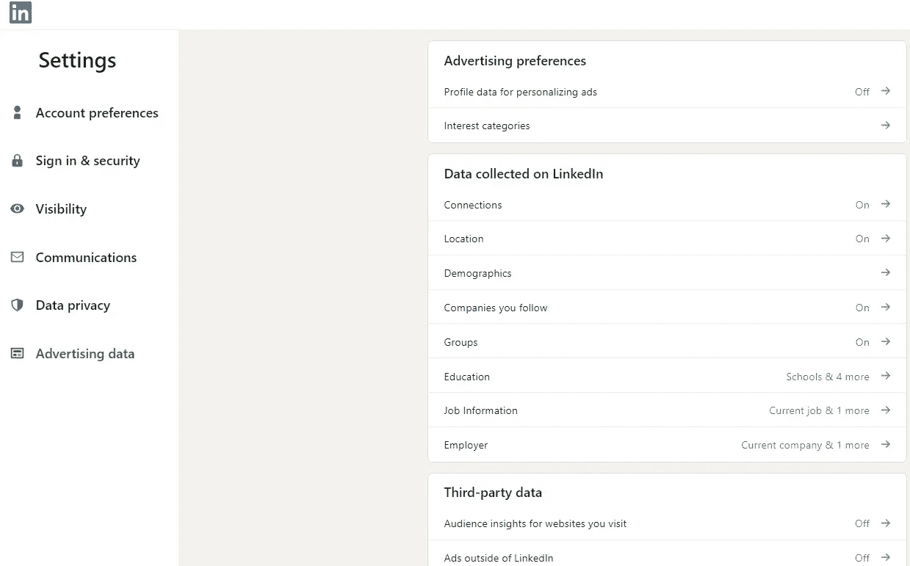

例如,“广告数据隐私”菜单会带您进入 14 个子菜单，每个子菜单都会打开另一组要撤消的单独设置:

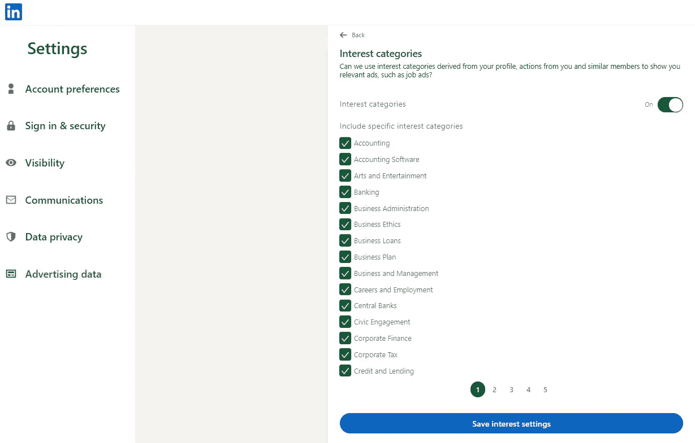

choice 架构中的过度摩擦——困难——几乎保证了用户不会费心更改默认设置，也不会实现他们的目标——在这种情况下是隐私。

有一项有趣的研究是关于选择加入和选择退出设计之间的差异。在那些人们除非选择退出，否则自动被视为器官捐献者的国家，几乎每个人都是器官捐献者——90%。但是如果人们不得不主动选择成为器官捐献者，这个数字会骤降到不到 15%。在“选择加入”的国家，额外的工作是在表格上勾选一个方框——而大多数人就是不勾选。

这种心理是“隐私选项”设计者所熟知的。任何需要披露的信息都被隐藏在远离主界面的地方。除非用户能够主动选择参与数据收集，并获得相应的报酬，否则隐私是不存在的。

> 监控是默认设置。

# 默认监控

每家社交媒体公司都会建议你“完成你的个人资料”，这意味着有更多的数据出售给广告商。这些提醒会放在你的提要的顶部，以确保你不会错过它们，并且会一次又一次地弹出。以下是 LinkedIn 和脸书的建议:

分享数据变得很容易，但取回数据要困难得多——就脸书而言，这不是与平台定期互动的一部分——而是有一个单独的(令人厌烦的)“隐私中心”:

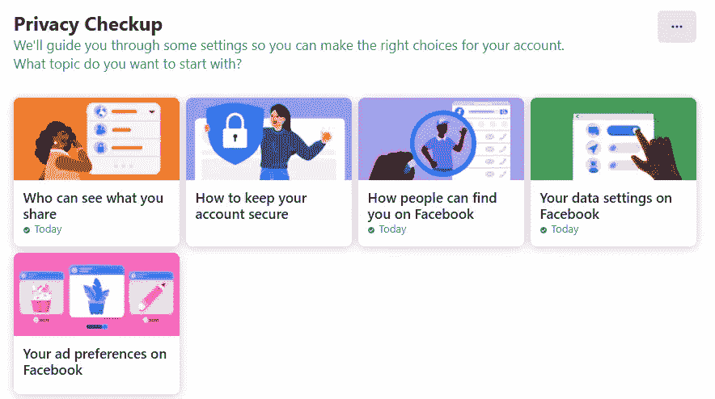

在那里，我们发现了大量令人困惑的设置，旨在耗尽我们微不足道的注意力，甚至在我们开始之前。[撤销所有监控选项的努力相当大。](https://www.techdetoxbox.com/digital-wellbeing/practice-data-privacy-hygiene-the-defaults-are-never-in-your-favor/)

> 我们只会惊呼“哦，算了吧！”然后继续观看我们的猫视频。脸书正指望它。

这只是我们正在打交道的数百家公司中的一家。我们中很少有人有时间和纪律去挖掘最大的罪犯——亚马逊、脸书、微软、谷歌和苹果——的背景，即使这样也是不够的。为了最大限度地减少损害，我们必须拒绝默认建议，并手动调整每个应用程序和小工具的隐私——从我们的智能恒温器到我们的冥想应用程序。

谁有时间和动力？我们太忙，太分心了。

> 因此，违约依然存在，而且[它们从未对我们有利](https://www.techdetoxbox.com/digital-wellbeing/practice-data-privacy-hygiene-the-defaults-are-never-in-your-favor/)。

# 精心策划的购物狂欢

当我们在亚马逊购物时，我们喜欢认为我们在独立做出选择，但实际上亚马逊为我们做出了选择，以多种方式建议我们应该购买什么。

看，这种产品是同类产品中的佼佼者。以下是相关产品。买这个的人也买那个。与类似项目进行比较。推荐给你。你可能也会喜欢这个。等等等等。

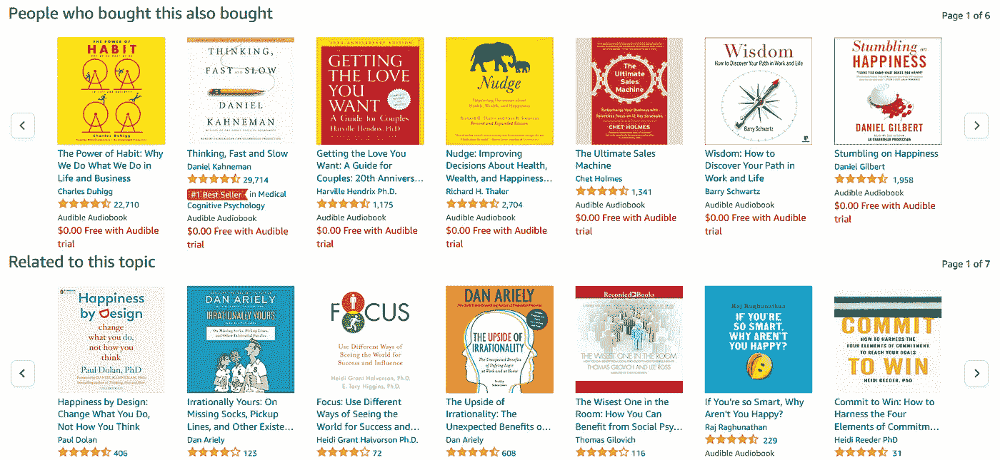

即使他们推荐的产品不是“赞助列表”(广告)，算法上呈现给你的也是你最有可能购买的。无论哪种方式，亚马逊都赚钱。来自小卖家的更便宜的替代品不会出现在“建议”列表中。亚马逊让卖家每月支付 40 美元的费用，只为拥有“立即购买”按钮的特权。那些不是“专业卖家”的人，不要买。

大型购物网站总是首先推荐广告产品。卖家向亚马逊支付费用，在“赞助”列表的位置吸引顾客的眼球，谷歌会把广告产品放在你的搜索结果上面。可能会有更好更便宜的替代品来满足你的需求——但是它们被隐藏起来了。

# 启动用户

网飞把我们推进了**【最喜欢】****【今日电影第一】**，结果我们看的大部分都是来自他们的推荐引擎。以下是我家两个不同档案的**“网飞流行”**快照:

注意——它们完全不同。因此，基于平台从我们这里提取的大量数据,“最受欢迎”的选项实际上只是我们可能会点击的选项。其他顾客可能会鄙视这些“流行”电影。

> 网飞知道，他们有更大的机会让我出现在电影屏幕上，让我丈夫出现在战争电影中。

以这种方式突出电影或产品使用了被称为[启动](https://en.wikipedia.org/wiki/Priming_(psychology))的心理效应——用户受到屏幕上视觉线索的制约，将首选项视为他们的最佳选择。

# 社会证明:大家都在做！

如果平台能让你相信你的朋友已经选择了他们喜欢的产品、服务或行为，那么启动就是超级增压。脸书对 6100 万选民进行了一项有争议的实验，在未经他们同意的情况下，通过向人们展示他们已经投票的朋友的照片，影响现实生活中的选民行为和选举结果。有人可能会说，这样的实验促进了更大的利益，但同样的策略被用来操纵用户达到不那么高尚的目的。

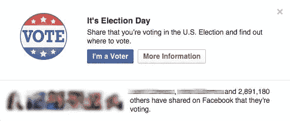

该平台会在一个快乐的“生活方式”环境中向你展示你的首选，以促使你购买:将产品与积极情绪联系起来是广告的一个标志。社会证据存在于已经做出选择的快乐和成功的人的形象中，尤其是那些你在社交网络中认识的人。

看，这些 LinkedIn 上的人都会参加这个活动——你也应该参加。看——这些脸书的朋友关注这一页——你也应该:

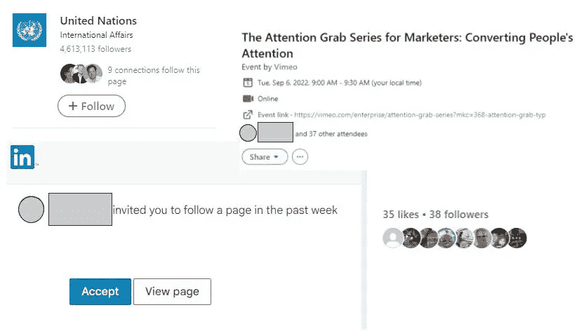

> 等等，社会证明，算法劫持。

# 权威建议

我们对权威的人类偏见可以进一步增强社会证明的力量——我们相信来自我们尊敬的人物的建议。这些可以是我们的朋友，也可以是在线平台本身——我们相信亚马逊会为我们推荐最佳选择，而谷歌会为我们的搜索提供最佳答案。

当亚马逊在一个产品上贴上“亚马逊首选”，或“类别第一”，或“畅销书”的标签时，你很可能会选择该平台首选的选项——他们有所有的数据，所以它一定是最好的。

该平台可以获得专家的帮助——无论是真实的还是想象的。著名作家的书评会卖出一本书。穿着白大褂、看起来像医生的演员的代言可以销售一种药物。

通常情况下，信任一个组织或一个人的权威并没有错，但就像罗纳德·里根对苏联说的那样:*“信任，但要核实”*。

# 到底是谁的选择？

我们习惯于认为更多的选择是一件好事，但根据畅销书《选择的悖论》的作者巴里·施瓦茨的观点，更多的选择会导致决策瘫痪。过多的选择让我们倍感压力——可供选择的选项越多，我们消耗的认知能力就越多，不确定哪一个是最好的。

选择越少越好。亚马逊使用其推荐算法，在“购买了该商品的人也购买了”或“相关商品”下，建议一个**可管理数量的可比商品**。

它们为我们提供了加速决策的比较。这些产品推荐列表利用了一种[对比效应](https://en.wikipedia.org/wiki/Contrast_effect)来加速购买:只需将商品放在更贵的替代品或评论评分较低的产品旁边，选择就变得显而易见了。

过去的研究人员对销售葡萄酒的心理学进行了实验——如果你把一瓶你想卖的葡萄酒放在便宜和昂贵之间，顾客会选择它作为最有价值的。一个定价过高的替代品变成了一个锚，一个比较点，我们买了一瓶更便宜的酒，满意地离开，我们得到了一个伟大的交易。

> 一旦我们开始考虑太多的选择，决策疲劳就会出现。对于界面设计师来说，危险在于我们放弃了，没有选择任何东西，放弃了这个过程。

所以他们给这个选择贴上“最受欢迎！”或者“物超所值！”

> 我们点击“立即购买”,因为他们知道我们会这样做。

# 受制而走不开的听众

你有没有从瑞安航空或精神航空这样的折扣航空公司买过机票？那么你已经忍受了他们的交叉销售盛宴，而他们把你作为他们的俘虏观众。我只是想要票，你在繁琐的购买过程中呻吟着，但在结账的每一步，他们都建议你购买行李限额、旅游保险、汽车租赁、酒店、停车，以及选择自己座位的权利！

> 他们知道他们把你困在这个过程中，他们会榨取你所有的一切。

虽然它们吸引了我们的注意力，但这些航空公司进行交叉销售，其他公司也是如此。我在 Evite.com 回复生日邀请，我被“可以利用的特别优惠”轰炸。我在 Shutterfly 上订购了一本相册，我的屏幕上立即挤满了许多其他可供购买的照片产品——以我孩子的照片为特色，触动了我的情感按钮！

因此，这是我们数字生活的一个事实——一旦你发现自己成了销售渠道的俘虏，从你身上榨取更多金钱的“有用建议”就不会停止。

# 偷偷摸摸的广告

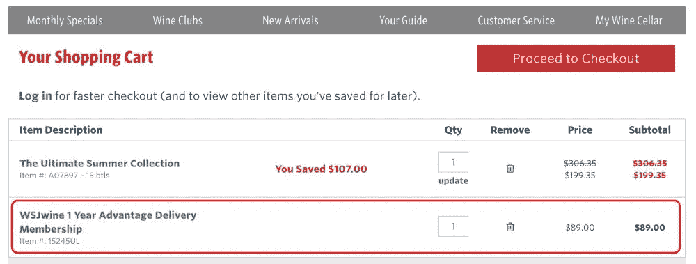

我们的惰性让我们接受隐藏在显眼处的默认选项，故意让它们容易被忽略——就像一个预先检查过的订阅盒。用户体验让我们很容易跳过它们，因为我们在流畅的购买体验中会无意识地点击“下一步”。我们不会被打扰，但后来当我们发现不必要的费用时，我们会为我们的疏忽付出代价。

# 自动注册

每次我使用像 Homeadvisor 这样的在线服务寻找勤杂工时，我都会自动加入他们的多个邮件列表，这些列表塞满了我的收件箱。

我们大多数人都会在 auto pilot 上经历账户注册或产品检验的过程——我们将它们视为标准操作程序，只需要最少的认知努力。但是在主流程中，开发人员可以隐藏多余的默认选项，以获得更多与交易的原始目的无关的数据和资金。

你想注册我们的营销邮件吗？当你的注意力在别处时，这个框已经被选中了。

我们点击了整个过程，却没有意识到每一个漂亮的绿色“下一步”按钮都可以把我们带到我们没有打算去的地方。我们最终会自动注册一些我们不需要的东西。

网页设计师为我们设计的阻力最小的路径满足了我们用最少的工作量获得产品或服务的愿望，现在我们的电子邮件在他们的系统中。他们知道我们的人性——我们不太可能努力退订。

# 当风险很高的时候

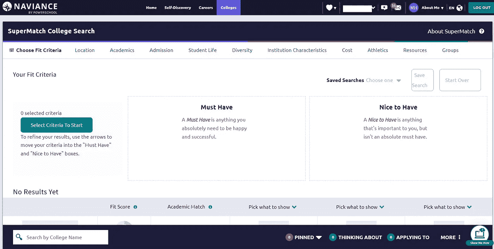

每个高中生都是潜在的每年 7 万美元的摇钱树，大学想把他们吸引到自己的牧场，相互竞争。如果一些大学推荐结果是伪装的广告怎么办？嘿，青少年，这所学校非常适合你——但没有办法知道他们是否为上榜的特权付出了代价。

像美国大多数学校一样，我儿子的高中指导顾问依赖于 PowerSchool 旗下的 Naviance 的大学推荐信，该公司还管理学生的学术数据。该软件为每个学生建立了一个全面的心理档案，所以在一天结束时，他们比学生更了解他们自己。大学渴望获得这些数据。

如何对大学推荐进行优先排序是一个算法黑箱。据我们所知，它们可能就像谷歌或亚马逊赞助的商品一样。但与简单的购买不同，人类的未来悬而未决。学生可以根据最佳建议的排名做出决定，定义他们的一生——毕竟，我们中有谁能超越谷歌的第一页？

一个推荐是真实的还是赞助的决定取决于公司的主管。他们必须在没人会注意到的诚信和直接影响他们奖金和工作保障的底线之间做出选择。

家长们，保持警惕——通过依靠技术的可信赖的指导顾问提出“有益的建议”的诱惑不可低估。利益冲突显然是存在的。

# 当他们让你别无选择时

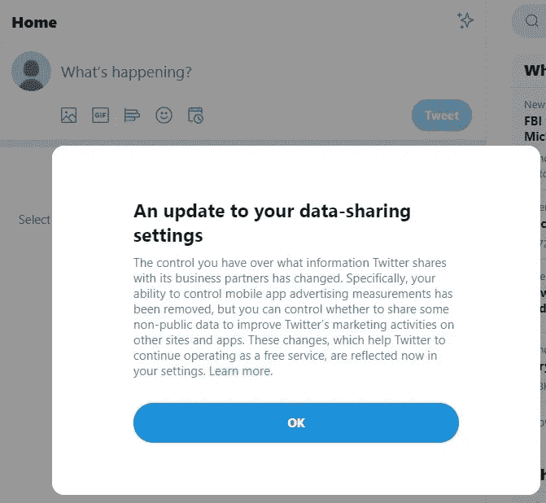

Twitter 最近告诉我，“你对 Twitter 与其商业伙伴分享的信息的控制已经改变。您控制移动应用广告测量的能力已被移除”。好吗？

不，不好——但是除了不使用它们，他们没有给我其他选择。这是一个错误的二分法:没有真正的选择。

# 否定选项:点击不报名

**“如果您不希望我们向您发送营销消息，请选中此框”。**

等等，什么？！如果你不想让他们给你发垃圾邮件，你必须点击不注册，否则他们会认为你没问题。所以关是真的开！

辨别这样的“双重否定”需要相当大的精神努力，而且很容易犯错误——对他们有利。

# 如何抵制暗示的黑暗模式

建议在网上随处可见，催促我们订阅、添加商品到购物车或注册服务。

每个界面都是为了平台的利益而设计的。我们需要对它的意图持怀疑态度，并当场进行分析，以回答这个问题——屏幕上的建议是否符合我们的最佳利益，或者我们没有它会更好？我们是否被巧妙地操纵，给出了超出交易目的所需的金额？

我们很少因为同意这个建议而得到有实际价值的回报。在提取我们的数据时没有交换。这是不道德的，我们需要为自己辩护。

应对控制性建议的策略是在点击之前先思考:

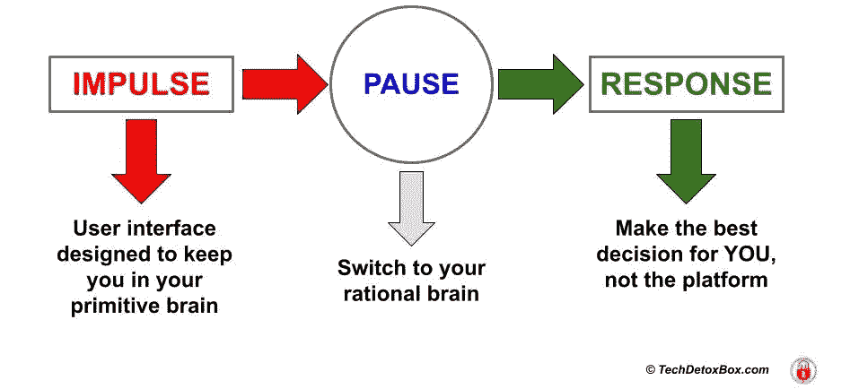

Image from [TechDetoxBox.com](https://www.techdetoxbox.com/)

# 点击前请三思

用户界面设计师依靠我们的进化生物学跳过停顿，直接从冲动到反应。无意识点击很容易，而且有利可图。

简单的觉察就足以抵抗黑暗模式。这需要我们的理性思维一直保持开启，而不是依赖我们情感边缘大脑的自动反应。当我们知道操纵看起来像什么，并在寻找它时，我们重新获得了对用户体验的控制。

**我们必须研究盲目遵循接口的潜在后果:**

*   *我是不是为产品多付了钱？*
*   *我订阅了一些我不需要但以后会被收费的东西吗？*
*   我是否放弃了我的个人信息，而这些信息会被用来向我出售更多的东西？
*   *我的数据会被出售给第三方以未知的方式操纵我吗？*
*   *我的邮箱会因为他们收了我的邮件而被垃圾邮件塞满吗？*

这种类型的警惕起初看起来很累，但它只需要应用到新的在线情况中。一旦你分析了一个平台，并确定要避免的陷阱，你就可以切换回自动驾驶。除非他们改变设计，否则你必须重新评估他们。

> 为了抵制操纵建议，我们必须中断阻力最小的模式。做他们不想让我们做的额外工作:

***建议:*** *“同意条款”。*

***阻力:*** *我可以选择退出吗，哪怕多点击几下？向他们的隐私部门发送电子邮件，收回您的数字自由。*

***建议:*** *“接受所有 cookies”。*

***抗性:*** *将 cookie 设置调整为只有“绝对必要”。定期清除所有设备上的网络浏览器中的 cookies。*

***建议:*** *在我的电子邮件中点击行动号召，让我进入他们的网站，增加他们的流量。*

***阻力:*** *被吸进我会在那里找到的内容的兔子洞是否符合我的利益？*

***建议:*** *看一部“推荐”的电影或视频。*

***电阻:*** *手动选择。*

***建议:*** *点击立即购买。*

***阻力:*** *我有没有做比较购物，以确保在别处没有更好的选择？*

***建议:*** *弹出消息进行订阅。*

***阻力:*** *我会收到有用的信息还是简单的广告？他们会分享我的电子邮件吗？*

***建议:*** *结账流程中的预复选框。*

***阻力:*** *扫描页面寻找他们不想让你看到的不显眼的选项。*

对于大多数平台来说，深色图案是不可避免的。处理它们的策略是朝着你的目标前进，除了绝对必要的以外，不要放弃任何更多的数据或金钱。不要因为拒绝操纵策略而感到内疚。只做符合你价值观的事情。

# 你对操纵的意识免除了你遵从的需要。

[TechDetox 妈妈](https://www.techdetoxbox.com/mission-screentime-children-wellbeing/)在上瘾技术的[接收端发现了自己的孩子，决定反击。](https://www.techdetoxbox.com/screen-time-problems/)

她对技术和心理之间关系的研究试图揭示数字行为操纵是如何影响人类福祉的。

她在她的博客[TechDetoxBox.com](https://www.techdetoxbox.com/)上写道，要找到[解决方案](https://www.techdetoxbox.com/digital-wellbeing/)来保护我们的家庭，恢复我们的人性。