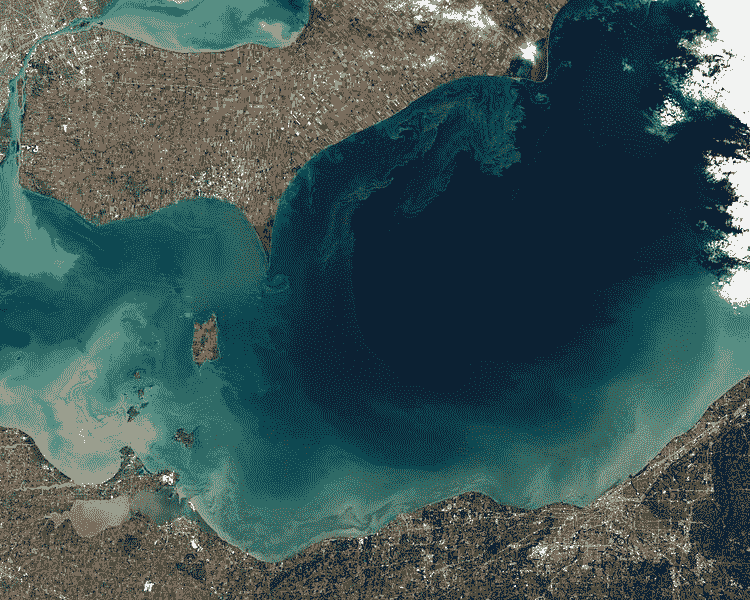
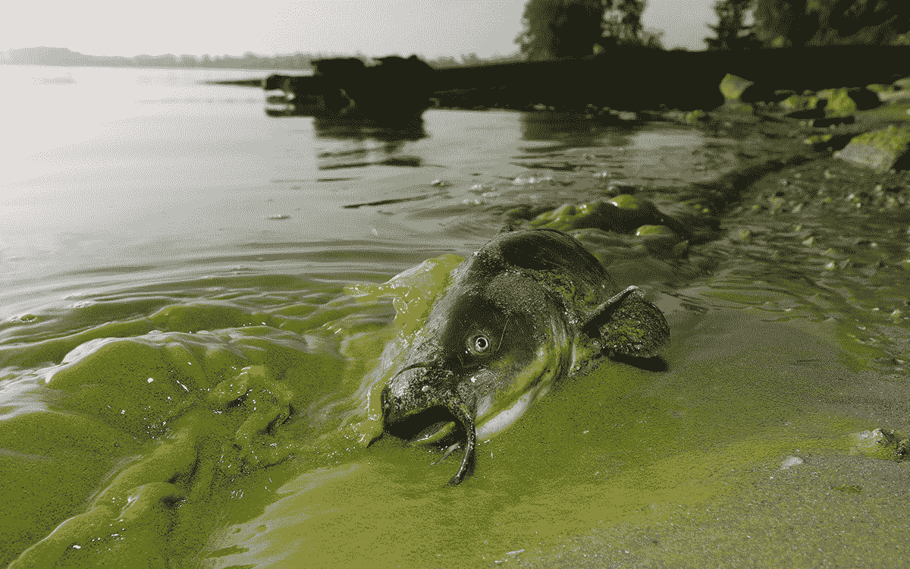
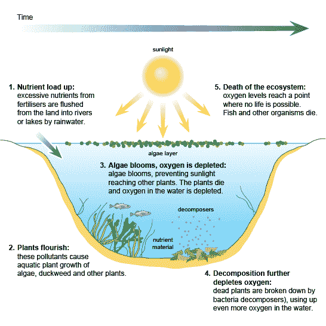
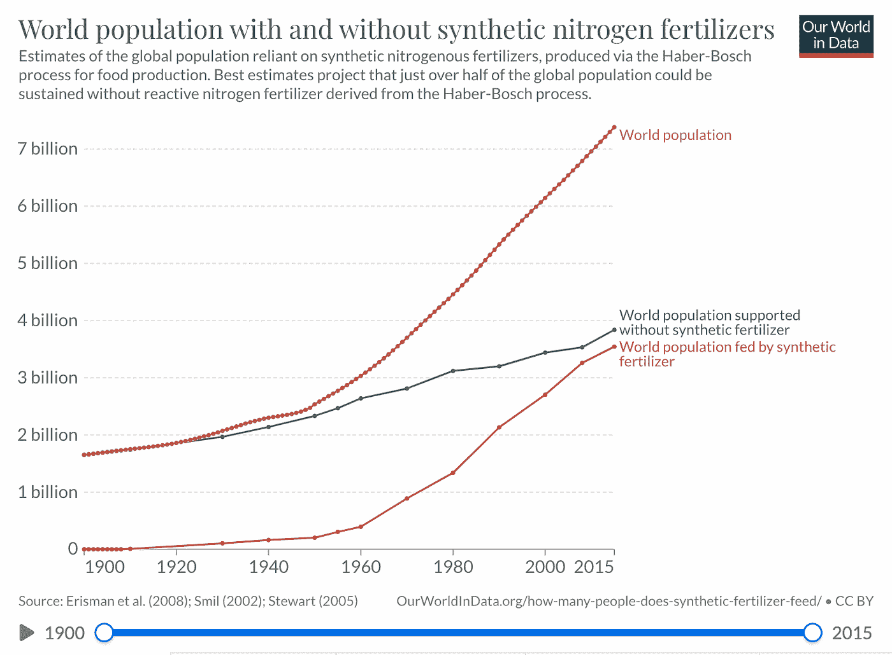
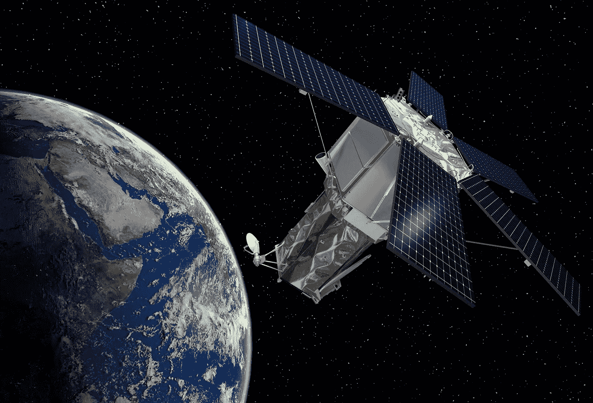
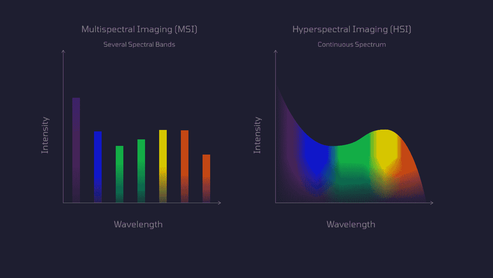
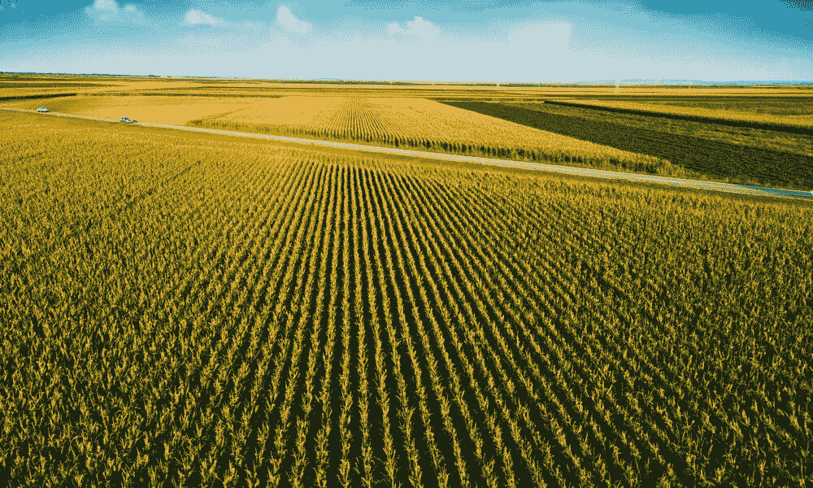
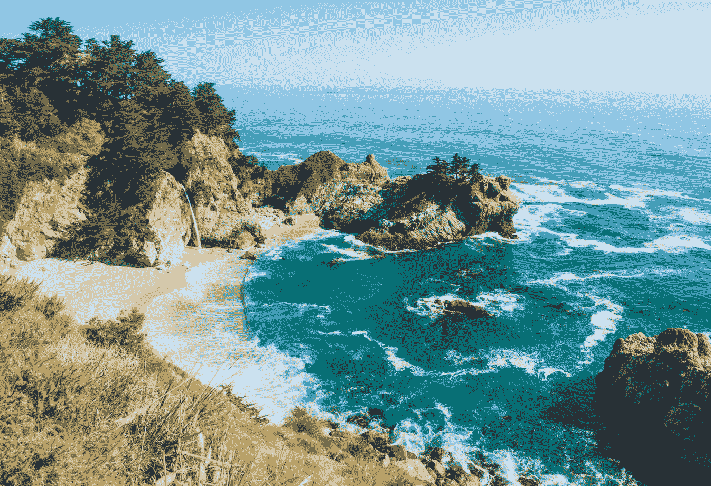
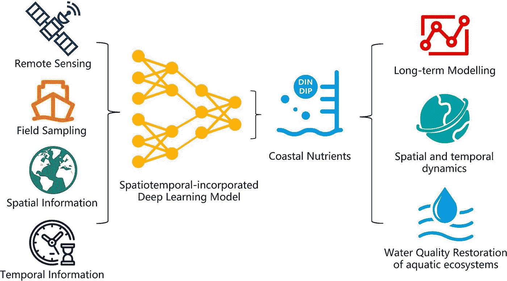
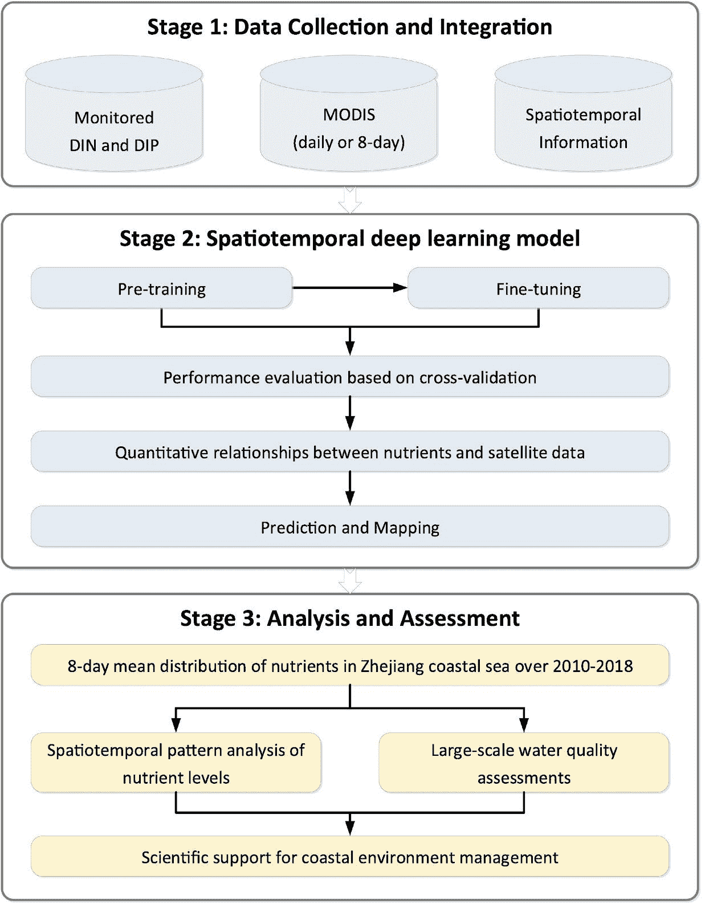

# 继续游泳…在致命的条件下

> 原文：<https://medium.com/geekculture/just-keep-swimming-in-deadly-conditions-31bdb07300f2?source=collection_archive---------3----------------------->

## *STEM 中的宝石:机器学习和遥感如何帮助拯救沿海死区*

你是一只特殊鱼缸里的金鱼。这不是一个糟糕的生活，除了如果你游到这个碗里的某些地方，你会窒息。哎呦。你已经死了。就像那些乱七八糟的“你宁愿？”游戏:你愿意永远呆在同一个地方还是窒息而死？不打算说谎，我不是任何一个选择的粉丝。

幸运的是，你实际上不是末日鱼缸里的一条金鱼！唷，说一个濒死体验。但是，我们世界的湖泊和海洋中的真正的鱼就没有这么幸运了。

简介:死区。

Lake Erie in October 2011, Credit: ITTNASA

# **什么是死区？**

死亡地带就像它们听起来的那样:水体中几乎不可能有生存条件的区域。具体来说，死区就是我们所说的**缺氧**，意思是低氧。由于大多数生物需要氧气，海洋生物无法在这些死亡地带生存。

好吧，这里有一个解决办法:不要生活在死亡地带。很简单，对吧？

没那么快。虽然有些死亡地带是自然形成的，但你猜对了，大多数是由人类创造的。自 20 世纪 60 年代以来，由于人类活动和干扰，世界范围内记录在案的死区数量从 10 个增加到 415 个。

如何，什么，为什么，什么时候？

一句话:**富营养化**。

## 富营养化的危险

富营养化是指水体获得过量的营养物质，通常是磷和氮，然后导致危险的藻华和缺氧条件。

*A catfish on the shoreline in the algae-filled waters of North Toledo, Ohio. (Andy Morrison/The Blade via AP)*

藻华，也被称为“赤潮”，基本上窒息了它们下面的海洋生物，从而产生了死亡区。这些水华阻止光线穿透水，阻止氧气到达它们下面的生物。不出所料，这导致了海洋哺乳动物、鱼类甚至海岸鸟类的大量死亡。过量的营养导致藻类和水生植物快速而不可持续的生长，最终耗尽所有的氧气并死亡。但是即使在死亡的时候，海藻群也是邪恶的。随着死亡的植物和藻类沉入水底，它们的细菌分解耗尽了水中剩余的氧气。

这张图分解了富营养化的过程。

Source: [Climate Change And Lakes That Look Like Pea Soup](https://www.fieldmuseum.org/blog/climate-change-and-lakes-look-pea-soup)

富营养化通常发生在有人居住的海岸线附近，因为过量的营养物质来自草坪和农田中的肥料、污水、发电厂和汽车产生的氮、城市化和其他人类活动。世界各地的营养水平各不相同，在一些地区，大气中的氮还会通过水循环加剧富营养化。

富营养化最危险的影响？死亡地带。

因此，尽管我们的金鱼可以试图避开鱼缸中的死亡点，但由于大量低效的农业实践，水生生物的家园正在变成死亡地带。事实上，我们用于农作物的一半以上的磷和几乎三分之二的氮变成了污染物。

我又想到一个“你愿意吗？”对你来说:你愿意有更多的农作物还是水生生物？在你回答之前，先说一下死区的大图。

## 死区对未来意味着什么？

从字面上看，这是一个更大的图片。

由于大量使用商业化肥、工厂和污水处理设施等人类活动，死亡区已经扩大到 95000 平方英里——相当于英国的面积。

即使这些死亡区没有设法杀死该地区的所有鱼类，缺氧条件也会给它们带来一些生殖问题，如低活性卵产量、生殖器官尺寸减小、可感知的雄性化(即雌性鱼减少)和产卵减少[ [4](https://www.youtube.com/watch?v=Fv8xGzVtUBM) ]。

但是死亡区不仅伤害了我们的海洋生态系统，还加剧了气候变化。自 1955 年以来，超过 90%滞留在大气中的多余热量被海洋吸收了。随着全球变暖使我们的海洋变暖，海水温度上升(每十年上升 0.13 摄氏度)，死亡区正在扩大。

这是一个恶性循环，研究人员称之为**反馈效应**:当沿海水域的氧气水平下降并接近 0 时，细菌转向氮气获取能量。然后它产生一氧化二氮，最终到达水面并进入大气。但这种“笑气”可不是闹着玩的。尽管一氧化二氮占总排放量的 6%,但它是一种比二氧化碳强 300 倍的温室气体。不仅如此，这些不断扩大的死区还限制了海洋从大气中吸收碳的能力。

Source: [Teach Ocean Science](https://teachoceanscience.org/modulepopup/from_land_to_the_sea/the_nitrogen_cycle/)

因此，全球变暖导致更大的死区，从而产生更多的温室气体，加剧全球变暖。哇，这就像是生命循环的反面。

好吧，这有点令人沮丧。但是不要失去希望！好的一面来了:我们可以做点什么。

## 解决办法？金发受精。

首先，我认为我们需要做一点法律和秩序，并清除一些名字。是的，死区是致命的，但是真正的罪魁祸首是造成死区的原因:过度施肥。

化肥增加了作物产量，从而减少了农业用地——太好了！但是肥料经常被过量使用，这就是导致养分流失造成死亡地带的原因。

好吧，但这实际上是在杀死水生生态系统，所以让我们少用点肥料，好吗？

不幸的是，我们的“你宁愿？”问题没那么简单。事实证明，全球一半的人口依靠合成肥料来生产食物(T4)。农民似乎正面临着一个几乎没有犯错余地的权衡困境:使用太少化肥，他们的作物产量会受到影响(人们没有饭吃)，使用太多化肥，会造成严重的环境破坏。

Source: Our World in Data

为了解决这个问题，我们需要引导我们内心的金发女孩找到所需肥料的准确数量——不多也不少，但恰到好处。高效的肥料使用意味着我们的人口仍然有饭吃，同时最大限度地减少毒害我们水生生态系统的过量养分。

斯坦福大学地球系统科学教授罗伯特·杰克逊(Robert Jackson)同意这一观点，“我们可以做出的最重要的改变是，通过减少氮肥的浪费和更接近作物需要的时间来提高作物的氮肥利用率。”[ [7](https://earth.stanford.edu/news/why-laughing-gas-growing-climate-problem)

而且，哈，这种优化肥料效率的方法以前曾经奏效过！

2005 年至 2015 年，研究人员与中国 2090 万小农户合作，试图增加作物产量，同时减少对环境的影响。没有神奇的技术或改变生活的政策实施，他们所做的只是教农民高效和环保的农业实践。结果呢？

虽然氮肥用量下降了 16%，但玉米、水稻和小麦的平均产量却上升了 11%。作物产量的增加和化肥用量的减少相当于 122 亿美元的经济回报。有很多零。

事实证明，这种权衡实际上并不像我们认为的那样激烈——我们可以增加作物产量，同时减少肥料对环境的危害。哈，拿那个“你宁愿”——我发现了一个双赢！

在我们继续之前，重要的是要注意不是所有的国家都过量施用化肥；事实上，有些需要使用更多。例如，撒哈拉以南非洲的许多国家几乎不使用化肥，其作物产量因此受到影响。事实上，如果他们使用更多的肥料，他们可以缩小作物产量的巨大差距，防止栖息地丧失，增加粮食安全，并享受大量的社会经济和环境效益。这就是为什么对组织来说，推行“使用的肥料越少越好”的概念是如此危险，这是对实际情况的过度简化。这种信息伤害了农民、人民和环境。相反，我们需要获得正确的肥料平衡。

随着农业活动的稳步增长，是时候全力以赴进行所谓的**精准农业**了，以准确找到我们最需要肥料的地方，并找出实现这一理想施肥点的最佳方式。进入:**机器学习。**

# **机器学习能做什么**

数据如此重要，因为我们收集的数据越多，我们就能让机器变得越聪明——这正是机器学习(ML)所做的。机器接受了数据集的“训练”，并使用这些知识来应对它们从未见过的情况，让它们自动做分类、检测和模式识别等事情。

现在，精准农业的整个理念是**你不能管理你不能测量的** *。*但是预测特定作物所需的确切肥料量并不容易，更不用说实时预测了，因此迫切需要一种低成本且有效的作物和附近沿海地区养分监测方法来实施可持续农业实践。这就是**遥感**的用武之地！

DigitalGlobe’s WorldView 4 Satellite. Photo: Lockheed Martin

最近，在使用卫星和其他机载仪器收集环境数据的遥感中，ML 变得非常受欢迎，因为它可以管理这些大规模复杂的数据集，并提供有价值的信息，而不需要大量的人工干预。这部分是由于地球观测技术的最新进展，让我们获得了前所未有的高空间、光谱和时间分辨率的图像——这就像 iPhone 14 Pro Max 相机，但不是为了地球！

遥感的机器学习方法可以改善对自然系统行为的预测，提高数据分析自动化，并使用这些见解来更好地管理我们的资源。因此，人工智能和人工智能已经将精准农业带到了一个新的水平，但是，当然，挑战仍然存在(我们将在后面谈到)。

现在，让我们回到寻找肥料平衡的挑战上来。我们可以通过破坏性的叶片组织取样和湿实验室实验来精确测量作物氮，但从长远来看，这显然不可扩展，也不经济。然而，我们知道一些作物性状与一组光谱波长密切相关，因此我们确实可以利用遥感来测量作物氮！

我们如何做到这一点？简单来说，遥感可以探测到地表反射的能量。树叶的化学成分，包括其氮含量，会改变反射的能量，但我们需要高灵敏度来监测这种微小的变化。

## **机载高光谱传感器测量作物性状**

简介:超光谱传感器！超光谱传感器在纳米尺度上运行，可以在整个范围内检测小到 3-5 纳米的差异，并在可见光、近红外、*和*短波红外的整个范围内提供数百种波长，具有高空间分辨率(< 1 米)。相比之下，其他航空遥感技术只能获得可见光谱和潜在的近红外光谱，即一些少量的光谱带。

Source: [Cubert](https://www.cubert-hyperspectral.com/knowledge-base/hyperspectral-imaging)

今年早些时候，伊利诺伊大学厄巴纳-香槟分校的一个研究小组在一架飞机上安装了强大的高光谱传感器，并让它在伊利诺伊州的玉米地上空飞行了三次[[10](https://www.sciencedirect.com/science/article/pii/S030324342100324X)。这些传感器让它们以令人难以置信的速度扫描田地，每英亩只需要几秒钟。由于与卫星相比，传感器获得了更高的光谱和空间分辨率，该团队能够以高达 85%的准确度检测作物的氮状态效率，接近“地面真实质量”。因此，这些机载传感器不仅是一种非常精确的遥感工具，它们还允许我们以低成本快速监测更大的区域，而不会牺牲太多的准确性。

Source: Igor Stevanovic via Stock Photos

UIUC 的这项研究首次尝试使用全范围(400-2400 纳米)光学机载超光谱传感器来测量一系列重要的作物性状，如叶片和冠层尺度的光合能力和氮含量/浓度。这是科学，宝贝！

为了他们的研究，UIUC 团队还开发了**当前最好的**算法，用于检测来自高光谱传感器的氮反射数据，他们预计这将用于即将到来的检测技术。

加州大学农业生态系统可持续发展中心助理教授王胜说:“我们的方法填补了实地测量和卫星之间的空白，为可持续精准农业中的作物氮素管理提供了一种经济高效、高度准确的方法。”

他们的最终目标是为卫星配备这种高光谱传感器技术，从而使农民能够在生长季节早期监测他们田地的养分状况，以便就如何可持续和高效地使用化肥做出更明智的决定。

好了，我们已经谈了很多关于庄稼，庄稼，以及更多的庄稼。但是我们在这篇文章开始时谈论的是死区，即在水中的区域。事实证明，我们可以通过监测农作物*和沿海水域*中的养分来解决这个问题。

## **时空深度学习监控沿海水域**

Source: Mariusz S. Jurgielewicz via Shutterstock

沿海水域中两种重要的限制性营养物是溶解无机氮( **DIN** )和溶解无机磷( **DIP** )。高 DIP 和 DIN 会引发富营养化以及我们之前讨论过的所有可怕的影响，导致水质恶化。为了确保这种情况不会发生，我们需要监测沿海水域的 DIN 和 DIP，就像我们监测农作物中的氮水平一样。

不幸的是，大多数监测水中这些营养物的实地调查技术既昂贵又耗时。不仅如此，目前基于站点的监测技术只能给我们提供区域水质状况。考虑到我们需要不断监测多少水，这两种方法可能都不是我们想要的金凤花监测方法。:(搜索继续！

我们*所做的*想要的是在时间和空间背景下对水质的整体理解，或者我们称之为大范围的**时空模式**，但是我们想要以低成本获得这种理解。如果我们能做到这一点，我们就能了解我们的沿海水域，以及如何有效地对待它们。

等等，为什么我们想要*时空*模式？似乎比它的价值更麻烦，不是吗？嗯，我们可以直观地看到，水(尤其是近海)是一个相当复杂的环境。假设我们试图模拟一个波，以及它的每个水滴的行为。我们可以想象，这种行为会随着具体位置和海岸的变化而变化，更不用说季节的变化了。如果我们只考虑这些因素中的一个，我们可能不会得到一个准确的图片！事实上，沿海水域通常在短时间间隔内有高度的季节性变化，甚至取决于其海岸的更复杂的因素。所以，水中的营养物和遥感之间的关系随着空间*和*时间而变化是有道理的。这就是为什么我们关心时空模式——它们使我们能够做出更好的预测。

为了找到这种宏观理解，来自浙江大学和 UIUC 的研究人员吴等人(2022)开发了一种时空深度学习模型( **ST-DBN** )，以估计大规模营养物质[ [11](https://www.sciencedirect.com/science/article/pii/S1569843222000991) 。使用遥感，他们实现了非常强大的预测，建立了测量的环境因素和卫星地图之间的关系，与非时空模型相比，估计误差减少了 40%以上！

怎么会？

Source: [[11](https://www.sciencedirect.com/science/article/pii/S1569843222000991)]

在他们的研究中，这些研究人员使用卫星数据探索了 2010 年至 2018 年浙江沿海地区 DIN 和 DIP 的时空分布。利用基于年、季、月和 8 天平均分布的营养物时空模式，他们想要回答三个主要问题:

1.  非线性圣 DBN 能准确估计长期和大范围的 DIN 和 DIP 分布吗？
2.  在 2010-2018 年期间，ZCS 中 DIN、DIP 和水质的时空分布如何变化？
3.  未来政府如何控制营养物质，改善水质？

为了回答这些问题，下面是他们的研究分类:

Source: [[11](https://www.sciencedirect.com/science/article/pii/S1569843222000991)]

他们发现:

*   对问题#1 的回答是肯定的！我们可以用时空模型精确地估计长期和大范围的 DIN 和 DIP 分布。
*   春季和夏季水质较好，秋季和冬季水质较差。
*   DIN 和 DIP 的浓度在 2010 年至 2018 年期间分别下降了 24%和 19%。但是，水质并没有明显改善。尽管 DIN 浓度较低，但仍大大超过了最差质量水平的临界值。
*   DIN 对质量最差的贡献为 93.9%，DIP 仅占 37.8%。这表明，与 DIN 相比，ZCS 中 DIP 的富营养化已经变得好得多。

研究人员得出结论，浙江省政府应该更频繁地监测其水域中的径流、流速和 DIN 浓度。他们尤其应该更有效地控制 DIN，尤其是在水质更差的秋季和冬季。

这项研究证明，使用时空结合的深度学习模型和遥感技术可以监测沿海地区的营养物质和水质！但是，我们还没有进入状态是有原因的——还有一些挑战需要克服。

## **长期大规模的挑战**

为了将这些机器学习模型扩展并应用到我们所有的沿海水域，我们需要**数据**。不幸的是，如果我们没有可访问的最新数据集来训练我们的模型，我们就无能为力。特别是，我们需要随时可用的分析就绪数据(ARD)，这需要大量的时间和计算能力(更不用说聪明人了)来准备。在预处理、提取、合成、分析、存储、传输以及基本上更有效地处理这些大型数据集以最终获得准确且完善的训练数据集方面，我们还有许多技术难题要克服，当我们谈论沿海水域和多尺度、多传感器和多平台以及多时相地球观测等复杂环境时，这可能会变得很困难。唷，这么多倍数！

随着我们的气候变化，准确的预测变得越来越重要。有了机器学习和来自卫星的接近实时的数据以及来自遥感的海洋探测，我们可以一头扎进监测死区和肥料污染物水平，以预测和快速应对富营养化。我们*能够*阻止死亡区的扩张，保护我们的水生生物和生态系统免受末日鱼缸的破坏。

在你离开之前，我有最后一个问题(如果你愿意，可以说是一句搭讪的话)来以更积极的方式结束事情。

你喜欢时空模式吗？因为我跨越时空爱你&欣赏你。❤

直到下一个！如果您对此感兴趣，请务必关注我，了解未来文章的最新动态。

与此同时，在我的专栏 [**这里**](https://apoorvapanidapu.medium.com/list/gems-in-stem-e5f24767d315) 查看其他文章！如果你有任何问题或意见，给我发电子邮件到 apoorvapwrites@gmail.com。

*成为第一个听到我所有新文章、最近事件和最新项目的人，订阅我的简讯:* [**信？我几乎不认识她！**](http://apoorvapanidapu.substack.com/)

*提醒一下:这个* [*专栏*](https://apoorvapanidapu.medium.com/list/gems-in-stem-e5f24767d315) *，STEM 中的宝石，是一个了解各种 STEM 主题的地方，我发现这些主题很令人兴奋，我希望也会让你兴奋！它总是会被写得相当容易理解，所以你不必担心没有背景知识。然而，它偶尔会在接近尾声时变得更高级。感谢阅读！*