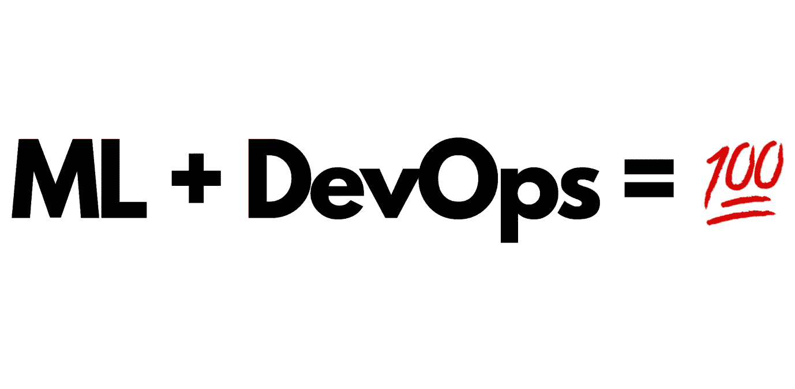
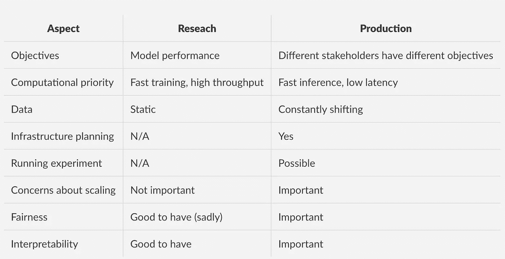
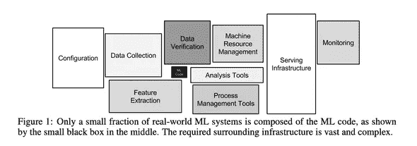

# 保持模型的活力

> 原文：<https://medium.com/geekculture/keeping-the-model-alive-a4ef3c26c9ff?source=collection_archive---------29----------------------->

## 学术界的 MLOps 正在赶上业界，你也应该如此。了解 ML 在研究和生产中的不同之处，以及在生产中部署您的模型并保持其活力意味着什么。

You have to think about ML and DevOps (MLOps) together if you want your models to be sustainable and add value to the business in the long run.

2021 年 6 月 16 日

> *本文讨论了为什么数据科学工作应该包括模型的部署、与之相关的挑战，尤其是可重复性——它意味着什么以及我们如何衡量它。*

假设您刚刚将一个高性能模型推向生产。你说完了，对吧？

不，不是真的。这只是开始。

大多数文献都谈到了数据科学项目的**离线阶段**，包括:

1.  问题定义
2.  电子设计自动化(Electronic Design Automation)
3.  数据清理
4.  建模
5.  性能赋值

但是，文献很少提到数据科学项目的**在线**阶段，包括:

一个在网下证明了自己的模型，在网上不一定会像在网上一样有效。它需要经过生产中真实数据的实战检验。实际上，在数据科学建模项目中，工作并不会在模型交付后停止，维护和采用需要持续的努力。所以，当你计划一个建模项目时，不要只计划离线阶段，还要计划项目的在线阶段。

Taken from [this](https://www.microsoft.com/en-us/research/uploads/prod/2019/03/amershi-icse-2019_Software_Engineering_for_Machine_Learning.pdf) paper by Microsoft on ML System Design

> ***数据科学家的任务是兑现他们的承诺，为企业增加价值。***

为了增加业务价值，数据科学工作必须超越培训和调整最佳模型。它必须包括模型交付，即在生产中部署，以便可以使用模型的预测。客户或最终用户应该能够以任何方便的方式使用模型的输出——以仪表板、web 应用程序、批处理作业、API 或收件箱中的每日报告的形式。当客户可以从机器学习模型中可靠地提取预测时，我们就可以从模型中获得最大价值。

在深入了解更多细节之前，为了清晰起见，让我们先定义一些数据科学上下文中的术语。

*   ***环境*** *:* 开发或运行软件应用程序/产品的计算机的设置或状态。它包括硬件、操作系统和软件。
*   ***研究环境*** *:* 适合 ML 模型的数据分析、开发、评估的设置(工具、程序、库)。可能包括 python、熊猫、jupyter 笔记本等。
*   ***生产环境*** *:* 一个*实时*设置，具有执行程序和硬件设置，使组织能够进行日常运作。ML 模型提供给客户以满足业务需求。

# 研究与生产中的机器学习

快速浏览 ML 的不同方面以及它们的不同关注点，这取决于我们是查看研究环境还是生产环境。

How ML looks different in the research phase and the production phase

# 生产模型的挑战

一个数据科学家可能已经在研究环境中完善了建模，但是当涉及到在生产环境中部署模型时，有一种倾向是寻找另一种方式。公平地说，行业中的 ML 应用相对较新(与软件开发相比)。大多数人通过学术界获得 ML 专业知识，如阅读论文、参加课程和研究工作。这意味着他们没有动力去关注生产一个模型。在我开始作为一名数据科学家工作之前，这正是我所在的位置，这是一次关于行业中的 ML 与我的学术培训有多么不同的现实检查。

由于没有其他地方可以寻求帮助，围绕生产模式的知识在行业中不断发展。线上阶段涉及到的做法都是经过行业内专业人士反复试验的。今天，我们可以利用他们的努力，学习最佳实践来思考我们项目的 ML 系统设计。我们可以从像优步这样的例子中学习，他开发了米开朗基罗，这是一个 ML 即服务平台，可以构建和部署 ML 解决方案。作为额外资源，这两篇分别由[谷歌](https://papers.nips.cc/paper/2015/file/86df7dcfd896fcaf2674f757a2463eba-Paper.pdf)和[微软](https://www.microsoft.com/en-us/research/uploads/prod/2019/03/amershi-icse-2019_Software_Engineering_for_Machine_Learning.pdf)撰写的论文值得一提。这些论文讨论了端到端的 ML 系统设计、与之相关的风险以及解决这些风险的最佳实践。(如果你决定通读/浏览这些例子，对这些建议要有所保留——把它作为一个清单，不要把目标放在实现每一个项目上，而是把重点放在与你的问题最相关的方面。)

Taken from [this](https://papers.nips.cc/paper/2015/file/86df7dcfd896fcaf2674f757a2463eba-Paper.pdf) Google paper about Hidden Technical Debt in ML

当谈到生产中的传统**软件开发**时，一些常见的挑战是:

*   **可靠性**:容忍硬件/软件/人为错误。
*   **可重用性**:跨系统和项目使用的能力。
*   **可维护性**:可操作性、简单性和可发展性。
*   **灵活性**:适应其他更新组件的能力。
*   **可伸缩性**:测量负载、性能、吞吐量和延迟百分比。

随着** ML 模型在生产**中的部署，我们面临着上述软件开发挑战和其他特定建模挑战，如:

*   **再现性**:给定相同的系统数据，产生一致结果的能力。换句话说，在给定相同的输入数据的情况下，模型在生产中应该能够和研究阶段的模型表现得一样好。
*   **协作**:数据科学项目通常需要跨职能团队的协作。数据科学家与主题专家、开发人员、数据工程师和业务主管互动。
*   **编程语言的差异**:当研究环境中使用的编程语言与生产环境中的不同时，重写代码增加了部署的时间线。此外，我们还面临着失去再现性的风险。

> 例如，Twitter 是一家 Java 商店——他们的大部分生产代码都是 Java / Scala (JVM 语言)。因此，他们必须建立许多生产粘合逻辑，以使机器学习项目的 Tensorflow(基于 C++和 Python)在 Twitter 上工作。(在 [*上听到的这个*](https://open.spotify.com/episode/0s032RWTHT2wVPUdd7cqZM?si=4QWPRX51SEm6eZjhMSQnwA&dl_branch=1) *播客上有一个 ML 工程师在推特上，跳到 20 分钟左右)。*

# 当我谈到部署一个模型时

当我谈到部署一个 ML 模型时，我指的是部署整个 **ML 管道**。这包括所有的步骤，从我们接受原始输入数据的那一刻开始，接着是数据清理、数据预处理、特征工程和数据传递到模型之前的特征选择。在研究环境中，涉及数据的每个步骤都需要应用于生产中的原始输入数据，即 ML 管道必须在生产环境中**“重现”。**

# **让我们来讨论一下再现性**

**我们希望达到这样的状态，即如果我们在研究和生产环境中向 ML 管道提供相同的原始输入数据，那么我们应该从两者接收相同的输出预测。从这个意义上来说，**使**到**ML 管道在生产中的性能与在研究环境中达到的性能相似(或尽可能接近)的能力就是**【再现性】**。****

****显然，您不会检查单个预测，而是会比较整体 **ML 管道的性能**。在研究阶段，该模型针对业务价值进行了优化——根据预定义的指标(KPI)进行衡量，如“收入增长”。根据问题的性质，评估性能的其他指标可能是精确度、召回率、F1 分数、AUC ROC 等。对于**“再现性”**确保生产中的这些指标与研究阶段的指标非常相似。****

****当您确保可重复性时，您就降低了某些风险——财务成本增加、交货延迟的风险，以及当您的生产模型表现不佳时对声誉的损害。****

****一旦部署了整个 ML 管道，就可以使用原始输入数据来(a)从已训练的模型中提取预测或者(b)重新训练模型。****

****最后，数据科学的努力并不仅限于建模。部署 ML 系统不仅仅是将 ML 系统提供给最终用户。就像对生产中的软件系统的关注一样，它是关于构建一个基础设施，这样当出现问题时，团队可以迅速得到警告，找出问题所在，在生产中进行测试，推出/回滚更新。这是关于“保持模型的活力”。****