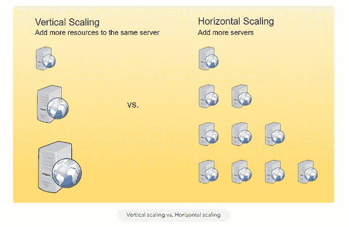

# 分布式系统的关键特征

> 原文：<https://medium.com/geekculture/key-characteristics-of-distributed-systems-e5b873bcdfae?source=collection_archive---------11----------------------->

## 如何根据可伸缩性、可靠性、可用性、效率和可管理性来判断分布式系统。

# 可量测性

可扩展性是系统、流程或网络增长和管理增长需求的能力。任何能够不断发展以支持不断增长的工作量的分布式系统都被认为是可伸缩的。

由于许多原因，如数据量增加或工作量增加，例如事务数量增加，系统可能必须进行扩展。可伸缩系统希望在不损失性能的情况下实现这种伸缩。

通常，尽管被设计(或声称)为可扩展的，但是由于管理或环境成本，系统的性能随着系统大小而下降。例如，网络速度可能会变得更慢，因为机器之间往往相距很远。更一般地说，一些任务可能不是分布式的，要么是因为它们固有的原子性，要么是因为系统设计中的一些缺陷。在某种程度上，这样的任务会限制通过分发获得的速度提升。可伸缩的体系结构避免了这种情况，并试图平衡所有参与节点上的负载。

# 水平与垂直缩放

水平扩展意味着您可以通过向资源池中添加更多服务器来进行扩展，而垂直扩展意味着您可以通过添加更多功能(CPU、RAM、存储等)来进行扩展。)到现有的服务器。

使用水平扩展，通过向现有池中添加更多的机器来动态扩展通常更容易；垂直扩展通常受限于单个服务器的容量。扩展超过该容量通常会导致停机，并且有一个上限。

水平扩展的好例子是 [Cassandra](https://en.wikipedia.org/wiki/Apache_Cassandra) 和 [MongoDB](https://en.wikipedia.org/wiki/MongoDB) ，因为它们都提供了一种通过添加更多机器来满足增长需求的简单方法。类似地，垂直伸缩的一个很好的例子是 MySQL，因为它允许通过从小机器切换到大机器来进行垂直伸缩。然而，这一过程通常会涉及停机时间。

# 可靠性

根据定义，可靠性是一个系统在给定时间内发生故障的概率。简而言之，如果一个分布式系统即使在其一个或几个软件或硬件组件出现故障时仍能继续提供服务，那么它就被认为是可靠的。因此，可靠性是任何分布式系统的主要特征之一。在这样的系统中，任何出故障的机器总是可以被另一个健康的机器替换，从而确保所请求的任务的完成。

举一个大型电子商务商店的例子(像亚马逊(Amazon)这样的商店)，其中的一个主要需求是任何用户交易都不应该因为运行该交易的机器出现故障而被取消。例如，如果用户在购物车中添加了一件商品，系统应该不会丢失它。可靠的分布式系统通过软件组件和数据的冗余来实现这一点。如果承载用户购物车的服务器出现故障，另一个包含购物车副本的服务器应该替换它。

冗余是有成本的，一个可靠的系统必须通过消除每一个单点故障来实现这种服务弹性。

# 有效性

根据定义，可用性是指系统在特定时期内保持运行以执行其所需功能。它是系统、服务或机器在正常条件下保持运行的时间百分比的简单度量。例如，一架一个月可以飞行很多小时而没有太多停机时间的飞机具有高可用性。可用性考虑了可维护性、维修时间、备件可用性和其他后勤考虑因素。如果一架飞机停机维修，在此期间它被认为是不可用的。

可靠性是随着时间的推移的可用性，考虑到可能发生的各种可能的真实世界条件。例如，一架能够安全度过任何可能天气的飞机比一架容易受到可能情况影响的飞机更可靠。

# 可靠性与可用性

如果一个系统是可靠的，它就是可用的。但是，如果有，也不一定可靠。

换句话说，高可靠性有助于高可用性。尽管如此，通过最大限度地减少维修时间并确保备件在需要时始终可用，即使是不可靠的产品也有可能实现高可用性。

让我们以一个在线零售商店为例，它在上线后的头两年有 99.99%的可用性。然而，该系统启动时没有进行任何信息安全测试。客户对这个系统很满意，但是他们没有意识到这个系统不太可靠，因为它容易受到潜在风险的影响。在第三年，该系统经历了一系列信息安全事件，突然导致长期可用性极低。这导致客户的声誉和经济损失。

# 效率

为了理解如何度量分布式系统的效率，让我们假设一个以分布式方式运行的操作，并作为结果交付一组项目。

其效率的两个标准衡量标准是:表示获得第一个项目的延迟的**响应时间**(或延迟)，以及表示在给定时间单位(例如，一秒)内交付的项目数量的**吞吐量**(或带宽)。这两种方法对应于以下单位成本:

*   系统节点全局发送的消息数，不考虑消息大小。
*   代表数据交换量的消息大小。

分布式数据结构支持的操作的复杂性(例如，在分布式索引中搜索特定的关键字)可以被表征为这些成本单元之一的函数。一般来说，根据“消息数量”对分布式结构的分析过于简单。它忽略了许多方面的影响，包括网络拓扑、网络负载、变化、数据处理和路由中涉及的软硬件组件的可能异构性等。然而，很难开发一个精确的成本模型来准确地考虑所有这些性能因素。因此，我们必须接受对系统行为的粗略但稳健的估计。

# 可维护性或可管理性

设计分布式系统时，另一个重要的考虑因素是操作和维护的容易程度。可维护性或可管理性是系统维修或维护的简单性和速度，

如果修复故障系统的时间增加，可用性就会降低。对于可管理性，要考虑的是在问题发生时诊断和理解问题的容易程度，进行更新或修改的容易程度，以及系统操作的简单程度(例如，它是否正常运行而没有故障或异常？).

故障的早期检测可以减少或避免系统停机时间。例如，当系统遇到系统故障时，一些企业系统可以自动呼叫服务中心(无需人工干预)。