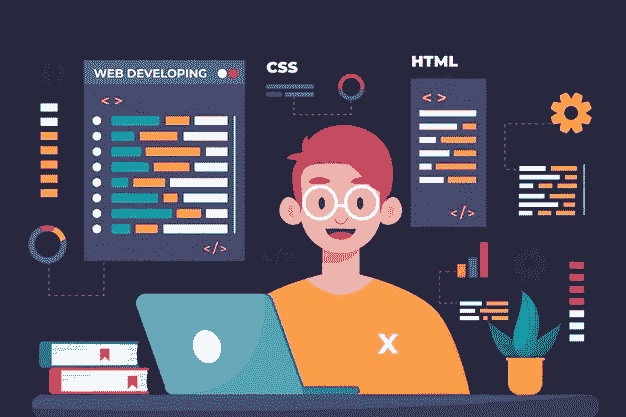

# 2020–21 年移动应用开发的主要趋势

> 原文：<https://medium.com/geekculture/key-trends-in-mobile-app-development-2020-21-d2e251d602b9?source=collection_archive---------39----------------------->

mobile

在这篇博客中，我们将捐赠 2020-21 年移动应用程序开发的最新趋势。众所周知，移动应用是全球技术基础设施中增长最快的领域之一。目前领先的应用商店中有 210 万个 Android 应用和 200 万个 iOS 应用。广泛的用途，从直接面向消费者的服务到企业对企业的通信。移动应用开发中的新技术是未来收入增长的最重要机会之一。

到 2023 年，移动应用收入将超过 3650 亿美元。

“来自 Statista

全球智能手机用户超过 50 亿。

移动应用市场的趋势不仅提供了进入以前无法到达的市场的巨大机会，而且移动技术本身也为您的企业提供了利用机器学习等前沿技术的前所未有的机会:

云计算和自然语言处理(NLP)直接整合到您提供给客户的产品中。

随着智能手机取代笔记本电脑，难怪移动应用程序开发人员的需求很大。在使用不同技术的移动应用程序开发中，有许多即将到来的趋势。然而，与任何机会一样，你需要了解应用程序开发的当前趋势。

# 2020-21 年将出现的 10 大移动应用趋势。

# 1|与云计算服务的结合

由于移动设备上的存储空间有限，所以在云中拥有一个集中的数据源是非常必要的。这导致了云服务供应的爆炸式增长，从微软 Azure、亚马逊网络服务(AWS)、谷歌、IBM 和甲骨文等大公司到许多较小的提供商。几乎所有未来的移动应用都需要一个基于云的支持系统来存储数据和访问云数据和计算能力。

所有主要云计算提供商宣布他们将开始提供量子计算能力，这将使未来的现代应用程序能够以极低的成本获得非常高的计算能力，从而进一步加强了这一趋势。

随着快速发展的计算能力创造了分析更大数据集的能力，它将为未来的移动应用程序提供更多机会来运行使用高级人工智能和 ML 的高级算法。

# 2|机器学习

基于云的基础设施服务所带来的计算能力的急剧增长，迅速引领了先进机器学习模型的新时代。越来越多的智能手机用户每天都在上网。这些模型可以不断地从不断增加的数据流中学习。

因此，他们每分钟都在提高自己的表现。在移动应用程序中使用尖端机器学习模型的能力是为大型企业设计的。无论用户数量有多少，这些模型现在都成为移动应用程序的标准集成。

例如，谷歌的 TensorFlow 项目提供了对不断更新的机器学习模型库的低成本和可扩展的访问，这些模型基于谷歌人工智能团队数十亿美元的研发。拥有访问这些机器学习模型的高级能力。你的移动应用的潜在用途几乎是无穷无尽的，而革命才刚刚开始。

当谈到机器学习在移动应用趋势中的力量时，可能性是:

*   不需要人工交互和人工干预。
*   机器学习可以快速处理大量多维数据。
*   可以进行持续的过程改进，如操作、分析和细化。
*   使用分析数据进行更好的预测和建模建议。

# 3|聊天机器人和人工智能

据甲骨文公司首席执行官马克·赫德称，到 2025 年，不超过 80%的客户与企业的互动将涉及人工客户服务代理。

自动化聊天机器人，如围绕 IBM 的沃森助手和类似工具的自然语言理解引擎构建的聊天机器人。

它将即时处理客户查询，并提供更好、更个性化的客户服务，同时减少与人员配备和标准操作相关的繁重开销。

与普通人类不同，聊天机器人天生能够一天 24 小时工作。为最苛刻的顾客服务。有了所有这些优势，难怪从现在到 2024 年，自动聊天机器人和客户服务人工智能的全球市场预计将以每年超过 25%的惊人 CAGR 增长。

人工智能聊天机器人的应用-

*   它通过帮助客户来提高客户服务和客户参与度。
*   对消费者来说性价比很高。
*   它通过改善销售和客户服务来影响这个行业。

# 4| 5G 移动技术

5G 移动是移动应用的一大福音，具有更快更可靠的连接、信息访问、互联网速度和更强的连接能力。在未来几年，5G 将有助于智能家居和智能城市、远程医疗等应用，并将与 3D 按摩配合使用。

5G 技术的好处包括:

*   5G 网络的高网速和高性能。
*   用户与移动应用程序的卓越而可靠的连接。
*   为商业用户提供更可靠的 B2B 应用。
*   在互联设备上进行更多数据处理和传输。

5G 对市场来说还是新鲜的，正在慢慢发展成为一种趋势。随着时间的推移，越来越多的人将通过 5G 连接更多的智能设备，这一技术无疑将塑造未来的移动应用开发技术。

# 5|区块链

区块链技术是下一波移动应用的不同组成部分，我们很快就会看到。正如我们所知，区块链是一种存储交易数据的方式，只有必要的当事人才能访问这些数据，并且不能更改。它是加密货币的基础，可以说是透明数据存储的下一波浪潮。

我们将在未来使用区块链进行所有交易，其中需要两方以上共享和控制数据并执行合同。很快，很快，我们将开始看到区块链成为移动应用程序使用的数据支柱。

未来，区块链将使用户能够检查交易的有效性，而不依赖于其他方。交易将按时间顺序添加，不能修改。

# 6|企业的移动性

企业移动性强调创建服务于内部和外部用户的企业专用移动应用程序。苹果几年前宣布，它可以允许企业在公共应用商店之外托管自己的私人应用。

它改变并欢迎企业应用的理念，在此之前，这种理念对黑莓是有限制的。从那时起，许多公司启用并采用了他们的设备包容性政策，并要求他们的员工通过内部应用部署服务器安装业务流程应用。

# 7|灯塔

Beacon 技术是位置标记和社区营销领域最有前途的发展之一。信标是微小的无线发射器，使用低功率蓝牙设备传输信号。它与执行位置标记的智能机器共享运动。信标技术使设备之间的通信更加直接和准确。

手机中的 GPS 芯片不能精确地确定用户的距离，这对于需要访问建筑物附近的应用程序来说是一个大问题。信标可以对信号进行三角测量，以检测连接设备的存在。

Beacon 技术处于移动应用程序开发趋势的最前沿。

这是未来移动应用开发的额外收获，因为这是移动应用的未来趋势之一。开发人员现在将能够使用信标轻松跟踪和传达应用/设备的位置，向信标范围内的应用发送特定于应用的消息和通知。

# 8|按需应用程序(优步式)。

按需营销模式让企业如雨后春笋般萌芽。在优步、Lyft、uber eats、Air-Bnb 等公司的帮助下，现在已经证明，未来要成为独角兽，你不必非得是硬资产。这些点播 app 平台正在慢慢改变很多服务和行业。

这些应用程序帮助两方或三方在单一平台上进行沟通，以完成交易。它让任何供应商，无论大小，都有能力直接向消费者销售他们的产品或服务，而无需在营销上花费大量资金。

这种按需应用程序将很快被具有个人品味的本地企业采用，以支持客户需求，并减少与更知名供应商相关的利润损失。

# 9|便携式设备

可穿戴设备是一个世界性的趋势。我们已经看到了智能手表、运动腕带、数字追踪器和其他智能可穿戴设备。所有这些设备都改变了我们与智能设备的交互方式。

每个可穿戴设备需要不同的平台来访问服务。例如，苹果智能手表需要 iOS，而安卓智能手表需要安卓来运行和执行它们的服务。现在，开发人员可以将他们的应用程序与可穿戴设备集成在一起。

# 10|提高移动应用的安全性

网络安全投资只是大型企业保护其商业秘密所必需的日子已经一去不复返了。根据 Juniper 的一项研究，2019 年全球因网络黑客攻击造成的损失总额将达到 2 万亿美元。研究发现，目前这些攻击中有一半针对小型企业和一般应用程序。

因此，在开发新的移动应用程序时，网络安全已经成为需要考虑的一个重要趋势。它不再局限于金融应用。当今的应用程序在设计业务模型或技术架构时需要考虑网络安全。

对于未来的移动应用程序，无论是消费者还是企业，移动应用程序开发人员都需要通过开发强大的数据访问架构，将网络安全置于其方法的核心。

公司不会成为重大诉讼和损害的受害者。为了进一步发展，你可以联系印度的顶级应用开发公司。