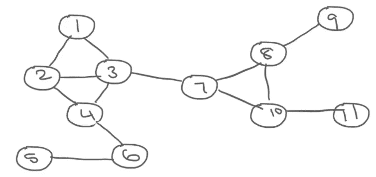
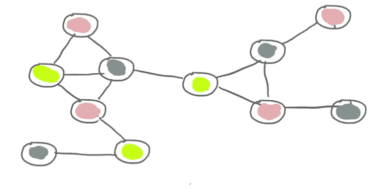
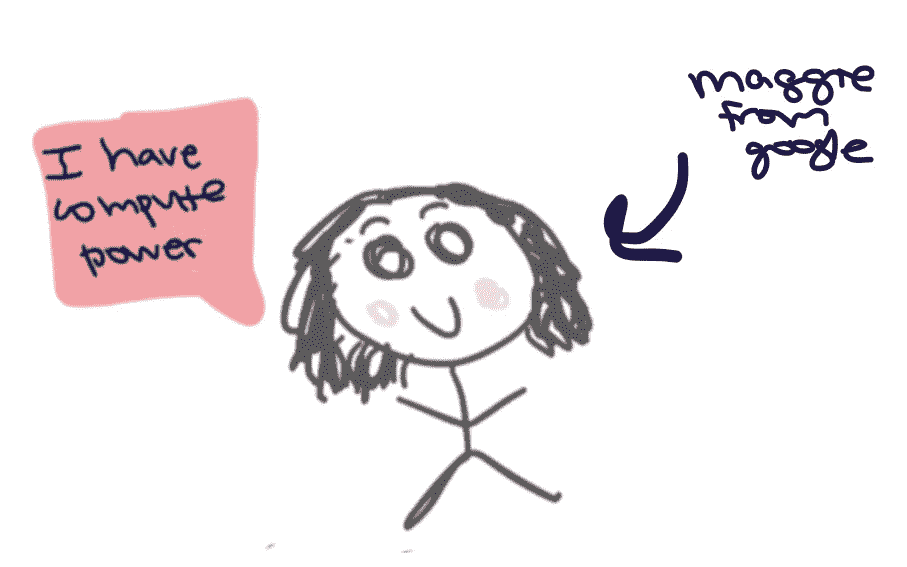
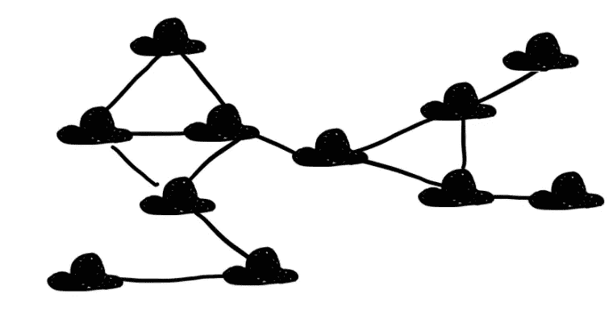
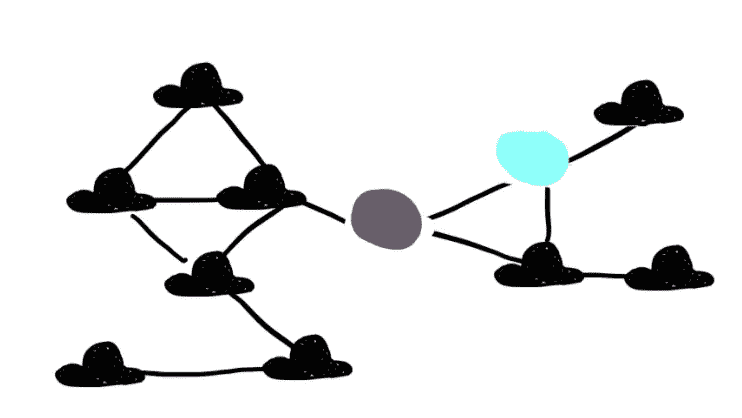
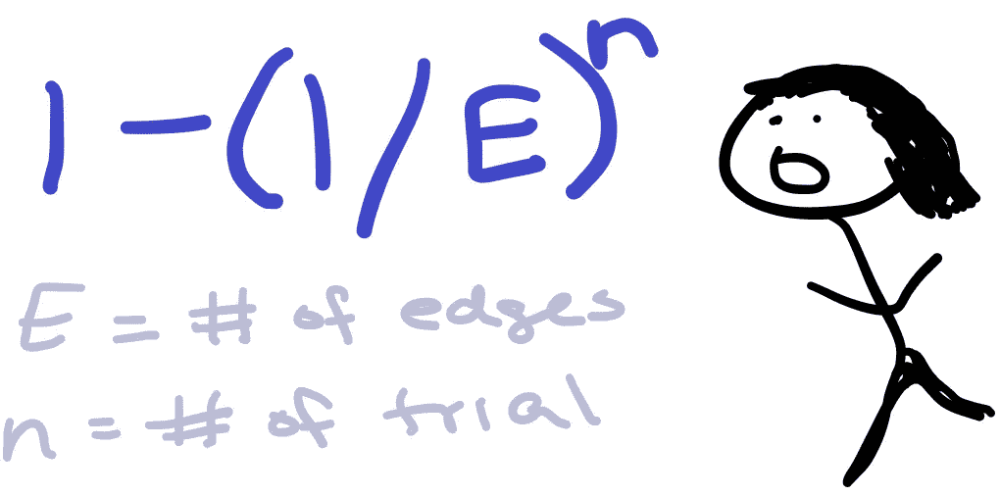
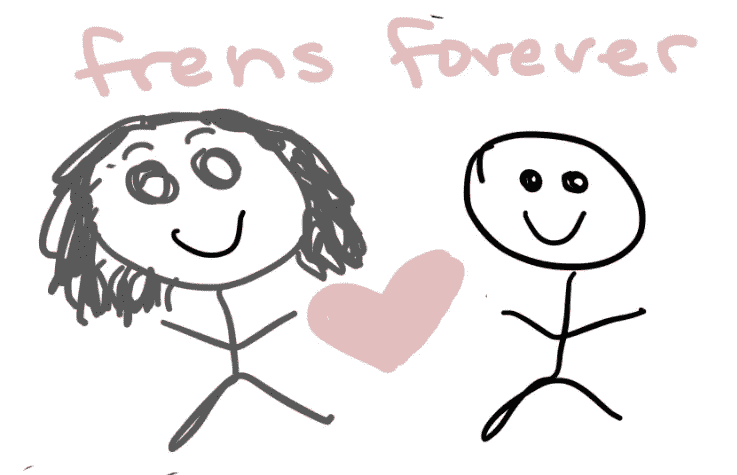
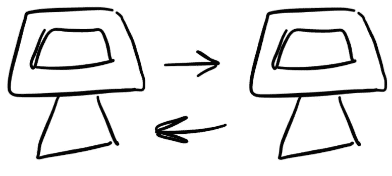

# 什么都不知道，同时什么都知道:零知识和区块链安全

> 原文：<https://medium.com/geekculture/know-nothing-and-everything-at-once-zero-knowledge-and-blockchain-security-b714bdd4a3b1?source=collection_archive---------3----------------------->

使加密成为主流的最大挑战之一是隐私。如果每个人都可以因为验证这个简单的原因看到其他人的交易，我们如何确保安全和数据隐私？

零知识协议是一种证明者说服验证者关于某个秘密信息的陈述是真实的，而不实际暴露秘密本身的方法。

想象一下，我是一个电信巨头。我想部署一个新的蜂窝通信网络。网络的结构如下所示。该图中的每个顶点都是一个蜂窝无线电塔，连接线(也称为图的边)是两个位置重叠的区域。因为我们正在建立一个网络，这将意味着传输可能会相互干扰。

重叠是有问题的，因为来自附近发射塔的信号会干扰接收。然而，可以利用网络设计将每个塔配置为 3 个不同频带中的一个，以避免重叠中的干扰。

部署网络面临的挑战是如何为基站分配频段，以确保没有两个重叠的基站共享相同的频率。

如果我们要用颜色来表示频带，不难找到解决问题的方法:

你可能注意到这个问题是著名的理论问题的一个例子，叫做图的三色问题。在上面的例子中，不难找到解决方案。然而，在许多情况下，很难找到解决方案，甚至很难确定解决方案是否存在。

一个图是否有三种颜色的解的判定问题被称为复杂类 NP-完全。

上面的例子很容易解决，但是在不容易解决的情况下呢？请记住，我们正在处理的蜂窝网络可能非常庞大和复杂。在这种情况下，我们将没有找到解决方案的计算能力。

**好吧，如果我们没有计算能力来找出解决方案，我们将何去何从？如果你不能解决自己的问题，最好的办法就是找人帮你解决。**

把这个问题外包给其他计算能力更强的人会更理想。幸运的是，我有一个熟人，我们称之为 Maggie，她碰巧在 Google 工作，拥有强大的计算能力。

然而，这导致了另一个问题。想象一下，Maggie 使用大量的计算基础设施来解决这个问题，并为图形搜索有效的着色。在你知道她真的有可行的解决方案之前，你不会想付钱给她。与此同时，Maggie 不会给你一份解决方案，除非你付钱。这只是僵局吗？

在现实生活中，这个问题有一个更简单的答案，可能涉及法律和律师，甚至可能涉及政府(取决于项目的规模和影响)。

然而这不是真实的生活——这是关于密码的。所以，当然，为了解决这样的问题，我们需要发明一个疯狂的技术解决方案，需要最高质量的卡通和最复杂的方程来理解。

谢天谢地，世界上真的有聪明人想出了一个如此优雅的协议，甚至不需要任何计算机。你所需要的只是一个巨大的仓库，一桶蜡笔，很多纸，以及尽可能多的帽子。

事情是这样的。

首先，我将进入空间，用纸覆盖地板的区域。我将画出细胞网络的示意图。然后在离开仓库后，Maggie 将进入并洗牌三支蜡笔，从三种商定的蜡笔颜色中随机挑选一种，然后用她的溶液给图形着色。

在离开仓库之前，玛吉用帽子盖住了每个顶点。当我回来时，这就是我所看到的。

这种高安全性的方法完美地覆盖了 Maggie 的秘密溶液着色，但不幸的是，它对我没有任何帮助。据我所知，Maggie 可能在图表中填入了随机的无效解，或者她可能根本没有给图表着色。

Maggie 如何解决这些问题？她给了我一个机会，让我随机选择这张图的一条边。她将取下两顶相应的帽子，露出一小部分解决方案。这里有什么可能？

1.  两个显示的顶点是相同的颜色或者根本没有颜色——然后，我们知道 Maggie 肯定在对我撒谎，这意味着我不会付钱给她，她将永远失去我的信任以及任何友谊的可能性。
2.  如果两个显示的顶点是不同的颜色，那么 Maggie 就*可能*没有骗我。在这种情况下，我们还有机会成为朋友。

问题是即使在我们的实验之后，玛姬仍然可能在说谎，因为我只看了两顶帽子下面。在一次测试后，她作弊成功的概率高达( *E* -1)/ *E* ，对于一个有 1000 条边的图来说，这相当于 99.9%的时间。

幸运的是，我可以再次运行协议！

我会放下更多的纸。Maggie 现在选择三支蜡笔的新的随机洗牌，并用有效的解决方案填充图表，但是使用三种颜色的新的随机排序。帽子会回到图上，你可以回到图上重复挑战过程，选择一个新的随机边。同样的过程也适用，但相反，这一次，如果一切顺利，你应该更加相信玛吉说的是实话。

那是因为为了欺骗我，她必须连续两次走运。这是可能发生的——但发生的概率相对较低。玛姬连续两次骗过我的几率现在是(*E*-1)/* E * *(*E*-1)/*E*)(或者对于我们上面的 1000 个边缘例子来说，概率约为 99.8%)。

幸运的是，我们不必止步于两个挑战。事实上，我们可以一遍又一遍地尝试，直到我确信玛姬说的可能是实话。

> 看看这个[链接](https://anya765.github.io/zk/)亲自尝试一下。

我永远也不会完全确定 Maggie 是诚实的——他们欺骗我的可能性总是极小的，但是在大量的迭代之后，我可以提高我的信心，使 Maggie 只能以极小的可能性作弊——低到实际上不值得担心。

有趣的是玛姬也受到保护。即使我试图通过记录协议来了解她的解决方案，也没关系。Maggie 在每次迭代之间随机选择颜色的决定将保护她。没有办法将你在互动中学习到的数据联系起来。

# 那么到底什么是零知识呢？

Goldwasser、Micali 和 Rackoff 提出了每个零知识协议必须满足的 3 个性质

1.  完整性:如果玛吉说的是实话，她最终会说服我的
2.  只有玛吉说的是实话，她才能让我相信。
3.  **零知识**——我没有了解到任何关于 Maggie 解决方案的其他信息。

如果玛姬试图欺骗我，我很有可能会识破。零知识证明的难点是零知识性质。

出于显而易见的原因，我们不想用 hats 来运行协议。为了将 2 和 2 放在一起，我们需要构建一顶帽子的数字版本——它隐藏了一个数字值，同时将制造者绑定或委托给它，这样他们就不能在事后改变颜色的值。

承诺方案赋予一方“承诺”给定消息的权力，同时保持其秘密，以便稍后公开并创建将揭示内部的结果承诺。

证明者首先将其顶点着色编码为一组数字消息

然后，为每个人生成数字承诺。这些承诺被发送给验证者。当验证者在一条边上挑战时，证明者揭示对应于两个顶点的承诺的开放值。

我们已经去掉了帽子，但是我们怎么知道这个协议是真正的零知识呢？

因为我们在数字世界中，我们不需要来回证明关于这个协议的事情。该协议不是在两个人之间运行，而是在两个不同的计算机程序之间运行，或者换句话说，是在两个概率图灵机之间运行。

即使你没有花哨的虚拟机软件，任何计算机程序都可以通过从头开始重新启动程序并输入完全相同的输入来恢复到早期状态。如果输入是固定的，程序将总是遵循相同的执行路径。

倒回一个程序相当于从头开始运行它，然后当它到达一个特定的点时分叉它的执行。

这意味着什么呢？如果存在一个验证者计算机程序，它通过与某个证明者交互地运行该协议来成功地获取信息，那么我们可以使用倒带作为一种方式来让程序提交一个随机的解决方案，然后每当挑战被错误地回答时，通过倒带它的执行来欺骗验证者。

如果验证器在运行实际协议后成功提取信息，那么它应该能够从模拟协议中提取相同数量的信息(基于倒带的思想)。没有信息进入模拟，所以真的没有信息可以提取。

从形式上来说，交互式证明的目标是让验证者相信一个特定的字符串属于某种语言。通常证明者是非常强大的(无界的)，但是验证者在计算上是有限的。

# 区块链安全零知识

此时，你可能在想，“酷，但是为什么呢？”零知识的效用在区块链领域大放异彩。像比特币和以太坊这样的公共区块链的透明性使得交易能够被公众验证。然而，这也意味着几乎没有隐私，并可能导致用户的非匿名化。零知识证明可以向公共区块链引入更多的隐私，因为它仍然允许人们在不知道其内容的情况下验证块或信息的有效性。

对于世界上的许多问题，尤其是与金融相关的问题，缺乏隐私会阻止人们使用一种可能会改变人们如何发送和接收资金的游戏的技术，特别是在得不到充分服务的人群中。

区块链领域缺乏透明度和对隐私的理解，使得没有技术背景的用户很难信任和使用新系统。由于大多数没有技术背景的人往往来自更多样化的背景，通过创建努力吸引已经在加密领域的人的系统，我们正在积极阻止少数族裔和代表性不足的人口利用技术和建立有影响力的项目。没有多样性和代表性，web3 只会继续扩大 web2 的不平等。

零知识证明有助于屏蔽交易，这是加强去中心化工具创建的基本部分。坚持最初区块链的承诺和宣言，需要更多像零知识这样的工具来支持人们，并建立能够实现不同未来的工具。

确保隐私和与早期用户建立信任是让更多人进入这个领域的重要部分，也是确保人们对新技术的引入感到舒适和自信的重要部分。

> 如果您对本文/我的理解有任何疑问或发现错误，请联系我，我们将不胜感激。
> 
> *在* [*Twitter*](https://twitter.com/_anyasingh) *上抓我或者在*[*LinkedIn*](https://www.linkedin.com/in/anya-singh/)*上联系我。我也在 Substack 上写我在 crypto/区块链* [*这里*](http://anyasingh.substack.com/) *学到的东西，如果你有兴趣可以订阅；)*

** *上面讨论的示例基于 Goldwasser、Micali 和 Rackoff 的工作，使用 hats 的教学示例基于希尔维奥·米卡利的解释。*