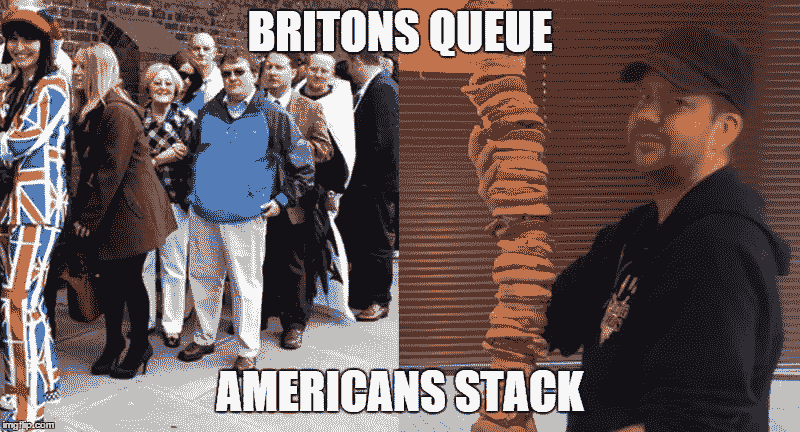
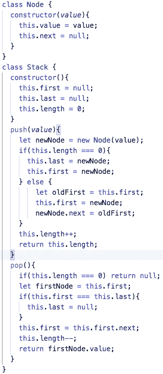
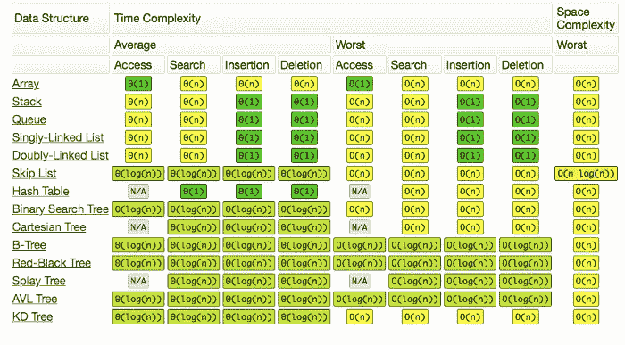

# 学习堆栈和队列

> 原文：<https://medium.com/geekculture/learning-stacks-and-queues-180d2b709c68?source=collection_archive---------12----------------------->

栈和队列是非常简单、有效和有用的数据结构。听起来很棒，那么为什么不把它们用在任何事情上呢？原因是他们在几件事情上做得很好，但在其他方面做得不多。也就是说，知道它们如何工作以及何时使用它们是很重要的，因为它们在正确的情况下是非常轻便和高效的。今天我将深入研究它们中的每一个，并讨论它们是什么，来自 CS 之外的一些类比，它们在编程中的真实应用，以及一些操作的大 O。本文中的一些图片来自我的 repl on stacks and queues，其中我定义了 JavaScript 类，并写出了每个类中几个重要操作的代码。希望这有帮助！

# 大量

堆栈是一种抽象的数据结构，必须遵循 FILO 规则(先入后出)。这意味着最近添加的元素将是第一个删除的元素。想象一堆煎饼。如果你一次吃一个，你正在向底部努力。底部的煎饼也是第一个放到盘子里的，所以它是第一个放进去的，最后一个出来的。

栈的两个值得注意的实际应用是撤销和重做功能。无论是在摄影编辑程序、VScode 还是 Google docs 中，我们都可能多次遇到过这种功能。栈是一个很好的数据结构，因为你想撤销你做的最后一件事，而不是第一件事。我们看到堆栈的另一个常见地方是浏览器中的后退和前进按钮。

为了构建一个堆栈类，我们还需要一个节点类。与链表非常相似，堆栈中的每一项都称为一个节点，有一个指针和一个值。在堆栈(以及队列)中，每个节点的指针都指向下一个节点。每个堆栈都有一个长度(它包含的节点数)以及第一个和最后一个节点。

因为你需要在堆栈上执行的唯一操作是从“顶部”添加和移除一个项目，所以我们真正需要在堆栈类中定义的唯一操作是 push 和 pop。

# 行列

队列是一种抽象的数据结构，必须遵循先进先出的规则。与堆栈相反，这意味着第一个添加的元素将是第一个移除的元素。如果你们中的任何人参加了纽约食物处理员的测试…你们已经知道了。这更像是一条线(在大部分英语国家仍然是一个队列)。当你排队时，假设每个人都遵守规则，第一个排队的人将是第一个出来的人。

现在让我们来谈谈队列在编程中的一些应用。首先，我们有下载。如果你开始下载多个东西，默认的行为是先下载第一个，然后再下载下一个。打印机的功能类似。如果您打印几个不同的文档，您第一次要求打印机打印的文档将是第一个打印的文档。

就像堆栈一样，我们不仅需要构造队列本身，还需要构造它包含的节点或项目。相似之处不止于此。节点和队列的构造函数与堆栈中的完全相同。他们也只需要执行两个操作，push 和 pop。如下图所示，区别在于我们编写这些方法所需的逻辑。

# 大量的堆栈和队列

check out [bigocheatsheet.com](https://www.bigocheatsheet.com/) for more great information

如图所示，堆栈和队列在插入和删除方面表现出色，在这两方面都实现了恒定的时间。他们在大多数其他操作上并不出色，但没关系！我们应该只在特别适合他们的情况下使用它们，比如我在文章开头概述的那些情况。

感谢阅读！