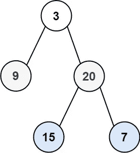

# LeetCode —二叉树层次顺序遍历

> 原文：<https://medium.com/geekculture/leetcode-binary-tree-level-order-traversal-947321626da2?source=collection_archive---------5----------------------->

# 问题陈述

给定二叉树的*根*，返回*其节点的*值的层次顺序遍历。(即从左到右，逐层)。

问题陈述摘自:[https://leet code . com/problems/二叉树层次顺序遍历](https://leetcode.com/problems/binary-tree-level-order-traversal)

**例 1:**



```
Input: root = [3, 9, 20, null, null, 15, 7]
Output: [[3], [9, 20], [15, 7]]
```

**例 2:**

```
Input: root = [1]
Output: [[1]]
```

**例 3:**

```
Input: root = []
Output: []
```

**约束:**

```
- The number of nodes in the tree is in the range [0, 2000]
- -1000 <= Node.val <= 1000
```

# 说明

## 递归函数

对于树，递归是最广泛使用的方法，因为代码易于阅读。但是对于一些问题，递归增加了时间复杂度。对于大树，递归会导致堆栈溢出或由于 **O(N^2)** 时间复杂性会花费大量时间。

对于这个问题，我们可以使用递归，但是需要计算树的高度。

上述方法的一小段 C++代码如下所示:

```
void printLevelOrder(node* root){
    int h = height(root);
    for (int i = 0; i < h; i++)
        printCurrentLevel(root, i);
}

void printLevel(node* root, int level){
    if (root == NULL)
        return;

    if (level == 0)
        cout << root->data << " ";
    else if (level > 0) {
        printLevel(root->left, level - 1);
        printLevel(root->right, level - 1);
    }
}
```

对于倾斜树，上述方法的时间复杂度是 **O(N^2)** 。最坏情况的空间复杂度是 **O(N)** 。

## 迭代方法

我们可以通过使用队列作为数据结构来改善时间复杂度。我们来检查一下算法。

```
- initialize 2D array as vector vector<vector<int>> result
- initialize size and i- return result if root == null- initialize queue<TreeNode*> q
  - push root to queue : q.push(root)- initialize TreeNode* node for iterating on the tree- loop while( !q.empty() ) // queue is not empty
  - initialize vector<int> tmp
  - set size = q.size() - loop for i = 0; i < size; i++
    - set node = q.front() - if node->left
      - push in queue: q.push(node->left) - if node->right
      - push in queue: q.push(node->right) - remove the front node: q.pop() - push the tmp to result: result.push_back(tmp)- return result
```

## C++解决方案

```
class Solution {
public:
    vector<vector<int>> levelOrder(TreeNode* root) {
        vector<vector<int>> result;
        int size, i; if(root == NULL)
            return result; queue<TreeNode*> q;
        q.push(root); TreeNode* node; while(!q.empty()){
            vector<int> tmp;
            size = q.size(); for(i = 0; i < size; i++){
                node = q.front();
                if(node->left)
                    q.push(node->left); if(node->right)
                    q.push(node->right); q.pop();
                tmp.push_back(node->val);
            } result.push_back(tmp);
        } return result;
    }
};
```

## 戈朗溶液

```
func levelOrder(root *TreeNode) [][]int {
    result := [][]int{} queue := []*TreeNode{root} for len(queue) != 0 {
        tmp := []int{}
        size := len(queue) for i := 0; i < size; i++ {
            if queue[0] != nil {
                tmp = append(tmp, queue[0].Val)
                queue = append(queue, queue[0].Left)
                queue = append(queue, queue[0].Right)
            } queue = queue[1:]
        } result = append(result, tmp)
    } return result[:len(result)-1]
}
```

## Javascript 解决方案

```
var levelOrder = function(root) {
    let result = [];
    let queue = []; if(root)
        queue.push(root); while(queue.length > 0) {
        tmp = [];
        let len = queue.length; for (let i = 0; i< len; i++) {
            let node = queue.shift();
            tmp.push(node.val); if(node.left) {
                queue.push(node.left);
            } if(node.right) {
                queue.push(node.right);
            }
        } result.push(tmp);
    } return result;
};
```

让我们试运行一下我们的算法，看看解决方案是如何工作的。

```
Input: root = [3, 9, 20, null, null, 15, 7]Step 1: vector<vector<int>> result;
        int size, i;Step 2: root == null
        [3, 9..] == null
        falseStep 3: queue<TreeNode*> q;
        q.push(root); q = [3]Step 4: loop !q.empty()
        q = [3]
        q.empty() = false
        !false = true vector<int> tmp
        size = q.size()
             = 1 for(i = 0; i < 1; i++)
          - 0 < 1
          - true node = q.front()
          node = 3 if node->left
            - node->left = 9
            - q.push(node->left)
            - q = [3, 9] if node->right
            - node->right = 20
            - q.push(node->right)
            - q = [3, 9, 20] q.pop()
          q = [9, 20] tmp.push_back(node->val)
          tmp.push_back(3) i++
          i = 1 for(i < 1)
        1 < 1
        false result.push_back(tmp)
        result = [[3]]Step 5: loop !q.empty()
        q = [9, 20]
        q.empty() = false
        !false = true vector<int> tmp
        size = q.size()
             = 2 for(i = 0; i < 2; i++)
          - 0 < 2
          - true node = q.front()
          node = 9 if node->left
            - node->left = nil
            - false if node->right
            - node->right = nil
            - false q.pop()
          q = [20] tmp.push_back(node->val)
          tmp.push_back(9) i++
          i = 1 for(i < 2)
          - 1 < 2
          - true node = q.front()
          node = 20 if node->left
            - node->left = 15
            - q.push(node->left)
            - q = [20, 15] if node->right
            - node->left = 7
            - q.push(node->right)
            - q = [20, 15, 7] q.pop()
          q = [15, 7] tmp.push_back(node->val)
          tmp.push_back(20)
          tmp = [9, 20] i++
          i = 2 for(i < 2)
          - 2 < 2
          - false result.push_back(tmp)
        result = [[3], [9, 20]]Step 6: loop !q.empty()
        q = [15, 7]
        q.empty() = false
        !false = true vector<int> tmp
        size = q.size()
             = 2 for(i = 0; i < 2; i++)
          - 0 < 2
          - true node = q.front()
          node = 15 if node->left
            - node->left = nil
            - false if node->right
            - node->right = nil
            - false q.pop()
          q = [7] tmp.push_back(node->val)
          tmp.push_back(15) i++
          i = 1 for(i < 2)
          - 1 < 2
          - true node = q.front()
          node = 7 if node->left
            - node->left = nil
            - false if node->right
            - node->right = nil
            - false q.pop()
          q = [] tmp.push_back(node->val)
          tmp.push_back(7)
          tmp = [15, 7] i++
          i = 2 for(i < 2)
          - 2 < 2
          - false result.push_back(tmp)
        result = [[3], [9, 20], [15, 7]]Step 7: loop !q.empty()
        q = []
        q.empty() = true
        !true = falseStep 8: return resultSo we return the result as [[3], [9, 20], [15, 7]].
```

*原载于*[*https://alkeshghorpade . me*](https://alkeshghorpade.me/post/leetcode-binary-tree-level-order-traversal)*。*