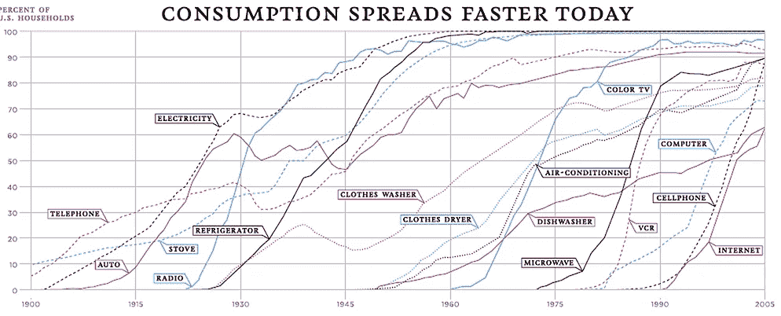
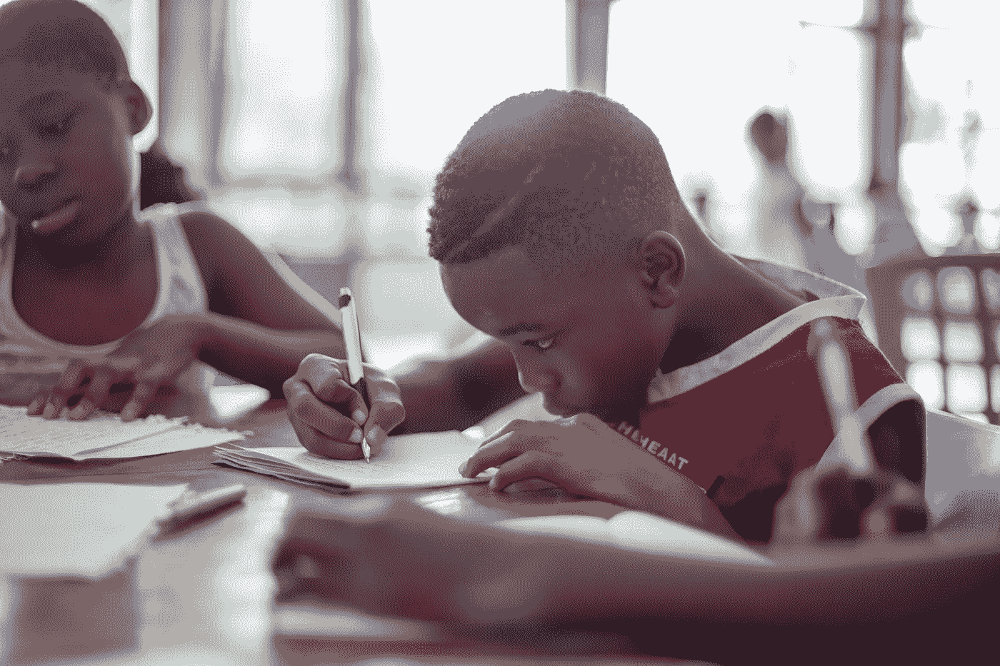

# 先说清楚。学校教育已经崩溃，需要重新设计

> 原文：<https://medium.com/geekculture/lets-be-clear-schooling-is-broken-c8295f64b288?source=collection_archive---------1----------------------->

一个新范式的提案。

Photo by [Yogesh Rahamatkar](https://unsplash.com/@8mpstory?utm_source=unsplash&utm_medium=referral&utm_content=creditCopyText) on [Unsplash](https://unsplash.com/s/photos/learning?utm_source=unsplash&utm_medium=referral&utm_content=creditCopyText)

我正在完成我在 K-12 教育的第二个十年。一个事实是清楚的。COVID 揭示了我们社会体系的所有不足，从医疗保健到银行，从电信到生物工程，从经济到教育，不一而足。用阿波罗 13 号的吉姆·洛威尔的名言来说，“休斯顿，我们有个问题。”

我们明确一点，美国的 K-16 教育是破的。这是一个出于农业需要而建立的系统，当时制造业和宗教信仰对今天的学校教育有着巨大的影响。自那时以来，没有资金支持的任务和围绕人权和公民权利的觉醒导致了一些解决过去错误的立法努力。这就引出了一个问题:“如果我们把家庭和学生放在第一位，从头开始创建学校，今天的学校会是什么样子？”这里有一些事实，我们需要考虑，当试图回答这个问题，创造一个新的教育范式。

# 事实#1

科技极大地改变了信息的获取方式。当你看一看从 20 世纪到现在的各种技术及其采用率的图表时，互联网和移动设备在采用率方面完全占据主导地位令人震惊。摩尔定律描述了微处理器的变化速度，它在确定技术创新导致的计算设备的速度方面仍然是一贯正确的。2012 年,*《大西洋》*的一篇文章分享了下面的技术消耗图表。显而易见的是，新技术的消费和采用将继续加速。在可预见的未来，与我们所知的基础学科相关的基本技能将继续主导我们如何吸引学生，即使这类似于在技术与我们擦肩而过时教孩子如何耕作和缝纫。学生需要在他们的教育生涯中更早地开始更高水平的学习。技术还使来自不同国家的学生能够协作，共同解决重大的、相关的日常挑战。

[https://www.theatlantic.com/technology/archive/2012/04/the-100-year-march-of-technology-in-1-graph/255573/](https://www.theatlantic.com/technology/archive/2012/04/the-100-year-march-of-technology-in-1-graph/255573/)

# 事实 2

美国的教育经费需要改变。当各州的资助差异如此之大时，我们不能指望学生获得同样的教育质量。**不同的州教育看起来不同。我们的教育体系是基于这样一个事实，即各州有权决定如何向其公民提供免费教育。正如你可能已经看到的那样，各州如何解决教育经费问题千差万别。例如，科罗拉多州在教育经费充足的州中仍然垫底。衡量资助的一个标准是每个学生的营业收入。这是各州为提供所有必要服务而分配给每个学生的金额。例如，2020/21 学年，科罗拉多州的 PPOR 为 9809.00 美元，而纽约州的 PPOR 为 23，091.00 美元。**

# 事实#3

**劳动力正在发生变化。**曾经有一段时间，学习一项特定的技术意味着你可以用整个职业生涯来修理这些技术。例如，当洗衣机和干衣机发明时，由于技术没有发生重大变化，修理工可以从事终身职业。由于技术的进步，这种情况已经不复存在。技术变化如此之快，以至于试图在修复技术方面建立一个职业生涯是徒劳的，当然，除非你的业务可以随着技术的变化而改变和适应。

Photo by [Santi Vedrí](https://unsplash.com/@santivedri?utm_source=unsplash&utm_medium=referral&utm_content=creditCopyText) on [Unsplash](https://unsplash.com/s/photos/teachers?utm_source=unsplash&utm_medium=referral&utm_content=creditCopyText)

# 事实#4

**学习是个人的。疫情表明，有些学习可以而且应该在家里进行。我们现在的学习知识比我们过去的学习知识好得多。事实上，今天的学习比历史上任何时候都更像一门科学。由于大学教授和智囊团的许多研究努力，我们现在知道，虽然学习是一个复杂的过程序列，但有明确的证据表明，我们知道学生需要一个安全的学习环境，有不同的需求，可以以不同的速度学习。灵活地决定何时评估一个学生，将比过去一次性同时测试所有学生的方法更有意义。**

# 事实 5

更新的技术会有所帮助。利用更新的技术应该是重新设计学校教育的核心组成部分。人工智能提供了一个独特的机会来最大化学习和教学过程。教师和学生都能从这项技术中受益。研究人员应该开始识别教师和学生在学习过程中表现出的细微差别和线索。教师可以利用这些信息来确定何时是展示新材料或提出后续问题以强化学习的最佳时机。

# 事实 6

教师和管理人员是成功的关键因素。教师和管理人员被要求用更少的资源做更多的事情。冠状病毒疫情已经表明，各种形式的传递是必要的。虚拟或远程学习可以成为学生和教师学习新材料的可行选择。这并不排除对面对面学习的重要方面的需求。为学生和家庭提供食物、身体健康和精神健康资源是不容忽视的重要组成部分。我们需要确定提供这些资源的新方式，以便家长和学生能够茁壮成长。这将要求我们想出新的和创新的方法来提供服务。

# 事实 7

**新的学习和表达形式需要被认为是学术卓越的合法形式。**在疫情期间，我观察了来自全球各地的学生和教师的非凡才华，清楚地展示了学习的多种形式的美。艺术继续为学生表达提供重要的途径，同时允许课堂之外的文化联系。文化响应教育需要在新的设计中发挥关键作用。需要回答的一个基本问题是:“在远程/虚拟环境中，文化响应型教育是什么样的？”此外，与面对面交付模式相比，远程交付模式有哪些优势？更明显的事实是，在互联网接入和利用技术进行各种形式的学习方面，有色人种学生仍然落后于他们的白人同事。

# 事实 8

**我们需要有全球视野的学习。没有背景的学习会扼杀创造力和目标。在每一个层面发展学生代理是我们能为学生提供的最重要的体验。学生需要知道他们的想法和信仰是重要的。它为他们的学习提供了一个目标。基于项目的学习仍然是学生将新知识应用于现实世界的最佳方式之一。由于远程环境中的学生参与仍然是一个挑战，我们需要能够促进有目的学习的工具。**

# 事实 9

我们渴望回到的这个系统，并没有满足所有学生的需求。与任何其他因素相比，这是重新设计我们的教育和服务交付模式的最有说服力的理由。一项又一项研究将白人和亚裔学生以及黑人和拉丁裔学生之间日益扩大的学习和成绩差距归因于长期的系统性种族主义所导致的不平等的教学实践。富裕的白人和亚裔家长，以及那些没有受到失业影响的高薪工作人员，有资源解决他们的学生因疫情而面临的许多学习差距。同样，受到失业影响的黑人和拉丁裔家庭将面临这样的挑战:是解决他们学生的学习障碍，还是为他们的家庭提供食物、住所和衣物。

# 结论

我们实现这一教育新愿景的工作需要我们从根本上改变对教育过程中每个利益相关者的看法。各州领导人需要要求资金的一致性，教育委员会应该支持立法努力，使各州和当地地区的资金公式平等。家长需要对领导者提出更多要求，以满足他们对学生社会情感学习的需求。当我们请求老师们的支持来打造这一新范式时，他们能够也应该对教育领域更有价值。拜登政府需要迅速采取行动，为我们国家的每个州和地区提供资金并实施联邦辅导计划。最近的报告显示，高强度/影响力辅导是学生、家长、教师和管理人员解决学习损失的最大希望。事实上，布朗大学最近发布了 [*跨公立学校*](https://education.brown.edu/news/2020-12-10/scaling-tutoring-public-schools) 扩展辅导的蓝图，详细说明了我们如何以每年 50 到 150 亿美元的成本成功实施这样一个项目。事实上，去年 8 月，英格兰就实施了这样一个项目，并通过立法为其拨款 4 . 5 亿美元。我们的学生是我们未来最大的希望。我们教育他们的好坏将影响他们成功创造意义、学习新材料、解决问题和创造性地创新解决方案的能力。我们的学生应该得到最好的。我们的未来取决于我们走出疫情后如何解决教育问题。