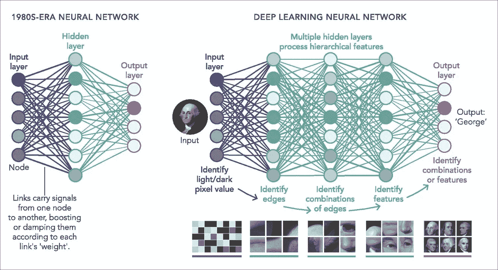
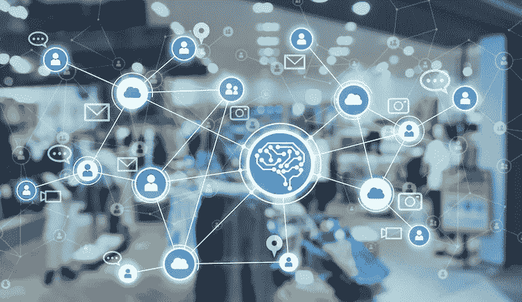

# 深度学习的局限性

> 原文：<https://medium.com/geekculture/limitations-of-deep-learning-197dbd85b673?source=collection_archive---------18----------------------->

有了 ML(机器学习),我们已经可以确定我们的未来。在谷歌搜索方面，基于你之前的搜索，或者你的 Instagram feed 显示你感兴趣的相关帖子。深度学习这个术语出现的次数比以往任何时候都多。机器学习和深度学习是 AI(人工智能)的两个不同变体，而深度学习是机器学习的一个分支，但深度学习到底是什么？

当你使用 FaceID 或在 Snapchat 上同步音乐来解锁 iPhone 以确定是哪首歌时，你在不知不觉中使用了深度学习算法。深度学习使用受大脑结构和功能启发的算法，称为人工神经网络。简称为神经网络，它由节点层组成，这些节点层相互连接形成一个节点网络。每个节点都有自己的线性回归模型，由输入数据、权重和阈值组成。输入层是接收数据的第一组节点，而最后一层节点是预测结果的输出层。在这些集合之间是隐藏的节点层，它们使用称为激活函数的复杂数学方程来训练自己理解输入数据。激活函数的结果决定了基于输入哪个神经元将被激活。通过正向传播，数据被转移到下一层节点。输出图层中具有最高值的数据。预测结果(输出)。通过互连每个节点的通道。所有这些值都是基于激活函数的概率。如果输出不正确怎么办？神经网络还使用反向传播，通过特定的误差产量对其进行训练，并将其与实际结果进行比较。反向传播是在考虑误差产量的同时在节点中调整权重。通过将误差产量考虑在内，反向传播调整权重以训练神经网络理解输入的具体结果，因此它不会再次重复错误。不管算法有多复杂，训练一个特定的神经网络可能需要几个小时到几个月的时间。神经网络是机器学习最深的根源。它用在我们的日常生活中，比如解锁手机、预测股市开盘甚至作曲。

A Diagram of Neural Network

深度学习开发可能需要几个月的时间，甚至开发一个测试版本也可能需要几年的时间。许多公司正试图开发自己独特的使用深度学习的产品，并希望这将带来技术革命。例如，埃隆·马斯克(Elon Musk)一直在设计和开发一种名为“NeuraLink”的神经芯片，这种芯片将被植入我们的大脑。这一发展本身将彻底改变人工智能的世界。我甚至不能想象在我的脑袋里有一个芯片，它将增加我 1000%的知识和能力，甚至好莱坞电影也没有预测到这一点。但是看到这些发展使我们能够创造这样的产品或机械，只会使我们的生活更容易。现在，深度学习有局限性，因为我们只能做这么多。但是就发展和可能性而言，它正在成倍地增长，而我们甚至都不知道它。目前正在开发的主要深度学习项目之一是使用视网膜眼睛扫描来提供关于我们整个生命背景和信息的信息。没有护照出国旅行不是更容易吗？取而代之的是，他们扫描你的眼睛来加载我们所有的信息。它不仅仅是革命性的，而是将深度学习与数据库和网络安全结合起来的全新水平。这将使我们有可能开创一个从未有人想象过的全新的信息时代。

通过人工智能和深度学习，我们已经在服务行业提供了基于人工智能的客户服务，在医疗领域，我们拥有使用非常复杂的深度学习算法来检测早期癌细胞的成像机器。很快我们就会有自动驾驶汽车。许多汽车公司已经有了他们的“自动驾驶”版本，允许司机坐下来放松，汽车会自动驾驶。作为一名人工智能爱好者，我相信将深度学习与数据人工智能结合起来，我们将能够预测我们在体育、娱乐甚至法律与秩序等领域从未想象过的事情。作为一名系统工程师，我非常高兴能为这一享有盛誉的领域做出贡献，并看到未来几年我们将走向何方。