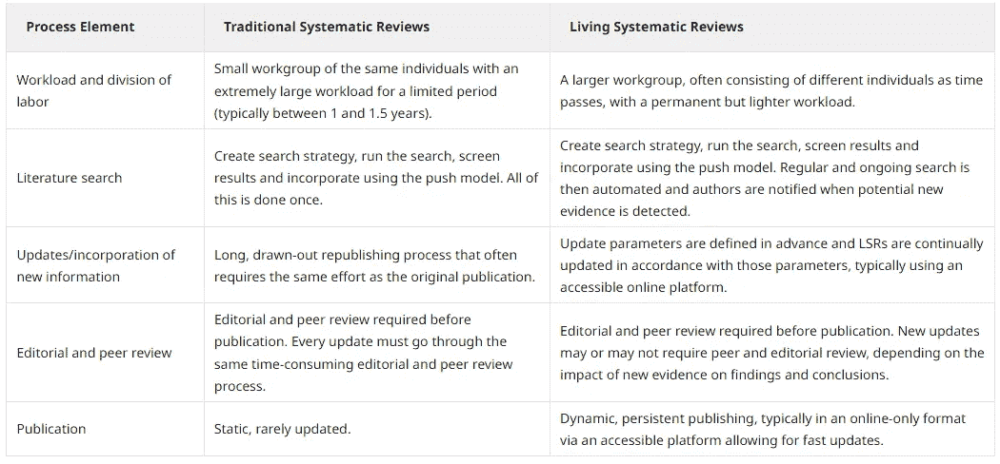

# 实时系统综述:由自然语言处理(NLP)驱动的实时证据监测

> 原文：<https://medium.com/geekculture/living-systematic-reviews-real-time-evidence-monitoring-powered-by-natural-language-processing-6139f3a38b88?source=collection_archive---------15----------------------->

我们已经讨论过几次系统文献综述(也称为 SLR 或系统综述)的重要性以及它们如何成为循证医学(EBM)的基石。

我们还[探索了](https://www.capestart.com/resources/blog/using-nlp-to-improve-pico-element-identification-and-extraction/)机器学习(ML)和其他人工智能工具可以帮助提高单反生产各种元素的速度和准确性的各种方式，如微微元素识别和提取。

在这个领域增加省时的工具是很重要的，因为传统单反生产的一个主要缺点是它们需要大量的时间和大量的努力。高方法标准意味着仅仅制作一个就要花费将近 [70 周](https://www.medwave.cl/link.cgi/English/Reviews/MethodlogicalNotes/8093.act)，而且许多评论在最终出版时已经过时了。

因为临床医生依赖这些综述，过时的综述可能会产生现实世界的后果。例如，依赖精确 SLR 的临床医生可能会根据旧信息提供错误的建议或处方。

特别是在新冠肺炎时代，在快速变化的环境中及时获得最新的高质量研究可以拯救生命和改善健康结果。

这也是为什么科学界开始接受活的系统评价的部分原因。它们是一种新型的单反相机，可以根据最新信息快速更新。因为实时评论依赖于高级自然语言处理(NLP)，这是一种 ML 技术，就在几年前还不可能实现。

## 什么是活体系统评价？

英国医学研究组织 Cochrane [称](https://community.cochrane.org/review-production/production-resources/living-systematic-reviews)living systematic reviews(LSRs)是一种不断更新的系统综述，它包含了新的可靠证据。它们是正在进行的、容易查阅的综述，总是随着最新的科学而更新。

这与传统单反相机截然不同，传统单反相机通常只发布一次，很少更新。事实上，根据[*【BMJ】*](https://bestpractice.bmj.com/info/toolkit/discuss-ebm/living-systematic-reviews-towards-real-time-evidence-for-health-care-decision-making/)的说法，只有少数评论会在两年内更新，近 10%的系统性评论在发表当天是不准确的。

除了具有与传统单反相机相同的科学严谨性，Cochrane 补充说，单反相机还:

*   依靠对新证据的持续定期监控(通常至少每月一次)；
*   及时纳入任何新的和重要的证据；和
*   应主动披露其最后更新的日期以及已经或将要纳入的任何新证据

鉴于众多学术和研究数据库中的科学研究数量迅速膨胀，每年约有 250 万篇[新研究论文](https://www.natureindex.com/news-blog/the-growth-of-papers-is-crowding-out-old-classics)发表，活系统综述尤为重要。这对于 4%的年增长率来说是不错的，引用总数每 12 年翻一番。

但是自然语言处理技术(NLP technology)和其他人工智能方法的进步释放了实时评论的潜力。自然语言处理技术将自由文本转换成计算机可以阅读和理解的代码，包括确定语言中单词的上下文。

## 什么时候适合做 LSR？

并不是每一部单反都需要活的系统综述:因为它们会不断更新，活的综述通常需要更多的长期努力和承诺。例如，如果研究问题不具有临床重要性，或者如果现有证据的确定性非常可靠，那么 LSR 就没有必要了。

但是对于结论未定的紧迫临床问题，或者如果未来很有可能出现新的重要证据，那么 LSR 是合适的。

## 传统系统评价和动态系统评价的主要区别

传统系统评价和现代系统评价之间存在几个值得注意的差异。下表列出了一些最大的问题:

LSR 的更新方式很大程度上取决于工作组的搜索参数。Elliot 等人被广泛认为发明了 LSR 的概念，[在 2017 年提出了](https://pubmed.ncbi.nlm.nih.gov/28912002/)以下方法:

*   **更新了搜索/筛选，但未发现新证据**:作者应显示搜索日期，并表明未发现新证据
*   **搜索/筛选更新，发现新证据，不太可能改变审查结果**:作者应显示搜索日期，声明发现证据并描述新证据，并解释为什么尚未纳入审查
*   **搜索/筛选更新，发现可能改变审查结果的新证据**:作者应显示搜索日期，说明发现证据并描述新证据，并将新证据和新发现纳入审查。

## NLP 如何使系统综述成为可能

用于 LSR 的人工智能工具在研究和选择阶段是最重要的，传统上这需要人类研究人员仔细研究成千上万的科学文献。

正如 Marshall 等人[解释](https://systematicreviewsjournal.biomedcentral.com/articles/10.1186/s13643-019-1074-9)的那样，SLR 和 LSR 中现在使用的核心 NLP 技术和模型是文本分类和数据提取/数据挖掘。

*   **文本分类**:根据预定义的类别自动对文档(包括摘要、全文或文章片段)进行分类。这通常是为了进行摘要筛选，以确定文章是否符合项目的入选标准。通常，NLP 模型为每个文档分配一个概率值，并根据概率按潜在相关性对文档进行排序。
*   **数据提取**:尝试识别与感兴趣的变量相对应的短语或单词/数字(如提取临床试验中随机参与者的数量)

NLP 模型通常由 ML 技术支撑，而不是基于规则的算法。ML 模型基于反馈学习并提高效率——模型学习得越多，它们就变得越准确——并且可以由人类专家[训练](https://www.medwave.cl/link.cgi/English/Reviews/MethodlogicalNotes/8093.act)。

为了实现这一点，NLP 模型[结合了](https://www.researchgate.net/publication/342045300_Artificial_intelligence_and_automation_of_systematic_reviews_in_women%27s_health)以下分析:

1.  词汇(在更大的文本中定位单词)
2.  形态学(按词类对单词进行分类，如名词和动词)
3.  句法(确定单词周围的句子和短语的上下文)
4.  语义(确定单词和短语的含义)

虽然 NLP 和 ML 模型非常精确，而且一直在变得越来越精确，但它们并不完美。事实上，系统评审需要非常高的准确性水平，这是自动化有时难以达到的。许多组织选择半自动化他们的单反生产

但是这些模型的省时元素——即使考虑到一些错误——仍然可以加速和提高研究和选择阶段的准确性几个数量级。

## 与 CapeStart 的 NLP 专家一起启动您的系统化审查

CapeStart 的机器学习和自然语言处理专家可以[半自动 SLR 流程](https://www.capestart.com/solutions/nlp-aided-systematic-literature-review/)——减少花费的时间，提高准确性，并扩展您团队的效率。

我们由机器学习工程师和数据科学家组成的专家团队可以部署定制和预构建的 ML 和 NLP 模型的近乎无限的组合，以快速识别、隔离和提取科学文献中的相关信息，改进用于研究问题制定的 PICO 识别，并智能地绘制证据缺口。

[今天联系我们](https://www.capestart.com/solutions/nlp-aided-systematic-literature-review/cut-through-the-noise-faster-with-capestarts-semi-automated-slr-processes/)了解更多关于我们的人工智能和单反和元分析开发服务。