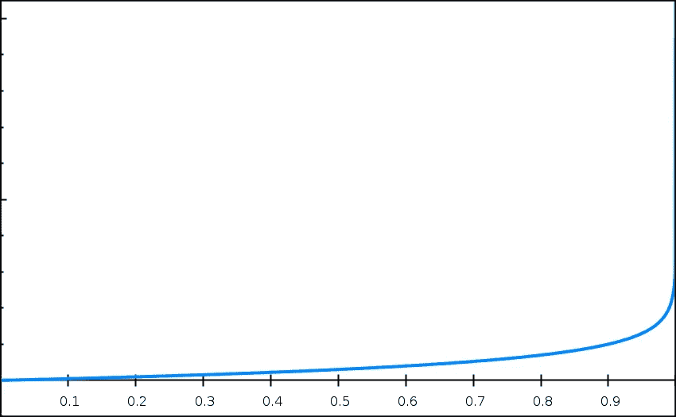
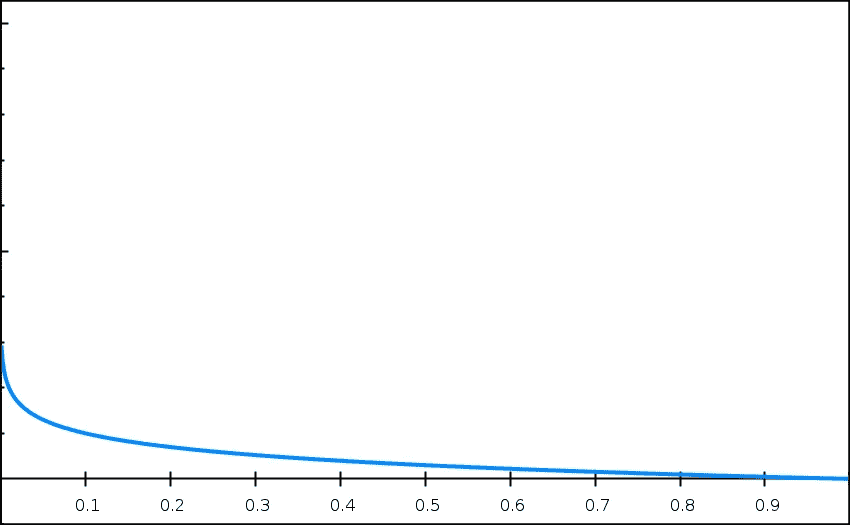
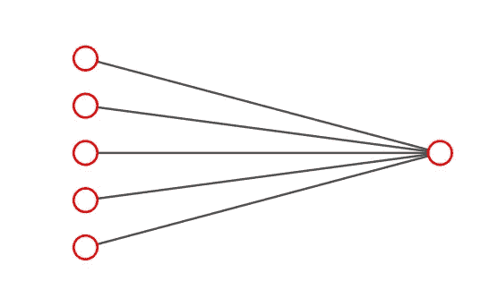
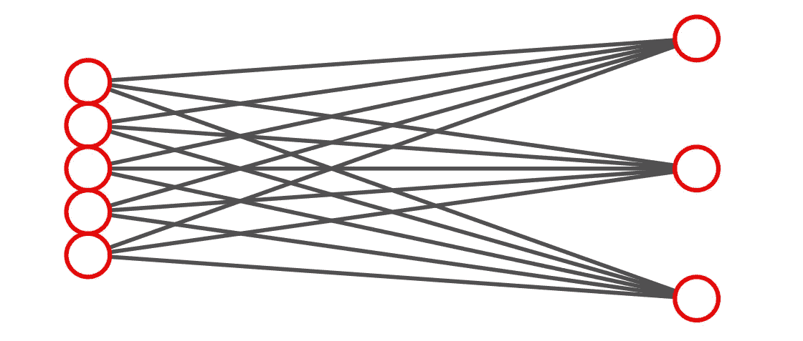

# PyTorch 中的逻辑回归

> 原文：<https://medium.com/geekculture/logistic-regression-in-pytorch-32efcf783fc1?source=collection_archive---------17----------------------->

PHOTOGRAPH: MARTIN HARVEY/GETTY IMAGES, Check out CobraML link at the bottom

# 我们离开的地方

在上一篇文章中，我们讨论了线性回归。我们讨论了该算法是如何实现的，以及它在真实数据集上的表现如何。在本文中，我们将经历相同的过程，但逻辑回归。

详细地说，我们将回顾

*   逻辑回归背后的理论
*   实现二元分类器
*   实现多类分类器
*   每个算法在真实数据集上的性能

# 什么是逻辑回归？

逻辑回归是一种能够预测二元结果的分类算法。我们将深入了解它是如何工作的，但首先让我们建立一些关于它的基本概念。

逻辑回归是**而不是**一种回归算法。

*   这可能看起来很奇怪，因为它的名字中有回归，但事实上，逻辑回归是一种分类算法。这意味着它不预测一个连续的值，而是预测一个特定的类。

与线性回归一样，逻辑回归也采用梯度下降算法来调整权重(θ)。

# 逻辑回归是如何工作的？

像线性回归一样，我们首先需要一组权重，我们称之为θ。这些是我们在训练模型时改变的权重。那么我们需要多少砝码呢？这取决于你有多少特征(X)。让我给你举个例子，如果你试图预测一个孩子是否会准时到校，你可能想要收集的数据点是:就寝时间，他们离学校有多远，以及他们醒来的时间。这些点中的每一个都算作一个单独的特征。在这种情况下，您的数据集将由每个孩子的三个要素组成。因为你有三个特征，我们有四个权重，一个对应于每个特征，一个是偏差。如果特征的数量是“ **n** ，你将拥有“**n**”+1 个权重。现在我们有了自己的特性和参数，我们该如何利用它们呢？

## 假设

首先让我们想象一下重量和特征是什么样子的。回到我们的“上学迟到”思想实验，我们可以用一个数组来表示这个特征，比如[-7200，1000，28800]。第一个值是孩子睡觉的时间转换为从午夜开始的秒数，第二个值是孩子住在离学校多远的地方，以米为单位，第三个值是孩子醒来的时间，也转换为从午夜开始的秒数。你可能已经注意到这不仅仅是一个数组，也是一个向量和矩阵。让我们看看权重可能是什么样子的。当第一次声明权重时，初始值并不太重要，所以通常的做法是用随机值或全零来设置权重。因此，我们的权重可能看起来像[0.123，0.823，0.241，0.395]。数组中的第一个值对应于偏差，第二个值对应于特征数组的第一个值，第三个值对应于第二个值，依此类推。

我们当前的目标是找到一种方法，使用这两个数组来生成一个奇异值，这就是我们的预测。最简单的方法是得到两个数组之间的点积。但是，这里有一个主要问题，数组的大小不一样！为了解决这个问题，我们可以采用两种方法。第一种方法是弹出偏差并将其添加到点积中，或者简单地在特征向量前面滑动一个 1，使其成为[1，-7200，1000，28800]，现在当您执行点积时，它只是添加了偏差。当在更大的范围内思考时，如果您拥有的数据比一组要素多得多，那么最好使用矩阵乘法。为此，我们转置权重矩阵，并将其乘以特征矩阵。因此，我们得到我们的基本假设方程θ转置 x。

The Hypothesis

## Sigmoid 函数

如果我们停在假设函数，我们会有线性回归，但我们不想这样。我们想要解决分类问题，这就是 sigmoid / logistic 函数的用武之地(因此得名逻辑回归)。sigmoid 方程为:

The Sigmoid equation

Sigmoid 图看起来像:

Sigmoid Graph

从图中我们可以看到，当“ **z** 趋近于正无穷大时，图渐近于 1，当“ **z** 趋近于负无穷大时，图渐近于 0。有了这些知识，我们可以利用 sigmoid 函数将我们的逻辑回归模型变成二元分类器，即返回预测值 0 或 1 的分类器。为此，我们将所有大于或等于 0.5 的预测四舍五入为 1，小于 0 的预测四舍五入为 0。假设我们的假设等于 sigmoid 函数中的“ **z** ，我们现在已经准备好了整个模型。我们现在缺少的只是一个成本函数。

## 成本函数

成本函数帮助我们的梯度下降算法找到到达*最小值*的最佳路径。我们需要一个代价函数，在两种不同的情况下惩罚我们的模型。第一种情况是目标为 1，第二种情况是目标为 0。预测离目标越远，惩罚应该越大。实现这一点的算法是二进制交叉熵，其公式为:

Binary Cross Entropy Loss

现在请记住，这个特定的模型是一个二元分类器，这意味着两个可预测的类(即" **y** "值)可以是 0 或 1。让我们看看 y = 0 的情况。如果 y = 0，成本函数变成

Binary Cross Entropy when y = 0

这张图最终看起来像

BCE y = 0 graph

从该图中我们可以看出，“ **L** 值离 0 越远，惩罚越高。现在让我们看看 y = 1 的情况。成本函数现在变成了

Binary Cross Entropy when y = 1

这张图看起来是这样的

BCE y = 1 graph

**L** 的值离 1 越远，惩罚越大。

随着成本函数的建立，我们现在可以用它来推导梯度下降方程。幸运的是，由于 PyTorch 等库的强大功能，这已经为我们处理好了。如果你想更深入地了解这些推导，我们建议你查看文章末尾的一些资料。

# 多类预测

你可能注意到了，因为 sigmoid 层，我们只能得到两个预测，0 或者 1。如果我们想要预测两个以上的类呢？有许多方法可以解决这样的问题，但最常用的一种方法是实现 One Vs. Rest 方法。OVR 方法将多类问题转化为二进制问题。这种情况发生的方式是我们为每一个我们想要能够预测的类训练一个模型。每个模型都在数据集上进行训练，其中一个类为 1，其他所有类为 0。之后，你会有一套模型，每个模型都能够预测某一类。然后，您将从所有模型中选择最高的预测作为您的总体预测。虽然这是一个好方法，但它很昂贵，因为你需要为“ **n** 班训练“ **n** ”个模特。你会在我的代码中看到，我实现了一个非常相似的方法，但又不完全一样。

# 二元逻辑回归实现

有了理论支持，我们现在可以看看实际代码的实现。按照 PyTorch 结构，我们应该从模型开始。

## 模型

熟悉 PyTorch 的人可能会感到困惑，为什么这个模型看起来像一个单层感知器(SLP)？这是因为这种特定类型的 SLP 实际上与逻辑回归模型完全相同。如果你还记得前面的解释，逻辑回归模型只是一个围绕假设函数的 sigmoid 函数。我们在这里基本上做完全相同的事情，如果你看正向方法，我们围绕线性层包裹 sigmoid 函数。线性层与我们的假设相同，但它为我们处理所有的权重和偏差。这一点可以通过文档页面来证明。

The bias is b and A represents the weights, x is the feature vector

通过使用线性层，我们所要做的就是传递特征，它将为我们处理所有的计算。如预测的那样导致一个神经元的激活。这里是证明 sigmoid 函数也和理论一样的文档。

The Sigmoid equation used in PyTorch’s Sigmoid activation function.

## 训练模型

训练模型是非常具体的优化器，所以我将分享两种训练方法。第一种训练方法最适合像 Adam 和 SGD 这样的优化者

如您所见，这遵循了一个非常常见的 PyTorch 培训结构。

*   我们遍历数据加载器中的每个批次
*   在每次迭代中，我们将梯度归零
*   将特征张量传递到模型中以获得输出(预测)
*   得到输出和目标之间的损失
*   反向传播损失
*   优化器使用阶跃函数对参数进行更改
*   该批次的损失随后保存在损失张量中
*   最后返回历元的平均损失

这种训练方法主要用于每批需要几次调整优化器。像:LBFGS(有限记忆 Broyden–Fletcher–gold farb–Shanno**)**和共轭梯度下降等算法就属于这一类。这两种训练方法的主要区别是嵌套闭包方法。嵌套闭包法允许对权重和学习速率等参数进行微调，理想情况下可以为用户节省大量时间，并提供更好的结果。

## 损失函数

为了训练模型，我们不仅需要优化器，还需要成本函数/损失函数。我们使用二元交叉熵，如果你看一下文献，你会发现它与我们之前在理论中陈述的相匹配。

Pytorch’s implementation of Binary Cross Entropy Loss

## 评估模型

在训练模型之后，我们需要评估它在看不见的数据上的表现如何，这就是评估方法的用武之地。此方法对预测进行舍入(将所有预测变为 0 或 1)，然后检查有多少预测等于实际目标。最终返回正确率。

# 在数据集上测试二元逻辑回归

准备好所有的方法后，我们现在可以回顾一下模型在真实数据集上的表现。从 SciKit Learn 加载乳腺癌数据集后，我们可以看到一个时期后我们获得的准确度为

Performance on the Breast Cancer Dataset (99% after 1 Epoch)

学习了二元逻辑回归之后，让我们继续学习多类逻辑回归的实现。

# 多类逻辑回归实现

## 模型

你可以看到我们仍然有一个线性层，但现在有点不同。不是所有的特征都与一个神经元相关联，而是现在与“ **n** 个神经元相关联。视觉表现是

Binary Logistic Regression

Multi Class Logistic Regression

现在，你可能认为我们这样做没有遵循一对一静止原理，但是我想说在大多数情况下我们是这样做的。如果仔细观察第二个图，可以看到每个类节点(右边的圆圈)都有自己的一组权重(线条)。因此，你可以把它看作是三个独立的模型，它们被训练来识别三个不同的类。主要区别是:它们都是并行训练的，它们存储在一个模型中，并且不需要改变数据来训练每个特定的模型。

你可能也注意到乙状结肠层完全消失了。它不存在的原因是因为我们的损失函数交叉熵损失将为我们应用 Log SoftMax 损失(这比多类问题的 sigmoid 函数更好)，因此再次添加它是不必要的。

## 评估模型

该函数的训练方法与二元逻辑回归相同，因此我们唯一需要做的是如何评估该模型。

在这种评估方法中，我们将 Log SoftMax 层应用于输出。原因是，我们不再通过损失函数来传递预测。因此，我们需要手动添加层。我们得到最活跃的神经元的指数(指示神经元预测的类别),并通过将预测的类别与实际类别进行比较来返回总体准确度。

# 在数据集上测试多类逻辑回归

那么这个模型在真实世界的数据集上表现如何呢？我们决定通过在最著名的数据集之一 MNIST 数据集上进行测试来找出答案。手写数字的数据集。我们的目标是从手写样本中准确预测数字。

在导入展平每个张量的数据集并在其上训练我们的模型后，一个历元后的精度为

Accuracy on the MNIST dataset (92% accuracy after 1 epoch)

这是非常好的，特别是对于一个简单的逻辑回归模型，我敢肯定，随着更好的超参数调整，你可能会做得更好。

# 结论

在这篇文章中，我们回顾了

*   逻辑回归背后的理论
*   多类逻辑回归
*   二元逻辑回归。
*   实施准则
*   在真实数据集上测试代码

如果你喜欢这篇文章，考虑与他人分享这篇文章或者为它鼓掌。如果你对开源 ML 社区感兴趣，试着注册来帮助 CobraML。我们正在编写一个 ML 库，它利用了 PyTorch 框架。如果你想联系我，请在 LinkedIn 上联系我和/或对文章发表评论。我会尽快回复你。请关注即将发表的下一篇文章。

# 资源

*   CobraML GitHub 链接(所有源代码都在这里)

 [## GitHub - govindansriram/CobraML:构建在 PyTorch 框架之上的 Python 库，旨在…

### Python 库建立在 PyTorch 框架之上，旨在让用户访问大量的 ML 模型…

github.com](https://github.com/govindansriram/CobraML) 

*   CobraML 投稿表格

Sign up to help contribute to CobraML!

*   解释逻辑回归和梯度下降以及其他 ML 主题的重要资源

*   我们 LinkedIn 的

 [## Sriram Govindan -机器学习工程师- Samotal，Inc. | LinkedIn

### 查看 Sriram Govindan 在世界上最大的职业社区 LinkedIn 上的个人资料。Sriram 有一个工作列在…

www.linkedin.com](https://www.linkedin.com/in/sriram-govindan/)  [## 美国印第安纳州西拉斐特普渡大学

### 我是普渡大学的本科生，主修数据科学，辅修心理学、经济学和…

www.linkedin.com](https://www.linkedin.com/in/saatvik-anumalasetty-8214b8167/) 

*   前一篇文章

 [## PyTorch 中的线性回归

### 放弃

medium.com](/geekculture/linear-regression-in-pytorch-262a4b7ed610)