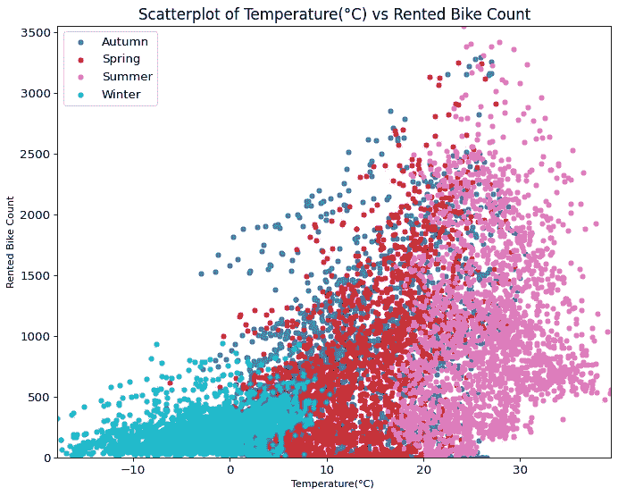
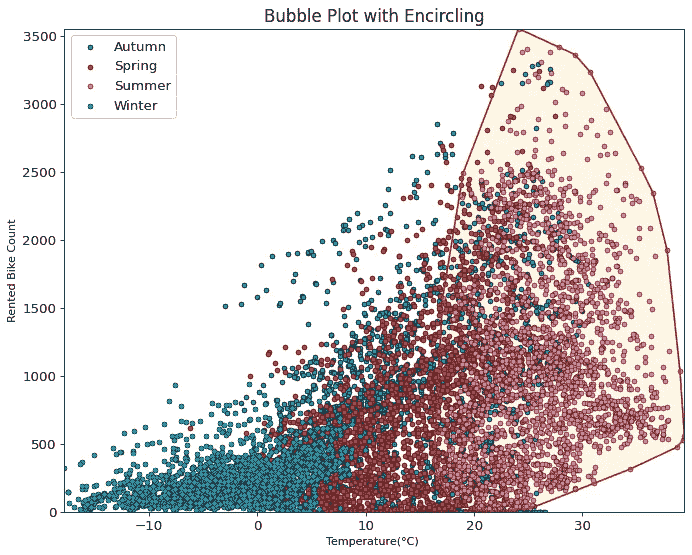
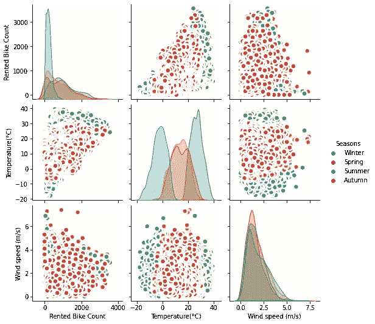
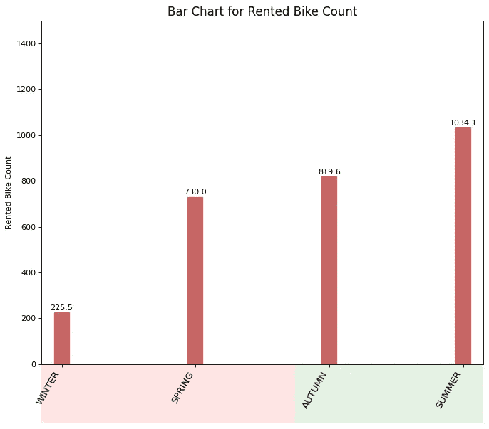
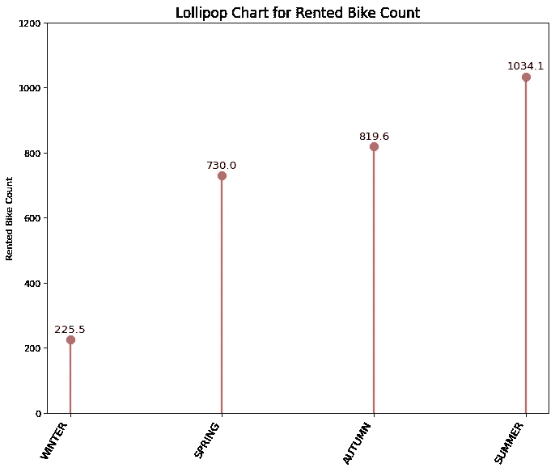
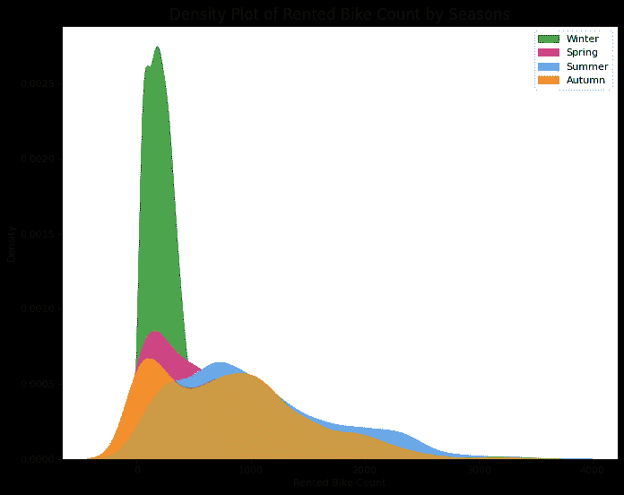
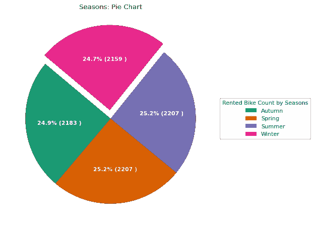

# 您可以使用 Matplotlib 和 Seaborn 可视化惊人的情节

> 原文：<https://medium.com/geekculture/looking-at-different-perspectives-when-visualize-data-using-matplotlib-and-seaborn-91d621a0623f?source=collection_archive---------14----------------------->

## 数据可视化

## 使用 Matplotlib 和 Seaborn 可视化一个更好的绘图

Source: [Urban Institute](https://giphy.com/gifs/map-united-states-us-hR0qj3ncK7M028EzOS)

在任何数据科学项目中，数据可视化都在理解数据方面发挥着重要作用。我们呈现可视化的方式将决定观众如何更容易地理解我们想要呈现的数据。当谈到数据可视化时，我脑海中经常浮现的一个著名的习语是

> **“一图胜千言”**
> 
> ——**弗雷德·r .****巴纳德**

很明显，一张图片会讲述各种各样的故事，使我们能够理解这些数据。没有适当的图片，很难以适当的方式解释事情。在解释数据时，放一个好的可视化总是一个好主意。因此，我将通过使用 Matplotlib 和 Seaborn 给出一些数据可视化图，当以简单而专业的方式呈现数据时，这些图将会让您的合作伙伴或客户惊叹不已。为了进行可视化，我使用了首尔自行车共享需求数据集，可以从 UCI 机器学习资源库下载。它由 **8760 个观察值**和 **14 个特征**组成。你可以看看提供的笔记本了解更多。

# **1。散点图**

Scatterplot of Temperature(°C) vs Rented Bike Count

**散点图**是能够检测两个变量之间相关性的图之一。我们经常在许多与数据相关的会议中看到这种可视化。我们可以看到一个变量的增加是否可以影响另一个变量的增加或减少。你可以在上面的图中看到，温度越高，在峰值 3000-3500 辆自行车时租赁的自行车数量就越多。这一可视化还表明，与其他季节相比，夏季是使用最多的自行车。你可以通过查看这里的代码来玩代码以产生可视化效果。

# 2.**气泡图**带圈圈

Bubble Plot with Encircling

环绕的泡泡图是我觉得非常有趣的最有用的图之一。通过包围数据，它可以在我们的可视化中显示一些重要的值。你可以看到上面的图，夏季是自行车租赁需求最高的最重要的部分。这可以让我们更容易地向利益相关者解释，我们的数据的哪一部分显示了可以产生利润的最重要的需求，或者如果同样的季节再次发生，我们应该提供多少自行车来预测自行车的缺乏。你可以通过查看代码[这里](https://nbviewer.org/github/naiborhujosua/Medium_Notes/blob/main/notebook/Data_Visualization.ipynb)来播放代码以产生可视化效果。

# 3.边缘直方图

Marginal Histogram

**边际直方图**被认为是显示数据帧/CSV 文件中所有特征之间的相关性。我们可以通过执行 seaborn 方法来绘制所有的相关性，该方法可以绘制所有特征之间的相关性。这种可视化的缺点是我们有很多特征。这将产生大量的相关图，这不是一个好主意。当我们只有几个变量可以映射到更好的可视化时，最好使用可视化。你可以在代码中看到，为了避免大量的情节，我只添加了一些可视化的特性。有时，最好是将我们感兴趣的变量之间可视化，而不是绘制它们之间的所有相关性。

# **4。时间序列图**

Rented Bike Count Return

时间序列数据无处不在。为了对数据有所了解，绘制图表的方法是必不可少的。您可以查看上面的数据可视化，其中我比较了每月租赁自行车计数回报，并显示与其他月份相比，2017 年 3 月是使用最多的自行车。通过标注具体数据来给出上下文，也会让受众更好地理解数据。建议这样做。但是，不要注释太多的注释，因为这会影响我们将要展示的可视化效果。让演示简单而专业。

# 5.订单条形图

Bar Chart for Rented Bike Count

**当我想在分类和数字特征之间排列数据时，条形图**是我最喜欢的图表之一。在 matplotlib 中绘制条形图的通常方法并不十分有趣。我们必须创造性地思考，通过使用 matplotlib 中可用的一些方法来改变可视化。您可以查看我在哪里使用 matplotlib 中可用的 patches 模块来更改条形大小，并根据每个季节的租赁自行车数量来注释条形大小。每当您想要实现这种类型的可视化时，都可以再次检查代码。基于上面的可视化显示，夏天哪里有最常用的自行车。

# 6.Lolipop 条形图

Lollipop chart for Rented Bike Count

**棒棒糖条形图**类似于条形图。这种比较仅仅是棒的大小和额外的棒棒糖来强调棒的大小。对于我们的案例，查看上面的可视化显示，冬季租赁的自行车最少，大约为 **225** 辆，其次是春季，使用最多的自行车是夏季 **1034** 辆。有时候，选择棒棒糖图还是条形图，是个人的口味。我经常把条形图换成棒棒糖图，反之亦然。

# 7.密度图

Density Plot of Rented Bike Count by Seasons

**密度图**用于可视化数字特征的分布。通过查看该图中分布的数据，您可以看到最可用的数据。你可以看到上面的图表，其中出租自行车在各个季节的分布情况。数据显示，春季、夏季和秋季的大部分数据非常分散，大约从零到 3000 辆自行车租赁，而冬季的数据大约从零到 1000 辆自行车租赁。

# 8.带曲线的密度图

Density Plot of Rented Bike Count by Holiday

**带曲线的密度图**通过两个图收集信息，因此我们可以在一个图中而不是两个图中同时显示它们。您可以在上面的图中看到，非假日和假日租赁自行车数量图连接在一起，形成一个可视化图形。你可以给出不同的颜色，用一种可以理解的方式来呈现。你可以在给定的链接上播放代码。

# 9.箱形图

Box Plot of Rented Bike Count by Seasons

**箱线图**用于了解我们数据的分布情况。我们通常使用箱线图来比较分类特征和数值数据。箱线图分为几个部分，即中间部分(平均值)、下四分位数、上四分位数和异常值。离群值是在下四分位数和上四分位数之外的数据。你可以查看[这里的](https://www.simplypsychology.org/boxplots.html)获得进一步的解释。在方框图中，对观察结果进行注释是一个好主意，这样可以让观众更好地观察，正如您在上面的图中看到的那样。你可以看到冬季有 2184 次观测。

# 10.圆形分格统计图表

Rented Bike Count by Seasons

饼状图是最简单的解释方式之一。您可以通过比较数字数据和分类特征来绘制饼图，从而绘制数据。你可以看到上面的地块，那里有 **2156 辆自行车**冬季出租或者 **24.7%** 。

# 11.有误差带的时间序列

**带有误差带**的时间序列图用于显示每个数据点的多个观察值。根据上面的图，你可以看到有多少自行车是按小时出租的。租金数量的平均值用白线表示，平均值周围画有 **95%** 置信区间。

12.**平行坐标**

Parallel Coordinated of Diamonds

**平行坐标**对我来说还是一个新的剧情。我发现这个图非常有趣，可以在所有数据中找到模式，以检查数据中是否有聚类。你可以通过使用给定笔记本中编码的熊猫来实现平行坐标。您可以从**租赁自行车计数功能**中看到大部分数据来自秋季。在风速和能见度方面，我们看到了类似的模式，其中大部分数据来自秋季。

# **结论**

使用 Matplotlib 和 Seaborn 实现出色的可视化不再是问题。您可以看到我如何使用这些库来可视化各种图形。同样，您可以通过查看这里的代码来查看这个可视化的完整代码。您可以根据对可用数据的需求进行调整。最重要的是，可视化的选择将决定我们如何通过可视化的方式让我们的观众更好地理解数据。根据我们总结的一些图表，您可以看到，以适当的方式绘制数据非常重要。我们对数据的可视化越好，受众就越能抓住我们对数据的意图。

参考

*   完整的代码可以在 [Jupyter nbviewer](https://nbviewer.org/github/naiborhujosua/Medium_Notes/blob/main/notebook/Data_Visualization.ipynb) 中看到
*   [UCI 机器学习知识库](https://archive.ics.uci.edu/ml/datasets/Seoul+Bike+Sharing+Demand)

# 感谢您的阅读！

*真的很感谢！*🤗*如果你喜欢这个帖子并且想看更多，可以考虑* [***关注我***](https://naiborhujosua.medium.com/) *。我发布与机器学习和深度学习相关的主题。我尽量让我的帖子简单而精确，总是提供可视化和模拟。*

**Josua Naiborhu** 是一名业务发展分析师，后来成为一名自学成才的机器学习工程师。他的兴趣包括**统计学习、预测建模和可解释机器学习**。他喜欢跑步，这教会他不要放弃做任何事情，即使是在实施**机器学习生命周期(MLOps)** 的时候。除了追求他对机器学习的热情，他还热衷于投资印度尼西亚证券交易所和加密货币。他一直在跑 2015 年**雅加达马拉松和 2019 年**大阪马拉松的全程马拉松。他的下一个梦想是参加波士顿马拉松、TCS 纽约市马拉松和 Virgin Money 伦敦马拉松。

*你可以在****LinkedIn****，****Twitter****，G****ithub****，***上和他联系或者直接在他的* ***个人网站上联系他。****