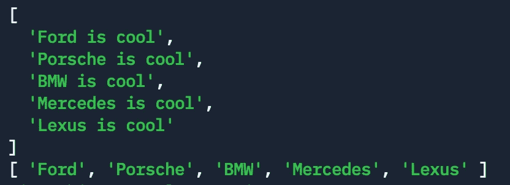

# Javascript 中的循环与迭代:导航二者的初学者指南

> 原文：<https://medium.com/geekculture/looping-vs-iteration-in-javascript-a-beginners-guide-to-navigating-both-571ecdfd9cfe?source=collection_archive---------22----------------------->

Photo by [Christopher Gower](https://unsplash.com/@cgower?utm_source=medium&utm_medium=referral) on [Unsplash](https://unsplash.com?utm_source=medium&utm_medium=referral)

虽然我自己的编程技能处于不断发展的状态，但我发现我有责任将已经获得的知识传授给那些从一开始就投入其中的人。以下博客的内容将解决新程序员中常见的困惑；循环和迭代，以及各自的用例。

首先，让我们澄清一下这些术语的含义。**循环**是指我们想要在同一个代码块中运行特定的次数，或者重复运行，直到满足某个条件。我们在循环中指定这个条件。**迭代**发生在我们想要对集合中的每一项执行一次代码的时候，通常是数组中的元素或者对象的属性。

常见的循环方法有“for”循环、“while”循环和“do…while”循环。为了更好地说明数据循环的概念，更常用的“for”循环将完成这项工作。还要注意，当使用不同的循环和迭代方法时，语法上有各种不同。在这篇博客中，我将更多地关注每一个概念的应用。

循环绝对是一个重要的概念，即使作为一个新的程序员也应该熟悉它。循环是一种运行代码块直到满足一个条件的方法，这个条件通常是一个“假”值。与迭代不同，在迭代中，我们的代码只对集合中的每个元素或数据块执行，循环可以根据我们的条件指定的次数运行。把循环想象成一个圆形的跑道，把我们的 JavaScript 引擎想象成一辆汽车。我们可以让我们的车绕着*这条*赛道*跑几圈，直到*我说停。这是循环。我们告诉循环在哪里运行，停止的条件是什么。

看一下上面的代码。在这个例子中，我在我的 carsArray 上循环。我怎么知道这是一个循环？注意到什么情况了吗？看一下第 4 行。这里，我将计数器变量(I)设置为零。这是因为在 Javascript 中，数组中的第一个元素的索引位置为零，这是我希望循环开始的地方。把它改成 1，我的循环从第二个元素开始，“保时捷”for 循环中的下一条语句是我的条件(i < cars.length)。记住，只有当这个条件为真时，循环才会继续。我告诉 Javascript 引擎的是，我想循环遍历 carsArray，直到我的计数器不再小于数组的长度。然后，我的计数器(i++)递增到下一个索引位置，然后重新计算。如果我没有在每次循环中增加我的索引位置，我们就会陷入一个无限循环，只返回数组中的第一个元素。我已经用一些文本记录了我的响应，并插入了我们从循环中得到的每个元素。复制并粘贴代码，亲自尝试！

迭代是一个类似的概念，你甚至会听到循环和迭代可以互换使用。然而，还是有一些区别的。正如我前面提到的，迭代是指我们希望对集合中的每个元素执行一次代码。我们真的不需要像循环那样为此设置“条件”。只有当我们拥有一个无限的数据集时，我们才会发现自己处于无限的迭代中！

一些常见的迭代方法包括“for…of”、“for…in”、“map()”和“forEach()”等等。对象和数组可以有自己的迭代方法，所以我们将坚持像前面的例子一样使用数组(还要注意，我们甚至可以迭代不同的数据类型，比如字符串！)

我已经使用了我的相同的 cars 数组来说明这个迭代方法和前面的循环方法之间的不同语法。“在引擎盖下”有很多不同于我们在同一阵列上的*循环*的内容。我在这里告诉 JavaScript 的是，对于 carsArray 中的每个元素的**，我希望控制台记录每个单独的元素。在这里包含我的 console.log 只是为了返回和查看我的单个元素，但是我可以在我的 forEach 中包含一个函数来返回我想对这些数据做的任何事情。请注意，我不必初始化计数器或设置条件。这是一个相当简单的方法，在某些情况下，可以在一行中声明并返回。**

大多数迭代方法都有对您正在处理的集合中的每条数据执行的函数。上面提到，另一种常见的迭代方法是。地图()。我们可以使用这个方法实际返回一个新的数组，其中包含我们修改过的元素。下面看看。

我正在遍历同一个数组，这次使用了一个不同的方法，返回一个全新的数组，其中包含我更新后的文本“is cool”。注意我在第 5 行和第 7 行的两个控制台日志。一个返回我的更新后的映射数组，另一个返回我的原始数组，完全没有修改。看看上面。

通过指出这两种迭代方法(还有更多)，我希望更好地说明这与循环有什么不同，以及如何利用这些区别来提高自己代码的性能。在考虑循环和迭代时，请记住最佳实践。我还包含了一些链接，以便进一步阅读下面的语法差异和用例。

 [## 循环代码-学习 web 开发| MDN

### 编程语言对于快速完成重复性任务非常有用，从多种基本计算到…

developer.mozilla.org](https://developer.mozilla.org/en-US/docs/Learn/JavaScript/Building_blocks/Looping_code)  [## 循环和迭代- JavaScript | MDN

### 循环提供了一种快速简单的方法来重复做某事。JavaScript 指南的这一章介绍了…

developer.mozilla.org](https://developer.mozilla.org/en-US/docs/Web/JavaScript/Guide/Loops_and_iteration) 

TL；DR — *循环*当你想让一段代码运行直到你告诉它停止(或者它不会停止)的时候。*迭代*当您想要为数据集合中的每一项运行一段代码时。不需要终止迭代循环。