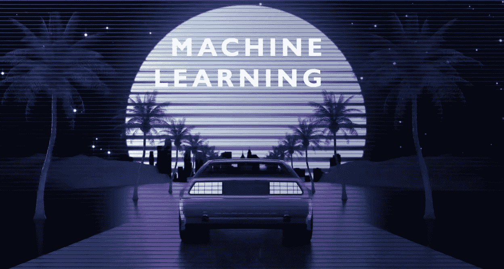
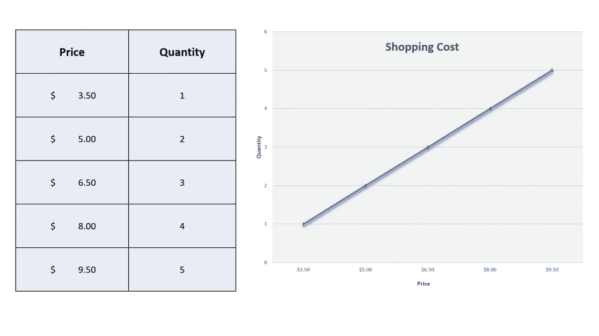
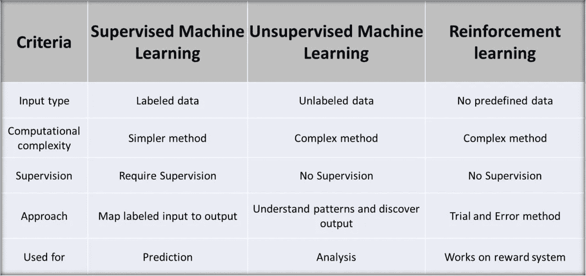

# 机器学习导论

> 原文：<https://medium.com/geekculture/machine-learning-34f7fc24e39f?source=collection_archive---------0----------------------->

**什么是机器学习？**

机器学习是人工智能(AI)的一个分支，它为系统提供了从数据中自动学习的能力，并随着时间的推移提高其准确性，而无需显式编程。

**机器学习的应用**

我们现在生活在一个机器学习是热门话题的时代。今天它是如此的无孔不入，以至于你可能一天要用几十次而不自知。它正在改变世界，改变了许多领域，包括教育、娱乐、食品行业、交通、社交网络平台等等。下面我已经提到了几个。

*   **面部识别:**脸书的自动好友标记建议是机器学习(ML)的常见应用之一。
*   **地图:**交通警报——每个使用谷歌地图的人都会自动提供他们的位置、平均速度、所走的路线，这有助于谷歌收集关于交通的海量数据，这使他们能够预测即将到来的交通，并据此调整你的路线。
*   **自动驾驶汽车:**这是机器学习最酷的应用之一。我相信你可能听说过特斯拉汽车！
*   聊天机器人:聊天机器人可以通过文本和语音与我们交谈。例如，你可能和亚马逊的声音互动过。
*   **欺诈检测:**随着信用卡使用、钱包和在线支付的增加，欺诈活动的数量也在增加。每当客户进行交易时，ML 模型都会对他们的个人资料进行彻底的 x 光检查，以寻找可疑的模式。
*   **虚拟现实耳机:**当我们转动头部时，画面也会移动！那是 ML 算法监控我们的动作，并把它们连接到视频上。
*   **医疗保健:**机器学习正在医疗保健中用于更快的患者诊断。ML 算法可以根据年龄、遗传史预测健康问题，也可以用于检测癌症。它每天都被用来拯救人们的生命。
*   **推荐系统:**脸书、亚马逊和网飞将机器学习用于他们的推荐系统。隐藏在数据中的模式对商业非常有用。基于你的浏览历史，过去的购买，喜欢或添加到购物车的商品，品牌偏好等。，提出产品建议。购物网站或应用程序会推荐一些符合你口味的商品。

让我们转到机器学习方法上来更好地理解。

**机器学习方法**

我们每天都在生成数量惊人的数据，而这个世界正在转向数据来做决策。除非我们对海量的大数据进行标记和分析，否则这些数据毫无用处。我们的世界已经发生了变化，所有企业都将深深依赖数据来做出任何决策。

在机器学习中，我们收集数据，清理数据，创建算法，从数据中教授算法基本模式，然后期望算法给我们一个期望的结果。它处理的数据越多，算法就越智能！

这些是我们遵循的主要机器学习方法。

1.  监督学习
2.  无监督学习
3.  强化学习

Machine Learning Methods

# **监督学习**

在监督学习中，我们在标记的数据集上训练机器/模型。这意味着数据已经被标记，它由一组带有结果/目标的观察值组成。

在监督学习算法中，标记数据被分成训练数据集和测试数据集。训练数据集用于训练模型，测试数据集作为新数据用于预测意外数据的结果。这个训练和测试数据的循环将被重复，直到算法提供可接受的结果。

监督学习进一步细分为:

**1。** **分类**

分类是一种受监督的机器学习技术，用于预测类别值。这是一个将给定数据集划分为不同类别的过程。该过程从预测给定数据集的类别开始，并训练算法。最终目标是预测新数据将属于哪个类别。

**例子:**

**欺诈检测:**有两个类别——存在欺诈活动和没有欺诈活动。

**垃圾邮件检测:**到达您邮箱的电子邮件分为两类:垃圾邮件和非垃圾邮件。

分类器将使用训练数据集来理解输入特征如何与特定类别相关。一旦分类器被有效地训练，它可以检测任何欺诈活动或垃圾邮件(就像我们的例子)。

**2。** **回归**

回归是一种受监督的机器学习技术，用于预测连续值。它从已标记的数据集中学习，然后能够预测给算法的新数据集中的连续值。

使用输入特征和输出标签来训练算法。回归有助于通过估计一个变量如何影响另一个变量来建立变量之间的关系。

**分类和回归的区别**

Classification Vs Regression

根据输入特征的数量，回归分为线性回归和多元回归。

**线性回归(1 个输入)**

线性回归试图通过将线性方程拟合到观察到的数据来模拟两个变量之间的关系。输入变量(输入特征)称为自变量，输出变量(输出标签)称为因变量。线性回归试图通过找到定义直线的斜率和截距来绘制一条接近数据的直线，并使回归误差最小化。

例:假设我付了 2 美元停车费后走进一家超市。无论我是否购物，我都需要支付 2 美元的停车票(不变，a)。我的购物清单上只有一项——苹果。每个苹果售价 1.5 美元。购物成本将取决于我摘多少苹果。假设我至少摘了一个苹果，让我们用一个等式画一个图。

使用的等式是:

> **Y = a + bX**

Y =购物成本(因变量)

a =停车票(不变)

b =每个苹果的价格(自变量系数)

X =苹果数量(独立变量)

在绘制了所有购物成本值(蓝线)后，我们看到一条直线。但在现实生活中，事情并没有这么简单。当这个方程用于类似的现实生活中的例子时，线性回归总是试图找到一条最符合数据的直线。

**多元回归(多输入)**

多元回归用于估计两个或多个独立输入变量和一个输出因变量之间的关系。影响输出变量的输入特征不止一个。

使用的等式是:

> **Y = a0 + b1X1 + b2X2+……+bnXn**

Y =因变量

a =常数(截距)

bn =独立变量系数

X =独立变量(X1，X2…Xn)

**例子:**

**房价预测:**房屋的销售价格(因变量)可以取决于位置的合意性、卧室数量、浴室数量、房屋建造年份、地块的平方英尺以及许多其他因素。

**天气预报:**特定地点的天气(因变量)可能取决于气温、气压、空气湿度、云量、风速和风向以及降雨量。

**线性回归和多元回归的区别**

Linear Regression and Multiple Regression

现在让我们进入下一个机器学习方法。

# 无监督学习

在无监督学习中，我们不需要监督模型，而是用未标记的数据进行训练。无监督学习的主要任务是在数据中发现模式。这里人眼将无法知道在这些未标记的数据中寻找什么。因此，算法被留给他们自己去发现和呈现来自未标记数据的隐藏结构。

我女儿和一只宠物狗一起长大。当她还是个婴儿的时候，我的朋友得到了他的狗。我女儿很舒服地和这只新狗玩耍，尽管她以前从未见过它。她认出许多特征(2 只耳朵，2 只眼睛，4 条腿)就像我们的宠物狗。无监督学习与这种情况类似，没有人教我们，但我们从数据中学习。

无监督学习有什么帮助？

*   无监督学习不需要人工干预。
*   这种方法有助于找到对分类有用的特征。
*   它在未标记的数据中发现各种未知的模式。

无监督学习进一步细分为:

**1。** **集群**

聚类是一种无监督的机器学习，它处理在一组未标记的数据中寻找模式，用相似的模式/特征将它们分组，并将它们分配到聚类中。

**例子:**

**客户细分:**了解不同的客户群体，构建营销策略。

**推荐系统:**将具有相似观看模式的用户分组在一起，以便推荐相似的内容。

**2。** **降维**

维数约简是一种无监督的机器学习技术，其中减少了数据集中的输入变量的数量。维度在数据集中表示为列，主要目标是减少它们。

在许多数据集中，我们会发现相关的列。因此，我们发现了冗余信息，这在数据集中产生了大量噪声。这会影响 ML 模型的性能。在建模之前对数据集执行降维技术，这反过来提高了性能。这项技术有助于数据压缩，从而减少存储空间和计算时间。

**举例:**这种技术可以用图像压缩来解释。我们喜欢拍摄照片，但是有一天我们面临这个问题——没有空间！图像压缩有助于解决这个问题。它将每个图像的大小最小化到可接受的质量水平。这意味着更多的图片可以存储在同一个空间。

有两种降维方法

**特征选择:**在这种技术中，从原始数据集中选择特征子集。

**特征提取:**在这种技术中，从原始数据集中获得新信息，以便生成新特征。

现在转到最后一种机器学习方法。

# **强化学习**

强化学习是一种在交互式环境中通过反复试验利用自身经验的反馈进行的学习。强化代理在一个环境中执行动作以获得一些奖励。每一个正确的决定都会得到积极的强化，而每一个错误的决定都会得到消极的强化。代理试图最小化不正确的决策，最大化正确的决策。

此算法没有带标签的数据集或与数据相关联的结果。因此，完成既定任务的唯一方法是从经验中学习。

**例子:**

**自动驾驶汽车:**强化学习可以应用于少数自动驾驶任务。在自动驾驶汽车中，各种方面，如不同位置的速度限制、可驾驶区域、避免碰撞等。被认为是。

**游戏 AI:** 强化代理被训练得很聪明，以便它提供玩家参与度和乐趣。

我以机器学习方法之间的差异来结束这篇文章

我希望这篇文章有助于你理解机器学习，它的应用和不同的 ML 方法和基本差异。感谢您的阅读。快乐学习！

*原载于 2020 年 12 月 21 日 https://www.numpyninja.com**[*。*](https://www.numpyninja.com/post/machine-learning)*