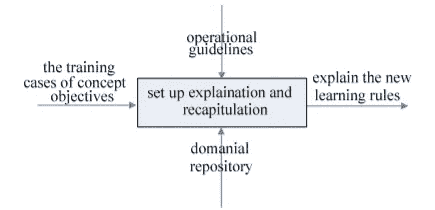
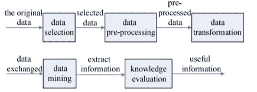

# 机器学习及其应用:简明综述

> 原文：<https://medium.com/geekculture/machine-learning-and-its-applications-a-concise-review-1c5510d0c23d?source=collection_archive---------68----------------------->

Image by [wallpapercave](https://wallpapercave.com/w/wp3205318)

随着信息的广泛传播和数据库的激增，如何从有用的信息中提取数据的问题变得迫切。本文介绍了机器学习的定义及其基本结构，以及一些机器学习方法，如机械学习、归纳学习、类比学习、解释学习、基于神经网络的学习和知识发现等。本文还介绍了机器学习的目标，并确定了机器学习的发展趋势。

# 介绍

学习是人类智力最重要的组成部分，也是获取知识最基本的方法。机器学习是使机器智能化的最基本的方法。“如果一台计算机不能学习，它就不能被称为智能的，”R.Shank 曾经说过。学习是一个整合的心理过程，包括记忆、思考、感知、感觉和其他心理功能，所有这些都是交织在一起的。因此，来自不同领域的研究人员基于他们各自的专业知识提供了各种各样的解释和观点。

# 机器学习

机器学习是对利用计算机复制人类学习活动的方法的研究，也是对获取新知识和能力、识别当前知识、不断提高性能和成就的计算机自我完善策略的研究。

机器学习比人类学习速度更快，积累的知识更多，更容易传播学习的成果。因此，人类在机器学习领域取得的任何进步都将提高计算机的能力，对人类社会产生影响。

# 机器学习的基本模型

作为起点，使用 H Simon 对学习的定义来创建图 1 所示的基本模型。外部环境向系统提供的信息质量是机器学习中最重要的组成部分。外部环境是以某种方式表现自身的外部信息的集合，它反映外部信息源；学习是将外界信息转化为知识的过程；它首先从外部环境获取信息，然后将信息转换为知识并存储在存储库中；因为环境为学习系统提供所有类型的信息，所以信息的质量对学习是容易的还是无序的有直接影响，并且存储库保存了许多管理一部分实现活动的一般原则。

影响学习系统设计的第二个组件是存储库。知识可以有多种表达方式，包括特征向量、一阶逻辑语句、产生式规则、语义网络和框架等等。每种表现方式都有自己的优势。

在做决策的时候，要考虑四个因素:强表达性、推理的容易性、修改知识库的容易性、信息的易扩充性。实现是利用知识库的知识完成一项任务，然后将完成任务过程中收集的信息反馈给学习者并指导进一步研究的过程。

Image by author

# 机器学习方法

## **死记硬背**

死记硬背的功能就像记忆，存储新信息，并在需要时检索。计算和推理学习系统不需要用户回忆他们以前的任何知识。在死记硬背的学习体系中，知识的可及性更为稳定和直接。该系统不需要大量的处理。因为函数是以变量(X1，X2，…，Xn)的值为输入，然后计算并输出函数(Y1，Y2，…，Yn)的值，死记硬背是对((X1，X2，…，Xn)，(Y1，Y2，…，Yn)的简单存储。当需要 F(X1，X2，…，Xn)时，实现部分只是在存储器中搜索(Y1，Y2，…，Yn)，而不是重新计算它。以下是一个学习模型:

Image by author

## **归纳学习**

归纳推理使用归纳方法来提炼事物的一般规律，并从足够的具体例子中总结一般知识。它是从个人到集体连锁反应的结果。归纳学习是一种应用归纳推理的学习方法。

归纳学习可以分为两种:举例学习和观察学习，这取决于是否有教师的指导。第一种是跟老师学，第二种是不跟老师学。图 3 描述了一个学习系统模型:

Image by author

编程过程通过扫描案例空间并将其提交给解释过程来选择活动实例。

该编程方法适当地变换实例，并将活动实例转换成规则空间的概念，指导规则空间的搜索。

1.  **例句的学习**

示例学习通过使用与环境中的概念相关联的示例来结束一般的概念学习方法。拿一组动物，通知学习系统哪个是“马”，哪个不是。当样本量足够大时，学习系统可以完成“马”的概念模型，允许它从其他动物中识别和区分“马”。

**2。被观察的学习**

观察学习的目的，也称为描述性总结，是发现规律或理论的一般性描述，描述观察集，指明具体对象的性质。

## **模拟学习**

类比可以简单明了地表达事物之间的相似性。类比学习是一种涉及比较相似对象的学习方法。类比学习涉及四个主要过程:

1)输入一组已知条件和一组待定条件。

2)对于输入的两个条件中的每一个，使用可比较的定义搜索它们之间的相关关系，如描述中所述。

3)使用类似的转换过程，将概念、特征、程序和关系翻译成新的问题，以便获得新的知识来解决新的困难。

4)通过对新问题的类比来验证接收到的新知识，并存储适当的知识。无法验证的知识只是作为引用知识存储在知识库中。

类比定义和转换的方法是类比学习的基石。随着模拟学习的目标，基于相似定义的对象发生了变化。如果学习的目标是获得一些新的问题属性，那么 analog 应该基于新问题的状态和旧问题的状态之间的关系；如果学习的目标是解决新问题，那么类比就应该基于新问题的状态和旧问题的状态之间的关系。

## **讲解学习**

解释学习是依赖于解释的学习。解释学习使用来自领域的信息和知识所基于的概念来检查和响应当前的实例，从而产生代表响应实例的过程的因果解释树。在获取新知识的过程中，它通过解释自然、表征现象和内在关系等来获取新信息。图 4 描述了基于解释的通用程序:

Image by author

系统在学习时，首先确定训练实例为什么是目标概念的领域知识证明，然后利用运算规则对证明进行扩展，最后利用一般知识表达形式化得到目标概念的普遍性描述。

## **基于神经网络的学习**

神经网络的性质由两个主要因素决定:网络的拓扑结构，以及网络的正确值和工作规则。一个网络的主要角色可以通过结合这两者来创造。网络值修改的挑战是神经网络的学习问题。

神经网络的价值可以通过两种方式确定:一种是通过设计计算，另一种是通过使用特定标准对网络进行分析。大多数神经网络使用第二种方法来确定其网络的值。众所周知的网络模型和学习算法包括反向传播算法、Hopfield 网络和其他众所周知的网络模型和学习算法。

## **寻找知识**

储存库的知识发现过程是高级管理的过程，用于从大量数据中识别有效的、独特的、潜在的、有帮助的和理解的模型，如图 5 所示:

Image by author

数据选择是从数据库中提取相关数据以满足用户需求的过程。数据预处理为后续处理准备数据，验证数据完整性和一致性，分析有噪声的数据，使用统计方法填补数据空白，并创建经过检查的数据库。数据转换从已调查的数据库中选择数据，最常用的转换方法是判别和聚类分析。数据挖掘根据用户的需求确定需要发现的知识类型，然后根据知识选择知识发现算法，从数据库中提取用户需要的知识。知识评估主要是在确定是否将规则输入基础知识数据库之前，对获取的规则进行评估。知识发现的过程可以分为三个部分。即数据挖掘预处理、数据挖掘和数据挖掘后处理。银行、保险、零售、医疗保健、工程和制造、科学研究、卫星观测和娱乐等行业都成功地使用了知识发现。这对人们的科学决策极为有益。

# 机器学习在应用中

根据研究，机器学习技术已经广泛应用于营销、银行、电信和网络分析。

机器学习技术在任务分类和相关任务领域的营销领域中更为常见；在金融领域，机器学习技术更广泛应用于预测任务；此外，机器学习与其他应用一起用于数据挖掘领域；典型的方法包括神经网络初始化、机器学习研究中的进化计算、机器学习的级别分类和基于粗糙集的机器学习等。

# 结论

本文讨论了机器学习的基本模型及其在各个领域的应用。本文还定义了机器学习及其基本结构，并描述了许多机器学习方法，如机械学习、归纳学习、类比学习、解释学习、基于神经网络的学习和知识发现等。虽然在机器学习的应用方面已经取得了一些基本的研究成果，但是这方面的研究还处于初级阶段，还有许多挑战需要研究和解决。