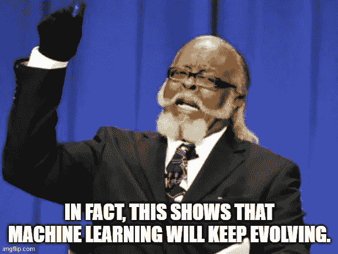
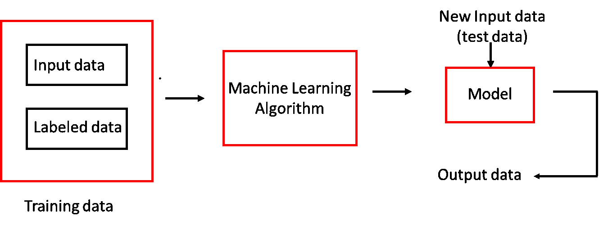

# 机器学习在生物医学中的应用

> 原文：<https://medium.com/geekculture/machine-learning-applications-in-biomedical-science-1458ca6e7e38?source=collection_archive---------16----------------------->

## 了解机器学习如何变革生物医学科学。

# 谁应该阅读？📖

在我的[上一篇文章](/geekculture/introduction-to-data-analysis-f35c576c75e3)中，我解释了数据分析的概念及其用于理解和分析当今可用的大型数据集的工具。在本文中，我们将了解机器学习如何帮助解决医疗保健中数据的复杂性和增长。

# 期待什么？👀

本文深入探讨了机器学习在改善疾病诊断和治疗方面的应用。此外，您还将了解到生物医学中机器学习的机会。

阿瑟·塞缪尔在 1959 年给[下的定义是，机器学习是一个研究领域，它赋予计算机学习的能力，而不需要明确的编程。换句话说，机器学习是人工智能技术的一个子集，它使用统计工具来教计算机完成人类比机器做得更好的任务。这种方法有许多应用，从自动驾驶汽车(](https://theconversation.com/what-is-machine-learning-76759) [Bojarskiet 等人，2016](https://arxiv.org/pdf/1604.07316.pdf) )到产品推荐( [Batmaz 等人，2019)](https://daiwk.github.io/assets/Batmaz2018_Article_AReviewOnDeepLearningForRecomm.pdf) 到网飞，从邮政 DVD 租借系统到视频流媒体提供商。在卫生领域，机器学习已被用于在大型数据集中发现有用的模式，如人类基因组计划( [Venter 等人，2001](https://www.science.org/doi/pdf/10.1126/science.1058040) )和癌症组学( [Tomczak 等人，2015](https://www.ncbi.nlm.nih.gov/pmc/articles/PMC4322527/) )。这有助于早期、更准确的诊断和持续监测，以支持整体健康。

[https://imgflip.com/i/5ym1r8](https://imgflip.com/i/5ym1r8)

为了人类健康的完美发展，基于机器学习原理的算法有能力产生准确的预测。然而，这些算法严重依赖于要解决的问题的类型。

对于不同的生物医学问题，有无数独特的方法。在本文中，您将了解其中的七种方法。

[https://towardsdatascience.com/what-are-the-types-of-machine-learning-e2b9e5d1756f](https://towardsdatascience.com/what-are-the-types-of-machine-learning-e2b9e5d1756f)

# 监督、非监督和强化学习

Supervised Learning

## 监督学习

被监督的这个名字意味着有一个监督者，作为老师，在场提供一些指导。在这种情况下，我们使用已经标记的输入数据来训练机器模型。一旦模型被训练，我们向模型提供一组新的输入数据，以从标记的数据中分析和预测正确的输出。

让我们看一个装满不同水果的篮子的例子。我们的第一步是用所有不同的水果训练模型，如下所示:

> 如果水果的颜色是绿色的，形状是椭圆形的，大小是小的，那么它被标记为葡萄。如果水果颜色是红色的，形状是圆形的，顶部有凹陷，那么它就被标记为苹果。

假设我们带一个新的苹果，让模特去识别。然后，基于训练的数据，它将使用颜色、形状和大小等特征对其进行分类，并确认水果名称为苹果。

Unsupervised Learning

## 无监督学习

无监督学习类似于新生婴儿。作为一个不知道谁是男是女或谁是好是坏的新生婴儿，新生婴儿只有来自观察模式、差异和相似性的输入，并试图基于此对它们进行分组。同样，在无监督学习中，机器事先不知道任何事情，必须根据未标记的数据找到隐藏的结构。

## 强化学习

强化学习是基于奖励和政策的。假设您有一个代理，该代理在环境中执行一个操作。基于动作的表现，代理人要么得到奖励(正的)，要么得到惩罚(负的)。它还伴随着状态变化，这意味着环境中的某些东西发生了变化。现在，新策略被制定，并且它保持更新，直到代理知道它是否应该遵循相同的步骤。

[https://www.inwt-statistics.com/read-blog/reinforcement-learning-for-marketing-lessons-and-challenges.html](https://www.inwt-statistics.com/read-blog/reinforcement-learning-for-marketing-lessons-and-challenges.html)

# 分类和回归

分类和回归学习属于监督学习方法的范畴。分类预测谨慎的值，例如正常对患病或红色对蓝色或 0 或 1。回归学习预测作为输出的连续值，例如对治疗的反应强度或价格范围。

让我们用一个真实的例子来理解这两者:

> 您正在构建一个模型来预测一个给定的客户是否有资格获得贷款，银行将提供该客户的所有信息；你现在要做的就是预测这个客户是否有资格。这是一个分类问题，因为输出是预定义的；我们知道要么是，要么不是。
> 
> 你正在为一个预测汽车价格的网站开发另一个模型。你会得到汽车的所有规格，模型预计会预测汽车价格。这是一个回归问题，因为它是一个价格范围，汽车的价格可以是连续范围内的任何东西。

# 集成学习

集成方法建立多个模型，并使用所有模型的平均值来产生预测。常见的集成方法包括随机森林、梯度增强和堆叠或元集成。

让我们试着用一个简单的例子来理解，不要深入技术细节。

> 有一部关于某个演员的电影，假设他的名字是克里斯·海姆斯沃斯。你的五个朋友选择去看电影。与此同时，你有一些工作要做，并选择不去，所以你很好奇电影进展如何。你要去问你的朋友。假设你的前三个朋友认为这部电影很好，剩下的两个认为很差。
> 
> 现在你已经有了这五个人的反馈，你将综合所有的信息来判断这部电影是好是坏，然后你将决定是否去看它。这正是在任何集合模型中发生的事情，其中来自各种来源的信息被组合在一起。
> 
> 这些来源是什么？这些来源是单独的模型。从上面的例子，你可以认为你的朋友是个人模型。从你的各种朋友那里学习或回应来自各种模型的数据科学术语，然后将这些模型组合起来，准备最终的模型。在这里，最后的模特是你。现在的问题是:你的决定是什么？你的决定将基于你所有朋友的决定反馈。
> 
> 这种模式现在被广泛使用，因为它产生了良好的效果。这是消除数据偏差的结果。
> 
> 数据偏差，或者换句话说，模型偏差是什么意思？
> 
> 假设你的一个朋友是克里斯·海姆斯沃斯的粉丝。即使这部电影并不精彩，那个朋友也可能对它有偏见；那个朋友可能会说这部电影棒极了；然而，这不是你要做的最终决定。相反，你最终的学习将基于你所有朋友的反馈；你的所有朋友可能都不是克里斯·海姆斯沃斯的粉丝，所以他们会提供中立的反馈。
> 
> 当涉及到数据时，数据的一部分可能讲述一个可能有偏见的故事，而数据的其他部分可能讲述一个不同的故事，当许多故事被整合时，我们就获得了一个组合模型。这整个过程被称为集成学习。

# 深度学习

> 你有没有想过如何在几秒钟内将一种语言的文本翻译成另一种语言？这是深度学习的一个例子。

深度学习是机器学习的子集，而机器学习又是人工智能的子集。它受到人类大脑结构的启发。在深度学习方面，这种结构被称为人工神经网络。在机器学习中，我们将特征输入模型以区分不同的类别，而在深度学习中，我们不输入特征，因为它试图在没有人工干预的情况下通过神经网络进行学习。

在机器学习中还有两种互补的方法用于提高生物医学应用的性能，它们如下:

# 降维

降维通过选择重要特征或组合特征来捕获数据集中的差异，从而帮助减少数据集的属性或特征的数量。它通常用于提高机器学习模型的性能和帮助可视化。

# 联合学习

当数据位于多个临床系统中或者从敏感的个人数据中学习时，联合学习是有用的。这在许多生物医学应用中尤其重要，因为这些应用中的数据包含敏感或受保护的健康信息，不容易共享。

## 我们来了解一下什么是联邦学习？

通常，当我们训练机器学习模型时，我们会将模型和数据保存在同一台设备上，这就是所谓的集中式机器学习。这意味着像苹果和谷歌这样的公司将我们的私人对话上传到云端，以建立他们的模型。

联邦学习颠覆了这一范式。我们不是将数据发送到云端，而是将模型发送到我们的设备上，然后在本地对它们进行训练。这意味着数据永远不会离开我们的设备。在我们在设备上本地训练了我们的模型之后，我们不是向服务器发送数据，而是向服务器发送模型更新，并且服务器聚集来自每个设备的模型更新并且更新全局模型。然后，我们在多轮训练中重复这个过程，实际上，我们不会一次在所有设备上训练模型；相反，我们只对一部分插上电源并在夜间闲置的设备进行采样，因此您实际上不会看到模型在所有这些设备上进行训练。

# 机器学习是如何推动生物医学的？

随着技术的进步，医疗专业人员、科学家和医生正在探索机器学习的不同应用方式，以便为患者提供最好的治疗。其中一种方法是对诸如癌症、脑瘤、糖尿病和其他几种疾病的生物灾难进行早期诊断和分期。对于生物灾难的早期诊断，有三个划时代的领域必须考虑。这些领域包括临床诊断、精确治疗和健康监测。

# 机器学习的未来

机器学习预计将对医疗保健管理和疾病监控的许多要素产生重大影响。早期和更准确的疾病检测、更好的诊断以及更持久和可承受的治疗都可以通过机器学习来实现。机器学习算法在生物医学的三个领域提供了许多前景:临床诊断、精确治疗以及健康管理和监控。例如，成像和分子测试现在产生了比过去多几个数量级的数据，这就需要使用机器学习进行自动解释。基于深度学习的 CAD 软件可以像医学从业者一样理解生物医学图像。

因为它们结合了人类和计算机的优势，在未来诊断中人类和计算机的使用将会越来越普遍。这将导致更准确的诊断。结合机器学习的高级临床测试技术将需要在疾病检测率、患者结果和其他健康相关参数之间进行权衡。通过在已发表的文献和患者数据库中挖掘和搜索专家知识以获得有用的信息，如生物标志物-治疗关系和感兴趣的生物途径，机器学习将有助于提高精准医疗。研究人员可以使用机器学习和用手机拍摄的照片来识别几种类型的皮肤癌和诊断糖尿病( [Esteva 等人，2017](https://on-demand.gputechconf.com/gtc/2017/presentation/s7822-andre-esteva-dermatologiest-level-classification-of-skin-cancer.pdf) ) (Micheletti 等人，2016)。

机器学习程序将能够监控个人对规范的任何偏离，并在变化需要咨询医疗专业人员时提醒他们，帮助对患者进行准确的诊断和治疗。机器学习应用程序将使用回顾性数据、迭代训练和前瞻性部署的组合进行评估。机器学习系统将能够适应不断变化的健康状况或习惯，并因此生成准确的预测。

## 参考

1.  [自动驾驶汽车的端到端学习](https://arxiv.org/pdf/1604.07316.pdf)
2.  [推荐系统深度学习研究综述:挑战和补救措施](https://arxiv.org/pdf/1604.07316.pdf)
3.  [人类基因组的序列](https://www.science.org/doi/pdf/10.1126/science.1058040)
4.  癌症基因组图谱(TCGA):不可估量的知识来源
5.  [利用深度神经网络对皮肤癌进行皮肤科医生级别的分类](https://on-demand.gputechconf.com/gtc/2017/presentation/s7822-andre-esteva-dermatologiest-level-classification-of-skin-cancer.pdf)

> *谢谢你一直支持我。我希望这篇文章对你有用，并且给你一些关于生物医学中机器学习转换的想法。*