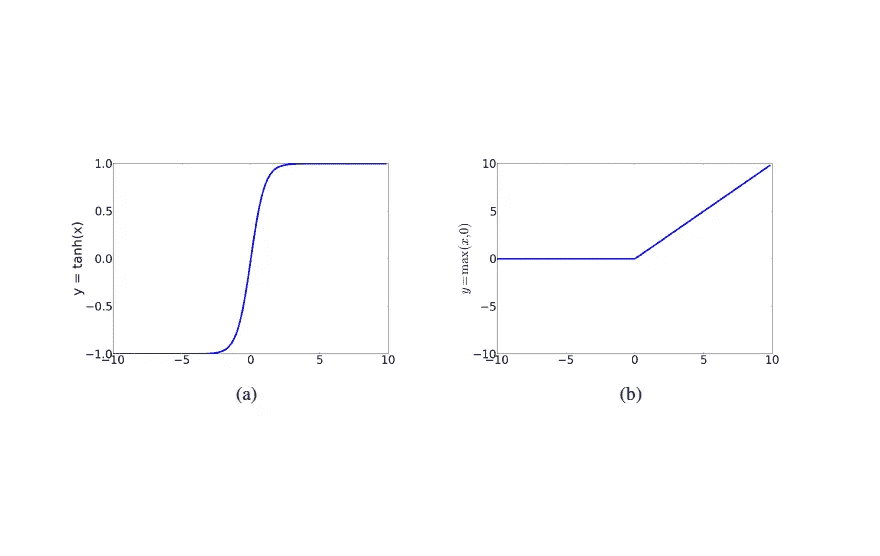
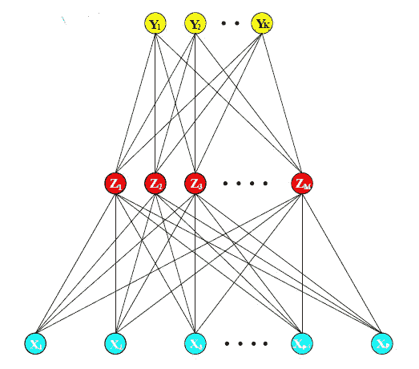
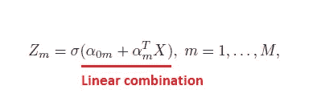
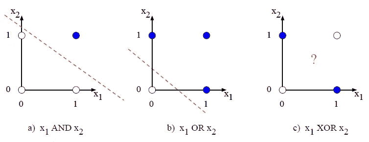
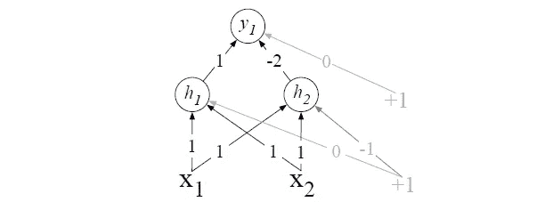
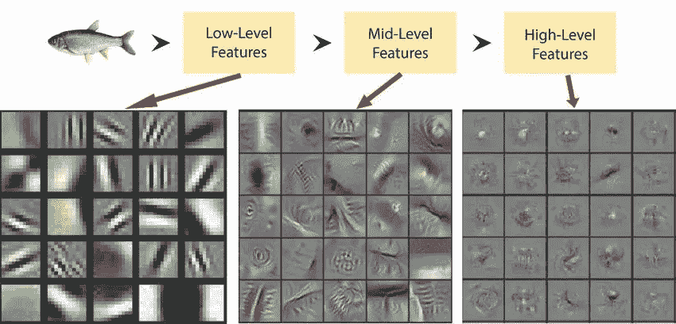
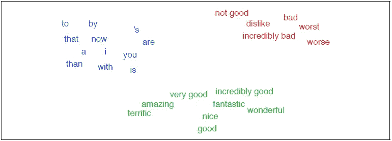

# 机器学习是关于空间的变化，而不是更高的维度

> 原文：<https://medium.com/geekculture/machine-learning-is-about-change-of-space-rather-than-higher-dimension-f9ba0c778834?source=collection_archive---------40----------------------->

这篇文章旨在为机器学习系统下的数学和随机过程提供良好的直觉。这种直觉在这里被认为是至关重要的，首先，能够达到生产水平，其次，实施一个对真实世界数据稳健的解决方案-对于从业者来说，我们并不关注像“正则化”这样的具体论点，我们更希望为任何好奇的人提供有趣的阅读。上面主图中显示的两个功能是许多现代机器学习模型的特征，然而，它们根据具体的结构以非常不同的方式进行。通过实际例子讨论这两个函数的线性或非线性特征是一种有趣的讨论方式。我们的目标是激发这篇文章的最后一个项目，一个关于自然语言处理(NLP)的项目。我们还将从**图像识别**应用的角度展开讨论。我们的第一个例子将是感兴趣的读者可以在普通书籍中找到的讨论，称为**“异或”例子**，然后我们将使用它与其他两个应用进行比较。

我们可以立即说，对于机器学习和有效解决该领域中的问题来说，说上面的一个、所有或没有一个函数是线性或非线性的并不能提供多少价值。有人可能会说第一个函数是非线性的，而第二个函数或两者都是分段线性的(函数 **b** 更接近线性，而函数 **a** 只是近似线性)，然而，更有用的说法是，它们同时是线性的和非线性的，这取决于它们在模型中的部署方式——注意，我们还可以在讨论中包括 sigmoid 函数，类似于函数 **a** ，但被限制在 0 和 1 之间，而不是-1 和 1 之间。这些说法的背后，是本帖下面要展开的直觉。

“*我在许多维度上都看得很清楚，只要维度是 2”——*马丁·舒比克

上面引用的短语可以总结许多人对机器学习的看法——相同或相似的短语确实在关于 AI(人工智能)、NLP(自然语言处理)、ML(机器学习)等的书籍中使用。虽然引用的作者可能没有特别提到机器学习，但它很好地总结了正在讨论的技术允许克服的人类局限性。然而，当涉及到深度神经网络等更复杂的机器学习模型时，这句话并不能说明全部问题——“深度”特征甚至没有那么重要，我们稍后将会看到这一点。

尝试用数学术语总结 Martin Shubik 引用的短语，我们可以说，人类可以直观地看到变量之间的关系，只要它们局限于二维的线性组合(我们添加了“线性”特征，这不是引用概念的一部分)。这种线性组合类似于 aX + bY = 0，这是 2D 圆图中的直线方程，可以写成 Y = cX + d。但是，当与神经网络相关联时，这句话缺少了一个关键概念。与人类和“普通”系统相比，神经网络不仅是能够说明更多变量(即维度)的工具；他们也能够改变这些变量所创造的空间。虽然这一事实本身并不是解决问题的先决条件，但它是神经网络的一般运行方式，因此，如果我们想设计有效的系统，我们需要正确的直觉。让我们通过一个只有一个隐藏层(图 1 中的红色层)的全连接神经网络的简单数学来解释这一点。

*Figure 1: schematic NN, Xi = inputs, Yi = outputs, Zi = intermediate features build by the model (picture from the book Elements of Statistical Learning)*

一旦图 1 的模型接收到输入 Xi，并试图输出 Yi，它所计算的数学和中间特征总结如下:

*Figure 2: picture from the book Elements of Statistical Learning*

网络中间层的每个中间特征 Zm(比如“神经元”)都是该层输入的线性组合，如图 2 所示。然后将结果乘以括号前的函数，该函数作为线性组合的一种开/关开关，用于下一层(可能是输出层)的计算，根据所选的特定函数，还可能有比例或对数因子。sigma 通常是 ReLU 函数，它是初始图片的函数 **b** ，而函数 **a** 也可以使用，一个稍微不同的函数，sigmoid one，通常用于输出层的分类问题，即图像是关于什么的，我们正在阅读什么类型的文本，等等。回到我们最初的问题，说函数(a)和(b)是不是线性的，考虑到我们的目的，意义不大，重要的是整体结构允许的非线性特征；让我们看看为什么这很重要——请注意，特定函数的线性仍然会影响整体模型的性能，但是，我们在这里试图解决 80%的问题并讨论主要概念。

现在让我们考虑更简单的模型，逻辑回归，我们可以认为它是分类应用的模型，我们可以将它们与没有中间层(图 1 中的红色层)的神经网络(图 1)联系起来。逻辑回归也类似于线性回归，只是在输出端添加了非线性 sigmoid 函数(类似于函数 **a** )，以返回 0 和 1 之间的结果，并允许分类而不是回归，例如:将 0 和 1 之间的结果视为图像是关于一只狗的概率。从问题的输入开始，逻辑回归将立即计算以下内容:

*Figure 3: in logistic regression, there are no intermediate layers and the output Y is the result of a straightforward linear combination of the input X*

中间层的缺乏阻止了简单的逻辑回归利用更复杂的深度神经网络的关键能力，即“改变变量空间并线性分离它”的能力。这就是为什么即使逻辑回归呈现非线性输出函数(sigmoid 函数)，它们也可以被视为线性模型，因为它们只考虑输入变量的线性组合。

我们将展示线性模型(即逻辑回归模型)和非线性模型(即神经网络模型)之间的所有差异，方法是浏览 Ian Goodfellow 的《深度学习》一书中的一个常见示例，然后，正如开始时所预期的那样，我们将通过一个基于图像识别的定制示例来扩展这一概念，然后达到自然语言处理的最终应用。*我们认为有必要总结一下“异或”的例子，为没有阅读过上述文本的读者提供上下文；有经验的读者可以跳过“异或结束”。*

—

XOR 示例

—

开始的例子是“XOR”应用程序:我们能否建立一个线性数学模型(线性意味着像一个简单的逻辑回归，没有能力在中间层建立 Zm)来告诉我们一个系统是否处于“与”、“或”、“XOR”状态？这意味着:想象一个系统试图根据一所房子是否有电梯和游泳池(“和”)，是否有其中之一(“或”)，或者是否有其中之一但不能同时有两者(“异或”)来发现房地产机会，如图 4 所示。这就相当于问我们是否可以用两个轴上的“电梯”和“水池”来线性分离一个 2D 空间。事实证明，对于“与”和“或”条件(图 4 a/b)，解决方案是存在的，但在“异或”情况下，我们会遇到麻烦(图 4 c)。

*Figure 4*

直观地说，我们可以从图中看出第三个“异或”问题的解是非线性的:虽然我们可以线性地找到前两种情况的解，但在第三种情况下，我们无法用直线将蓝点和白点分开。虽然我们可以通过在两个蓝色或白色的点周围画一个椭圆形来解决第三种情况，这对人类来说原则上很简单，但我们的机器更喜欢以不同的方式处理问题。神经网络宁愿“分离变量”(或输入)，这相当于改变变量空间，以这种方式，新的和修改的空间可以线性分离。上面提到的同一本深度学习书通过显示以下简单网络将输出什么来解释该概念(在衍生变量 h 中具有中间隐藏层的网络):

*Figure 5: simple “deep” NN*

模型构建的衍生特征 h 允许图 6 所示的变量空间的变化，这可以线性分离。

*Figure 6: The reader with a bit of patience to go through a couple of linear combinations in h1, h2, and y1 will see the new space works “linearly” according to figure 6/b.*

—

“异或”结束

—

现在，让我们通过将讨论应用于图像识别的定制示例来扩展这个概念。让我们将一幅图像输入神经网络，看看每一层都做了什么——请注意，图像识别的实际应用可能会涉及卷积神经网络；在文章的最后，将会有一个技术插入语，让感兴趣的读者了解卷积运算在图像识别中的应用。像图 7 所示的图像识别操作的中间结果的图片(有三个隐藏层的例子)在网上很常见；让我们看看这些步骤在上面讨论的数学和空间类比中意味着什么。

F*igure 7: Simple image detection (across three layers of a neural network)*

在图 7 中需要注意的重要事情是，神经网络捕捉的第一个特征是相当线性的(低级特征)，这意味着网络最初是通过线来分隔输入空间(图片)(类似于图 4a/b)；这种操作通常被描述为神经网络首先发现模糊限制。我们可以把这一步想象成一个简单逻辑回归模型所具有的能力。然后，随着计算在网络上进行，从隐藏层获得的导出特征增加了它们的非线性特征。我们的神经网络将那些最初的线性特征结合到随后的非线性和衍生特征中，当它们通过各层时，这些特征增加了它们的非线性特征。思考这个概念是很有趣的，这个模型并不真的能够画出非线性的线，它是用线性的片段组成它们，并且它是一次一层地这样做——对于从业者来说，并不像决策树那样。为了对概念进行三角测量，我们可以说，如果来自图 7 中所谓的中级特征和高级特征的结果显示在由模型构建的新空间中，而不是显示在原始图像的 2D 维度中，我们仍然会看到如图 6/b 所示的线

**外卖**

为什么这个讨论很重要，我们能从中得出什么结论？基本答案:理解这些想法对于做出更有教育意义的开始猜测是很重要的，例如，一个简单的应用程序是否可以用更容易处理的线性或逻辑回归来解决。此外，这将使我们能够更好地评估像决策树这样的中间解决方案，决策树是介于线性和非线性模型之间的模型，这在很大程度上也取决于具体的实现。然而，还有更多的东西，我们可以通过激发这篇文章的自然语言处理(NLP)项目简要地暗示这个想法。

自然语言处理是一个复杂而迷人的领域，该领域的许多最新发展都与所谓的“嵌入”有关——而不是唯一的选择。在将文本输入神经网络之前，通常会对文本进行预处理，这种预处理通常包括嵌入。在嵌入过程中，文本在某种程度上是语境化的:通常，在文本中，单词不是随机出现的，它们通常是成组的；我们可以认为，包含单词“king”的文本可能还包含单词“queen”和“kingdom”，而在呈现单词“Apple Inc”的文本中不太可能找到相同的两个单词，单词“Apple Inc”可以被定义为“2-gram”而不是“单词”，这表示文本处理的高度复杂性，因为“Apple”与“Apple”完全不同，并且常见的小写预处理会错过这一点。该上下文和同现概率可以通过 n 维空间内的向量进行数学表示，其中 n 对于设计者来说是主观的。虽然更高的 n 值可以允许更好的结果，但是这 n 个维度虽然不是确切的概率，但是可以被认为是单词在其中共现的机会。与只有主要共现起作用的较低 n 相比，较高 n 将表示也利用次要共现的更复杂的情境化。假设我们想要在 2 维空间中表示给定文本的所有单词(即 n = 2)；每个单词都有一个相关的二维向量:比如单词“king”是向量 234i+547t，其中 I 和 t 是表示两个主要方向的单位向量。一旦经过训练，这样的嵌入将通过图 8 所示的 2D 表示来表示我们的文本。

*Figure 8: 2D embedding example from the book Speech and Language Processing by Daniel Jurafsky & James H. Martin*

从图 8 中需要注意的是，尽管我们利用了 2D 表示，但这并不意味着我们文本中的所有单词都将被分成 2 组，因为从呈现 3 组的同一个图中可以看出这一点。那些对向量有些熟悉的人可能已经意识到了计算数学计算的可能性，比如“国王”——“男人”+“女人”=“女王”；我们可以用以下方式来考虑这个计算:

具有高共现率的相似单词倾向于组合在一起。在 n 大约为 100 的典型嵌入中，像“国王”、“王后”、“男人”和“女人”这样的词很可能沿着总 n 的一些 t 维度彼此靠近，而沿着其余维度彼此远离。所有这些复杂性都是对它们通常所处环境的描述。因此，从“king”中减去“man”并添加“woman”将保持“king”的维度，表示文本中可能是包含“……被统治……”的短语的主题的事物，但它将减去包含“……他……”的短语的维度——注意，在实际应用中，代词并不常用，它们通常在预处理过程中被删除。一旦我们加上“女人”，剩下的词仍然和“…被统治着…”联系在一起，但现在也和“…她…”联系在一起了。这些短语的结果主语可能是“女王”。

嵌入只是一个起点。通常，我们会尝试通过情感分析对给定的文本进行分类，以判断特定的电子邮件是否是垃圾邮件，或者我们可能会尝试编辑一些文本，或者将另一个文本分类为诗歌或新闻文章……要做到这一点，我们需要以下模型，可以是逻辑回归，或神经网络，或其他东西(决策树等)。).根据我们选择的模型，我们会[或不会]进行我们上面简要讨论过的空间变更。因此，我们的嵌入空间(例如图 8)会[或不会]经历空间的转换，就像我们在图 6 和图 7 中看到的那样。尽管尝试模型不一定是错的——至少对于个人经验来说，鉴于模型的复杂性，试错是使用这种模型的很大一部分——但如果我们运用对基础数学和统计的正确直觉，我们构建的试验类型可以有效地缩小范围。坚持我们刚刚看到的 NLP 示例，思考空间(意味着它的数学和统计)可以让我们，例如，理解我们是否正在用给定我们的应用空间的正确文本训练我们的模型(即，我们将应用我们的预测模型的文本的概率分布)。它还可以让我们了解与简单的逻辑回归模型相比，神经网络会对我们的输入或嵌入空间做什么。

多亏了编码库(特定用途的数学模型已经打包，只需几行代码就可以部署)，使用复杂的模型变得越来越容易。然而，尽管随机尝试不一定是错误的，但如果我们想从中获得一些东西，我们应该努力理解主要的数学动力学。

现在，对于感兴趣的读者来说，最后一个关于卷积和图像识别的技术插入语。

*请随时提出建议、意见和问题……riccardo[at]m-ODI . com*

下面是卷积神经网络的一个直观的技术括号:

*卷积神经网络是图像识别中经常遇到的。虽然它们可能看起来是更高级别的神经网络，但在理论上，它们的容量低于普通密集(即全连接)神经网络。对于感兴趣的读者来说，它们被如此广泛部署的原因是，它们的局限性允许在共同特征可能表征输入信号的情况下进行更轻的计算(如图像识别)，如下所述。简而言之，卷积神经网络利用工程中一种常见的运算，即卷积。这通常用于信号滤波，比如一名混音师想要从输入声音中消除特定频率的成分。她/他基本上将表示滤波器的函数乘以(具体来说是“卷积”，略有不同)输入信号，她/他将得到滤波后的输出。关键特征是对整个信号应用相同的滤波器。在信号处理中，滤波器由我们设计，并应用于信号，以获得预期的输出，而在图像识别中，滤波器(我们可以认为是网络每层的特定滤波器)是未知的，它是网络在训练期间通过优化其参数(即权重)必须得出的结果。例如，假设可以通过首先识别卷积 NN 的第一层中的垂直边缘来粗略地近似一幅图片，则该模型可能会选择优化识别该第一层中所有垂直边缘的滤波器。因此，卷积神经网络更受限制，其限制在于它们必须找到在各个层之间“共享”共同特征(比如“卷积的步骤”)。*

*一旦理解了卷积神经网络的数学特征，并且理解了它如何改变下面的空间，就可以应用于不同于图像识别的其他领域，这些领域不能通过普通的密集神经网络解决，因为它们具有高[和稀疏]的特征空间。*

*原帖*[*https://www.m-odi.com/blog/*](https://www.m-odi.com/blog)