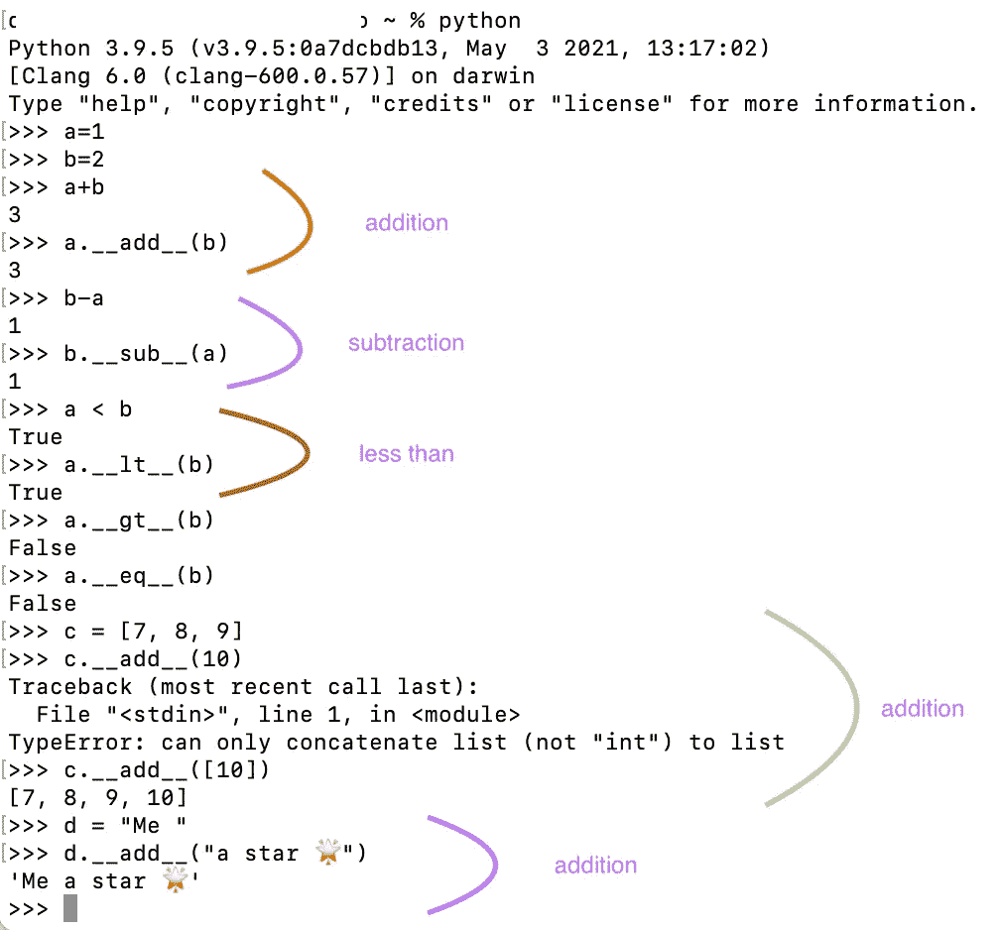

# Python 中的 Magic/Dunder 方法

> 原文：<https://medium.com/geekculture/magic-dunder-methods-in-python-ce83c4f9701b?source=collection_archive---------22----------------------->


Photo by [toan phan](https://unsplash.com/@phanchutoan?utm_source=unsplash&utm_medium=referral&utm_content=creditCopyText) on [Unsplash](https://unsplash.com/s/photos/fireflies?utm_source=unsplash&utm_medium=referral&utm_content=creditCopyText)

Dunder 代表 score 下的**d**double**，与 thunder 押韵。与 thunder 不同，dunder method 不需要制造噪音，它像 magic✨一样工作——在你的光学感官后面。在本文中，我们将把 magic/dunder 方法称为 dunder 方法。**

在我的第一堂计算机科学课上，我就知道了邓德代表什么，我想从那以后它就一直伴随着我。后来，我也可能因为脱口而出它所代表的意思而有点惹人讨厌。🤐:翻转 _ 鬃毛:

Dunder 方法以双下划线`_`开始和结束，如`__init__`、`__main__`、`__str__`。

让我们建立一个疫苗信息模型:

运行该文件时，我们得到:

```
<__main__.Vaccine object at 0x7fc8480dce50>
```

我们收到的东西看起来像是`v1`类疫苗的实例所在的地方。`print`声明背后发生了什么？

`print`基本上是使用`__str__`方法打印疫苗对象的字符串格式，就像我们在 Java 中使用`toString()`一样。我们可以在`v1`实例上显式调用`__str__()`看到同样的结果:

运行该文件时，我们看到:

```
implicit print of v1 instance: <__main__.Vaccine object at 0x7f9e701e4e50>
explicit print of v1 instance: <__main__.Vaccine object at 0x7f9e701e4e50>
```

现在让我们重写`__str__`方法，以给出关于`v1`实例的更多高级细节:

运行该文件时，我们可以得到:

```
Generic Name: Moderna, Expiry date: 2021-07-07, Against: coronavirus 🦠
```

所以你看，你实际上可以覆盖内置的 dunder 方法来满足你的需要。你需要工作，没有魔法。😁

现在让我们检查一下 python 环境中的一些内置 dunder 方法:



builtin dunder methods in python

你能看出我们可以用多少种不同的方法来使用`__add__`方法()吗？除了整数，我们还可以用它来连接列表和字符串。像`__str__`方法一样，它背后有一个重载`__add__`方法的实现。

让我们覆盖我们的类`Vaccine`中的内置`__add__`方法。

运行该文件时，我们得到:

```
======== __add__ and ___repr__ ==========
v1 + v2 = [Moderna, PFizer]
======== __call__ ==========
Instance v1 call: 👺 hehawhehaw I'll soar your heat for max 2 days to make you resistant most of the time, says Moderna 🎃
Instance v2 call: 👺 hehawhehaw I'll soar your heat for max 2 days to make you resistant most of the time, says PFizer 🎃
```

输出是最后的润色。这里涉及的新数据方法有`__add__`、`__repr__`和`__call__`。

正如我们前面所讲的，我们将覆盖`__add__`方法来添加两个疫苗实例。我们通过向`__add__`方法添加我们自己的实现来做到这一点。如果我们没有`__repr__`方法，那么`v1 + v2`的结果将会是

```
[<__main__.Vaccine object at 0x7ff0a81edfd0>, <__main__.Vaccine object at 0x7ff0a81edf10>]
```

所以`__repr__`帮助了我们，为我们提供了一个更人性化的实例。

还包括一个用`__call__`方法的 s 小治疗。我最近遇到了一个使用`call()`调用类的实例，所以快速查找了一下。`__call__`方法被用来调用一个对象的实例，就像`__init__`被用来调用类一样。

总之，dunder/magic 方法在一些操作符后面被隐式调用，如`str()`、`+`、`—`等。希望这对你有帮助！

我的下一篇文章是关于记忆🧠.的感谢您的阅读。到时候见！