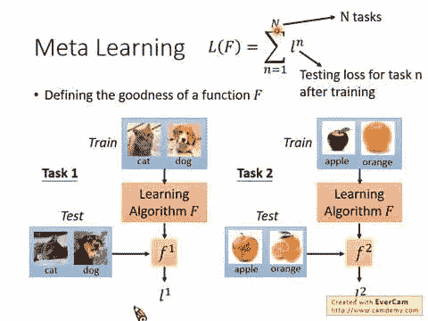
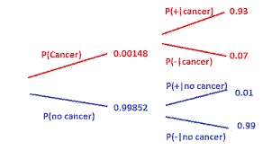
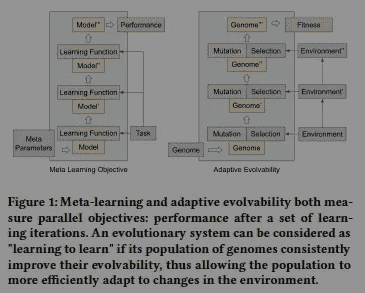
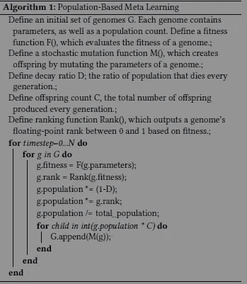
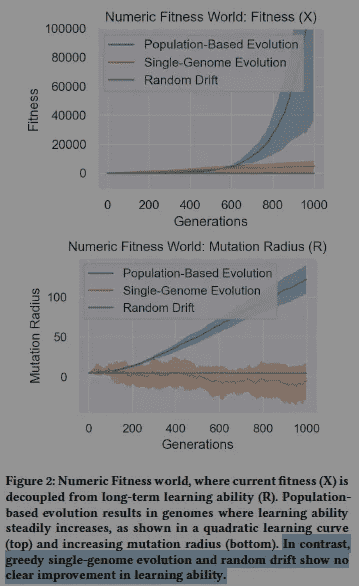
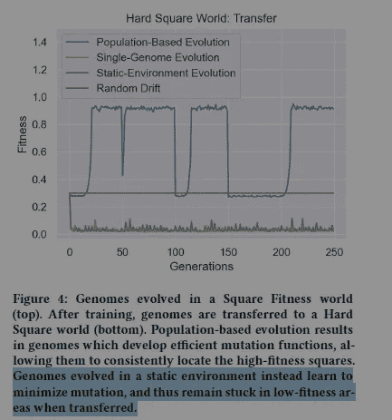
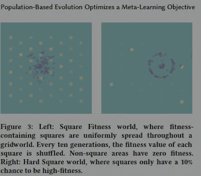

# 通过进化强化元学习

> 原文：<https://medium.com/geekculture/make-meta-learning-stronger-through-evolution-166139f54360?source=collection_archive---------6----------------------->

## 我的媒体正在变成一个进化算法的粉丝页面

随着机器学习变得更加主流，我们继续看到更复杂的机器学习协议被开发出来，这推动了我们认为“正常”的边界。像[强化学习](https://youtu.be/_J1Xn8fgUAc)，[对抗学习](/mlearning-ai/researchers-discover-possible-reason-why-adversarial-perturbation-works-f65e64d9eb7)，AI 鲁棒性等领域。已经从利基领域发展到他们自己的丰富而微妙的领域。研究人员一直在寻找下一个改变游戏规则的领域。一个非常令人兴奋的领域被称为[元学习](https://machinelearningmastery.com/meta-learning-in-machine-learning/)，这是机器学习中致力于教会机器如何学习的领域。为了跟上这一领域以及更多领域的发展，请确保通过本文末尾的所有链接与我联系。

在这篇文章中，我将分享[基于群体的进化优化元学习目标](https://arxiv.org/abs/2103.06435)的作者的发现。这篇论文是来自麻省理工学院、十字罗盘公司、东京大学和东京技术学院的研究人员合作完成的。作者表明，通过在进化的背景下构建元学习，我们可以在避免高成本的同时实现卓越的性能。

# 什么是元学习？

为了理解这项研究的重要性，让我们首先了解元学习以及为什么元学习是一个如此热门的领域。通俗地说，元学习是指创造学习如何学习的机器学习代理。这通常是通过在特定任务上训练较小的 ML 模型，然后将这些模型的输出馈送到我们的元学习模型来实现的。

We train our Meta-Learning Models by training smaller models on related tasks and combining the results

让我们以上面的图像为例。如果我们想使用元学习创建一个基于计算机视觉的二元分类器，我们可以创建多个更小的模型来处理诸如区分猫-狗、苹果-橙子、男人-女人、儿童-成人等任务。当我们使用其中的每一个来训练我们的元学习代理时，我们希望我们的代理学习二元分类的一般任务。因此，当我们给它一个完全看不见的任务([像分类恶意软件图像](https://youtu.be/MIT0Hg2lUmI))时，我们的模型可以快速有效地学习。

我们为什么要这么做？想想吧。直接在任务上训练我们的模型会更便宜。而且，对于该特定任务，它肯定会有更高的投资回报率。我希望你们花一点时间，想想元学习会有什么帮助。如果你觉得大胆，请在评论中留下你的答案。

No cheating now. Photo by [Bogomil Mihaylov](https://unsplash.com/@bogomi?utm_source=medium&utm_medium=referral) on [Unsplash](https://unsplash.com?utm_source=medium&utm_medium=referral)

请记住，您的 ML 模型的结果在很大程度上取决于您的数据的分布。在机器学习的许多情况下，你的数据集自然是极度不平衡的。例如，我受雇参与的一个项目(但最终没有参与，因为我接受了另一份工作)，是与埃默里大学合作检测癌症。因为癌症是一种罕见的疾病，所以收集到的阳性样本非常少。如果我们在这个例子中训练我们的数据，那么我们的模型将被激励为对每个样本都打印 no，不管这个样本实际上是否是负数。

This example is something that is so well known that you will see it as an example in Bayesian stats. [Image source](https://www.analyticsvidhya.com/blog/2017/03/conditional-probability-bayes-theorem/)

然而，这还不是全部。想象一下收集大量数据成本高昂或者数据带有大量法规的情况。在这种情况下，我们[通常使用合成数据，比如这里显示的](/nerd-for-tech/how-is-singan-seg-solving-the-medical-machine-learnings-data-problem-26c10e1ecbcc)由辛甘-赛格的作者[。元学习可能是一个很好的选择/补充。继续我们的医学主题，让我们以 SinGAN-Seg 论文中的例子为例。想象一下，我们想根据医学图像将一个肿瘤归类为潜在危险。由于医疗数据的注释成本很高，很难获得，并且有很多规则，因此用大量数据训练我们的模型是不可行的。相反，我们可以创建一个二元分类元学习器来首先擅长计算机视觉分类，然后让我们的模型学习这个特定的任务。](/nerd-for-tech/how-is-singan-seg-solving-the-medical-machine-learnings-data-problem-26c10e1ecbcc)

本质上，这就是元学习如此令人兴奋的原因。它可以增加很多灵活性，并允许我们通过将简单问题的解决方案堆叠起来来处理棘手的情况。你可以在这段视频中了解更多关于元学习的知识。随着背景的方式，让我们来谈谈这篇论文，以及它如何改善元学习。

# 元学习成本问题

正如我们前面提到的，元学习可能是一个昂贵的解决方案。为了开始达到可接受的“一般”表现，我们需要大量的训练。虽然我们可以聪明地实施诸如[转移学习](https://machinelearningmastery.com/transfer-learning-for-deep-learning/)的技术来降低成本，但元学习仍然非常昂贵。这篇论文的作者在他们的声明中完美地阐述了这一点，“*传统元学习的内在挑战在于其昂贵的内部循环——如果学习是昂贵的，那么学会学习就更难了几个数量级。*

Solid foundations allow you to make these connections b/w concepts

这篇论文的作者注意到了一些有趣的事情。元学习可以用与进化算法非常相似的术语来表达。由于进化算法创造了能适应各种环境的解决方案，它们是元学习的理想选择。

> 从元学习的角度来看，后代适应新挑战的能力——我们称之为适应性进化——特别令人感兴趣。考虑一个不断变化的环境，在这个环境中，基因组必须不断适应，以保持较高的健康水平。具有高适应性进化能力的基因组将更容易产生探索高适应性区域的后代

正如我在我的文章[中提到的，为什么你应该在你的机器学习项目中实现进化算法](/mlearning-ai/why-you-should-implement-evolutionary-algorithms-in-your-machine-learning-projects-ee386edb4ecc)——当我们想要获得经济有效的结果时，EAs 可以是一个很好的解决方案，特别是通过大的搜索空间。将这一点与进化算法创建具有可进化性的解决方案的事实相结合，我们可以看到为什么进化算法对于元学习环境是理想的。现在让我们深入研究论文中提出的算法及其结果的一些细节。

# 用于改进元学习的算法

为了制造对元学习有益的进化基因组，研究人员非常重视显示适应能力的基因组。他们还为他们的学习者实现了一个新颖的结构。元学习通常是分层设计的。较低的层次(内部循环)集中于特定任务的学习(猫对狗)，而较高的层次(外部循环)集中于概括领域(分类)。[由于进化算法不需要梯度](https://youtu.be/Ny3KdjELS0I)，所以一直用在外环。对于该算法，在外环和内环中都使用进化算法来创建基因组，“T2 在提高其自身学习能力的同时进化”。

The algorithm used. As you can see, it is extremely simple and easy to understand.

看着这个算法，你可能想知道它们的区别是什么。毕竟，许多基于 EA 的系统都有相似的核心算法。这个团队的与众不同之处和结果是一个简单的想法。用一句话来说，“*PBML 背后的关键直觉是，拥有大量人口的进化系统自然会为长期适应性而优化*”。这可以通过多种方式实现。PBML 以非常高的初始种群开始，这允许更大的搜索空间探索。更大的群体规模减少了噪音，更有利于实际理解选择的效果(更大的样本规模→结果中更低的方差)。

Leaving a few weaker genomes to improve long-term genetic diversity in your candidate solutions is something I always recommend in my content. This paper proves my hypothesis empirically.

第二个突出的决定是算法如何不立即删除较弱的基因组。在传统的进化过程中，最强的基因组是产生后代的基因组。搜索空间的探索大多是通过突变发生的。这对于以经济高效的方式获得特定任务的解决方案非常有用。然而，当谈到元学习，并推广到更大的任务，这种方法并不太好。如上图所示，对于长期学习来说，仅使用单个基因组并不比随机漂移好多少。与 PBML 相比，这一点非常明显，我的主张得到了证实。

The performance of PBML after being transferred to another environment is very encouraging.

当研究人员将在一个环境中训练的基因组转移到另一个环境中时，这一点得到了进一步的支持。与其他方案相比，PMBL 基因组发现了表现更好的突变。当我们将其与静态环境基因组相比较时，PBML 更加重视进化。这非常令人鼓舞。

> 在进化系统中，基因组通过增加世代间的适应性来相互竞争生存。重要的是
> 适应性较低的基因组不会立即被删除，因此
> 长期适应性的竞争可能会出现。想象一个贪婪的
> 进化系统，在这个系统中，每一代只有一个高适应度的基因组存活下来
> 。即使基因组的突变
> 功能有很高的致死率，它仍然会存在。相比之下，
> 在一个多重血统可以
> 存活的进化系统中，一个适应度较低但学习能力较强的基因组
> 可以存活足够长的时间，以显示其优势
> 
> ————作者

对于那些喜欢直观描述 PBMLs 性能的人来说，请看下图。它表明，基于群体的元学习创建的基因组在推广到不断变化的场景时具有非常好的性能。

This is obviously fantastic for Meta-Learning.

图 3 和图 4 帮助我们检查了基因组中最重要的元学习方面——概括新的和看不见的任务的能力。对我来说，这是最让我兴奋的部分，也是促使我写这篇文章的原因。然而，当涉及到更复杂的任务时，PBML 的性能略有下降。这是因为算法中隐含的偏差。虽然 PBML 确实比传统方法更鼓励搜索空间探索，但它仍然隐含地将变异限制在更高性能但更安全的配置上。这意味着，在真正的最优值超出正常范围的情况下，PBML 会停在一个合适但次优的突变上。作者在下面的段落中完美地陈述了这个问题

> 值得注意的是，基于群体和静态环境的基因组学会约束它们的突变功能，并且可以在许多代中保持强有力的政策。相比之下，用其他方法得到的后代很有可能发生严重变异，降低了他们的平均适应度。然而，这种约束的代价很小。基于人口的基因组接近于表现最佳的政策，但仍有不足，因为它可能已经阻止了一个稍微次优的模块中的突变。这可以被视为一种探索-利用权衡，其中**基因组通过约束其后代的搜索空间** **获得了更高的平均适应度，但当最优解超出其考虑的空间**时可能会失败。

解决这个问题的一个可能的方法是让偶尔在模拟中传递几个“致命的”解决方案。这将允许搜索空间探索进入完全不同的配置，并可能允许我们找到被低适应度配置包围的非常强大的解决方案。我将更深入地介绍这个系统是如何工作的，以及我在论文注释中的其他分析和重点。如果你喜欢它们，请使用我的社交媒体链接。

本文到此为止。为了能够创建和有效地实现这样的解决方案，掌握机器学习是一个先决条件。如果你想擅长机器学习，基础技能是必须的。对于那些希望进入机器学习领域的人来说，这篇文章是一个循序渐进的指南。它链接了大量的免费资源，你可以用来提高你的技能。

对于机器学习来说，软件工程的基础至关重要。它将帮助你概念化，建立和优化你的 ML。我的每日时事通讯，[编码采访变得简单](https://codinginterviewsmadesimple.substack.com/)涵盖了算法设计、数学、最近的科技事件、软件工程等主题，让你成为更好的开发者。[我目前全年都在打八折，所以一定要去看看。](https://codinginterviewsmadesimple.substack.com/subscribe?coupon=1e0532f2)

我创建了[编码面试，使用通过指导多人进入顶级科技公司而发现的新技术，使面试变得简单](https://codinginterviewsmadesimple.substack.com/p/faqs-and-about-this-newsletter?r=4tnbw&s=w&utm_campaign=post&utm_medium=web)。时事通讯旨在帮助你成功，避免你在 Leetcode 上浪费时间。[您可以阅读常见问题解答，并在此了解更多信息](https://codinginterviewsmadesimple.substack.com/p/faqs-and-about-this-newsletter?r=4tnbw&s=w&utm_campaign=post&utm_medium=web)

为了帮助我写更好的文章和了解你[填写这份调查(匿名)](https://forms.gle/7MfQmKhEhyBTMDUD7)。最多花 3 分钟，让我提高工作质量。

如果你也有任何有趣的工作/项目/想法给我，请随时联系我。总是很乐意听你说完。

以下是我的 Venmo 和 Paypal 对我工作的金钱支持。任何数额都值得赞赏，并有很大帮助。捐赠解锁独家内容，如论文分析、特殊代码、咨询和特定辅导:

https://account.venmo.com/u/FNU-Devansh

贝宝:[paypal.me/ISeeThings](https://www.paypal.com/paypalme/ISeeThings)

# 向我伸出手

使用下面的链接查看我的其他内容，了解更多关于辅导的信息，或者只是打个招呼。另外，查看免费的罗宾汉推荐链接。我们都得到一个免费的股票(你不用放任何钱)，对你没有任何风险。所以不使用它就等于失去了免费的钱。

查看我在 Medium 上的其他文章。:【https://rb.gy/zn1aiu 

我的 YouTube:【https://rb.gy/88iwdd 

在 LinkedIn 上联系我。我们来连线:[https://rb.gy/m5ok2y](https://rb.gy/f7ltuj)

我的 insta gram:[https://rb.gy/gmvuy9](https://rb.gy/gmvuy9)

我的推特:[https://twitter.com/Machine01776819](https://twitter.com/Machine01776819)

如果你正在准备编码/技术面试:[https://codinginterviewsmadesimple.substack.com/](https://codinginterviewsmadesimple.substack.com/)

获得罗宾汉的免费股票:[https://join.robinhood.com/fnud75](https://www.youtube.com/redirect?redir_token=QUFFLUhqa0xDdC1jTW9nSU91WXlCSFhEVkJ0emJvN1FaUXxBQ3Jtc0ttWkRObUdfem1DZzIyZElfcXVZNGlVNE1xSUc4aVhSVkxBVGtHMWpmei1lWWVKNzlDUXVJR24ydHBtWG1PSXNaMlBMWDQycnlIVXNMYjJZWjdXcHNZQWNnaFBnQUhCV2dNVERQajFLTTVNMV9NVnA3UQ%3D%3D&q=https%3A%2F%2Fjoin.robinhood.com%2Ffnud75&v=WAYRtSj0ces&event=video_description)