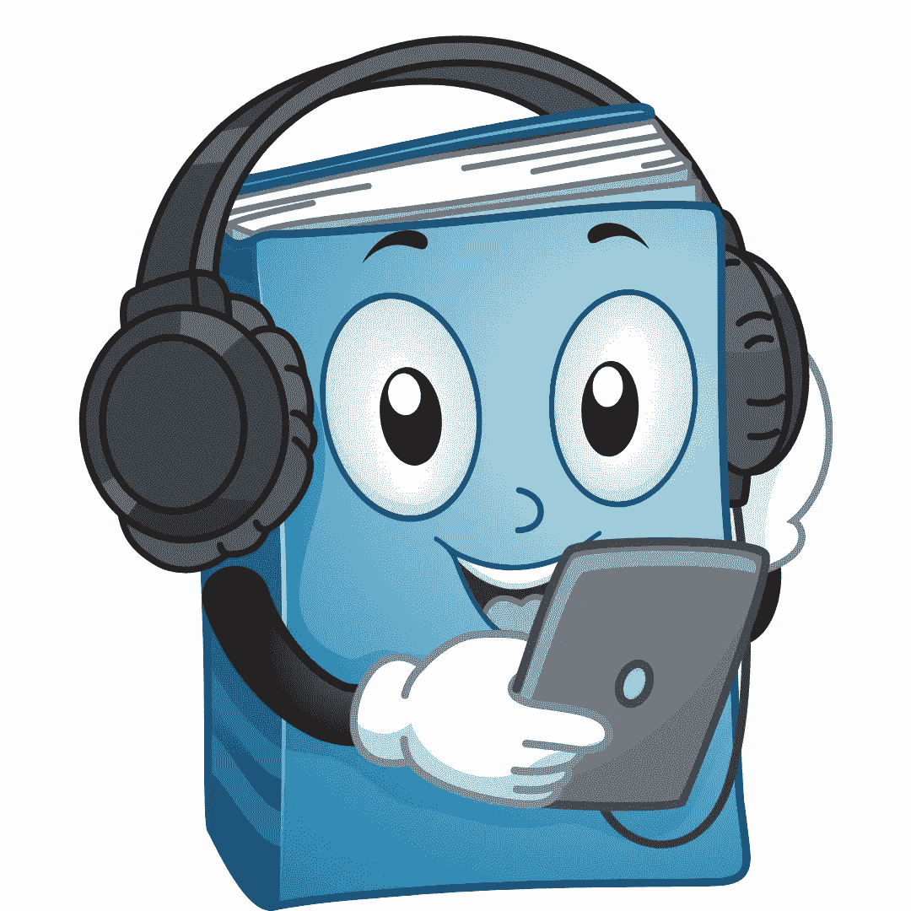

# 使用 Python 编程将您的 PDF 制作成有声读物

> 原文：<https://medium.com/geekculture/make-your-pdf-an-audiobook-using-python-programming-610b59cc4a92?source=collection_archive---------5----------------------->

使用 Google 文本到语音和 Python 将 PDF 转换成有声读物



Converting Pdf to an audio file using Python

Python 爱好者们，你们好..！！

Python 是一种容易学习的编程语言。但是做项目会让你的知识更加清晰。项目可以有很多种类型，比如现实世界的解决问题的项目，你可以从中赚钱的项目，等等。如果你想在你的编程生涯中有所成就，那么在某个时候，你必须开始做项目。一开始，从小项目开始。

在本文中，我们将构建一个 Python 项目。该项目是关于一个 pdf 文件到音频文件的转换。是的，你可以把你喜欢的书转换成有声读物，在你睡觉的时候听。让我们开始这个项目。

如果你正在寻找这个项目的视频教程，那么它在这里:

# PDF →有声读物

我的建议是在虚拟环境中开始这个项目，因为在虚拟环境中，新安装的 python 库版本不会影响系统中同一 python 库的现有版本。并且构建基于 python 的项目是个好习惯。但这不是强制性的，没有虚拟环境你也可以继续。但是您必须为这个项目安装以下 python 库:

```
pip install gtts
pip install tk
pip install PyPDF2
```

如果你不知道如何在虚拟环境中开始一个 python 项目，那么你可以阅读这篇[文章](/geekculture/make-your-first-web-app-with-django-python-in-a-virtual-environment-4cce2241031d)或观看视频:

# 带解释的代码

制作一个文件， ***file.py***

```
from gtts import gTTS #google text to speech
import PyPDF2
from tkinter import filedialoglocation = filedialog.askopenfilename()
full_text =""with open (location, 'rb') as book:
    try:
        reader = PyPDF2.PdfFileReader(book)
        total_pages = reader.numPages   #for total number of pagesprint('Location of the file is: '+location)
        print('\n')
        print('Total number of pages are: '+ str(total_pages))try:
            for page in range(total_pages):
                next_page = reader.getPage(page)
                content = next_page.extractText()
                full_text += content

            speech = gTTS(text = full_text)
            speech.save("audio.mp3")

        except:
                print("Task failed Successfully")

    except:
            print("\n")
            print('Invalid pdf')
            print("\n")
```

*   导入库
*   指定位置和 pdf 文本的变量。
*   阅读页数
*   打印 Pdf 文件的位置
*   打印 pdf 文件的页数。
*   使用 for 循环逐页读取 pdf 文件，并将文本原样存储在 full_text 变量中。如果您想听特定页面的音频，那么您可以更改循环的*范围的索引。例如，我想听 pdf 文件第 42 页的音频，那么我必须更改 For 循环的范围，如下所示:*

```
for page in range(41, total_pages):
```

你们都很清楚 python 中[索引的概念。](https://python.plainenglish.io/python-strings-53394b90c883)

*   使用 Google 文本到语音将 pdf 文件转换为音频。
*   将音频文件保存在同一目录中。

现在使用以下命令运行该文件:

```
python file.py
```

选择一个小的 pdf 文件，让转换完成。现在检查您的项目目录。您将看到一个新文件“audio.mp3”。播放那个文件。

答对了。

本文到此为止。

如果这篇文章听起来对你有帮助，那么一定要跟着鼓掌。分享给你的极客社区。

感谢阅读。

# 这里有更多的 Python 项目供练习！

[***随机密码生成器利用 Python 编程***](https://python.plainenglish.io/random-password-generator-using-python-programming-1e65fc058540)

[***用 Python 和 Tkinter 制作计算器***](https://ninza7.medium.com/make-a-calculator-using-python-and-tkinter-dc24a2d17d4)

[***YouTube 视频下载器使用 Python 和 Tkinter***](https://python.plainenglish.io/youtube-video-downloader-using-python-and-tkinter-b97462542300)

[***使用 Python 进行文本到语音的转换***](https://ninza7.medium.com/text-to-speech-conversion-using-python-with-gtts-eb4aa0f6dfb7)

[***使用 OpenCV Python***](/nerd-for-tech/capture-and-process-video-footage-from-a-webcam-using-opencv-python-9e3c5585da0c) 从网络摄像头捕捉并处理视频素材

[***石头剪子布游戏使用 Python 编程***](https://ninza7.medium.com/make-rock-paper-and-scissors-game-using-python-programming-da277b51182c)

快乐编码..！！

你好，我是 Rohit Kumar Thakur。我对自由职业持开放态度。我构建了 ***react 原生项目*** *和目前正在开发的****Python Django****。随时联系我(*[*freelance.rohit7@gmail.com*](mailto:freelance.rohit7@gmail.com)*)*