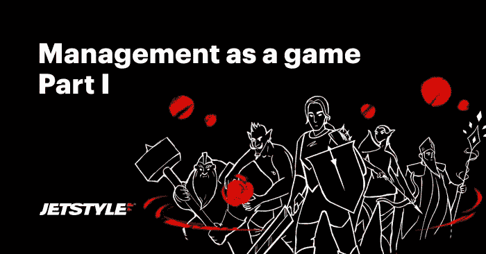
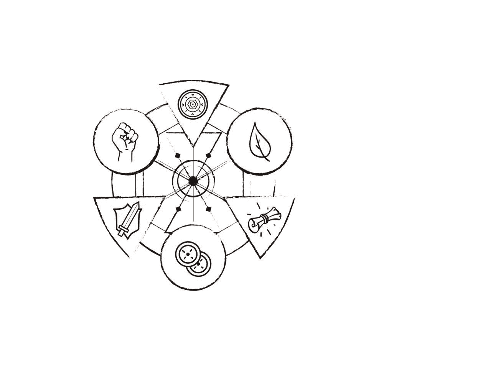
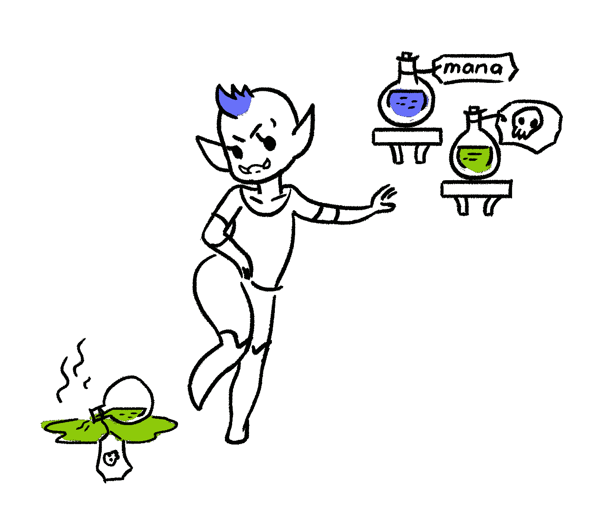
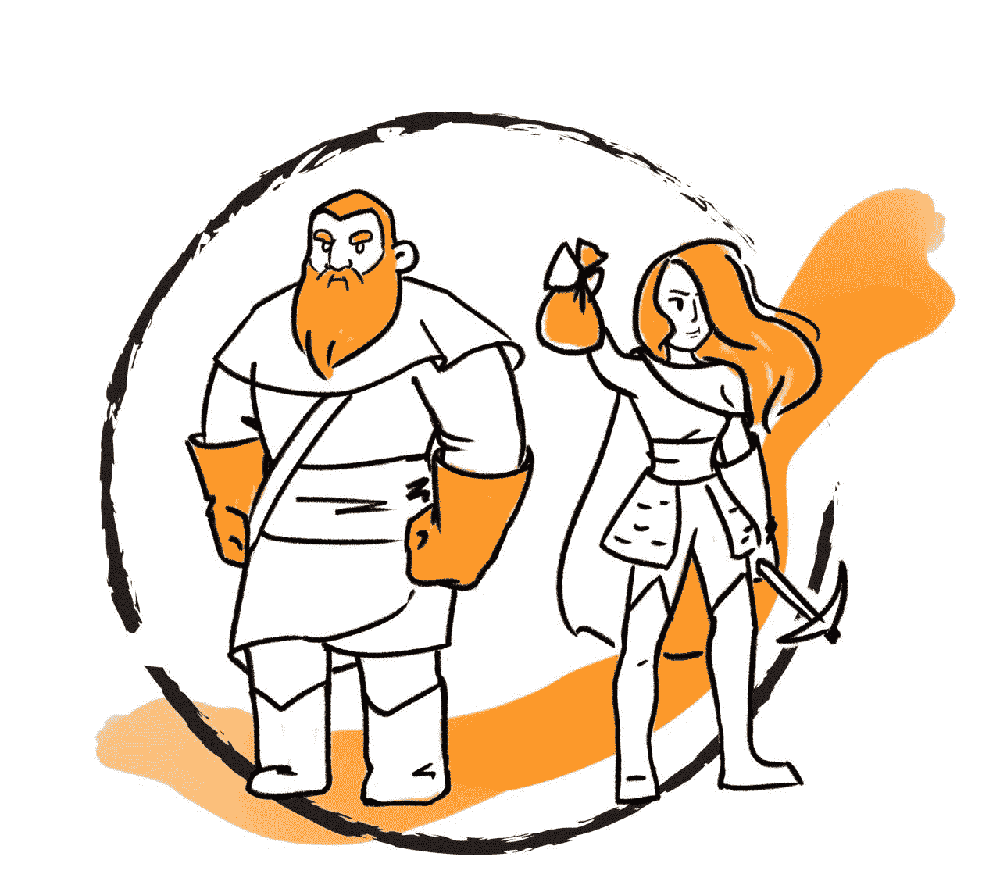
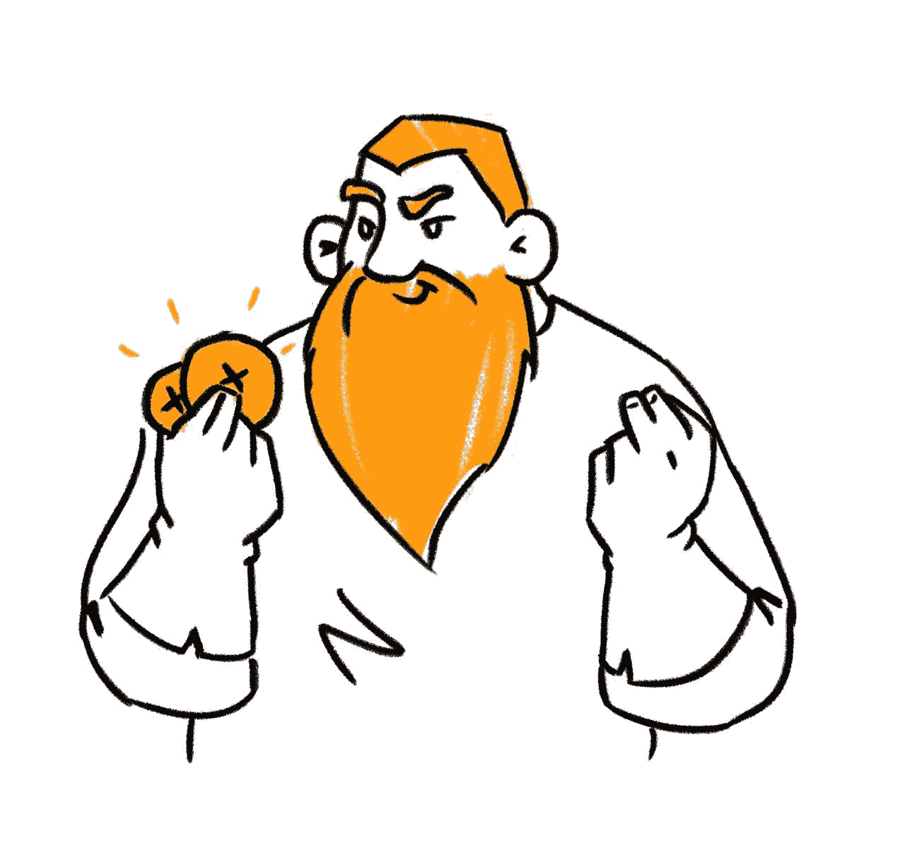
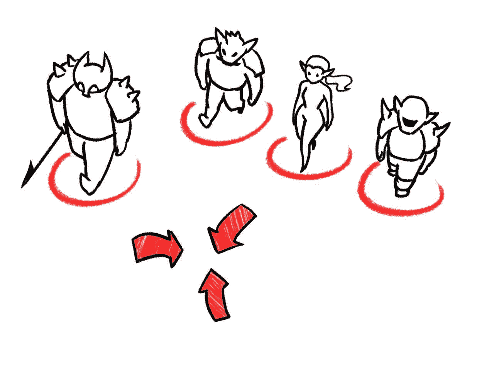
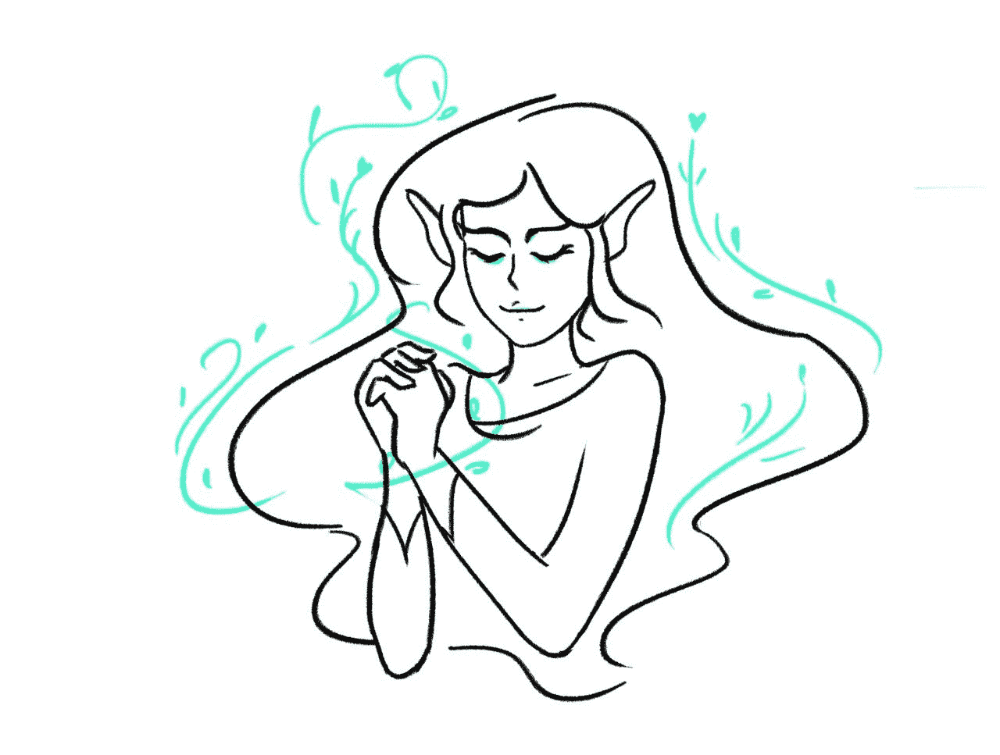
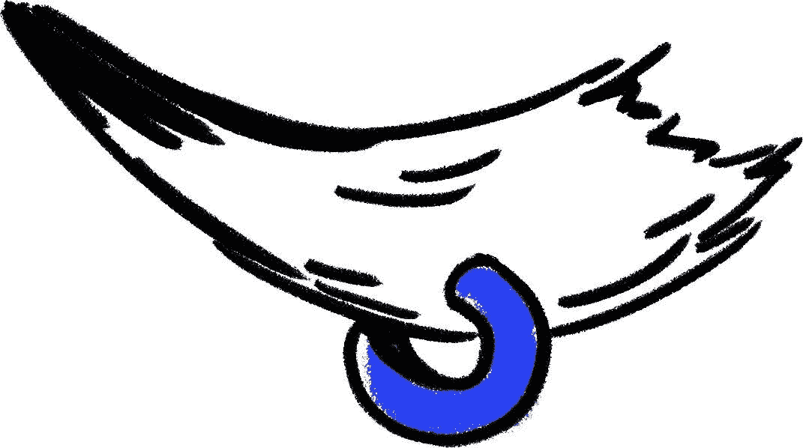
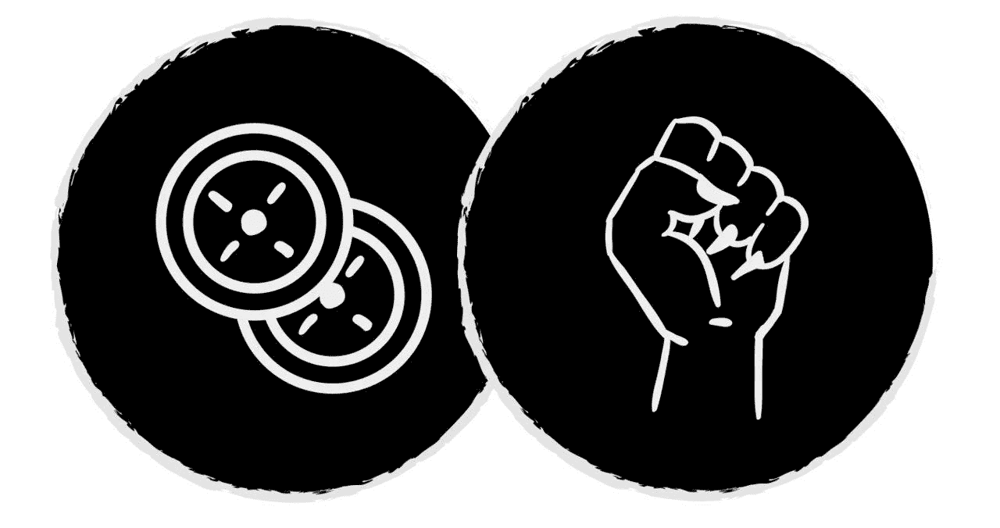
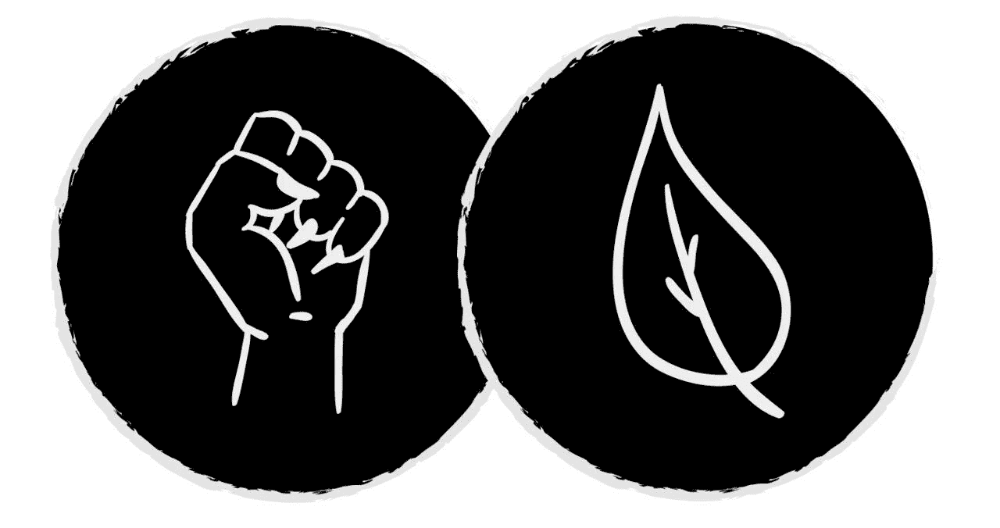

# 管理是一场游戏。第一部分

> 原文：<https://medium.com/geekculture/management-as-a-game-part-i-d913dd27fad9?source=collection_archive---------29----------------------->

在这篇文章中， [*JetStyle*](https://jet.style/?utm_source=medium&utm_medium=blog&utm_campaign=article&utm_content=jetstyle) *的首席执行官阿列克谢·库拉科夫将谈论如何建立一个团队，需要雇佣谁，人们为什么要做事，以及如何将事情传递给特定的人。*

15 年前，我注意到在多人 PC 游戏中，有许多很好的隐喻来描述我们在现实生活中发生的事情。这就是所谓的六芒星的概念是如何诞生的。下面有很多搞笑的图片和术语，但在我看来，它们比其他的要准确得多。

与大量的近心理学理论不同，六芒星不是关于个性特征，而是团队中的角色。

在我的想法框架内，不同团队的同一个人，立场不同，喜欢的东西不同，一般表现也不一样。这不是社会学或科学知识。这是我直接观察的概括。

**六芒星有六个位置:**

## 道德的

*比赛*

## 功能的

*角色*

每个位置都有它的动机——法力。这是某种形式的社会能量。当一个人收到它时，他或她想更加努力地工作。如果一个人在工作过程中获得更多的这种能量，他们会继续努力。如果他们的能量只是被浪费，而没有得到任何形式的补充，那么他们“不想工作”

我相信，每一个理性的人，在生命只有一次的过程中，都希望更经常地感觉凉爽，更少地感到恶心。所以，你需要知道什么让你觉得酷，什么让你觉得恶心。然后你会给自己安排合适的条件。法力是让你觉得酷的东西。

此外，每个立场是根据一个人认为什么是最可怕的不可饶恕的大罪以及他或她不准备放弃什么价值来理解的。

# **道德立场**

## **矮人**

他们都是为了钱。矮人有一种非常基本的魔法。所有矮人的快乐都包含在黄色的金属圈里。更多的金子意味着更多的快乐。

***矮人看重控制力，把一切都看成资源。***

例如，有“人际关系”或“魅力”或“发现”的资源你可以用资源逻辑来谈论所有这些事情，因为它是通用的。所以，从矮人的角度来说，人也是一种资源。他们是矮人组装商业引擎的砖块。

矮人追求最大利润，最大市场控制。每个矮人都寻求尽可能多的拥有。相应地，矮人的行动方式很简单:他或她控制那些在从属等级中低于他们的人。矮人热爱工作，也热爱其他人所做的工作。对他们来说，当然，对矮人来说。

## **决策方式**

拥有资源的人替他们做决定。当矮人建造建筑时，他们会说，“是啊。要么我是你的资源，要么你是我的资源。”差不多就是这样。你怎么能理解谁将做什么？如果亚历克斯是泰勒的资源，那么泰勒将决定。谁拥有资源，谁就独自决定其未来的命运。

## **管理风格**

矮人在使用暴政。为什么要求资源？如果它属于一个矮人，那么这个矮人可以按照他或她认为合适的方式来使用它。

矮人还没准备好放弃资源。一个纯粹的，100%的矮人会这样说:“等等，你要我现在花资源，然后他们可能会回来找我？你们是十足的傻瓜还是什么？！我不会放弃任何资源。”

从这个意义上来说，一个没有创造性方法的纯粹的侏儒根本不知道如何投资。只有短期指标，只有现金流，只有快速周转才可以。“我花钱确保他们可靠地返回。如果这些钱没有以可靠、简单的方式回到我这里，那就不属于我。”你如何牵制一个侏儒？让他或她知道，如果他们不做某事，他们将失去资源。

对于一个矮人来说，最大的罪过是偷窃和挥霍，这也是他或她讨厌其他人的地方。同罪的一个特例是答应而不履行。随着盗窃，一切都清楚了:一个矮人从另一个矮人那里拿走了资源。这很糟糕，但可以理解。这发生在矮人的世界里。但是如果你被给予一种资源，然后简单地浪费它，这是对圣地的侵犯。

## **精灵**

这些小伙子一点也不像矮人。都是关于爱情的。一般来说，如果你没有精灵，那么很有可能你没有团队。你可能有一个业务引擎，或者一个研究小组，但是没有关系，没有稳定，没有社会胶水，你根本不想去给这样的同事打工。你不爱任何人，也没有人爱你；每个人都不在乎对方。差不多就是这样。

***精灵上班是因为有好的团队。***

“杰出的团队”——你在面试中听过这个短语吗？是精灵语。对他们来说重要的是在工作过程中发展出什么样的关系，人们如何对待彼此，他们是否把某个同事作为一个人来看待。

精灵是为了什么而工作的？因此，没有人被冒犯，每个人都彼此相爱，没有人踩到任何人的脚趾，没有人在任何人的灵魂里吐痰。精灵们搞外交，分享，自我反省，反省邻居。

如果 HR 不是精灵，那么，最有可能的是，他(她)不适合这个职业。通常 HR 是精灵和其他人，但精灵是必须的。比如有精灵——矮人。

## **决策方式**

精灵做决定的方式是最恶心的。甚至比民主还糟糕。这是共识。“在所有人都同意之前，我们不会采取任何行动。”这是最慢的模糊的东西。你可以尽情踩水。一个病态的示范者将整个精灵团队带入完全的互操作性。没有人做任何事情，因为有人不同意。

## **管理风格**

精灵首领使用的管理方式是谈判。人们必须自愿工作。

*总的来说，这是一种非常好的情感。我现在给你讲的故事大部分是精灵语。六芒星的思想是，一个人工作是因为工作带给他或她快乐。这就是我如何构建*[*JetStyle*](https://jet.style/?utm_source=medium&utm_medium=blog&utm_campaign=article&utm_content=jetstyle)*。我认为和喜欢工作的人一起工作对我来说很酷，因为那对我来说也很酷。这意味着我一般是个精灵。*

一个纯粹的精灵根本不知道如何发号施令，因为发号施令是痛苦的。精灵正在达成协议。

同时，精灵的大罪是非团队游戏。第一，精灵是嫉妒的生物。如果你，上帝禁止，不仅爱我们的团队，那么有一天你根本不会醒来。出轨是第一位的。但更可怕的罪是遗弃。“你从我们教派去了哪里？这是什么？你是个叛徒。”“看来凯尔在和邻队一起欺骗我们。现在他会后悔的。”

## **巨魔**

第一个伦理——矮人——是基于资源的:一个好的人是积累资源的人。

第二个——精灵——是爱和正义的伦理。我们都是人，必须这样做才能让我们都感觉良好。主要的价值观是团队和个人、爱和正义。

第三伦理是关于什么的？这是关于真相。这是关于什么是事实，世界是如何运作的。这是巨魔伦理的核心。

巨魔挖掘启示、突然发现和赤裸裸的真相。

如果与此同时，每个人都在哭泣，每个人都被抹到地狱，而精灵们在叫喊，并因戏剧性的癫痫发作而崩溃，那么巨魔会对自己说:“哦，我揭示了真相，多酷啊。”

让我用侏儒的例子给你演示一下。“我有钱，我得到它是因为有人不清楚他或她为什么把钱给我。”这时一个巨魔走过来说:“让我们诚实地告诉他或她事情是怎样的。”他或她活不长。谁需要这个道理？

矮人挖掘真相，但不是为了任何东西，只有当它带来资源的时候。巨魔就是爱说明，其实世界并不是你想的那样，只是不一样而已。从这个意义上说，他们没有伤害邻居的目的。他们只是不在乎痛苦——他们在乎的是事实。他们喜欢批判性思维、形式逻辑和挖掘真相。

巨魔的目标是一场革命，一场形势的彻底更新，因为，无论事情如何，现实和现实之间总是存在差异。总有那么一个时刻，人们在惯性之下，习惯了这样的现实地图，不希望地图改变。

顺便说一句，没有巨魔就没有发明，因为要做一个发明就要暴露事物的本质。他们敦促我们深入内心，找出真正的问题所在。把壁橱里的骷髅拿出来，扔到桌子上。精灵和魔法师也热爱创意，但他们不会深究自己要伤害人的地方。同时，组织内部的发明几乎总是痛苦的。

## **决策方式**

巨魔使用证据。

## **管理风格**

最可怕的。它甚至比精灵还糟糕。这是一个没有规则的搏击俱乐部，但战斗是基于事实的。

什么巨魔不适合表演？他或她不能保持沉默。如果有些真相说出来没有好处，巨魔还是会说出来——因为真相必须说出来。

# **伦理冲突**

## 矮人和精灵的冲突是什么样子的？

**精灵:** “好吧，听着，我们是人，我们不是引擎。我们是一个大家庭。你让我们浪费资源，在工作中死去。太不人道了。”

**矮人:** “不，等等。我们在这里赚钱，这是生意，生意是引擎。是的，当然，我们为此使用人力资源。顺便说一句，你是我们的资源。”

## 矮人和巨魔冲突的一个例子:

矮人:
“只有当更多的资源因真理而变得可用时，真理才应该被表达。”

**巨魔:** “不，真相无论如何都要说出来，因为世界就是这样运转的。”

## 巨魔和精灵之间的冲突看起来很像这样:

**巨魔:
“这里是亚历克斯。他们是个混蛋。”**

**精灵:** “是的，亚历克斯是个混蛋，但我们的！”

**巨魔:** “亚历克斯，的确，是我们的，但他们还是个混蛋。”

## 如果其中一项道德缺失，那就有问题了。

如果团队没有这三种伦理中的任何一种，如果团队没有资源逻辑的倡导者，没有个人和人际关系的倡导者，没有真理的倡导者，那么团队就有问题。

如果没有矮人，就没有生意。
资源被简单挥霍，巨魔带着精灵玩他们的魔法游戏，没人赚钱。我们来这里只是为了交流。

**如果没有精灵，那么就没有团队。** 那样活着没有意义；很疼。我们从工作本身得不到任何能量。

如果没有巨魔，我们就开始对自己撒谎。
我们很快撤回到自己或者在教派的逻辑中找到自己。没有真理伦理的团队很快就会明白他们是最好的，他们觉得一切都很酷，如果有人不这么认为，那么他们只需要被钉死在十字架上。

在**第二部分**中，我们将讨论职能职位——魔术师、牧师和战士，他们如何合作以及公司如何发展，我们还将诊断自己属于哪个职位。

你喜欢这篇文章吗？在脸书上分享它，写下评论——我们将讨论它！