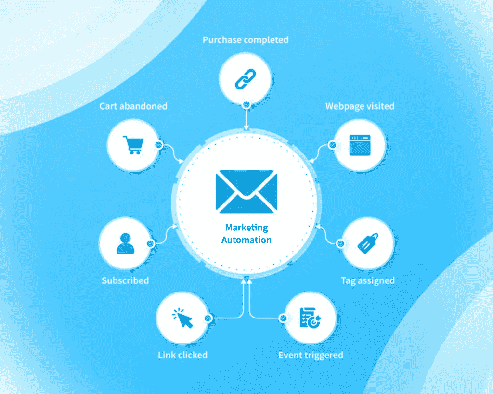
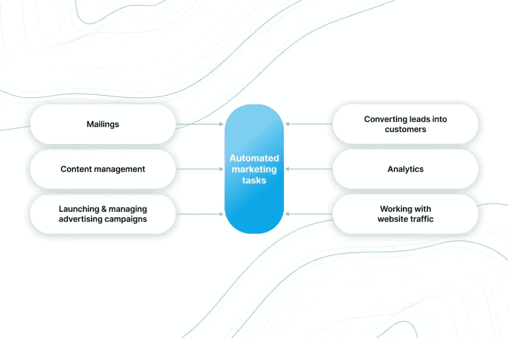
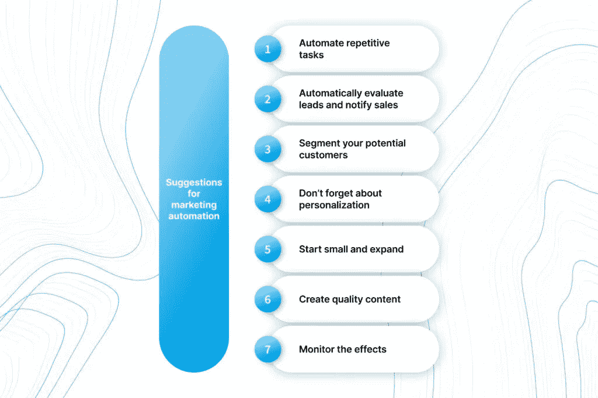
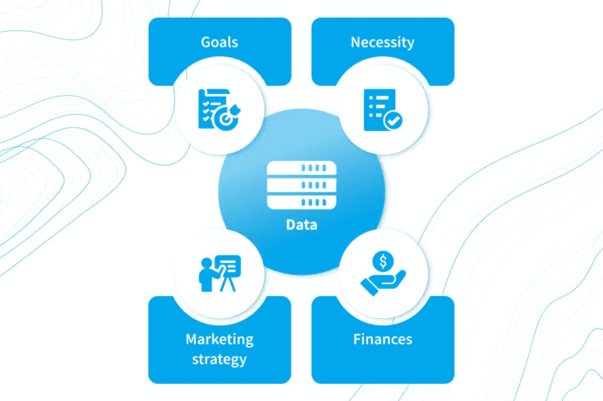

# 营销自动化:好处、应用和使用技巧

> 原文：<https://medium.com/geekculture/marketing-automation-benefits-applications-and-tips-for-use-nix-united-dac368a19721?source=collection_archive---------15----------------------->

数字营销是企业的核心——一套推广商品或服务并获取利润的措施。如果我们说同样的话，但简单地说，它是为企业和目标受众销售利润的能力。根据企业面临的任务，它可能会有所不同。所以，在一家公司，营销专家负责研究竞争对手和消费者；在另一个项目中，他们组织了一次社交媒体广告活动；第三，他们负责业务发展支持。同时，一些营销任务必须仅手动执行，而其他任务可以自动化。收集营销活动绩效指标、生成报告、发送发票、发布到社交媒体等原本需要花费大量时间和精力的工作可以得到简化。你是怎么做到的？欢迎来到自动化[数字营销服务](https://nix-united.com/services/digital-marketing/)的世界。

营销自动化不仅仅是一个好策略；这是新标准。自动化工具可以帮助从电子邮件营销到内容营销和聊天的一切。他们不会取代营销专家，但会帮助节省公司资源，提供详细的分析，支持高水平的销售，吸引新客户，甚至最小化可能的风险。有了这么多营销自动化的好处，难怪企业主希望实施它来最大限度地提高企业生产力。如果你是其中之一，那么你会在这篇文章中找到一些有用的东西。今天，我们将回答营销自动化是什么、它如何帮助您的业务以及您应该使用什么工具等问题，并分享自动化建议。

# 什么是营销自动化，它如何帮助您的业务？

营销自动化的最佳定义是使用软件来简化营销人员的工作，简化业务流程，减少人力的使用，并通过自动化用户旅程和销售漏斗来提高盈利能力。这包括群发邮件，创建在线营销活动，监控网站流量，甚至关注社交网络或定位(SEM)。

例如，您可以设置一个电子邮件提醒，以便在客户的信用卡到期时更新您的账单信息。或者使用社交媒体调度程序，自动转换和转发你最受欢迎的内容。这两个只是营销自动化的例子，因为在这两种情况下，你都不需要使用人工来执行营销任务。机器人全部或部分接管重复性任务，让营销人员有时间处理其他更重要的问题。让我们仔细看看自动化的[数字营销策略](https://nix-united.com/blog/13-foolproof-steps-to-create-a-digital-marketing-strategy/)给企业带来的好处。

# 实施自动化的好处

自动化不仅仅是一种趋势，而是一种提高业务效率和盈利能力的工具。专门的助手服务可以嵌入到各种流程中，从而获得许多营销自动化的好处。下面就让我们来认识一下其中的一些:

# 吸引更多潜在客户

不断增加的销售和营销活动是营销自动化系统最明显的应用。可能会收集社交媒体活动、网站访问、下载、提交表格和其他数据，以更好地吸引潜在客户。通过收集这些信息，营销人员可以评估和优先考虑潜在客户，然后创建自动消息、个性化电子邮件，甚至定制社交媒体帖子。通过这种个性化的消费之旅，公司更有可能吸引更多的潜在客户，并将他们转化为回头客。

# 节省金钱和时间

市场最重要的部分是时间，时间就是金钱。营销自动化的好处之一是，它有助于大大节省这种资源，因为它连续工作。如果您需要收集关于广告活动的数据或关于应用程序的信息，向特定的客户群发送信件，或在一个表中收集行为数据，将需要一个多小时。任何承担类似任务的营销人员都需要休息——项目不要求这样。你可以在营销自动化的帮助下完成所有常见的、重复性的杂务，节省数小时的体力劳动。

# 提高营销工作的有效性

通过将营销自动化与社交媒体、谷歌广告、博客、搜索引擎优化和电子邮件相结合，让更聪明而非更努力地工作成为可能。通过依赖数字营销自动化，营销人员可能会花更多的时间来提出原创想法和策略。此外，它有助于协调管理和营销团队。通过减少重复性营销任务的工作量和提供反馈，可以防止这两个部门之间的差异或沟通不畅。此外，营销自动化软件的高效和准确的工作进一步减少了人为错误的危险。

# 营销自动化的神话

自动化营销是企业前进的一步。然而，自动化只有通过整体方法和深思熟虑的策略才能带来好处。让我们驱散流行的营销自动化误解，不再相信它们。

# 一切都可以被设定和遗忘

即使是最先进的系统也没有掌握在无人监管的情况下独立运行。营销自动化的解决方案可以监控用户行为并给出数据，但它们无法自行做出决策或思考策略。营销活动是由一个能看到全局并知道营销与其他渠道的关系的人策划和创建的。营销自动化解决方案将提高在给定时间内执行的行动数量，但这需要经理的专业知识、时间以及跟踪和纠正的能力。当被问及哪个活动产生了更多或更少的转化率时，受访者会指出是哪个活动以及为什么。

# 自动化只适用于大型企业

中小型企业专用的数字营销自动化工具的市场以前并不大。软件对小企业来说太贵了。但是今天的中小企业可以用足够的自动化技术来运营。在小公司比在大公司更容易实现自动化——与拥有数千名员工的公司相比，拥有不同数据集的部门更少，需要培训的人员也更少。此外，实施云技术更容易，因为公司不需要额外的资源，如设备或技术人员。

# 自动化将解决营销问题

自动化将使营销人员更加有效，并简化他们的工作流程，但它无法全面改善营销。没有有效的策略，营销自动化就不是一个有效的工具。这就像一辆汽车:如果你知道如何驾驶它，并选择一条没有交通堵塞的路线，它将加快从 A 点到 b 点的速度。

# 自动化营销是一种很快就会过去的趋势

信息过载不断渗透我们的现实。因为快速行动是新的货币，所以最好是个性化产品并立即做出反应。营销人员正在学习新的技能，接受创新的数字营销服务，并采取比几年前更多的措施。没有营销自动化解决方案，他们只会淹没在单调中，带着他们为之工作的公司。通信路线和信息源的数量和复杂性都在增长。没有数据丢失的唯一营销方法是自动化。

# 哪些营销任务可以自动化？

数字营销的主要任务如下:

*   增加销售线索生成指标
*   确保与客户的有效沟通
*   广告活动的实施和管理
*   客户数据处理(细分、优惠个性化等。)

可以实施营销自动化系统来简化这些任务。帮助数字营销人员工作的主要工具包括 CRM 系统、聊天机器人、短信和电子邮件简讯、客户数据平台(CDP)、在线连接器、自动发布和广告管理服务。各种功能的良好配置的工作流程将帮助您实现更好的结果。让我们更深入地了解营销自动化工具能做些什么。

首先，是自动化各种邮件。客户打开邮件了吗？点击一个链接？你完成了预定的动作了吗？没有追随者活动跟踪，你不了解你的策略的结果，因此不会得到结果。诸如 PostcardMania、Gunderson Direct、PrintingForLess 等平台不仅能自动处理电子邮件，还能为你提供分析，帮助你一次又一次地提高营销绩效。

请考虑这样一个场景:您希望向订阅您网站的人发送一封欢迎电子邮件。点击“订阅时事通讯”按钮的访问者会马上收到一封介绍信或邮件确认。

# 内容管理

为了有效的推广，在社交网络上的持续活动是很重要的。手动发布帖子是一个漫长而乏味的过程，可能会花费大量时间，尤其是当您通过多个渠道发布帖子或有大量内容时。这里有一些营销自动化工具的例子:Brandwatch、Loomly、Sendible、Iconosquare 和其他一些工具，可以更容易地创建内容并将其发布到社交媒体上。

此外，电子邮件仍然是与客户沟通的最重要渠道之一。电子邮件可用于发送公司新闻、生成个性化报价、告知忠诚度计划以及引发更复杂的互动。要使用这种沟通渠道，使用电子邮件自动化服务是很方便的，例如 RafflePress、Constant Contact、Sendinblue、ConvertKit 等。

# 发起和管理广告活动

营销自动化系统有助于在不同网站上投放有针对性的数字广告，例如，搜索引擎上的上下文广告或社交媒体定向，以及联盟计划等。对于他们中的每一个，都有许多工具可以优化活动的发起、协调和分析。以下是一些营销自动化的例子:

*   自动投标人-上下文广告投标软件(谷歌广告自动投标)
*   分析器——用于分析和受众识别的数据收集(SimilarWeb，社交提及)
*   广告自动测试服务(Kantar Marketplace，SurveyMonkey)
*   广告活动监测平台(Linktrackr、Peerclick)
*   用于将统计数据加载到分析服务的连接器(Adobe Analytics)

# 处理网站流量

也有很多工具来转换网站的流量:线索捕捉器、提供新闻订阅的弹出窗口、个性化内容等等。在营销自动化的帮助下，您可以设置从网站(例如，从已完成的表单)到 CRM 系统的信息传输。接下来，CRM 将自动修复客户通过 web 资源发出的请求。

# 将销售线索转化为客户

用户在订阅时事通讯时会自动进入销售漏斗。现在，潜在客户需要不断预热，这样他们才能回到网站，或者在其他互联网渠道上关注你的报价。你可以使用电子邮件简讯、推送通知、聊天机器人和即时通讯工具与他们交流。

构建系统后，您需要实施分析服务来帮助您跟踪性能。营销自动化工具可以收集、控制和分析来自不同渠道的指标，生成显示所用营销技术成功与否的统计数据和图表，这有助于发现和关注最有效的营销技术，同时不会在无效的营销技术上浪费金钱。此外，这些频繁的报告让你的利益相关者了解信息，并帮助你与他们建立更紧密的联系。

# 营销自动化的建议

一些最佳实践可以帮助您创建自动化来提高转换率、生产率、简化工作流程和改善客户关系。在制定数字营销自动化策略时，请谨记以下几条指导原则:

# 自动化重复性任务

当您评估业务流程的自动化时，寻找对您的团队来说可能很耗时的重复性任务。这可能是更新客户关系管理软件或手动跟踪新的线索。通过自动化这些操作，营销人员可以比人类更快、更有效地完成这些操作，减少犯代价高昂的错误的可能性。

# 自动评估销售线索并通知销售人员

销售线索评分允许您评估他们对产品或服务的兴趣。这种理解有利于普通客户转化为买家。例如，使用营销自动化工具，您可以跟踪潜在客户的消息交互，跟踪他们在您的网站上的行为，并在从社交媒体到电子邮件营销的多个平台上创建接触点。

# 细分你的潜在客户

成功实现营销自动化的最重要策略之一是在销售线索到来时对其进行细分。推荐的开始方式是让你的营销自动化软件根据线索是如何产生的来标记客户。例如，如果他们是在购买了某种产品后添加的，他们可能会对该类别或类似类别的其他产品感兴趣。或者，如果客户注册免费获得一些商品，他们可能会对相关产品或服务感兴趣。

# 不要忘记个性化

个性化是近来最热门的趋势之一。但值得记住的是，个性化导致了许多过程的复杂化:决策、管理和优化。基于您对客户的了解，使用自动化来定制您的通信，使开发以人为中心的内容变得更加简单。

# 从小处着手，然后扩展

当你第一次接触数字营销自动化时，从简单的小任务开始，尤其是那些你的营销团队已经觉得乏味的任务。一旦你理解了如何使用你的自动化软件，你就可以扩展你的自动化营销领域并提高效果。

# 制作高质量的内容

营销自动化工具非常有效地帮助您确定与哪些潜在客户沟通、与他们沟通的最佳时间以及如何传递信息。然而，确保这一进程成功的最重要因素之一是提供高质量的内容。确保你只创作高质量的内容来联系你的观众。

# 监控效果

跟踪结果是数字营销策略的重要组成部分，同时也是最困难和最耗时的任务之一。但是，您必须每月、每季度和每年分析工作流。你的营销自动化需要随着你的业务而改变。

# 如何选择合适的营销自动化软件

最重要的[营销自动化建议](https://nix-united.com/blog/digital-marketing-framework-to-get-started-right-away/)是在实施前提供以下信息:

**你的目标是什么？**您可以自动化哪些流程来节省时间和提高生产率？哪些策略会提高你的投资回报率？一旦你明白了你的目标，创建一个营销预算。如果你的团队还没有营销人员，是时候雇佣一个有能力的专家了。

**你的观众想要什么？**你客户的梦想是什么？他们想要什么？他们缺少什么来提高生活质量？在实施营销自动化之前，描述您的买方角色。

你有什么数据？一个条件或事件使自动化开始运行，所以列出一个你可以使用的数据点列表，并对其采取行动。

这对你的公司有用吗？在做出最终决定之前，先试一试。你需要测试营销自动化软件，看看它的效果如何，是否会对你的公司有利，是否值得投资。检查后，你可以看到所有的缺陷和未来的问题。

你的计划是什么？行动的顺序是将自动化引入业务的一个重要点。想想你的步骤和你将要做的事情，这样你就有足够的时间去测试它们。

你有足够的钱来实现自动化吗？在购买任何东西之前，你的预算是需要牢记的一个重要因素。确保你的软件符合你的需求和预算。

# 跟踪营销自动化成功的基本指标

关键绩效指标(KPI)是衡量营销成功与否的基准。监控它们将有助于您确定集客营销和销售目标的进展。它还允许您在未来改进您的流程和沟通。

KPI 通常与你公司的目标一致。虽然要关注的[数字营销指标](https://nix-united.com/blog/digital-marketing-metrics-to-keep-up-with/)因业务而异，但这里有一些通用指标，可以用于您的营销自动化战略:

**投资回报**或营销支出回报，也称为 ROI，不仅在营销领域，而且在任何商业环境中都是最有价值的指标。这个指标是什么意思？广告投资的有效性。简单来说，投资回报率衡量的是企业从营销支出中获得的利润。

**点击率**是在数字环境下评价一个企业效益的重要指标。它是通过广告的点击次数与总印象数的比率来衡量的。高点击率表明营销活动成功，这意味着许多遇到你的广告的潜在客户会对它感兴趣。这样，你将永远知道哪些广告你应该改变，哪些应该关注，因为它们会集中给你带来线索。

**活跃关注者**是最近与你的品牌有过互动的联系人，而**不活跃关注者**是那些在一段时间内保持不活跃的人。监控两者的数量将有助于你确定你的活动是否有效，并让你知道谁最有可能购买。

当你在社交网络上发布内容时，你最感兴趣的可能是**你工作的有效性**。唯一知道的方法是测量结果。你需要分析一下最高分和最低分的帖子之间的区别。找出为什么有些比其他的更好，例如，如果你的视频获得的评论比照片多，那么针对视频内容可能更好。

对简讯的兴趣**越高，与客户的沟通就越有效。订户的反应表明了他们的兴趣:信件被打开的频率，他们关注链接的活跃程度，以及他们是否进行了购买。开发简讯的努力如果没人看就白费了。这就是为什么你需要跟踪每个电子邮件活动的打开率，并随着时间的推移比较这些率。**

获取客户的**成本**对所有企业都至关重要，但对初创公司尤为重要。这些是将潜在客户转化为买家所需的资金。这包括营销和直销活动的所有成本。如果吸引新客户的成本增加了，那么重新评估吸引新客户的方法或者专注于寻找不同的、更便宜的目标受众可能是值得的。

# 最后的想法

营销自动化不仅仅包括电子邮件营销。它还收集用于分析的数据、个性化广告、发布内容、参与工作以及与客户建立关系。营销自动化承担了常规任务，简化了营销人员的工作，但它不会解决所有营销问题，也不会取代一个人。自动化营销是一套行动和策略，仍然是专家的领域。

为了自动化带来最大的好处，所有服务的协调工作是必要的。许多程序很容易支持与其他服务的集成。还有预先打包的工具包，您可以一次性购买，因此您不必担心它们是如何一起工作的。但是最好的选择是求助于专业开发人员，他们将帮助您创建和配置自动化服务。

营销自动化适用于所有商业领域和任何规模的公司。现代系统价格合理，即使对小型企业也是如此。实施营销自动化是业务发展和获得竞争优势的一个进步。未来是自动化。

*原载于 2022 年 10 月 20 日 https://nix-united.com***。**