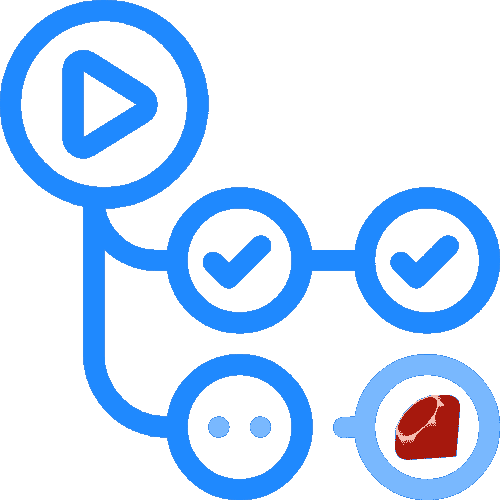

# 将 Travis CI 迁移到 GitHub Actions for Ruby

> 原文：<https://medium.com/geekculture/migrate-travis-ci-to-github-actions-for-ruby-9c2601778a4f?source=collection_archive---------7----------------------->



[GitHub Actions](https://b.remarkabl.org/github-actions) + [Ruby](https://b.remarkabl.org/ruby)

这篇文章讲述了如何为 GitHub 上的 [Ruby](https://b.remarkabl.org/ruby) 项目从 [Travis CI](https://b.remarkabl.org/travis-ci) 迁移到 [GitHub Actions](https://b.remarkabl.org/github-actions) 。

观看 [YouTube 视频](https://youtu.be/QE9mk9Ww7oM?list=PLVgOtoUBG2mdLpj6qT5DXfg5_pGPTDrJZ):

# 特拉维斯·CI

鉴于`.travis.yml`:

# GitHub 操作

首先制作目录`.github/workflows/`:

```
mkdir -p .github/workflows/
```

创造`.github/workflows/build.yml`:

```
touch .github/workflows/build.yml
```

添加运行单个作业的工作流:

要测试多个版本的 Ruby，请更新工作流程:

Ruby 工作流程的灵感来自于[模板](https://github.com/actions/starter-workflows/blob/master/ci/ruby.yml)。

# 工作流程

下面是每个 YAML 场的作用分析。

## 名字

`[name](https://docs.github.com/en/free-pro-team@latest/actions/reference/workflow-syntax-for-github-actions#name)`是工作流名称。这是可选的，您可以随意命名:

## 在

`[on](https://docs.github.com/en/free-pro-team@latest/actions/reference/workflow-syntax-for-github-actions#on)`是触发工作流的事件。在我们的例子中，git `push`触发了我们的工作流。

添加`pull_request`事件:

这和:

## 工作

`[jobs](https://docs.github.com/en/free-pro-team@latest/actions/reference/workflow-syntax-for-github-actions#jobs)`是工作流运行的作业。在我们的示例中，我们有一个名为`build`的作业:

## 连续运行

`[runs-on](https://docs.github.com/en/free-pro-team@latest/actions/reference/workflow-syntax-for-github-actions#jobsjob_idruns-on)`是工作流运行的环境。要指定操作系统版本:

## 战略矩阵

`[strategy.matrix](https://docs.github.com/en/free-pro-team@latest/actions/reference/workflow-syntax-for-github-actions#jobsjob_idstrategymatrix)`是构建矩阵。在我们的例子中，我们为一个单一的 ruby 版本运行一个作业。要为多个 ruby 版本定义作业:

## 步伐

`[steps](https://docs.github.com/en/free-pro-team@latest/actions/reference/workflow-syntax-for-github-actions#jobsjob_idsteps)`是一项工作的任务。在我们的例子中，我们使用 GitHub 动作:

*   [结账](https://github.com/marketplace/actions/checkout)
*   [设置 Ruby](https://github.com/marketplace/actions/setup-ruby-jruby-and-truffleruby)

`actions/checkout`签出存储库，`ruby/setup-ruby`设置 Ruby 环境:

## 步骤.运行

`[steps.run](https://docs.github.com/en/free-pro-team@latest/actions/reference/workflow-syntax-for-github-actions#jobsjob_idstepsrun)`运行命令。由于 [setup-ruby](https://github.com/ruby/setup-ruby) 安装了 [bundler](https://bundler.io/) ，它可以用来执行命令:

## 包封/包围（动词 envelop 的简写）

`[env](https://docs.github.com/en/free-pro-team@latest/actions/reference/workflow-syntax-for-github-actions#jobsjob_idenv)`为整个工作流程或单个步骤设置环境变量。参见`[env](https://docs.github.com/en/free-pro-team@latest/actions/reference/workflow-syntax-for-github-actions#env)`和`[jobs.<job_id>.steps.env](https://docs.github.com/en/free-pro-team@latest/actions/reference/workflow-syntax-for-github-actions#jobsjob_idstepsenv)`。

虽然 [Travis CI 设置了默认的环境变量](https://docs.travis-ci.com/user/environment-variables/#default-environment-variables)，但是我们不必为我们的工作设置`CI=true`，因为`actions/checkout@v2`已经为我们做了:

# 资源

*   [从 Travis CI 迁移到 GitHub 动作](https://docs.github.com/en/free-pro-team@latest/actions/learn-github-actions/migrating-from-travis-ci-to-github-actions)
*   [构建和测试 Ruby](https://docs.github.com/en/actions/guides/building-and-testing-ruby)
*   [拉式请求(PR)示例](https://github.com/remarkablegames/remarkablegames.github.io/pull/2)

[*本文原载于 2021 年 2 月 20 日《remarkablemark.org》。*](https://b.remarkabl.org/2NIuc5s)