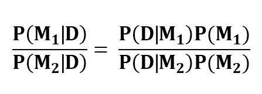
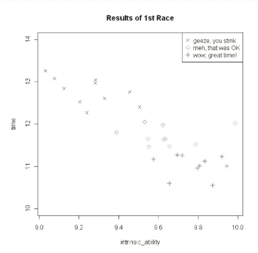
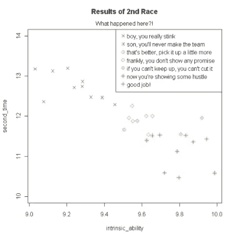

# 模型选择技术——简约和拟合优度

> 原文：<https://medium.com/geekculture/model-selection-techniques-parsimony-goodness-of-fit-fc2f1863ccfd?source=collection_archive---------0----------------------->

Source: [www.vidooly.com](https://vidooly.com/blog/free-images-websites/)

## 介绍

根据定义:

*简约模型是用尽可能少的预测变量实现所需解释或预测水平的模型。*

*统计模型的拟合优度描述了它与一组观察值的拟合程度。*

拟合优度的测量值通常总结了观察值和模型预期值之间的差异。

简约模式背后的想法源于*奥卡姆剃刀*，或*简约法则*(有时在拉丁语中称为 *lex parsimoniae* )。法律规定你不应该使用不必要的“东西”;在简约模型的情况下，那些“东西”就是参数。简约模型具有最优的简约性，或者正好是解释模型所需的正确数量的预测值。

通常有两种评估模型的方法:**基于预测和基于当前数据的拟合优度**。在第一种情况下，我们想知道我们的模型是否充分预测了新数据，在第二种情况下，我们想知道我们的模型是否充分描述了当前数据中的关系。这是两码事。

## 比较模型

通常在拟合优度和简约性之间有一个权衡:低简约性模型(即具有许多参数的模型)往往比高简约性模型具有更好的拟合。这通常不是一件好事，因为添加更多的参数通常会产生一个适合手头数据的好模型，但这个模型可能对预测其他数据集没有用。在简约和吻合度之间找到恰当的平衡是一项挑战。

## 模型选择方法

模型选择可以遵循三种方法:

E **基于预测的估价:**

评估用于预测的模型的最佳方式是交叉验证。简而言之，我们将数据集分成 10 个不同的部分，用其中的 9 个来建立模型，并预测第 10 个数据集的结果。观察值和预测值之间的简单均方差为我们提供了预测准确性的度量。当我们重复这 10 次时，我们计算所有 10 次迭代的均方差，以得出具有标准偏差的一般值。这允许我们再次使用标准统计技术(t 检验或 ANOVA)比较两个模型的预测准确性。

E **基于拟合优度的评估:**

这种方法根据我们使用的模型框架而有所不同。例如，当对误差使用经典高斯模型时，似然比检验对广义加性混合模型有效，但对二项式变量则没有意义。

我们有比较模型的更直观的方法，像阿凯克信息标准(AIC)或贝叶斯信息标准(BIC)来比较两个模型的拟合优度。其他方法如 Mallow 的 Cp 准则、Bayes 因子、最小描述长度(MDL)等。也很受欢迎。

让我们探索其中的一些方法:

**赤池信息标准:**

赤池的信息标准(AIC)比较一组统计模型的质量。如果我们有许多模型要比较，AIC 将选择每一个模型，并从最好到最差对模型进行排序。最好的模型是既不过度拟合也不欠拟合的模型。AIC 的基本公式是:

其中:

*   k 是模型参数的数量(模型中变量的数量加上截距)。
*   对数似然是模型拟合的一种度量。数字越高，拟合度越好。这通常从统计输出中获得。

对于小样本量(n/K < ≈ 40), use the second-order AIC:

Where:

*   n = sample size,
*   K= number of model parameters,
*   Log-likelihood is a measure of model fit.

**贝叶斯信息准则:**

BIC 几乎和 AIC 一样，尽管它倾向于参数较少的模型。BIC 也被称为施瓦兹信息标准或施瓦兹 BIC。BIC 的基本公式是:

这里 n 是样本量；您正在处理的观察数量或数据点数量。k 是模型估计的参数数量，θ是所有参数的集合。L(θ̂)代表在给定数据的情况下，以θ的最大似然值进行评估时，测试模型的似然性。你可以称之为模型的可能性，让一切都符合他们最有利的。

给定任意两个估计模型，具有较低 BIC 值的模型是首选模型。因变量和解释变量数量的无法解释的变化增加了 BIC 的价值。因此，较低的 BIC 意味着更少的解释变量，更好的拟合，或两者兼而有之。尽管 BIC 取决于 n 的大小以及 n 和 k 的相对大小，但它通常比 Akaike 信息标准对自由参数的惩罚力度更大。请务必记住，只有当因变量的数值对于所有要比较的估计值都相同时，才可以使用 BIC 来比较估计模型。与使用 f 检验或似然比检验来比较模型的情况不同，被比较的模型不需要嵌套。

**马洛的 Cₚ准则:**

马洛的 Cₚ准则是一种评估多元回归模型拟合度的方法。然后，该技术将完整模型与具有“p”参数的较小模型进行比较，并确定部分模型留下了多少无法解释的误差。或者，更具体地说，它使用以下公式来估计部分模型的标准化总均方估计值:

其中:

*   SS(Res)ₚ =具有一组 p-1 个解释变量加上截距(常数)的模型的残差平方和，
*   s =σ的估计值

Cₚ值越小越好，因为它表明无法解释的误差越小。具有小 Cₚ和接近 p 的 Cₚ的模型。或者，我们可能希望选择 Cₚ ≤ p 为真的最小模型。

**贝叶斯因子:**

模型选择的贝叶斯方法很简单。先验概率分布用于描述所有未知的不确定性。观察数据后，后验分布提供了与模型选择相关的剩余不确定性的连贯的后数据汇总。然而，这种方法的实际实现通常需要精心定制的先验和新颖的后验计算方法。根据贝叶斯定理，任何模型的后验概率都可以写成:

这里，P(M|D)是给定数据 D 的模型 M 的后验概率，P(D|M)是模型 M 的证据，P(M)是关于模型 M 的先验知识，P(D)是归一化因子。当我们有两个竞争模型时，我们可以比较它们的后验概率:

有了这个等式，我们可以比较两个模型，并采用具有更大模型证据的模型(当我们有无信息先验时)。它类似于似然比检验，但模型不必嵌套。基于贝叶斯因子的模型选择可以近似等于 BIC 模型选择。然而，BIC 不需要先验知识，所以它通常是首选。

**自动模式选择:**

当我们对预测感兴趣时，我们的回归模型实际上有两个目标:1)准确性——R 越大，我们的 y’值就越准确；2)效率——我们不希望模型中有任何不必要的(也许是昂贵的)预测器。为了满足这两个(有些矛盾的)目标，我们需要确定一组具有两个属性的预测因子-所有预测因子都与标准变量相关，并且预测因子彼此之间没有很强的相关性(称为“降低共线性”)。

多年来，有三种常用的程序用于从较大的一组预测值中选择具有这些特征的回归模型。

*   **前向包含:**从具有最高简单相关预测值开始，在每个连续步骤中，添加将产生 R 的最大增加的变量(具有最大偏相关的变量)，当附加的预测值不会显著增加 R 时停止。
*   **向后删除:**从一个完整的模型开始，在连续的步骤中，删除对模型贡献最小的预测值(具有最小显著性/最大回归权重 p 值的预测值)，当删除下一个变量将产生 R 的显著下降时停止(当模型中的所有变量都有贡献时)。
*   **向前逐步选择:**把这个想成向前和向后的组合。从具有最高简单相关预测值开始。对于第二步，添加将使 R 增加最多的变量(具有最大偏差值的变量，但仅当 R 增加显著时)。每个连续的步骤都有两个部分:如果模型中的任何预测因子都不起作用，则丢弃它(如果不止一个，则丢弃贡献最小的那个，具有最大 p 值的那个)，2)如果模型中的所有变量都起作用，则添加将产生最大 R 增加的那个变量(具有最大偏相关，但仅当 R 变化显著时)。当模型中的所有变量都起作用时，以及当不存在将显著增加 R 的额外预测因子时，停止。

就我个人而言，我不提倡使用这些技术，因为它们有很多缺点:

*   它们产生的 R 平方值严重偏高。
*   打印输出上每个变量旁边引用的 f 检验和卡方检验不具有声称的分布。
*   这些方法产生的效应和预测值的置信区间非常窄。
*   在存在共线性的情况下，这些问题很严重。
*   这些给出了需要收缩的有偏回归系数(剩余变量的系数太大了)
*   在许多情况下，我们从不同的起点开始，逐步选择可能会返回一个完全不同的模型。这些方法很不稳定。

让我们举一个例子来看看为什么自动化模型选择可能不是一个好的选择。

想象一下，一个高中田径教练在选拔的第一天。三十个孩子出现了。这些孩子有一些潜在的内在能力，无论是教练还是其他人都无法直接接触到。结果，教练做了他唯一能做的事，让他们都跑 100 米。《时代》大概是对他们内在能力的一种衡量，并被如此看待。然而，它们是概率性的；一部分人做得有多好是基于他们的实际能力，另一部分是随机的。想象真实情况如下:

下图显示了第一场比赛的结果以及教练对孩子们的评价。

请注意，按照比赛时间划分孩子会使他们的内在能力有所重叠——这一点至关重要。在表扬了一些人，对另一些人大喊大叫(教练们往往会这么做)之后，他让他们再次跑步。以下是第二场比赛教练的反应结果(根据上述相同模型模拟):

请注意，他们的内在能力是相同的，但时间相对于第一场比赛有所波动。从教练的角度来看，那些他大喊大叫的人往往会提高，而那些他表扬的人往往会做得更差，尽管实际上回归到平均值是一个简单的数学结果，因为教练正在根据部分随机的测量为球队选择运动员。

现在，这与自动化(例如，逐步)模型选择技术有什么关系？

开发和确认基于相同数据集的模型有时被称为数据挖掘。尽管变量之间存在一些潜在的关系，并且更强的关系预计会产生更强的得分(例如，更高的 t 统计)，但这些是随机变量，实现的值包含误差。因此，当我们基于具有更高(或更低)的实现值来选择变量时，它们可能是因为其潜在的真实值、误差或两者都有。如果我们以这种方式进行，我们会像教练在第二场比赛后一样惊讶。无论我们是基于高 t-统计量还是低相关性来选择变量，都是如此。

## 结论

尽管在自动模型选择领域已经发生了许多发展，例如*天秤座*和*皮卡雷*，但是仍然存在许多用于选择最佳模型的统计和直观方法。

*让我们一起探索吧！*

**参考:**[statisticshowto.com](https://www.statisticshowto.com/)