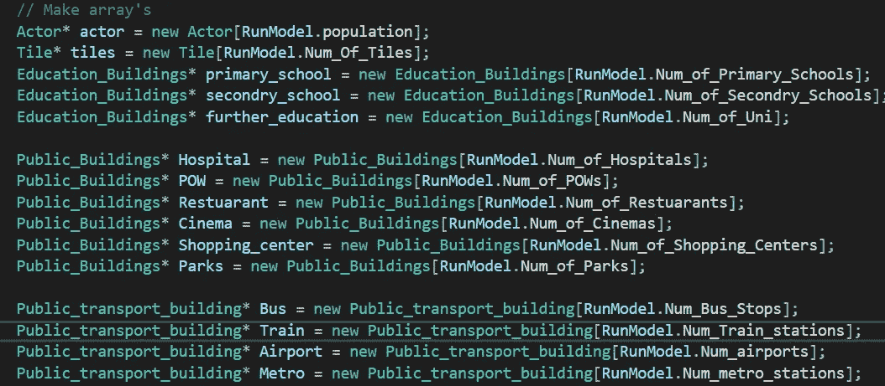

# 模拟现代疫情——开发基于主体的模型

> 原文：<https://medium.com/geekculture/modelling-a-modern-day-pandemic-developing-an-agent-based-model-7d4623e5da8e?source=collection_archive---------53----------------------->

基于主体的建模是在许多主要的流行病局部模型中使用的技术，但也可以在经济学中找到，它们在网络理论中大量使用。那么你如何着手建造一个呢



开发一个 ABM 是一个相当漫长的任务，所以我将把它分解成多个小文章。在本文中，我们将讨论代理的发展，这是基于代理的模型的许多核心方面之一

虽然我并不期望我们在本文中开发一个完整的代理类，但是通过尝试一个基本的代理类，这篇文章将有希望为您提供正确的方向

# 构建代理类

基于代理的模型需要速度快，同时还要处理成千上万的对象，同时还要有内存效率，这使得 C++成为构建模型的理想语言。

我们首先需要创建两种类型的文件:头文件，在这里我们将声明变量、类中的方法、库以及项目中任何其他需要的文件；和一个 cpp 文件，这将用于编写方法的所有逻辑。

# Agent.h

```
class Agent 
{};
```

# Agent.cpp

```
#include Agent.h
```

我们现在已经建立了一个基本的头文件和 cpp 文件。

为了给代理添加功能，我们现在必须添加变量和方法。包含在代理类中的大多数变量都是私有变量，这是因为我们不会意外地编写一段代码来改变变量，而实际上我们并不想改变它，这使得修复 bug 变得更加容易。

重要变量:

*   位置:x 和 y
*   感染状态:易感染、已感染、已删除
*   传染性:是或否
*   被感染的机会
*   康复的机会
*   死亡的可能性
*   一个特工被感染多久了

随着我们的模型变得越来越复杂，我们显然可以添加更多的变量，但是对于一个非常基本的模型，这就是我们所需要的

```
class Agent 
{
public:
    enum infection_status
    {
        suceptible = 0, infected, removed, dead
    }; int infection_length = 0;private:
    int m_x = 0;
    int m_y = 0; infection_status m_stage = suceptible;
    bool m_infectious = false; double m_infection_chance = 0;
    double m_recovery_chance = 0;
    double m_dying_chance = 0;};
```

*   int 是整数
*   bool 是一个布尔值，所以它要么为真，要么为假
*   double 表示双精度浮点，本质上它是一个 64 位浮点，允许我们使用小数
*   枚举允许我们将整数值赋给命名的常量

虽然将这些变量作为私有变量存储在类中很好，但是如果我们想要编辑它们，我们的一些方法就会派上用场。

随着模型的发展，这些方法中的一些会改变，但是为了本文的目的，我们只需要其中的一些。所以我们在代理类中需要的方法是:

*   更新位置
*   更新感染状态
*   传染性检查
*   设置感染几率
*   设置恢复机会
*   设置死亡机会

```
class Agent 
{
public:
    enum infection_status
    {
        suceptible = 0, infected, removed, dead
    }; int infection_length = 0;private:
    int m_x = 0;
    int m_y = 0; infection_status m_stage = suceptible;
    bool m_infectious = false; double m_infection_chance = 0;
    double m_recovery_chance = 0;
    double m_dying_chance = 0;public:
    void update_location(int x_loc, int y_loc);
    void update_infec_stat(infection_status stage);

    bool check_infectious();
    bool check_recovered();
    bool check_dead(); void set_infection_chance(double chance);
    void set_recovery_chance(double chance);
    void set_dying_chance(double chance);};
```

*   void 意味着函数没有返回值

现在我们已经在头文件中声明了函数，我们可以向代理类添加一些逻辑，为此我们必须打开 cpp 文件。

```
#include Agent.hvoid Agent::update_location(int x_Loc, int y_Loc)
{
    m_x = x_Loc;
    m_y = y_Loc;
}void Agent::update_infec_stat(infection_status stage)
{
    m_stage = stage;
}void Agent::set_infection_chance(double chance)
{
    m_infection_chance = chance;
}void Agent::set_recovery_chance(double chance)
{
    m_recovery_chance = chance;
}void Agent::set_dying_chance(double chance)
{
    m_dying_chance = chance;
}
```

你可能已经注意到，我没有写一些方法，这是因为它需要我们添加随机库，向量库，时间库和字符串库到头文件，所以让我们这样做。我们还应该创建一个私有方法，为我们做所有随机的事情

```
#include <random>
#include <vector>
#include <string>
#include <chrono>class Agent 
{
public:
    enum infection_status
    {
        suceptible = 0, infected, removed, dead
    }; int infection_length = 0;private:
    int m_x = 0;
    int m_y = 0; infection_status m_stage = suceptible;
    bool m_infectious = false;double m_infection_chance = 0;
    double m_recovery_chance = 0;
    double m_dying_chance = 0;private:
    std::vector<unsigned int> Discrete_distribution(std::vector<double>& weights, unsigned int runs);public:
    void update_location(int x_loc, int y_loc);
    void update_infec_stat(infection_status stage);

    bool check_infectious();
    bool check_recovered(); void set_infection_chance(double chance);
    void set_recovery_chance(double chance);
    void set_dying_chance(double chance);};
```

*   一个无符号的 int 会把-10 当作 10，它允许我们使用更大的数字

我们对这些使用随机函数，因为它们是涉及概率的元素，这将使模型比微分方程系统模型表现得更真实。

```
std::vector<unsigned int> Agent::Discrete_distribution(std::vector<double>& weights, unsigned int runs)
{
    std::vector<unsigned int> Results;

    time_t CT = time(NULL); //CT = CurrentTime
    char str[26];
    ctime_s(str, sizeof str, &CT);
    std::string time = str; std::seed_seq stime (time.begin(), time.end()); for (auto num : weights)
    {
        if (num < 0 || num > 100)
        {
            weights.clear();
            for (int i = 0; i < weights.size(); i++)
            {
                weights.push_back((double)1 / (double)weights.size());
            }
            break;
        }
    }

    std::discrete_distribution<int> dist(std::begin(weights),     std::end(weights));
    std::mt19937 gen;
    gen.seed(stime); for (unsigned int i = 0; i < runs; i++)
    {
        unsigned int result = dist(gen);
        Results.push_back(result); }
    return Results;
}
```

现在我们已经设置了生成随机数的函数，我们可以将逻辑添加到这些检查方法中。

```
bool Agent::check_infectious()
{
   if (infection_length < get_min_period() || infection_length > get_max_period())
    {
        return false;
    } double prob = ((double)infection_length - 10080.0) / (20160.0 - 10080.0);

    std::vector<double> weight_vector = { prob, 1 - prob };
    if (Agent::Discrete_distribution(weight_vector, 1)[0] == 0)
    {
        m_infectious = true;
        return true;
    }
    return false;bool Agent::check_recovered()
{
    std::vector<double> weight_vector = { m_recovery_chance, 1 - m_recovery_chance }; if (Agent::Discrete_distribution(weight_vector, 1)[0] == 0)
    {
        m_stage = removed;
        m_infectious = false;
        return true;
    }
    return false;
}bool Agent::check_dead()
{
    std::vector<double> weight_vector = { m_dying_chance, 1 - m_dying_chance }; if (Agent::Discrete_distribution(weight_vector, 1)[0] == 0)
    {
        m_stage = dead;
        m_infectious = false;
        return true;
    }
    return false;
```

我们需要向代理类添加更多的功能，但是这已经超出了本文的范围，或者对于一个基本的代理类来说是不必要的。你可以在这里找到一个代理类的完整例子[https://github.com/bptigg/CovidSim/tree/master/Source](https://github.com/bptigg/CovidSim/tree/master/Source)请记住，这是一个基于全功能代理的模型

如果你打算开发一个基于代理的模型，我希望这篇文章能为你指明正确的方向。在下一篇文章中，我们将介绍如何使用一个控制器 ai 来控制模型中的所有代理。