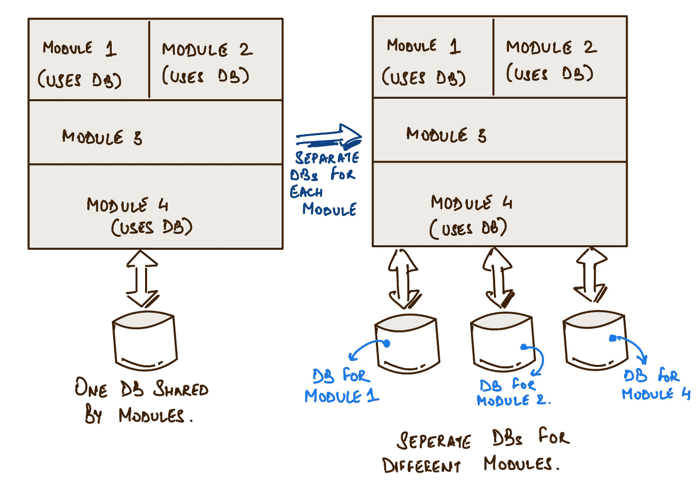
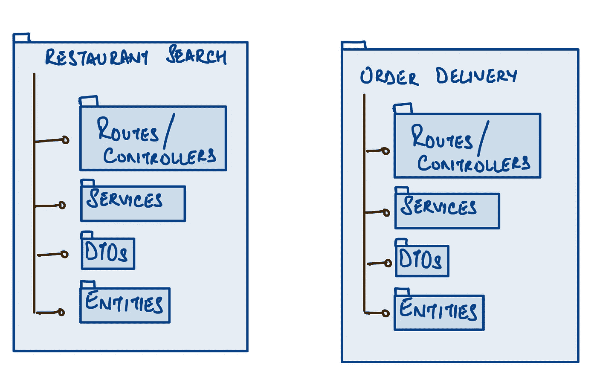
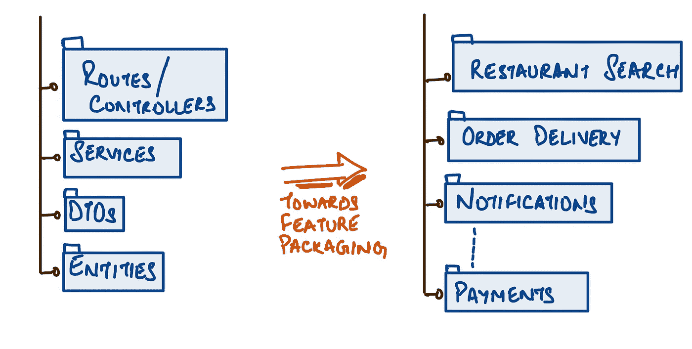

# 整体服务与微服务:从团队的角度

> 原文：<https://medium.com/geekculture/monolith-vs-microservices-from-the-teams-perspective-cfed51231f05?source=collection_archive---------26----------------------->

## 在考虑整体服务和微服务时，一些首要考虑因素是可伸缩性、独立可部署性、增强的可发布性和可维护性。然而，只考虑应用程序而不考虑选择将如何影响团队，就像只看到硬币的一面。

Photo by [David Guliciuc](https://unsplash.com/@hypefilms?utm_source=medium&utm_medium=referral) on [Unsplash](https://unsplash.com?utm_source=medium&utm_medium=referral)

正如一个“好的”应用程序更容易扩展、维护、发布和测试，能够为更多的最终用户服务(通过处理更多的用户请求)，一个“好的”团队是这类应用程序成功背后的推动力。虽然一个结构良好的应用程序/服务生态系统能够更快地发布功能，让用户不必等待“太长时间”，从而缩短*上市时间，*团队才是实现这一目标的真正**英雄**。

# 词汇表

让我们一起来看看这篇文章中用到的一些术语。如果你已经熟悉它们，直接跳到 ***注意事项部分。***

## **模块化整体结构:**

*   当在本文中提到一个 *monolith* 时，我将提到一个“单进程部署”，即:代码作为单个进程部署的系统。对于规模、弹性等，这一过程可能有多个实例。但是从概念上讲，整个代码是作为一个单独的进程打包和部署的。
*   通常，我们只从代码的角度考虑模块化。然而，拥有模块化代码只是工作的一半。底层的持久性也必须模块化。所以，当你把你的整体结构分成模块时，也要有一个分解的数据库。尽量不要让外键引用另一个模块的表，即使这似乎是最明智的做法。
*   一开始有这么多数据库似乎有点矫枉过正，有这种担心是有道理的。但是您甚至可以利用*模式*的力量，现在几乎所有的数据库都提供这种能力，并且为不同的模块提供单独的模式。

Modular Monolith with decomposed modular Databases

> *与稍后将数据分离到单独的数据库(由相应的微服务拥有)并处理繁琐的迁移相比，将代码分离到微服务中仍然相对容易。DB 迁移是一个*【难题】*。*

## **基于功能的包装:**

首先，如果你不熟悉[软件打包原则](http://butunclebob.com/ArticleS.UncleBob.PrinciplesOfOod)，这是一个很好的开始并理解它们背后的基本概念的地方。它们和坚实的原则一样，是编写和构建代码的基础。

“逐层打包”通常是我们都知道并且在项目中使用最广泛的。如果说，我们正在开发一个 API 服务，我们将尝试通过*层来分离包。*因此，所有与*路由*相关的代码都将进入一个*路由*目录，所有与*服务(或适配器)*相关的代码都将落入臭名昭著的*服务*包中，然后该模式继续使用*实体*和*存储库*等等。

An example of code structure using package-by-layer packaging style

虽然最容易开始使用*，但是逐层打包*是一个维护的地狱，特别是随着项目的增长，越来越多的人开始做贡献，越来越多的特性得到开发。想象一下，浏览整个*实体*包，找出真正需要变更的相关实体。现在想象一下为所有这样的*层*这样做，想象一下所有的开发人员和团队都这样做，这将会带来的痛苦。简而言之，代码的*可发现性*非常低。

另一方面，使用包来反映特性集。它试图将与单个特性相关的所有项目(并且 ***仅*** 该特性)放入一个简单的目录/包中。这导致了具有高内聚性和模块化的包，包之间的耦合很少甚至没有。在特性包中，你可能仍然有分层的架构，如下所示，但是一个好的北极星是采用一个更加基于领域驱动设计的打包结构。例如，如果“食品配送应用程序”具有“餐厅搜索”&“配送”功能，则它们中的每一个都将以包含相关层/子包的功能包结束，如下所示:

Code structure using package-by-feature style of packaging

每个特性团队都可以独立地发展和维护他们的特性包，同时将冲突降到最低，并集中精力寻找合适的代码文件进行修改。

From package by layer towards package by feature code structure

## **跨职能团队:**

*   大多数传统组织都将他们的团队建立在*职能* *筒仓*中。一个单独的营销团队将负责对各种产品线/功能进行所有的市场评估和竞争对手研究。他们将把这个信息传递给产品团队，这个团队专门负责把它制作成各种功能或产品套件。然后，通过一个宏大的规划会议，这些特征史诗将被传递给工程团队去执行。这种将*信息模型*从一个职能部门传递到另一个职能部门的方式是如此迷人，以至于我开始称他们为 ***接力职能团队*** *，*类似于接力赛，一名选手跑完一程后，将接力棒传给下一名选手，让他们尽自己的一份力量。在大型组织中，单个功能可能由多个团队组成，但是，从概念上讲，信息模型仍然会从一个功能(作为一个整体)流向另一个功能。
*   当我们想到跨职能团队时，最常见的模型是工程团队。我们会想到 devops。我们认为让开发人员、架构师和 QA 作为同一个团队的一部分，遵循相同的方法，一起编排各种仪式。
*   那很好。此外，我们还应该努力让其他业务部门(如产品、营销、销售等)的代表加入团队。想象一下，如果营销人员确切地知道正在做什么，并能同时进行市场适合度分析。想象一下，销售人员提前给出反馈，哪些会受到客户的欢迎，哪些不会。
*   一开始地方就有这样的团队很难，但完全说得过去。这样的团队需要一些汗水、经验和来自用户的反馈来得到正确的组合。但核心思想是在整个旅程中让你的团队牢记这一点，而不是对你所拥有的感到“舒服”。

# 决定整体服务还是微服务时的考虑因素:

在我们深入考虑这些因素之前，有必要停下来，理解一下团队的效率到底意味着什么。虽然向现有团队添加更多人员的表面想法可能看起来很合理，有助于提高整体效率，但是行业中有很好的证据表明，添加更多人员并不真正意味着项目将更快交付。(如果你还没有读过，那就值得一读《人月神话》( T12 ),里面有关于这个主题的精华文章。)

因此，在考虑可伸缩性的同时，也要考虑如何在现有团队的能力和贡献能力方面进行扩展，而不仅仅是规模。

在上述前提下，我们来探讨各种考虑因素如何影响整体服务与微服务的选择。此外，让我们同时探索一些中间地带**。**

*   *在 mono-repo 代码库中，一个结构良好的模块化整体也可以有效地扩展团队。你并不明确需要一个基于多 repo 微服务的设置来做到这一点。去过那里，做过那个！然而，关键是“结构良好的模块化整体，围绕关键子领域/业务功能进行功能打包”(我知道，这很拗口🙂).*
*   *不要忘记考虑正确的团队组成。它在项目的整体架构和结构中扮演着比你想象的更重要的角色，尤其是在长期的项目中。(过于简化的[康威定律](https://en.wikipedia.org/wiki/Conway%27s_law))*
*   *如果本质上你有*接力职能团队*在筒仓中工作，那么你最好有一个由单一回购支持的模块化整体。由同一个团队维护的不同代码仓库可能不是令人兴奋的开销。一些组织能够很好地支持这一点。但是需要团队足够的成熟。然而，随着团队规模的增长超过一个阈值，开销会变得难以承受(由于缺乏对阈值的实际研究，没有引用数字。有时智慧先于科学和统计😉)*
*   *然而，如果有跨职能团队，即由产品、工程、营销等组成的团队，并且每个团队负责单独的子领域或产品(如果可以的话，还有子产品或功能)，那么围绕微服务的解决方案以及围绕明确的代码回购的代码拆分(例如，每个微服务一个回购是一个流行的选择)可能会为您创造奇迹。然而，团队的成熟度也很重要。*
*   *当产品处于萌芽阶段时，领域只是在发展，并且经常被误解。如果没有清晰的边界环境，过早地建模微服务可能弊大于利。我相信你已经听说过团队不得不合并服务并重新思考边界的恐怖故事。不是一个快乐的地方。*
*   *如果这是团队第一次涉足微服务领域，最好从开发模块化 mono-repo 代码库的功能团队开始。后来，随着需求的增加和团队信心的增强，又分成了微服务。*
*   *功能团队给予工程和其他业务功能最大的信心。相对来说，更容易理解的是考虑哪一个特性比另一个需要更多的关注，从而允许你一次关注特定的团队。此外，该方法有助于为各个团队设计定制的解决方案。*
*   *你也可以走库/包的路线，将 monolith 中的模块放入单独的代码库中，生成各自的包。此后，将它们组合在一起以作为单个过程来展开整料。包的回购分离(建议基于业务能力或“有界上下文”的分离)帮助不同的团队只担心对他们重要的代码。但是请记住将“*打包原则*”牢记在心，否则不必要的依赖可能会减慢速度，而不是有所帮助。*
*   *在使用微服务时，错误识别的有界上下文也会导致可释放性阻抗。这些通常被称为*、【分布式独石】*。从结构不良的整体中恢复可能比从结构不良的迷宫式微服务中恢复更容易。*

# *摘要*

**【视情况而定】*。就像软件中的大多数事情一样，上下文是关键。一种方法可能对一个团队非常有用，但对另一个团队可能就不一定了。*

*当有疑问时，试着从一块巨石开始。尤其是在初创企业或试图探索新产品的可行性时。如果你不清楚微服务实际上会为你解决什么问题，也要坚持使用 monolith。使用基于特性的打包，这将有助于团队在代码库增长时更好地维护它。加入使用指标和监控。观察。最终用户对应用的使用才是真正的事实。看看是否有必要拆分由单个跨职能团队领导的功能。等一下再去微服务。你可能永远也不会需要它们。
如果需要的话，与典型的 3 层架构模式相比，您的基于功能的打包 mono repo 可以更容易地进一步分解为微服务。特性打包帮助您的团队更多地考虑业务能力(有限的上下文),无论如何，这些都是微服务的构建块。*

***奖励**:了解更多关于[清洁架构](https://blog.cleancoder.com/uncle-bob/2012/08/13/the-clean-architecture.html)、[六边形架构](https://netflixtechblog.com/ready-for-changes-with-hexagonal-architecture-b315ec967749)和[洋葱架构](https://jeffreypalermo.com/2008/07/the-onion-architecture-part-1/)的信息，通过将领域驱动设计融入其中，将基于功能的封装提升到一个新的水平。*