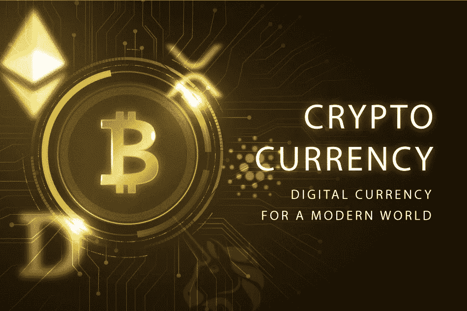

# 加密货币世界的 30 多个重要术语。

> 原文：<https://medium.com/geekculture/more-than-30-important-terms-of-the-cryptocurrency-world-ebd2a9519aa3?source=collection_archive---------18----------------------->

为了帮助您轻松理解加密货币概念，我们决定准备一份数字货币和加密货币术语的词汇表。在本文中，数字货币术语以简单的语言供您使用，我们将定期更新该术语表。如果您在我们的列表中找不到某个术语，并且您认为它在我们的词汇表中是空的，请在评论部分告诉我们。

**数字货币的基本术语**

为了更好地了解加密货币的世界，最好先熟悉一下数字货币最基本的术语。

密码系统

对信息进行编码的过程称为密码学。加密是一种使用代码保护信息和通信的方法；以便只有有权访问这些信息的人才能阅读和处理这些信息。

加密货币或加密货币是一种以加密和数字信息形式存在的货币，其运作独立于任何银行或中央机构。密码术使用复杂的数学来管理、创建和转移资金。

白皮书

白皮书或性能报告是一份报告，其中开发人员详细说明了他们的设计或系统。2008 年，中本聪也发布了比特币白皮书。要了解更多关于比特币表现报告的内容，可以参考白皮书《什么是比特币？看吧。

区块链

区块链是由区块组成的。每个块维护所有事务的历史数据库，直到该块被填满。记录在每个块中的记录是永久的和不可变的。

区块高度

区块链中所需块之前的总块数称为块高。

方块探测器

Blockfinder 是一个加密货币搜索引擎，允许用户查找有关交易、地址等信息。

使用这个搜索引擎，用户可以分别阅读每个区块的内容、交易状态及其历史。

对等 2 对等

在对等(P2P)网络中，两台或多台计算机(或人)相互通信，无需第三方作为中介。

俚语

我们在下一节回顾最常用的数字货币术语。

矿工

挖矿机是基于其计算能力提取比特币或特定加密货币的计算机或设备。

交换

交换是使用最广泛的数字货币术语之一。交易所是一个平台，通过它你可以买卖比特币和其他加密货币，并在彼此之间和人与人之间(在线)交换这些货币。交易所提供的加密货币类型和收费各不相同。

购买数字货币，可以使用币安这样的外汇，也可以使用 Valex 这样的国内交易所(要使用外汇，要考虑制裁的问题和关闭伊朗用户账户的可能性)。

鲸

“鲸鱼”这个词用来形容那些交易量非常大、在市场上拥有大量资产的人。墙进行的大量交易影响了市场上数字货币的价格。一般来说，Wall 人使用的策略对数字货币市场的状态有很大的影响，可以是积极的，也可以是消极的。

市场价值

市值或市值是通过将相关数字货币的当前价格乘以流通货币的总数而获得的。加密货币按市值排名。您可以在 coinmarketcap 网站上查看所需数字货币的市场价值。例如，目前比特币的市值约为 2200 亿美元，在全球加密货币中排名第一。

HODL(长期持有数字货币)

HODL 一词实际上是英语中 HOLD 一词的同义词。这个词是在比特币对话网站的一名用户发布消息“我在抱抱”时创造的。

事实上，这位用户错误地将单词 HOLD 写成了 HODL，这是一个拼写错误。但是他故意没有纠正这个错误。一段时间后，术语 Hodel 在加密社区中变得流行起来。所以全球密码界长期持有比特币和其他加密货币的称为 Hodel。

**硬币常用术语**

听到数字货币这个词后你想到的第一个硬币就是比特币。但是除了比特币，还有一些其他的术语，我们下面会介绍。

比特币

第一种也是最著名的加密货币是比特币，它以去中心化的方式工作，没有人能控制它。比特币于 2009 年由一个化名为“中本聪”的不知名的人或组织创立。

比特币

每种加密货币都有一个 3 个字母的符号，用于在同等平台上识别它。BTC 代表比特币。

中本聪

中本聪是比特币的创造者。没有人知道中本聪是谁，他的身份也还没有暴露。

聪史

比特币的最小单位叫做 Satoshi。每个比特币可以分成一亿个单位，每个 satoshi 是一个比特币的一亿分之一。代币

代币是没有自己的区块链，工作在其他加密货币平台上的加密货币；比如系绳。

阿尔特科恩

替代币是继比特币之后产生的加密货币。

硬币是独立运行的加密货币，有自己的区块链；比如比特币和以太坊。

固定价格的硬币

在加密货币的世界中，有一些硬币的价值相当于一种固定资产，如美元。这种硬币被称为稳定硬币。例如，像系绳一样稳定的硬币的价格是一美元。创造稳定货币的目的是减少市场波动，与其他没有稳定价格的加密货币不同，它们可以保护交易者的资本。

ICO 首次发行硬币

数字货币相关项目的一种融资方式是首次发行硬币或 ICO。在这种方法中，投资者可以使用比特币等其他加密货币或美元等法定货币投资于所需的项目，并从相关公司获得与该项目相关的令牌。在项目启动和出售项目代币之前，先发行硬币。专业术语

在本节中，我们用简单的语言介绍数字货币的最专业术语。

硬叉子

硬分叉是加密货币协议的根本变化；把它变成两种不同的货币。在硬分叉中，新版本与以前的版本不兼容。这一领域一个明显的例子是比特币现金(比特币叉子)，与比特币相比，应用于它的变化之一是块的体积增加。

当一些矿商决定为有问题的加密货币创建新规则时，就产生了一个硬分叉。认同这些改变的人加入新的分叉。不同意的人可以用之前的版本。

软叉

在一个软分叉中，对正在讨论的加密协议做了一个小的改变，它与以前的版本兼容。

混杂

用非常简单的语言来说，散列是从输入信息中获得的输出。哈希算法接受任意大小的输入数据，并产生固定大小的输出。

哈希可以被称为“数字指纹”，它是通过“哈希函数”处理信息而创建的。这个过程是线性的，单向的。这意味着原始数据(输入信息)无法通过生成的哈希获得(就像通过指纹一样，我们无法想象一个手指并创建它)。比特币哈希长度为 64 位，从零开始。

哈希速率

哈希率说明你的电脑能出多少(挖矿速度)，性能有多好。哈希速率是选择矿机最重要的因素之一。

分散

去中心化或许是比特币和其他加密货币最重要的特征。由于没有中央权威，加密货币比法定货币(美元、里亚尔等)有独特的优势。)等支付方式。这些优势中最重要的一个就是货币供应量有限，可以随着时间的推移增加加密货币的价值(比如比特币总数为 2100 万；随着时间的推移，这个固定的数字会导致比特币的价格上涨)。

随着数字钱包的使用，接收、存储和发送加密货币成为可能。每个钱包都包含一个私钥，让你可以使用比特币和其他加密货币。

中央分类帐

术语中央分类账是指以有组织的方式维护与交易和其他类似项目相关的数据的组织。

分布式分类帐

分布式分类账的通用术语是一种大规模记录与交易和资金数量有关的所有信息的系统。这种数字办公室分发信息的方法增加了信息的安全性，降低了被黑客攻击的风险。

例如，区块链是一种分布式分类账，最初是为了跟踪比特币交易而创建的。

区块链是特定加密货币所有交易的数字账本。这个区块链由通过加密签名相互连接的单个块组成。每完成一个块，它就作为一个新块被添加到区块链中。

区块链被反复复制并储存在世界各地成千上万的电脑上。由于在特定位置不存在主版本，区块链被认为是一种分散的技术，所有版本都是平等的。

双重支出

如果用户试图同时在两个不同的地方消费相同的加密货币，他们使用术语双消费或双消费。

51%的攻击

如果一个人或一群人控制了区块链网络的一半以上，就有可能破坏该网络(负面影响，如停止采矿、重复支出或改变交易)。

**结论**

本文的目的是帮助您更容易地理解加密货币的表达方式，并更快地了解数字市场。本加密词汇表中提到的单词是加密领域的重要组成部分。