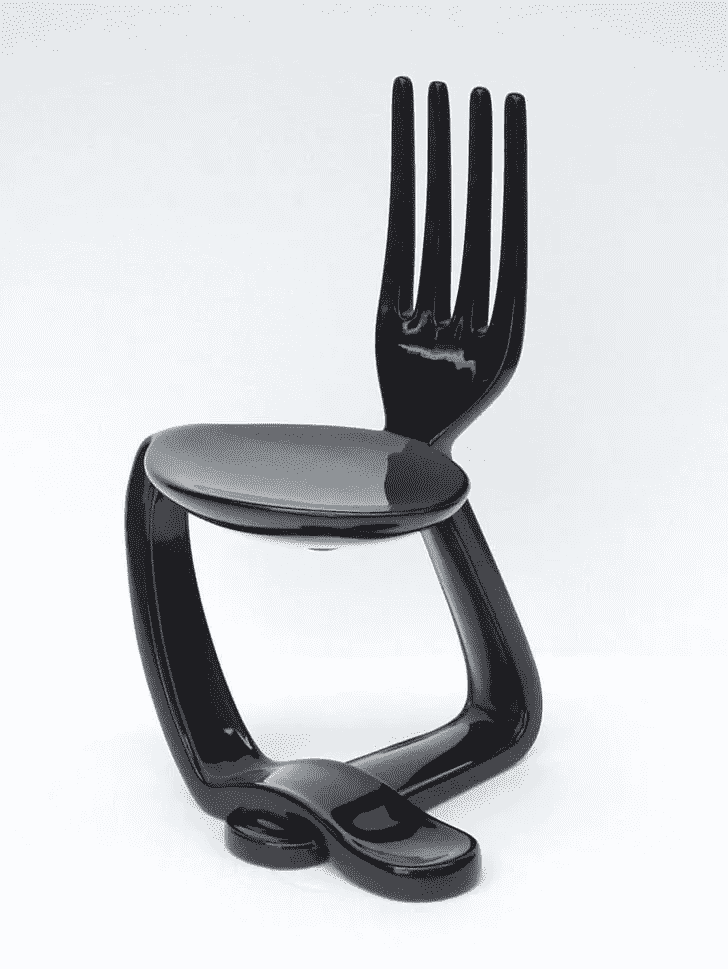

# 不仅仅是设计:在技术人工制品中体现价值的启示

> 原文：<https://medium.com/geekculture/more-than-just-design-affordances-as-embodying-value-in-technological-artifacts-354f6b20db7?source=collection_archive---------13----------------------->

*这篇文章最初出现在《3 夸克日报》的周一杂志上(这里见***)。**

*人们很自然地认为，技术制品具有工具价值。也就是说，给定技术的价值在于我们使用它的各种方式，不多也不少。例如，锤子的价值在于我们能够利用它把钉子敲进东西里。汽车是有价值的，因为我们可以用它们以最少的体力从一个地方到达另一个地方。这种看待技术的方式有着巨大的直觉吸引力，但我认为它最终无法令人信服。更具体地说，我想说的是，技术人工制品能够体现价值。有些人认为这个值应该根据工件的 [*设计属性*](https://link.springer.com/chapter/10.1007/978-94-007-7914-3_7) 来计算，但是我将采取不同的方法。我将建议工件可以基于它们的*启示*来体现价值。*

*然而，在这样做之前，我需要说服你，技术的工具观点是错误的。虽然有些科技制品可能仅仅是有工具价值，但其他的显然没有，所以有两种方式来看待这个问题。首先，反思一下技术只是等待我们使用的工具，而是我们现实体验中的 [*中介*](https://www.psupress.org/books/titles/0-271-02539-5.html) 。技术制品不再简单地“在那里”等着被使用，而是我们是谁的一部分(或者至少，我们正在成为谁)。可穿戴技术(如健身追踪器或智能手表)为我们提供了一系列生物识别信息。这些信息改变了我们体验自我和周围世界的方式。在这些信息的狂轰滥炸下，我们可能会使用这样的技术来迫使自己锻炼(苹果允许你获得更新，直接传送到你的手表，当你的朋友锻炼时。这是否会激起那些看到自己的朋友跑完马拉松，而自己却整天坐在沙发上吃 Ritter Sport 的人的怨恨，这是一个悬而未决的问题。)，或者我们可以使用它来了解最新消息(通过启用智能通知)。不管是哪种情况，关键是这些技术不仅仅是向我们揭示了世界的“本来面目”，而是打开了世界的新的一面，从而调节了我们的体验。*

*第二，我们可以看看科技产品的设计。例如，考虑减速带。减速带可以说体现了安全的价值，因为它们迫使汽车减速以确保合理的行驶速度。减速带不仅在工具上有用(即，它们是实现安全的有效手段)，而且安全是其功能的重要组成部分。它们是*有意* *设计*来体现安全的价值。这与刀子形成对比:刀子的功能是切割东西。这种钻屑可能具有工具价值，例如，保持良好的健康、幸福等。然而，重要的是，这些最终值的实现不是刀具功能的一部分，也不是刀具总体设计规范中的值。因此，刀的最终价值可以从其功能价值中分离出来。但是，对于减速带，它们的最终值和功能值不能分离。让我们称之为价值嵌入的意向性账户。*

*之前，我认为关注设计属性可能是一种哲学上卓有成效的评估技术产品价值的方法。然而，在[最近的一篇论文](https://link.springer.com/article/10.1007/s00146-021-01155-7)中，我认为这种账户有两个缺点，因此建议我们利用价值嵌入的[启示账户](https://link.springer.com/article/10.1007/s13347-020-00401-y)。*

*第一个问题是形而上学的。具体来说，它关注工件的实际使用和它的*设计*使用之间的脱节。也就是说，设计者可能旨在将特定的值嵌入到工件中，但是该值可能在实践中无法实现，因为人们可能会盗用该技术并以设计者不希望的方式使用它。这“固定”了任何技术产品在其“诞生”时的价值，从而关闭了这些价值随时间变化的大门。因为我们不能倒带并改变与一个人工制品相关的有意的历史，坚持有意的解释意味着价值改变是不可能的。此外，如果设计师的意图是价值嵌入中真正重要的东西，那么为什么要谈论体现价值的技术呢？似乎价值在于设计者的头脑，以及他们对技术的意图。这引发了认知问题。*

*这样的认知问题涉及到我们在试图理解设计师意图时遇到的问题。我们无法直接观察这些意图，因为我们无法将人们置于大脑扫描仪中，并找出他们对给定设计的意图(即使我们可以，将人们置于大脑扫描仪中并不总是解释他们头脑中正在发生什么的最佳方式)。尽管存在这个问题，但我们确实可以可靠地访问*间接*机制来识别设计者的意图。我们可以查看设计过程的文档，或者询问设计师他们的意图是什么。然而，正如迈克尔·克伦克所说，这个问题不仅仅是实际的:*

> *假设一个设计者记录了她对某个原型 P 的意图，然后一个复制者复制这个原型，这样 P 的功能属性就保持不变。同时，复制者为他的 P 的复制品打算非常不同的事情，并且也记录这些意图。结果，将会有物理上不可区分的 P 的实例或复制品，它们具有非常不同的有意历史。”*

*在这种情况下，意向解释并没有提供一种机制来决定哪些意向比其他意向更重要，从而产生认知上的不确定性。*

*考虑到这些问题，我建议我们看看从生态心理学借来的关于可得性的文献，作为一种哲学上更成功的方法来阐明人工制品体现价值的方式。基于这个原因，如果工件能够实现有价值的行为，那么它们可以被认为是体现了价值。一个工件所提供的是它所支持的行动的可能性。然而，并非所有的启示都是平等的。例如，一把椅子可以让一个成年人坐下，但是它只能给一只动物提供庇护。这揭示了*感知*在任何关于启示的讨论中的中心地位。具体来说，在给定环境中感知的启示取决于感知它们的实体的种类。因此，启示是*依赖于反应的*，并且能够实现或增加行动发生的机会。*

*[我认为](https://link.springer.com/article/10.1007/s00146-021-01155-7)我们应该根据启示是否有意义来理解它们，其次，我们应该根据它们的影响力来给它们分级。对于一个有意义的可提供性来说，意味着它在某种程度上与代理的关注点或价值相关。然而，“仅仅相关的”启示会有一个更贫乏的现象学，因为它们与主体的关注或价值无关。例如，想象在街上遇到一个纸箱。如果你是那种重视可持续性和环保意识的代理商，这个盒子可能可以回收利用。然而，没有这些顾虑的代理可能会认为箱子“仅仅”可以扔掉或捡起来。*

*其次，我们可以根据他们的*力量*来给启示分级。也就是他们有多“苛求”或“邀请”。例如，AK-47 和手枪都可以使用致命武力。然而，AK-47 在这方面更有吸引力，因为它被明确设计为尽可能致命(和耐用)，而小型手枪可能被视为简单地为自卫而设计。*

*这个讨论突出了行为科学在人工制品设计中的作用。有些可靠的方式让我们无法正确地对世界进行推理，而在这些情况下的成功干预可以用来促进社会期望的结果。例如，在英国，转向选择退出(相对于选择加入)退休计划导致符合条件的私营部门员工参与率增加了 [37%。因此，对价值嵌入的可提供性解释凸显了像我们这样的主体所拥有的心理机制以及我们随后与技术人工制品的互动是如何在实践中实现不同的价值的。当然，这也有它的缺点，因为考虑不周的设计会导致系统体现有害的社会价值观，如](https://www.ifs.org.uk/publications/8723)[推荐系统推广认知上有问题的内容](https://ftollon.wordpress.com/2020/08/13/youtube-designed-to-seduce/)。*

*因此，我们处于一个有趣的位置，我们的人工制品的设计并不一定决定它们所体现的价值。更确切地说，我们所拥有的似乎是设计属性与感知和行动方式之间的舞蹈。承认这一点可以帮助我们进行更周到的设计，并让我们更清楚地了解技术人工制品的伦理后果。*