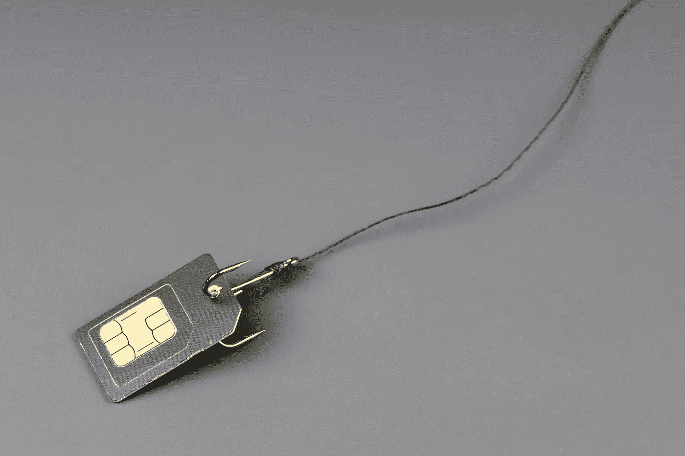

# MSISDN 与 IMSI:区别是什么？为什么它对移动身份很重要？

> 原文：<https://medium.com/geekculture/msisdn-vs-imsi-whats-the-difference-and-why-does-it-matter-for-mobile-identity-c6f7787e33b3?source=collection_archive---------2----------------------->

## **不了解手机号码(MSISDN)和 SIM 卡号码(IMSI)的区别——或者仅仅依靠手机号码来验证身份——可能会为移动用户打开 SIM 卡互换欺诈和其他问题的大门……**

Photo by [Andrey Metelev](https://unsplash.com/@metelevan?utm_source=unsplash&utm_medium=referral&utm_content=creditCopyText) on [Unsplash](https://unsplash.com/?utm_source=unsplash&utm_medium=referral&utm_content=creditCopyText)

商业已经转移到网上，而网上越来越意味着移动。新冠肺炎疫情让更多的人远程工作、购物和做生意。在全球范围内，[超过 50%](https://www.statista.com/statistics/277125/share-of-website-traffic-coming-from-mobile-devices/) 的流量已经发生在移动设备上；在整个亚洲，这一数字更接近于[的 60%](https://gs.statcounter.com/platform-market-share/desktop-mobile-tablet/asia) ，而在印度，这一数字高于 75% 。

随着手机在电子商务中的主导地位不断增长，许多应用程序已经开始使用手机号码作为其主要的用户身份形式。最常见的双因素身份验证方法(通过短信发送 PIN 码)也使用手机号码。

但这里有一个大问题:虽然一个手机号码是唯一的，但它实际上并不归用户所有或控制。这使得它容易受到欺诈者的攻击，他们可以越来越容易地拦截短信 PIN 码和其他敏感信息。当号码被移动运营商回收并重新发放给不同的用户时，也会带来问题。

所以，如果你的生意仅仅依靠一个电话号码，你可能会有大麻烦。

在本文中，我们将解释电话号码(MSISDN)和 SIM 卡标识符(IMSI)之间的重要区别。我们将看看 SIM 卡互换欺诈者是如何操作的，检查回收电话号码的问题，并解释移动号码本身如何不足以安全地验证用户。最后，我们将看看一种安全且简单的替代方法，用于验证用户并防止您可能没有意识到的欺诈。

# MSISDN 与 IMSI:有什么不同？

每个人都知道自己的手机号码——这很容易记忆。这个号码的技术名称是移动站国际用户目录号码: **MSISDN** 。但这个数字实际上只是一个标签——用户可以记住并与他人分享的东西。

事实上，SIM 卡标识符——被称为国际移动用户身份，或**IMSI**——是移动网络中唯一的用户标识符。因此，如果你出于任何原因需要一张新的 SIM 卡，那张新的卡将有一个新的 IMSI。但你可以保留同一个手机号码，这就产生了一个漏洞。

当您发送短信或拨打电话时，您会将其发送到一个电话号码(MSISDN)，这样当您获得新的 SIM 卡时，您的联系人仍然可以联系到您。您的移动运营商根据该 MSISDN 到移动设备 IMSI 的最新映射，将该消息路由到该设备。如果没有变化，就没有问题。然而，如果 MSISDN 现在被映射到其他人的 SIM 卡上，那么该文本消息或电话将会发送给其他人。

你可能会认为这不是一个大问题，除非你最近丢失了手机或更换了网络。但是恶意的行为者故意利用这个漏洞，并取得了巨大的效果。

# 不良演员是如何进行 SIM 互换诈骗的？

SIM 卡互换欺诈正在上升，高调的案件越来越多地成为头条新闻，如 Twitter 首席执行官杰克·多西的账户被黑客攻击，一名加拿大少年被指控盗窃 T2 5000 万美元。

它是这样工作的:

1.  不良行为者会发现您的手机号码和一些个人信息，通常是通过网络钓鱼诈骗、社会工程或从其他罪犯那里购买信息。
2.  他们利用这些信息向你的移动网络运营商(MNO)冒充你，说他们需要一张新的 SIM 卡——也许假装他们的手机丢了。
3.  MNO 客户支持代理向坏人发放新的 SIM 卡，上面有你的手机号码。
4.  一旦 SIM 卡上线(在坏演员的手机中激活)，你原来的 SIM 卡就停止工作。
5.  在你注意到之前，或者在你采取任何措施之前，坏人会迅速登录你的网上银行、社交媒体、电子邮件等，并通过拦截短信发送的 PIN 码来更改密码。然后他们可以轻易地窃取你的身份和/或你的钱。

SIM 卡互换欺诈是一种简单而成功的方法，背后有一个欣欣向荣的犯罪团体，并且还在继续上升。2020 年，行动欺诈在英国记录的案件数量几乎是前一年的两倍。但是，即使你从未成为 SIM 卡交换的受害者，你的手机号码仍然可能将你身份的钥匙交给坏人——或者将你的个人信息泄露给陌生人…

# 回收的数字是如何引起问题的？

MSISDN 和 IMSI 分离的另一个后果是当一个移动号码被回收时会发生什么。每个国家的手机号码都是有限的，因此总是有释放更多号码的压力，尤其是当移动运营商使用手机号码的速度比你想象的要快时。

例如，MnO 常用的营销策略是发送大量预付费 SIM 卡，以吸引客户加入他们的网络。每一个模拟市民都有一个电话号码；即使没有激活，在一段时间内，其他人也不能使用该号码。但最终，如果它没有被使用，移动运营商将回收 MSISDN，并把它放回可用号码池。

在英国，这个时间段的长度因网络而异，通常需要 90 天到一年的时间，未使用的号码才能再次可用。但是在其他国家，只需要几周，甚至几天。

当移动应用程序仅使用移动电话号码(MSISDN)作为主要标识符时，问题就出现了。当该号码被回收给新用户时，该用户可能会在尝试注册帐户时无意中访问前一用户的登录信息，甚至会收到针对前一用户的消息、呼叫和双因素验证码。

在最好的情况下，这可能只是导致一个困惑的陌生人偶然查看你的社交媒体资料。在最坏的情况下，这可能意味着恶意个人故意访问您的在线帐户，拿走您的钱，并窃取您的身份。

# 单单 MSISDN 是正确的解决方案吗？

简单的回答是否定的——但正确的身份验证级别取决于风险级别以及你的应用程序需要在摩擦和安全之间取得的平衡。每个应用程序最安全的版本会强制要求每次登录都使用 2FA，但当涉及到用户入职和保留时，这是不现实的。

例如，在一个旅游应用程序的移动入职流程中，用户可能只需注册 MSISDN 就可以简单地浏览列表和消息销售者。当用户需要采取更高风险的行动，如预订时，应用程序可能会要求第二个因素，如指纹或面部扫描。虽然这增加了摩擦，但用户已经在这一点上投资了，所以 UX 权衡被认为是值得的，以防止欺诈。

# 那么，如何使用 SIM 卡来解决所有这些问题呢？

没必要妥协。快速、安全和可靠地认证移动用户的关键是使用他们的移动号码*，但使用移动电话*中的 SIM 卡进行验证。**与物理 SIM 卡** **相关联的** [**移动号码检查是移动设备**上用户身份的最强且摩擦最小的解决方案，解决了上述所有问题。](https://tru.id/use-cases/passwordless-onboarding)

**无与伦比的安全性**:手机号码唯一地绑定在一张 SIM 卡上。在任何时候，这种手机号码+ SIM 卡的配对都是完全唯一的，不可复制的，并且是密码安全的。

**防止 SIM 卡互换**:使用手机号码+ SIM 卡进行验证，确保号码不会被坏人重新分配，从而防止 SIM 卡互换欺诈。

**解决回收号码**:基于手机号码+ SIM 卡的组合识别用户，消除了号码回收时账户信息泄露的风险，确保用户安全，保护您品牌的声誉。

**无缝 UX** :对于用户来说，这种方法非常简单——只要输入你的号码，它就会被即时、实时地验证，不需要任何进一步的操作:不需要等待短信，也不需要重新输入 PIN 码。