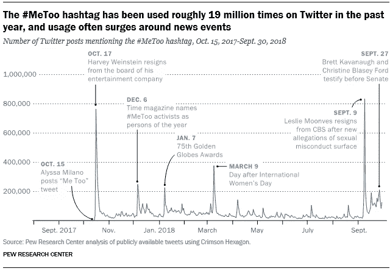
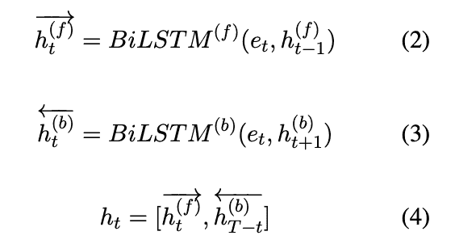
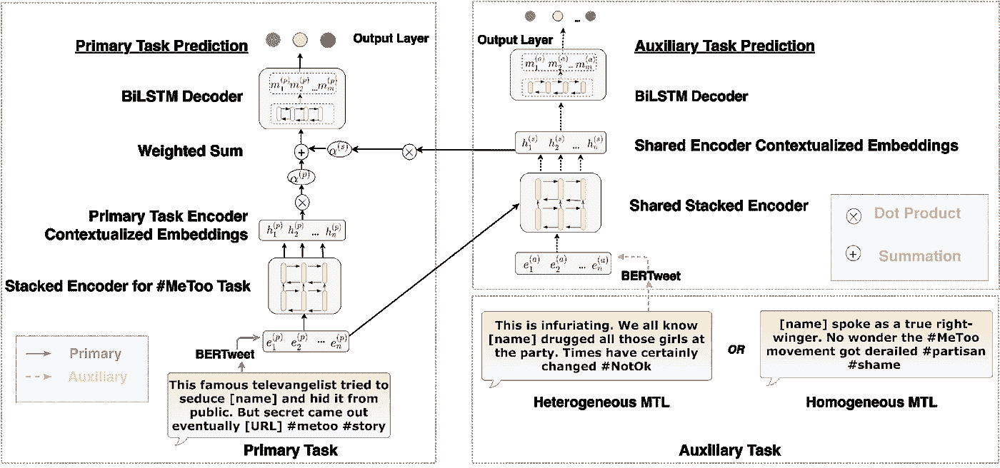
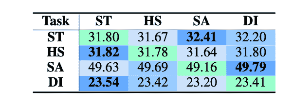
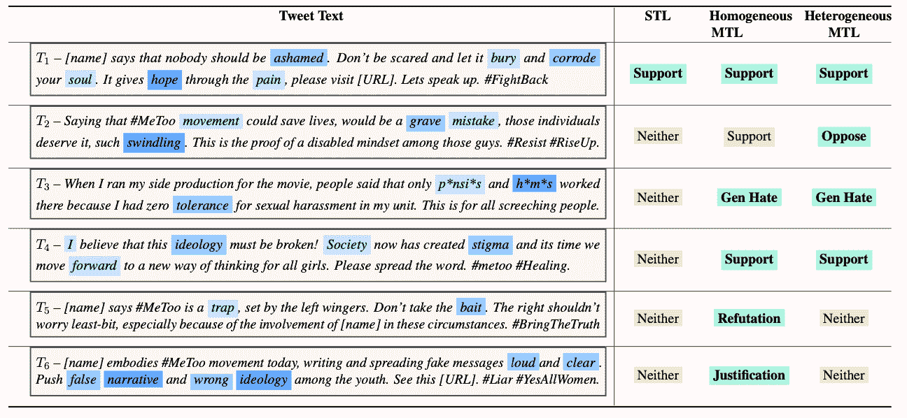

# 用于识别在线性虐待披露叙事的多任务学习方法

> 原文：<https://medium.com/geekculture/multitask-learning-approach-for-identifying-online-sexual-abuse-disclosure-narratives-32b80413b6f6?source=collection_archive---------48----------------------->

在这篇博客中， [I](https://sites.google.com/iiitd.ac.in/akash-kumar-gautam/) 将解释计算语言学协会北美分会 2021 年会议论文集:人类语言技术(NAACL-HLT 2021)中接受的我们工作的基本细节。我们将识别在线社交媒体帖子中与性虐待披露相关的叙述的任务制定为一项联合建模任务，通过[多任务学习](https://ruder.io/multi-task/)利用它们的情感属性。我们将分析重点放在在线#MeToo 运动上，该运动涉及许多人，他们讲述了自己在工作场所或机构遭受的性虐待。NLP 社区以前为自动识别与性虐待披露相关的叙述所做的工作，很少将此作为独立任务进行探索。然而，与#MeToo 社会运动相关的文本对话的情感属性与这些叙事复杂地交织在一起。

> **NLP 社区先前为自动识别与性虐待披露相关的叙述所做的工作，几乎没有将此作为独立任务进行探索。**

我们的结果表明，通过灵活的交叉缝合参数共享模型的上下文特定共享表示进行积极的知识转移，有助于在*同质*和*异质*设置中，利用文本的情感分类，建立与性虐待披露相关的联合建模任务的固有优势。我们的工作是在计算社会科学和自然语言处理领域的 IIIT-德里 MIDAS 实验室正在进行的几个项目的扩展。我们的团队热切期待任何关于这项工作的建议和改进。

# 社交媒体平台上的#MeToo 运动

[*短语“#MeToo”最初是由非裔美国民权活动家 Tarana Burke 在 2006 年使用的，旨在通过对性骚扰相关问题的同情赋予年轻和弱势女性权力。在过去的几年里，仅在 Twitter 上，标签#MeToo 就促成了几次关于性虐待的讨论。这些推文的很大一部分被贴上了专门的标签，记录了一年内超过 1900 万次的使用。*](https://en.wikipedia.org/wiki/Me_Too_movement)

Plots emphasizing the impact of #MeToo on social media platforms.

***为什么有必要从语言学角度研究#MeToo 社会运动？***

这场运动在本质上可以被认为是反对许多女权主义者、活动家和政治家的不正当性行为文化的重大发展。它可以被视为社交媒体平台推动的成功数字行动主义的一个主要例子。该运动引发了关于性虐待和暴力等污名化问题的对话，这些问题以前由于害怕羞耻或报复而没有讨论过。Twitter 作为一个社交媒体平台，完美融合了对性虐待和暴力事件的不同描述。

***由于这些数据的敏感性，我们决定从本博客的示例中删除任何个人标识符(姓名、地点)。我们还想提醒读者，一些例子，虽然被审查为亵渎，但可能表达了一种严厉的情绪。***

# 动机

这为研究人员创造了机会，可以分析人们如何在社交媒体平台这样的非正式场合就敏感话题发表意见。它还为社交媒体监管机构提供了一个促进社会包容、社区融合和改善个人对他人支持的感知的机会。本文旨在根据立场(支持或反对)、仇恨言论、讽刺和对话行为(指控、反驳或为性行为不端辩护)对与#MeToo 运动相关的帖子进行分类。

Examples denoting the relationship between tweets identified for sexual abuse disclosure (top) and emotion recognition (bottom). Colors highlight token-level attention assigned by BERTweet.

现有的文献强调，文本的情感属性与描述性骚扰事件的对话叙事高度相关。我们通过图像中的一个例子来描述它。(a)部分显示了一条表达对#MeToo 运动支持的推文，但在没有上下文的情况下，这种语气可能很难被幼稚的神经学习模型捕捉到。该图的(b)部分展示了一条推文，其中作者最初有一个积极的前景，后来转变为对该主题的厌恶。缺乏事件的背景和描述压迫者的对比资格使得性骚扰披露标签的正确分类对于没有情感标签额外监督的传统分类器来说极具挑战性。

# 我们的贡献

这项工作是首次尝试联合建模与性虐待披露和情绪分类相关的叙事，通过多任务学习(MTL)提供的参数共享技术来学习他们的互动模式。情感特征是通过共享参数的联合学习设置产生的，将包含文本的情感内容，该内容可能是与性虐待披露相对应的叙事的预测。更具体地说，在#MeToo 运动的背景下，我们为与性虐待披露(立场、仇恨言论、讽刺、对话行为)和情感分类相关的叙事的多标签分类制定了一个 MTL 框架。MTL 允许两个或更多相关的任务一起学习。由于语言特征的共享表征，这有利于归纳偏差的转移和相关任务之间更好的概括。

# 方法和途径

## 问题描述

我们将分析的重点放在一个数据集上，该数据集涵盖了与#MeToo 运动相关的相互不排斥的语言标签。为此，在 ICWSM 2020 上发布的#MeTooMA 数据集是一个完美的手段。发布的数据集是 [**HuggingFace**](https://huggingface.co/datasets/metooma) 数据集库开源支持和维护的一部分。

Sample tweet identified as belonging to the category: Generalized Hate

具体来说，给定 tweet 的文本数据，我们用取自以前作品的定义将其公式化为多标签多类分类问题。感兴趣的读者可以浏览这个 [**博客**](/@418akash/a-multi-aspect-view-of-metoo-movement-on-twitter-9fdefae484df) ，里面记录了完整的数据收集过程和问题定义指南。具体来说，我们将(a) *姿态检测*、(b) *仇恨言论识别*、(c ) *讽刺检测*、(d) *对话行为分类*视为用于识别与性虐待披露相关联的叙述的建议任务的一部分。对于作为辅助任务的情绪检测，我们使用了 SemEval 2018 Task-1 数据集，该数据集涵盖了代表推文作者精神状态的情绪特定标签。不同的情感标签将在下一节介绍。

## 建模设置

为了验证 MTL 在不同领域的表现，我们还实验了情绪检测作为辅助任务。我们的目标是预测代表作者情感状态的几种情绪中的一种或多种——(*愤怒、厌恶、期待、恐惧、喜悦、爱、乐观、悲观、悲伤、惊讶、*和*信任*)。我们概念化三种不同的问题设置，并比较它们来分析中的*和*域中的*。这些是:*

(i) **单一任务学习**:独立优化与性虐待披露叙述分类相关的四个提及的任务。

(二)**同质多任务学习**:同时优化从与性虐待披露帖子相关的四项任务中选出的一对。

(三)**异质多任务学习**:将与性虐待揭露相关的叙事分类作为主要任务，情绪检测作为辅助任务。

## 文本编码

基于 NLP 中基于 transformer 的模型的成功，我们选择了 [BERTweet](https://github.com/VinAIResearch/BERTweet) ，这是一个经过预先训练的语言模型，在 8.5 亿条英语推文中进行了训练。BERTweet 接受了与 RoBERTa 相同的培训程序的培训，并且具有与 BERT 基础架构相同的模型配置。关键的组成部分是基于转换器的模型是令牌级的自我关注，这使它们能够生成动态的上下文嵌入，而不是手套的静态嵌入。我们考虑来自 BERTweet 最后一层的嵌入，并为给定的 tweet t *i* 获得嵌入 e *i* 。每个 tweet 的嵌入维数为 m × k，其中 k 表示基于 BERT 的模型的维数，m 表示 tweet 的最大长度。

来自等式 1 的这些表示通过堆叠的 BiLSTM 编码器。然后将丢失应用于这些编码表示 h(t)(等式 4 表示两个任务的通用公式)。然后，这些信号被传递到 BiLSTM 解码器，接着是一个 dropout 层，然后是一个线性输出层，以获得输出。

## 任务设置

我们独立地对待与性虐待揭露相关的叙事分类的任务——立场、仇恨言论、讽刺和对话行为。每个 STL 模型都有一个输入表示。在对与#MeToo 运动相关的推文的性虐待披露叙事进行分类的拟议任务中，我们使用 *sigmoid* 激活进行讽刺检测(其分类输出是二进制的),并使用 *softmax* 激活进行最终输出层的所有其他任务。为了说明标签之间的不平衡，我们使用了[类别平衡聚焦损失](https://openaccess.thecvf.com/content_CVPR_2019/papers/Cui_Class-Balanced_Loss_Based_on_Effective_Number_of_Samples_CVPR_2019_paper.pdf)，其中类别平衡项是模型不可知的。有关更多细节和超参数设置，请参考本博客末尾提到的随附出版物。

> **MTL 框架通常使用这两种方法中的任何一种来构建:*硬参数*共享或*软参数*共享。在硬参数共享模型中，主要和辅助任务都有一个共享的编码器，后面是单独的特定于任务的网络分支，共享的编码器由两个任务交替更新。另一方面，在软参数共享中，任务具有带有独立参数的不同编码器，并且使用正则化约束来正则化它们的参数之间的距离。**

# 灵活的交叉连接参数共享架构

我们设计我们的模型，使得任务不可知的文本特征表示受益于硬共享，而任务特定的特征的正则化可以根据任务对设置来学习。我们称我们的方法为灵活的交叉缝合参数共享，如图所示。具体地，我们一前一后地训练两个独立的模型(每个任务一个),同时还具有由它们更新的共享编码器，以及针对该任务专门调整的主任务解码器参数的加权联合学习。这允许两个模型具有它们自己的一组参数，同时还通过共享编码器权重鼓励知识转移。

The embedding representation identifies BERTweet word-level embedding for the primary and auxiliary task. The different arrows are used to denote alternate passes of the primary task (solid arrows) and the secondary task (dotted arrows). Two controllable parameters are used to control the flow from task-specific and shared encoders respectively, for the primary task.

这种聚集来自两个编码器的信息流的方法也促进了先前多任务学习设置的成功。至于我们的辅助任务，我们只通过共享编码器传递嵌入，后面是一个 *dropout* 层。我们使用这种架构进行异构 MTL 实验。对于同质 MTL 模型，由于在这种情况下的统计性能，我们采用硬参数共享模型。该技术由一个单一的堆叠编码器组成，该编码器由与识别#MeToo 运动中与性虐待披露相关的叙述相关的两个任务共享和更新，随后是特定于任务的分支。来自编码器的共享表示通过丢弃层传递。

这些输出表示(在同质和异质实验的情况下)分别通过相应的 BiLSTM 解码器和 *dropout* 层，以获得两个任务的最终表示 m(p)和 m(a)。辅助网络分支使用(类平衡焦点损失)或(二元交叉熵)进行优化，这取决于辅助任务是否与识别性虐待披露叙事或情绪相关联。

# 结果和讨论

根据我们的假设和在#MeTooMA 数据集上进行的 STL 实验的初步结果，使用 BERTweet 嵌入训练的模型的性能远远好于 GloVe-Twitter。由于推文固有的主观性和数据大小的限制，学习#MeTooMA 数据集中的情感状态具有挑战性。就所有任务对的宏观 F1 分数而言，多任务学习实现了显著的绩效增益。第一个表格中以绿色表示的对角线结果表示基线 STL 结果，而以蓝色阴影突出显示的结果表示以行作为主要任务、以列作为辅助任务的成对同质 MTL 的结果。

F1 macro score for pair-wise MTL (non-diagonal elements) and STL (diagonal elements — top left corner to bottom right corner). Rows denote the primary task and columns denote the auxiliary task in the case of MTL

当成对的任务被联合建模时，同质 MTL 的更高性能可以被推断为更好的概括的指示。有趣的是，这些任务在同质 MTL 设置中的选择性对应物中表现最佳。*姿态*检测与*讽刺*标注强耦合，对于*仇恨言论*分类和*姿态*识别也是如此。特定任务对的这种选择性超出表现可归因于任务本身之间的高度相关性。

Best F1-scores obtained for Homogeneous MTL (Top table) and Heterogeneous MTL experiments. Heterogeneous MTL experiments represent multitask learning performed with emotion identification as the auxiliary task. Best results in bold.

下面的第二个表中的结果表明，在四个任务对中的两个中的类似设置下，异构 MTL 设置实现了比同构 MTL 更高的性能——分别以+0.21 和+0.19 的裕度检测立场和仇恨言论。对于其他两个任务，异构 MTL 的性能非常接近，如果不是比同构 MTL 更好。这些发现与#MeTooMA 数据集中支持跨任务概化的主张一致，这与情绪识别高度相关。这表明这两个领域之间存在积极的知识转移。这种联合优化通过参数共享来学习可能对两个相关任务都有益的共同表示，从而提高主要和辅助任务的整体性能。

## 定性分析

为了强调我们提出的方法，我们通过从数据集中精选例子来进行定性研究。我们分析了 BERTweet 分配给单个术语的标记级注意力，其中颜色强度对应于注意力得分。我们推断，与 STL 相比，同质和异质多任务学习在每种情况下都表现出优越的性能。在同质 MTL 中，通过成对任务的联合公式化学习有效特征在 T4 是显而易见的，在那里，伯特的自我关注给诸如意识形态、耻辱和前进等词分配了更高的权重，以符合作为支持的实际标签。表中的其他示例也遵循相同的趋势。

Qualitative analysis of the performance obtained by MTL architecture on some samples. The color intensity of each word corresponds to the token-level attention score given by BERTweet. Green denotes the correct prediction and yellow denotes incorrect prediction.

一个有趣的观察是 T5 和 T6 中命名实体的存在，导致通过异构 MTL 的不正确预测。因此，单任务学习和异质 MTL 的局限性在于不能减轻文本中的命名实体或特定事件影响知识转移和创建负面共享表征的效果。

# 伦理讨论和限制

由于这一主题涉及对社会问题的看法，因此检查这一活动的社会影响和相关个人的道德是很重要的。

***将研究成果用于人口研究*** *:* 我们要提到的是，还没有人尝试对提议的数据集进行以人口为中心的分析。这篇博客中的分析只能被看作是一个概念证明，用来检验 Twitter 上 MeToo 运动的实例。作者承认，从该数据集中获得的知识不能用于任何直接的社会干预。我们的工作试图揭示总体趋势，这可能有助于研究人员开发更好的技术来理解大量无组织的虚拟运动。

***对边缘化群体的影响:*** 我们认识到 MeToo 运动对像 [LGBTQIA+](https://www.uis.edu/gendersexualitystudentservices/about/lgbtqaterminology/) 这样被社会污名化的人群的影响。MeToo 运动为这些人提供了表达对性暴力和性骚扰事件看法的自由。该运动是实施社会政策变革以造福这些社区成员的催化剂。因此，重要的是要记住，在这些结果基础上展开的任何工作都应尽量减少对少数群体的偏见。

***个人同意的限制:*** 考虑到相关个人的精神健康方面，社交媒体从业者应该意识到要进行自动干预来帮助性虐待的受害者，因为一些个人可能不愿意透露自己的身份。如果发现社交媒体信息可能被用于计算分析，相关的社交媒体用户也可以撤销他们的社交媒体信息。

# 朝着正确方向迈出的一步？

在这项工作中，我们提出了一个*灵活的交叉缝合*多任务学习框架，用于检测社交媒体上与性虐待披露相关的叙事。我们的方法利用来自情绪和相关任务的情感特征来鼓励知识转移和获得辅助知识。定性和定量结果展示了*姿态检测*和*讽刺*识别的联合优化如何相互受益，表明了它们的相关性和相互依赖性。

类似地，我们观察到像*仇恨言论*分类和*立场*标记这样的任务从彼此和情绪检测中受益，从而加强了相关任务之间联合语言学习的好处。在未来，我们的目标是探索如何有效地利用这种联合学习范式来提高下游任务的绩效，如情绪分析，识别虐待幸存者中的自杀倾向。这项工作的应用还可用于识别报告的性骚扰叙事模式、仇恨言论检测、谣言和假新闻的传播以及数字警戒的实体提取等问题。我希望这篇文章能激励另一位像我这样的年轻研究人员去着手解决一个相关的社会问题，并利用人工智能和数据科学的潜力来解决这个问题。

# 相关链接

 [## 情感分析性虐待披露的多任务学习

### 摘要社交媒体平台上的#MeToo 运动引发了对性骚扰几个方面的讨论…

aclanthology.org](https://aclanthology.org/2021.naacl-main.387/)  [## 拥抱脸的 metooma 数据集

### 该数据集由 Twitter 上属于#MeToo 运动的推文组成，分为不同的类别。这个…

huggingface.co](https://huggingface.co/datasets/metooma)  [## MIDAS-research/meto ma

### 这是一个共享 ICWSM 题为# meto oma:Tweets 的多方面注释的论文中产生的数据集的存储库…

github.com](https://github.com/midas-research/MeTooMA)