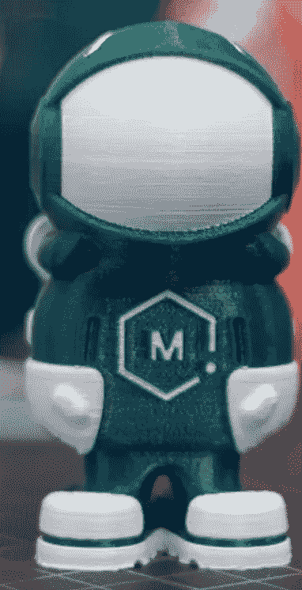
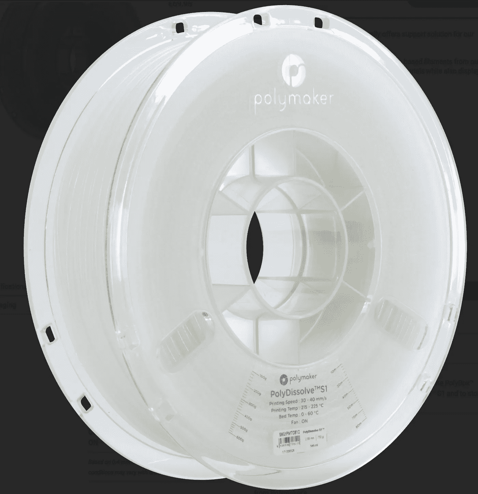
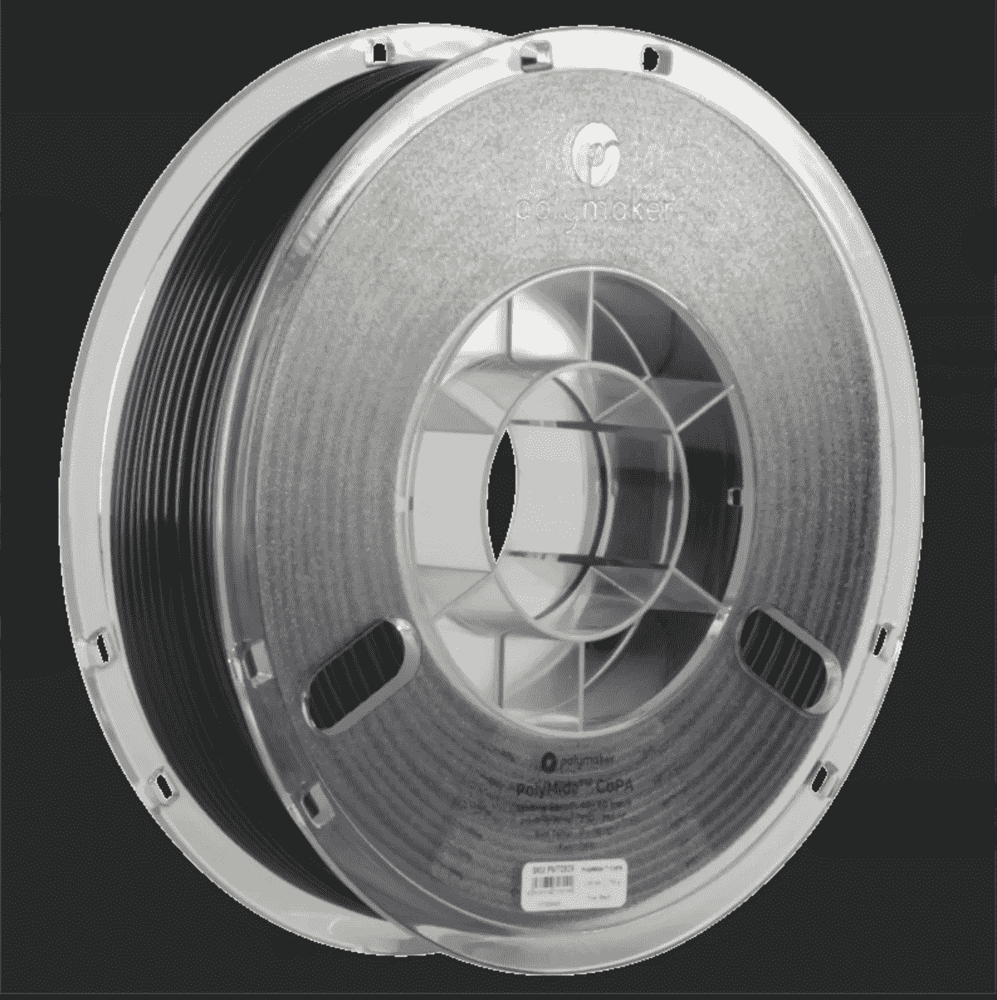
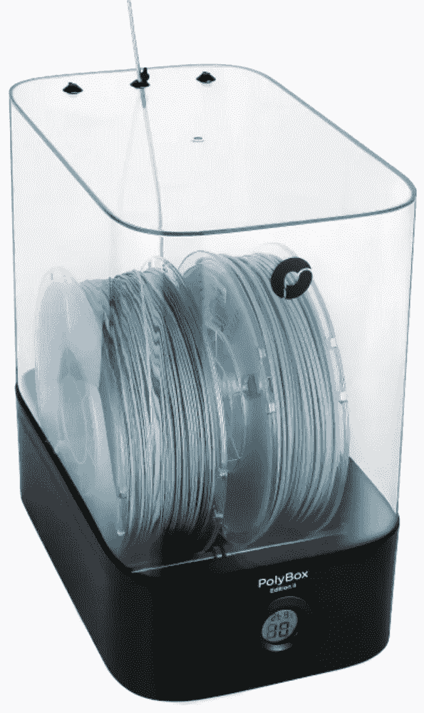
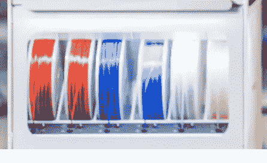
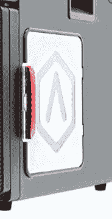
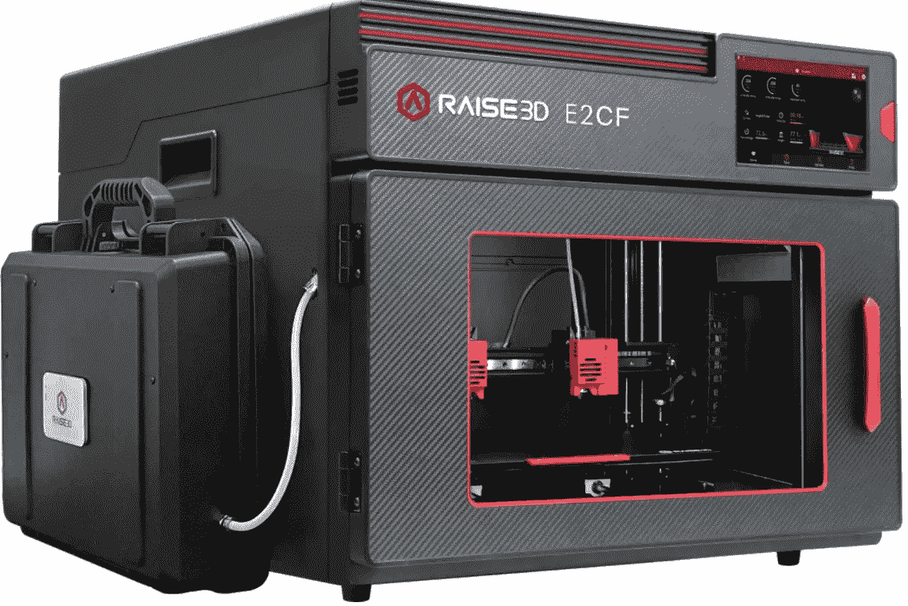
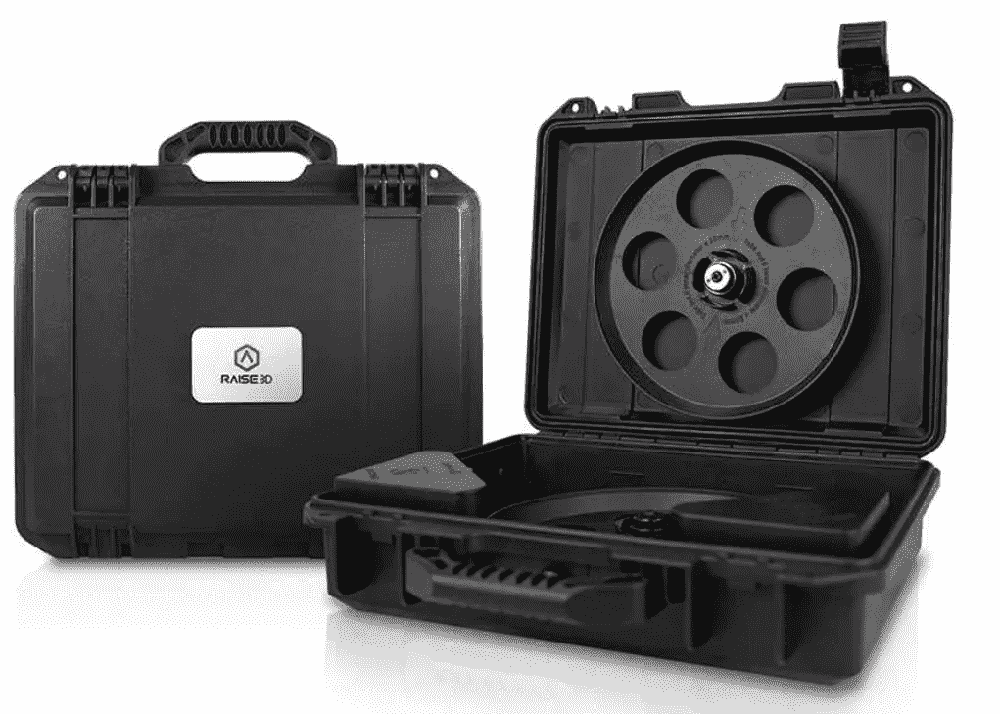
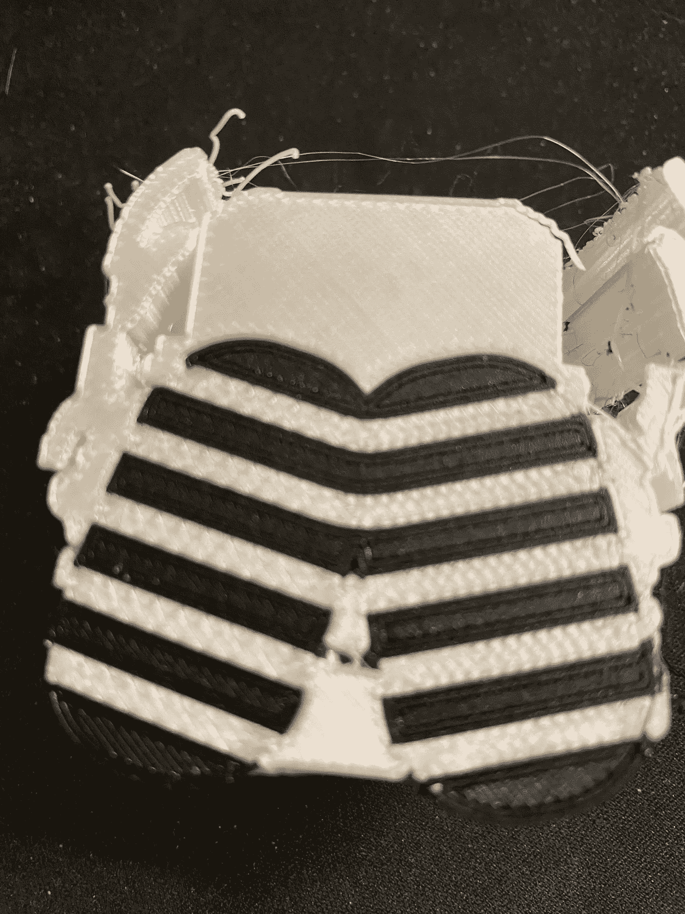

# 我选择高端 3D 打印机的旅程(raise 3D E2)——第 3 部分

> 原文：<https://medium.com/geekculture/my-journey-to-choose-a-high-end-3d-printer-raise3d-e2-part-3-f6272d540737?source=collection_archive---------14----------------------->

> 注意:Raise3D 已经联系了我，我已经更新了这篇文章的几个部分，因为它是今天早上第一次写的。

# 飞行意大利面怪物的攻击

让我问你。完美是不是要求太高了？我想可能是。这台打印机不会是我买过的最贵的打印机，但也差不多了。因为我是作为个人购买的，所以我在这个多部分购买评论中如此详细的原因是，我希望以尽可能最好的价格购买一台尽可能接近完美的打印机。我希望这台打印机能购买 5 年，是的，我希望更多，但老实说，3D 打印仍然远非完美，对于家庭用户来说，比 FDM 更好的技术出现只是时间问题。

我今天早上去了商店，在他们开门之前，通过一个我可以看到打印机的小窗，我现在第二次看到，左边的卷轴有进纸问题，只有右边的卷轴在打印…所以有一堆意大利面条。

Credit: [Dual Color 3D Phil by MatterHackers — Thingiverse](https://www.thingiverse.com/thing:2849214)

因此，为了测试印刷，我们一直使用 MatterHackers 的双色 3D Phil。这是一个非常酷的小印刷，它最终应该会非常棒。但是，我们还没能让他打印出来。

# 灯丝

PolyDissolve S1: Credit [PolyDissolve™ S1 — Polymaker EU](https://eu.polymaker.com/product/polydissolve-s1/)

对于正确的线轴，我选择使用 PolyMaker 聚溶解 S1。

PolyMide CoPA: Credit [PolyMide™ CoPA — Polymaker EU](https://eu.polymaker.com/product/polymide-copa/)

对于左边，我选择使用 PolyMaker PolyMide CoPA。

这两根灯丝的选择很容易。首先，它们基本上是由同一批人设计的，用于打印一种不可思议的材料，并配有最好的支持材料。据我所知，它们被化学工程化成了完美的配套材料。

## 不同的材料

我不想打印两种颜色的聚乳酸或 PETG 或其他材料，而是想要两种在不同温度下工作并具有不同特性的材料。如果您只是用不同的颜色打印相同的材料，您最好使用二合一喷嘴解决方案或可能的长丝焊接机，如 Mosaic Palette 3(我打算用相同的细节来回顾它)来处理长丝过渡。

在不同的温度下打印两种不同的材料有一些非常重要的好处。此外，它还提供了一个很好的二合一测试。打印机不仅打印不同的材料，而且通常还会遇到许多空闲时间的问题。其他支持材料，如简单的胶水聚乙烯醇是惊人的坏在坐在温暖的热端闲置。如果放置太久，它会结晶和堵塞。如果它缩得太远，灯丝末端的那点鼻涕会把自己粘到散热片内部。如果它收缩得太少，没有结晶，它会使水滴鼻涕火箭。

至于尼龙，尼龙总是一种很难印刷的材料。PolyMide CoPA 可能是我用过的最简单的尼龙材料，Taulman 910 紧随其后。但这是一种很难达到绝对完美的材料，因为尼龙令人惊叹的特性使其非常适合打印，同时也是导致堵塞、堵塞、流口水、流鼻涕等的特性。事实上，尼龙非常适合缠绕。这就是为什么女士丝袜用这种材料制成，它应该是非常轻便的，当它变得多线时有着难以置信的耐用性，等等…

## 不同的温度

该打印机测试旨在测试打印机，而不是材料。所以，我真的很想找两个因合作而出名的材料，尽我最大的努力消除材料失败的原因。PolyMide CoPA 印花温度为 250C 至 260C，PolyDissolve 印花温度为 215C 至 225C。虽然材料会做得很好，但用温差如此大的材料打印是对零件冷却的巨大考验。

当在 CoPA 上印刷聚溶解 S1 时，我们预计会非常顺利。我们希望从顶部、底部和侧面获得良好且均匀的附着力。但是我们真的不希望聚溶解剂融化成可乐。科帕应该保持一个完美的形状，而聚溶解剂应该冲进去…并顶着它。基本上，我们希望聚溶解以粘合到 CoPA 上，而不是成为它的一部分。

当将 CoPA 印刷到 PolyDissolve 上时，我们希望材料靠在 CoPA 上，并且在有限的程度上，我们希望 CoPA 稍微取代 PolyDissolve 表面的缺陷。听起来这可能会导致畸形，但实际上，这有点像用化学方法而不是通过软件来平滑印刷品。但出于工程目的，我们不希望这是一个实质性的改变。因此，重要的是 CoPA 印刷足够热以完美粘合，但我们不希望它通过聚溶解剂切割草皮。所以温度控制很关键。打印机应该奠定了 CoPA，创造了债券和冷却 CoPA 之前，它没有坏的事情，以聚溶解一般。

# 到处都是水

PolyBox Edition II: Credit [PolyBox™ Edition II — Polymaker EU](https://eu.polymaker.com/product/polybox-edition-ii/)

PolyMide CoPA 和 PolyDissolve 都是在潮湿环境中会自毁的材料。这就是为什么我使用塑料盒子，并确保我有现成的二氧化硅包供应，以不断保持我的细丝尽可能干燥。当然，我也可以使用细丝烘干机，但烹饪细丝需要花费很长时间，我已经毁了几个很棒的线轴，因为热量不足不起作用，热量过多最终会将一个线轴变成一个固体塑料块。

Ultimaker Material Station — Credit [Which Ultimaker S5 Material Station setup is right for you?](https://ultimaker.com/learn/which-ultimaker-s5-material-station-setup-is-right-for-you)

如果你想知道为什么这篇评论应该就此打住，我应该取消我的订单，花将近 3 倍的钱买一台 Ultimaker S5 而不是这台打印机，Ultimaker S5 材料站就是原因。对于未来 5 年我处理灯丝管理所需的所有费用，以及当时间到来时我将与马赛克调色板进行的斗争，我可能会通过花费 10，000 美元以上而不是 4，000 美元加上 10 亿美分来省钱。使用更高级的材料进行印刷时，材料处理至关重要。

Stratasys 通过将细丝储存在盒子里做了一些非常酷的事情。Ultimaker 有材料站。Raise3D 有什么？

# 坏事来了

Raise3D 什么都没有。是的，他们让打印机在材料处理方面变得非常糟糕。

我面前没有打印机，所以我将使用一些图片，并显示当它们变得奇怪时会发生什么。

The E2 Filament storage : Credit [All-in-One IDEX Desktop 3D Printer | Raise3D E2 | Free Shipping in the US](https://www.raise3d.com/products/e2/)

所以，Raise3D 犯了几乎所有在 FlashForge Creator 3 上犯过的愚蠢错误。E2 的灯丝存储只是一个塑料门，没有密封，没有湿度控制等等…它基本上是在乞求摧毁你的灯丝。

## 无外部盒子或支架

最重要的是，不允许使用像 PolyBox 这样的外部细丝存储解决方案。事实上，除非你想把门关上，破解出一个解决方案，否则 E2 就是反灯丝。

## 大型线轴

你不能用大线轴。你只能购买较小的线轴或自己缠绕线轴。

你将受到打印尺寸的限制，因为如果你想填满打印机的容量，打印时需要更换灯丝。

## 不可拆卸的门

要么你冒险把门折断，要么你就让门开着。

## 没有马赛克调色板…可能

由于没有外部灯丝进料的余量，调色板 3 不可能在不破坏门或打开顶部的情况下使用。

# 恨恨恨

由于门在打印机的侧面，除非你在某个地方给它一个岛，或者你碰巧想在打印机的每一侧留 30-50 厘米的开口，这意味着它基本上是在一个岛上，否则你可能需要凭感觉使用这台打印机。

不是的。

这台打印机很重。你不会想经常滑动它。我的预期目标是将一些支持材料放在一边，并尽可能少地更改。每次我想换灯丝的时候，我都会把另一边打开。

好吧，改变灯丝所需的角度是合理的，但考虑到你需要将灯丝送入鲍登管的奇怪角度，令人惊讶的是，在收回过程中，经常会出现灯丝丢失的情况，这可能会导致灯丝从侧面滑落，并缠绕在心轴支架上。

一个不太完美的解决方案是使用一个剥离和粘贴电缆支架，以确保灯丝与线轴保持对齐。

但这太可怕了。

## Raise3D 搞砸了

> 注意:我不会改变这篇文章中的文字，因为我相信我最初的印象仍然适用。不过 Raise3D 联系了我，至少做了初步澄清。因此，在我对 E2CF 的咆哮之后，这可能是基于我当时缺乏信息，请阅读之后用斜体标记的文本。

Raise3D E2CF : Credit [Raise3D Introduces New E2CF Professional Desktop 3D Printer to Enable Production of Carbon Fiber Parts — Raise3D: Reliable, Industrial Grade 3D Printer](https://www.raise3d.com/news/raise3d-introduces-new-e2cf-professional-desktop-3d-printer-to-enable-production-of-carbon-fiber-parts/)

Raise 显然意识到他们把事情搞砸了。他们不仅意识到了这一点，而且最终建造了一台全新的打印机…差不多…解决了许多这样的问题。但是他们留下了与 E2 相同的格式(在我写这篇文章的两周前宣布),而不是像他们真正应该做的那样修复打印机中的灯丝存储…

The dry boxes : Credit [Raise3D Introduces New E2CF Professional Desktop 3D Printer to Enable Production of Carbon Fiber Parts — Raise3D: Reliable, Industrial Grade 3D Printer](https://www.raise3d.com/news/raise3d-introduces-new-e2cf-professional-desktop-3d-printer-to-enable-production-of-carbon-fiber-parts/)

取而代之的是，他们将内部的卷轴存储全部移除，并在打印机的侧面钻孔。他们在想什么？！？！？！？

The dry box up close :

[Raise3D 推出新的 E2CF 专业桌面 3D 打印机，实现碳纤维零件的生产——raise 3D:可靠的工业级 3D 打印机](https://www.raise3d.com/news/raise3d-introduces-new-e2cf-professional-desktop-3d-printer-to-enable-production-of-carbon-fiber-parts/)

这些干燥的盒子太棒了。我的意思是，他们真的为过度设计设立了一个全新的标准，他们真的是一个美丽的东西。

他们考虑了线轴的稳定性。

他们考虑用细丝来避免滑动

他们考虑保持线轴干燥。

我个人认为他们做得完全错了。

## 他们应该做什么

虽然 E2 上的灯丝存储远非完美，但有一点非常好，那就是有足够的空间来修复错误。

他们可以提供这种新解决方案的所有优势和功能，并通过用干盒插件替换 E2 的门和主轴支架来解决外部进料问题。

无论是通过一个真空成型插入或通过一个密封的丙烯酸/有机玻璃容器，他们可以从打印机的侧面移除门，然后提供两种选择。

1.  能够将线轴和二氧化硅以及湿度传感器放入线轴当前存放的插槽中。
2.  第二路径将提供对波顿管的侧面外部访问，用于支持外部灯丝管理。

相反，他们所做的是再次限制卷轴的尺寸，并在打印机的两侧放置两个巨大的塑料盒。

## 缺乏升级能力

目前，我正在合作的 3D 打印机商店有一台设备可供测试。他们甚至还没卖出去。他们正在评估是否出售它。Raise3D 本可以做出完美的选择，用两个新的 hotend 组件和两个可插入的灯丝存储单元做一个合适的升级套件。

现在我在几个选择之间左右为难。

1.  我会考虑其他选择吗？我应该花费额外的资金，只是得到 Ultimaker S5，扔掉我所有的 1.75 细丝，只是撕掉创可贴吗？
2.  我要不要让商店买下这个新的怪物，用塑料盒子(我已经有了)代替 E2 干燥盒？
3.  我是不是应该让他们把这一台退回去，然后继续寻找完美的打印机？

我做这些评论是因为我真的不知道 E2CF 打印机的存在，直到我为这篇文章寻找图片，Raise3D 使它广为人知

1.  这台打印机和另一台打印机价格一样
2.  这台打印机似乎有更好的热端
3.  修改是对设计的修改，而不是简单的改变。
4.  这真的是一台新的打印机…但它看起来像地狱，因为考虑不周的干燥盒挂在旁边
5.  Raise3D 现在将支持另一个该死的打印机。这意味着稍微不同的部分，很少的支持细微差别，等等…

我想知道他们对这台新打印机做了哪些改进，使另一台打印机相形见绌？

## 什么能挽救这次销售和回顾？

在这一点上我很欣慰，我还没有买这台打印机。这迫使我重新考虑，想出一个替代方案。E2CF 是一记耳光，表示“我们知道 E2 不是它应该是的样子。我们将 E2CF 作为更好的选择”。

所以我想看到的是:

1.  升级到 E2，E2CF 上的所有东西都在，除了干盒。
2.  E2 和 E2CF 之间的明显对比让我感觉好像我没有买一个连 Raise3D 都认为是坏的产品。

> 这是承诺的更新。
> 
> Raise3D 让我看一下 2019 年 9 月发布的 E2 的[原公告。它清楚地表明，E2 从来就不仅仅是一种产品。相反，它说这是一个产品系列。他们一直打算发布基于该平台的新打印机。因此，至少从他们的角度来看，虽然 E2CF 在我看来很像 E2，不仅打印 CF，而且还解决了我独立发现的打印机的明显问题。他们声称现在的对齐甚至更好，我无法想象如何，但如果他们这样说，根据我在打印机上使用摄像头辅助对齐的经验，E2CF 上的对齐一定是完美的。他们还升级了挤出机，据称是为了 CF，但我确信双驱动挤出机将允许打印机打印肖氏评级低至 75A(规格最低为 90A)的柔性材料。](https://3dprint.com/254117/raise3d-multipurpose-e2-3d-printer-tct-2019/)
> 
> 我保留了我最初的话，而不是编辑或软化它们，因为我认为这真的很重要，不仅是因为我在缺乏信息时想到了这些东西，而且 Raise3D 也很快联系了我，问我为什么会想到它们。我相信他们会主动解决这些问题。记住，他们没有送我打印机，我没有借。我在购买它之前正在评估它。实际上，从他们邮件的书写方式来看，我认为让他们的客户(或至少是潜在客户)感到受到良好对待对他们来说非常重要。这也正是为什么在看了 Joel Telling 的 Raise3D 之旅后，我把 Raise3D 作为 Ultimaker 的替代品。

# 照常继续

所以，现在我已经咆哮了，我想继续写这篇评论，就好像我没有被这个疯狂的新信息扇耳光一样。

# 打开的灯丝变坏了

当他们选择做开放细丝计划时，Raise3D 非常棒。这个想法是，社区将提供细丝和简介，可以很容易地在线访问，并添加到 IdeaMaker 软件。

我相信他们希望灯丝公司会考虑测试他们的灯丝，并将他们自己的设置添加到数据库中。

我觉得这个失败了。

Open Filaments 项目的结构看起来没有真正的同行评审过程。

他们犯了一个巨大的错误，使每个开放的灯丝配置文件成为一个清单，其中包括灯丝设置以及打印配置文件。结果是开放细丝目录变得有点混乱。使用给定灯丝的每个轮廓似乎是矛盾的。

一个更好的解决方案应该是将细丝轮廓包括像密度、最佳温度、最佳收缩、最佳速度和防渗漏设置这样的事情合而为一。然后单独打印设置。那么细丝将更容易配置和上传，并且测试的打印设置将被单独上传。

我真的不喜欢开放的细丝设计，我相信我最终会创建自己的个人资料。

此外，Open Filaments 程序是一个奇怪的 IdeaMaker 链接到网络浏览器的链接，并且有点笨拙地集成到软件中。如果他们想采用这种方法，他们真的应该将浏览器嵌入到软件中，而不是触发外部浏览器，使这个过程有点尴尬。

# 回到好的…不要太棒了！！！

## 对齐

对于 3D 打印机来说，独立的双挤出机一直是一个非常糟糕的想法，因为它们需要 X，Y 和 Z 对齐。

FlashForge 证明了至少有 1000 个东西(夸张？也许是，也许不是)你可以在设计 IDEX 打印机时出错。FlashForge 做得太差了，他们应该在试图回来之前就关门大吉，改名换姓，远离这个世界。

When it’s done right

我以为会有一个向导要求我通过仔细观察不同的印刷品并猜测正确的偏移量来对齐 x、y 和 z 的偏移量。我预计这将是一场来自地狱的灾难…因为 FlashForge 让我相信这将是一个悲惨的过程。

所以我进入菜单，继续寻找校准设置。看了看。看了看。却没有找到。

我很困惑。我看不出这台除了“相机辅助”校准之外什么都没有的打印机怎么会没有一个菜单，在那里你可以欺骗和祈祷让一切都校准。

所以我放弃了寻找，然后想，让我们把创可贴撕掉吧，我试着不用对齐打印头来打印。

刚刚成功了！！！

IDEX 打印的体验就像在 Ultimaker S5 上打印一样流畅和完美。我的意思是，真的，它不只是做一个完美的第一层灯丝，然后在第二个半吊子。Ultimaker S5 知道 X 和 Y 的精确偏移量，并通过触摸压力测试找到 Z，Raise3D 神奇地找到 X、Y 和 Z。我还是没搞清楚这是什么魔法。我需要坐下来盯着看一会儿，猜猜它是怎么做到的。

Snotty Scotty

这张照片有点乱，但我要警告你，在我开始剥印刷品之前，我忘记拍照了。所以，这不是一个公平的代表。这是一个有意停止印刷。

使用默认设置，我们看到有净化/清除塔。我们也看到那些擦拭塔真的很重要。

## 将高塔从地狱中抹去

看起来，在细丝更换过程中(使用开放细丝 PolyMida CoPA profile ),在细丝更换之间有一个非常大的清除…在聚溶解器上，它要小得多。尽管总的来说，有相当多的灯丝浪费。

这可能是我迄今为止见过的相对于 S5 和 Cura 最大的缺点。比起净化桶和刷子，我更喜欢净化塔或墙，就像在闪锻炉上一样，但是这有点乱。清洗/擦拭塔的问题在于，要使它们真正有用，它们必须具有足够的质量，使得擦拭过程不会将它们撞倒。

对于大型印刷品，它们比在印刷品周围使用一面墙要有效得多。但是对于像这样的小印刷品来说，一面墙可能更有意义。

此外，为了获得所需的质量，同时提高灯丝效率，打印两个相连的半圆或出于好玩，一阴一阳会更好。目标是擦鼻涕。这座塔是否漂亮并不重要。因此，这个目标可以很容易地实现，只需浪费一半的灯丝。

## 关于多溶解的一点注记

用 PVA 打印过的都知道很丑。看起来像是变硬的体液。另一方面聚二甲基硅氧烷是这种晶白色的美丽物质。老实说，我很想把它做成东西，放在玻璃盒子里，以防受潮。这是我见过的最漂亮的细丝之一。

# 关闭它

我已经写得够多了。一旦菲尔被正确打印，我会继续。我想我也会用我自己的 E2 干箱解决方案进行试验。我可能会数控一个真空模具，看看我是否能做出比他们更好的解决方案。

下期再见。