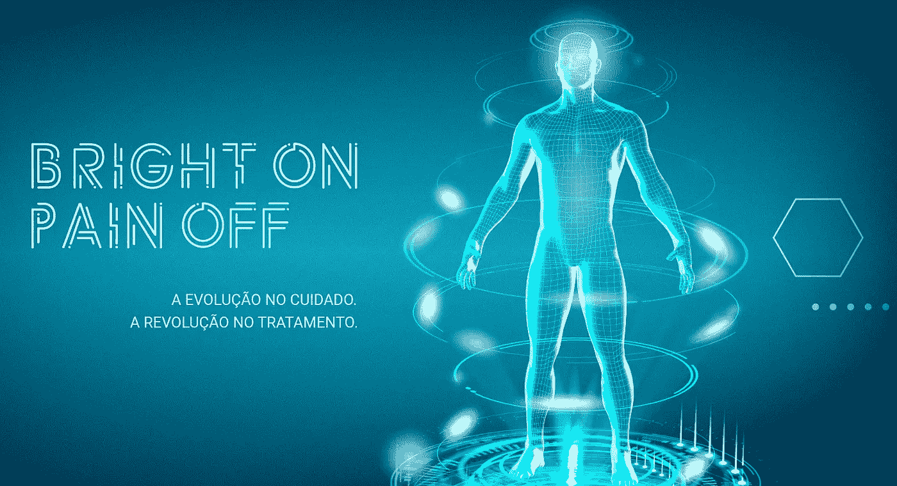

# 我在数据科学方面的技术培训

> 原文：<https://medium.com/geekculture/my-technical-training-in-data-science-5275938cabfd?source=collection_archive---------13----------------------->

我在一家名为 [Bright Photomedicine](https://brightmed.com.br/) 的初创公司的第一份工作中，我获得了 [FAPESP](https://fapesp.br/) 奖学金以及工作福利，以便成为一名全职数据科学家。[在这里](/@vagnerzeizer/from-academia-to-industry-how-a-physicist-turned-into-a-data-scientist-ffe6179eb689)，我讲述了我在得到这份工作并闯入数据科学领域之前的旅程。在这个故事中，我将告诉你在这将近两年的时间里我所经历的教训和挑战。

让我们从概述我正在工作的创业公司开始。

## 定制光生物调节疗法

Figure 1: Bright Photomedicine ([source](https://brightmed.com.br/))

急性和慢性疼痛是影响全球数亿人的健康问题。然而，减轻这些人的痛苦并提高他们的生活质量是昂贵的，并且伴随着一些副作用，这取决于所采用的药物或外科手术的类型。因此，为了减轻疼痛并带来一种更实惠的方法，Bright Photomedicine 正在开发一种基于光的疗法，称为定制光生物调节，其中根据患者的表型特征(如体重指数、年龄、性别、疼痛程度、皮肤光型(根据黑色素浓度确定的患者皮肤类型)等)定制应用于患者的光束能量。在这种疗法中，光刺激患者体内产生止痛和抗炎物质，缓解和降低疼痛的强度。这种治疗的优点是无创，无副作用。这种疗法的更多细节可以在这家初创公司的网站上找到，同时还有科学研究的参考资料，证实了这种疗法的效率和功效。

这里的问题是:数据科学/分析能否帮助优化定制的光生物调节疗法？为了回答这个问题，我将简单地讨论一下我作为一名数据科学家在**行业研究**和患者真实数据**中所做的事情。**

## 行业研究

作为一名辍学者(见我的拿铁咖啡[这里](http://buscatextual.cnpq.br/buscatextual/visualizacv.do?id=K4209360H2&tokenCaptchar=03AD1IbLDk3mXfOWhaPAKaGijKq6o1U4vkWvImQ2FVImHbt6VSPUQfPmBmIaQE3GKeRtm82xZA3KXjlTOy1sCu9-pGNvEBCg1bJORoUTZjVOuBEWVtl9iKuFWd_DsfRGX_3EGOzG6CWaze_8ws6fhgS05uelP6_hjPP9_Z5sbIrsYpUeTEt4Z8zrsWuJsosmQJy2ZAzwaQ3SbJz8i01-HFrwGsj9j_8YwJ9Ff8KuGQYWdDdY4Y3IM7bAauCiA8pISaczwAUPJ2tkXNbJQfWjbbfDjkEHUk8hjZgIRHSq10RZyL1etxjtprzSq2oZQmuXt2MjFMoI-haAwfq-MPKLq7A0dt6Nt4posz9PSbDYAjrZBbWGA3YfFQqUH3KYa90MVgYVxAcCvEdxDbkNhAI-UY18-tFFgB1PzbEhn6-GUDu1KVz1MYgHyV-NYrjMnB1SnGTGgSJJZZhbHfkW_scsqqKf-FiIj6xYWKHvgqNPji8mJ6RCRl_-b0A3as4A-lTEx4oK-moWE63UQhyVRgr_Fkugcm_APQOARZPXhZB4UZXy4iyz9eOzClvic))，我知道如何写科学文章，并以一种可以在知名科学期刊上发表的方式展示成果。不知何故，这在我的日常工作中很有用，因为我工作的初创公司是基于科学的。因此，用科学的方法来验证我们的治疗方法是非常重要的。在这一节中，我将讨论一些我们已经发表的关于接受定制光生物调节治疗的临床试验患者数据的结果。

在与 [NotreDame Intermedica](https://gndisul.com.br/campanhasul/?campanha=SCH-14985&gclid=Cj0KCQiA-oqdBhDfARIsAO0TrGFhgfzERj3AgSLo75fnvzzLQ4J5-PWm6xSKopj7D4F8JjTMnlMlLewaAp7PEALw_wcB) 共同发表的[链接](https://rsdjournal.org/index.php/rsd/article/view/34954)中提供的文章中，我们调查了接受定制光生物调节治疗的腰痛患者的疼痛演变。在本病例报告中，研究了 6 名患者，所有患者在 10 个疗程的治疗后都表现出疼痛明显缓解的趋势，甚至在治疗结束后 4 周(随访)也观察到患者生活质量的改善(通过生活质量问卷的分析)。我们还注意到，与治疗开始时相比，随访 4 周后，到监护病房就诊的次数和手术指征减少了。

Figure 2: Chatbot-user interactipon. [Source](https://uxplanet.org/3-steps-to-grow-chatbot-user-engagement-w-personalization-7d29e70c87ee)

在另一篇即将在网上发表并在一次会议(CBIS(巴西医疗保健信息学会议)上发表的文章中，我们分析了来自患者的数据，这些数据由聊天机器人在 4 个月内每天进行调查，以及治疗师在治疗期间的数据记录。这项工作的目标是找出聊天机器人是否是一种有用的工具，用于监测接受定制光生物调节治疗的腰痛患者的疼痛。基本上，聊天机器人每天都向患者发送一条消息，询问患者的疼痛情况，每天都在同一时间发送，并且持续四个月(见图 2)。正如即将在网上公布的那样，我们发现聊天机器人收集的疼痛和治疗师之间有很强的相关性，延迟回复聊天机器人的信息是好的，即大多数回复都是在聊天机器人向患者发送询问疼痛程度的信息后近 30 分钟内记录的。我们发现的结果是有希望的，为了全面验证聊天机器人作为一种监测疼痛的工具，还需要进行更多的研究。

## 来自真实病人的数据

一般来说，接受治疗的患者并不严格遵守给予他们的协议，以便从治疗中获得最佳效果。因此，数据分析/探索和机器学习方法是有用的，以便在数据中找到特定的模式，从而发现患者随着治疗是变好还是变坏。通过机器学习，我们可以发现病人的哪些特征对病人的结果最负责。我们还可以找到最佳就诊频率，以便在治疗后显著缓解疼痛。更多的策略正在通过数据开发来实施，以便发现成功治疗的患者的特征。未来将发表更多涉及真实患者数据的文章，这将是展示定制光生物调节疗法减轻疼痛的强大武器。

现在，我将讨论我在数据科学技术培训中开发的主要技术和软技能。

## 最发达的技术技能

*   *统计*:这是我所做一切的基石。当然，在可能的情况下，许多情况下需要深入的统计分析；
*   *用于数据科学的 Python*:掌握 pandas、seaborn、plotly 和其他库是必不可少的。当分析真实数据时，事情要困难得多，这些库确实是必不可少的；
*   *机器学习概念*:深入了解机器学习模型在拟合数据时如何工作，以及在寻找可解释的模型时理解超参数的作用，当然是好的；
*   *数据可视化*:处理数据时获得有洞察力的图形也是一种艺术。我们呈现数据的方式使数据更具可解释性；
*   *数据探索*:从数据中获得洞察力非常重要，与深度数据探索相关的还有对业务问题的理解。你必须很好地理解数据，以便提供有见地的情节，并深入研究数据；
*   数据清理:这是一个持续的过程，总是需要更新，这比我们简单地检查数据要困难得多；

## 最发达的软技能

*   *演示*:这是我在技术培训中发展最多的软技能。当然，我改进了我展示结果的方式，但是最显著的技能是使用好的基本工具，比如聪明地使用 PowerPoint。这听起来可能很简单，但我来自学术界，我习惯于制作基于 LaTeX 的演示文稿，我对基于微软的工具有一种偏见。事实是，在就业市场上，没有人关心你使用哪种工具/技术，但最重要的是它可以快速、高质量地交付；
*   *沟通*:与来自不同背景的人沟通可能会很有挑战性，同样，你必须考虑到你的听众；
*   团队合作:以一种聪明的方式工作并让别人理解你所做的也是一种挑战，因为用通俗的语言解释困难的概念/分析是一种艺术；
*   *批判性思维*:进入一个新领域是一件具有挑战性的事情，交付高质量的结果是一件要求很高的事情，需要在现实世界中实施之前进行充分的讨论。问题是真实的数据比我们在学习数据科学时习惯发现的数据复杂得多，同样，为了充分利用数据，业务理解也至关重要。因此，开发高水平的批判性思维策略为交付高质量的结果铺平了道路。

a 写了一个关于数据科学家必须具备的软技能的故事，可以在[这里](/@vagnerzeizer/soft-skills-for-data-scientists-dea74eff9efb)找到。

## 所学专业

每天工作只是 8 个小时，但你的职业必须随着工作一起发展。不管你的雇主是否要求你具备特定的技能，你都必须从长远考虑，把握自己的命运，规划你未来想要成为的职业。这就是为什么我在数据科学技术培训期间阅读了几本书，并参加了几门课程/mooc。我推荐的书籍和课程/mooc 的完整列表可以在这里找到。

就这样，伙计们。我确信这次获得数据科学奖学金是值得的。

如果你喜欢这个故事，请给它一些掌声。

你可以在 LinkedIn [这里](https://www.linkedin.com/in/vagner-zeizer-carvalho-paes-31494b43/)加我。

感谢阅读。