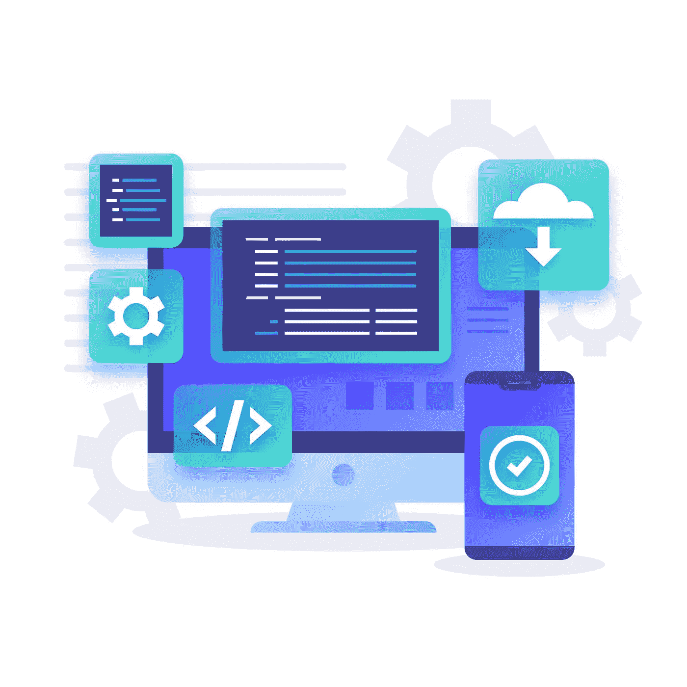

# 电子商务应用程序开发的本地与混合与响应

> 原文：<https://medium.com/geekculture/native-vs-hybrid-vs-responsive-for-ecommerce-app-development-9163fb18891a?source=collection_archive---------13----------------------->

开发应用程序的市场已经发生了变化，从软件设备只面向大型国际公司的时代，到新兴企业选择让他们的应用程序更快地到达他们的客户并更好地服务于他们的消费者的时代。

全球数百万人都可以使用的应用程序，现在是把你的业务放在互联网上的一个关键因素和重要齿轮。通过增加客户满意度，他们有助于建立强大的品牌形象，创造客户信任和忠诚度，并提高公司的销售额和盈利能力。

鉴于亚马逊和 Flipkart 等行业巨头是全球市场最高端、最受欢迎的平台，电子商务领域竞争极其激烈。由于每天都有新企业出现，电子商务已经扩展到包括所有商品的销售，从服装、食品、书籍和电子产品到药物、咨询和治疗。

在竞争激烈的零售环境中，最有效的拓展业务、满足客户需求并保持客户参与度的策略是使用移动设备的电子商务应用来接触目标消费者。创建一个电子商务应用程序可能看起来像一个简单的步骤，以扩大你的在线业务，但它确实包括选择最佳的应用程序开发策略。

**为什么选择应用开发策略很重要？**

如果您想要创建一个高性能、经济且用户友好的程序，做出应用程序开发决策是至关重要的。企业主有一大堆原创的、让消费者满意的想法，他们想要实施，但是他们经常失败，因为他们没有把发展战略考虑进去。

公司所有者和应用程序开发人员可以使用三种基本类型的应用程序开发技术来选择应用程序的设计、功能、成本效益和用户友好性。每种策略为应用程序提供了不同的优点、缺点、可能性和目标。

**电子商务应用开发的三种不同应用方法**

**如下**:

1.本机应用程序开发

2.混合应用程序开发

3.响应式应用程序开发

为了帮助您选择最适合您的应用和您的电子商务网站的发展的选项，我们汇编了每种策略的特点、优势和限制。要确定哪种开发电子商务应用的策略最适合你，请继续阅读。

**本地应用开发**

根据开发语言的不同，本机应用程序一次只能在一个操作系统上运行。简单地说，这些程序是使用特定于操作系统的编程语言创建的。

使用 Swift 为 iOS 设备创建应用程序，而使用 Java 为 Android 设备创建应用程序。因此，对于要在两个操作系统上安装的单个应用程序，开发人员必须维护两个不同的代码。在移动设备上，可以通过谷歌 Play 商店或苹果应用商店(针对 iOS 用户)下载原生应用(针对 Android 用户)。一些著名的本地应用包括 WhatsApp、Twitter 和脸书。

**优势**

**消费者体验**:原生应用程序比混合或响应型应用程序要快得多，也更优化，因为它们一次只针对一个操作系统开发，并且使用平台的核心编程语言和 API 进行整合。它们的加载时间要少得多。原生应用保证了出色的用户体验、出色的结果和工作效率。

**安全性**:由于数据被加密并内置于代码中，本地应用提供了有保证的数据安全性。由于它们是在不使用跨平台工具(如 Xamarin、PhoneGap 或 Ionic)的情况下开发的，因此问题也较少。

**交互性**:由于原生应用的设计可以很容易地与操作系统的大部分功能连接起来，用户体验更加高效和流畅。这使得原生应用程序更直观，与用户的互动更强。

**访问不同的功能**:智能手机的内置功能和操作系统，如摄像头、GPS、媒体播放器、信息、麦克风等。本机应用程序可以访问。这些应用程序还可以充分利用推送通知来通知用户更新、新功能等。由于这些应用程序可以在没有互联网连接的情况下使用，它们也非常可靠。

**混合应用开发**

混合应用程序结合了本地和 web 应用程序的元素，也就是说，它们同时使用 HTML 和 CSS 以及本地编程语言。开发人员创建基于 HTML 的应用程序的核心，然后将其包装在本机设备包装器中，使其能够与 iOS 或 Android 一起工作，并将其称为混合应用程序。

混合应用最好的一点是，它们可以从谷歌 Play 商店或苹果智能手机应用商店下载，并用网络浏览器浏览。

该应用程序的本地组件使用户更容易在移动设备上访问它，其 HTML 核心使它能够在 web 浏览器上运行。网飞、Instagram 和亚马逊是混合应用开发做得很好的例子。

**优点**

**性价比高:**开发混合应用时，开发者避免了必须编写三套不同的代码才能在三个不同的平台(iOS、Android 和 Web 浏览器)上执行一个应用。由于企业节省了时间、金钱和资源，许多人发现这种策略更有吸引力。

**跨平台兼容性**:使用 Xamarin、React Native、Adobe PhoneGap 等跨平台工具，可以轻松为各种操作系统开发混合应用。

**访问简单**:就像本地应用一样，混合应用可以利用运行 iOS 或 Android 的智能手机的 GPS、摄像头和其他内置功能。它也可以在没有 Wi-Fi 连接或互联网连接的情况下工作。

**响应式 Web 应用开发**

虽然企业更喜欢使用应用程序来营销和销售他们的商品和服务，但有趣和吸引人的网络体验也同样重要。响应式 Web Apps 方法是应用程序开发的流行选择，因为它对组织来说有很高的客户保留率。

JavaScript 或 HTML 用于创建响应式 web 应用程序，为应用程序提供类似的用户体验。此外，它们还提供了卓越的移动 web 体验，以及各种网格、高质量图像和布局，以提供引人入胜的用户体验。

**优点**

**成本效益**:响应式网络应用对初创公司来说特别经济，因为所有平台都只有一个代码库和一个应用版本，而且可以从任何设备和操作系统访问。

**用户友好**:基于消费者行为和最受欢迎的屏幕尺寸和分辨率，响应式网络应用是根据用户的需求创建的。web 应用程序被创建为自动调整大小以适应任何大小，并且适合移动查看。

**低维护**:因为 web 程序是一次创建的，只需要一个代码库就可以维护。此外，因为它可以自动修改，所以 web 应用程序在所有设备上使用相同的材料。

***我们相信-***

在为你的电子商务公司选择应用程序开发策略时，通常没有特定的“好”或“坏”

虽然混合应用程序是寻求上网并利用应用程序优势的公司的一个很好的选择，但原生应用程序提供快速的性能、高质量的用户体验和其他有吸引力的功能。希望改善 SEO 并为客户提供用户友好体验的企业应该考虑响应式 web 应用。

然而，你的选择必须得到对这三种策略的仔细理解和对你的电子商务公司策略的回顾的支持。通过了解你的目标市场，设定一个确定的预算，概述你对不同功能的需求和目标，可以帮助你做出正确的决定。

我们有丰富的经验[**开发电子商务应用**](https://www.weblozy.com/services/web-ecommerce) 全面。联系我们，与我们的团队讨论您开发电子商务应用程序的意图！