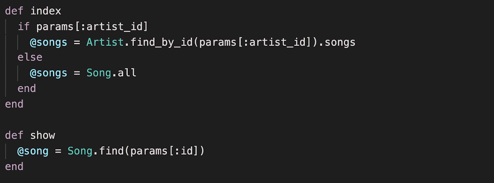
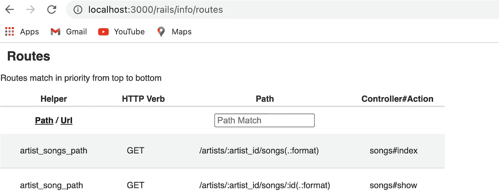

# 在轨道中嵌套路线

> 原文：<https://medium.com/geekculture/nested-routes-5d9bb14c999d?source=collection_archive---------7----------------------->

最近，我开发了我的第一个 Ruby on Rails 应用。项目完成后，我对自己说“哇！多好的旅程啊！”换句话说，我学到了很多。我从头到尾都被一些概念卡住了，但最终还是通过了。

我建立的应用程序是一个简单的模拟[加密货币交易和跟踪网站](https://github.com/slcsta/My-Crypto-Portfolio)。我认为加密货币会是我的 Rails 项目中一个有趣的主题。

在我的代码中最难部署的概念是嵌套路由。为了确保我最终理解了这些复杂的路由，我将解释什么是嵌套路由以及如何使用它们。

**为什么嵌套航线？**

我们使用嵌套路由来:

1.  使代码更具可读性，以及
2.  关联更容易——嵌套总是让我们通过 URL 访问父 id。

**如何使用嵌套路线**

为了简单起见，让我们来看一个艺术家和歌曲的例子，而不是我的加密模型:一个艺术家有许多歌曲，一首歌曲属于一个艺术家。

在嵌套路由中，belongs_to(子)关联始终嵌套在 has_many(父)关联下。第一步是添加嵌套路由，如下所示:

在上面的 Rails 路由器示例中，“索引”和“显示”路由是唯一列出的嵌套路由(可以添加其他资源)。在嵌套下面，请注意歌曲的常规资源路径，这些路径没有嵌套。

添加嵌套路线后，歌曲控制器索引操作将处理非嵌套和嵌套路线:所有歌曲(非嵌套索引)和属于特定艺术家的所有歌曲(嵌套索引)。songs 控制器中需要一个条件语句来考虑这两种情况。

注意，尽管嵌套发生在 artist 下，但我们处理的是 songs 控制器。当有疑问时，总是看一看可用的路线。控制器动作明确说明了我们需要哪个控制器。

回到上面例子中的歌曲控制器。请注意，我们在索引操作中添加了一个条件语句，以检查 params hash: params[:artist_id]中的 artist_id 键。

如果艺术家 id 键存在，Rails 知道控制器正在请求嵌套索引，并以适当的 URL 响应。如果请求嵌套索引，我们将@songs 变量设置为属于该艺术家 id:artist . find(params[:artist _ id])songs 的所有歌曲。

否则(' else ')，如果 params hash 中没有艺术家 id 键，Rails 就知道使用非嵌套索引并访问所有歌曲:Song.all。这有多神奇？！！一旦我们正确地设置了嵌套路由，默认情况下，我们只处理属于特定艺术家的歌曲对象。URL 中的艺术家 id 将我们限制在只属于该艺术家的歌曲对象上。哇！

虽然我们更新了歌曲控制器中的索引动作，但是我们不必对显示动作做任何事情。show 操作将处理嵌套和未嵌套的路由，但将根据路径呈现所请求的任何歌曲集。

如果您想要嵌套一个“new”路径来在一个特定的艺术家下创建一首新歌，请注意，您必须将父元素和子元素都传递到表单中:([@artist，@song])，而不仅仅是(@song)。

像学习 Rails 时的所有事情一样，您一步一步地在代码中走得越多，就越能理解发生了什么。当我第一次接触路由嵌套时，我花了几天时间试图理解代码中发生的事情。我读了一堆解释，但最有帮助的是使用“bye bug”gem 来进入我的代码，以访问与我的语法相关的值。