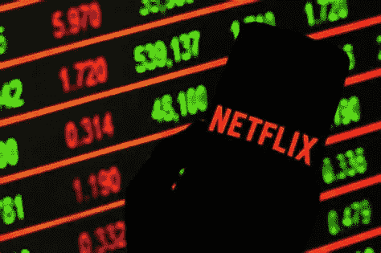
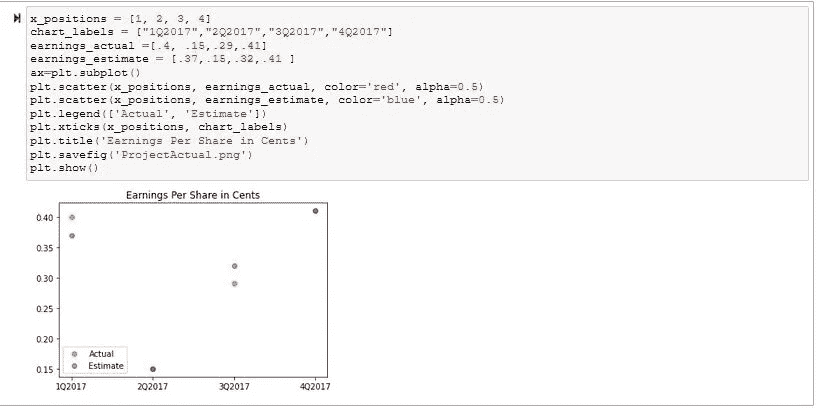
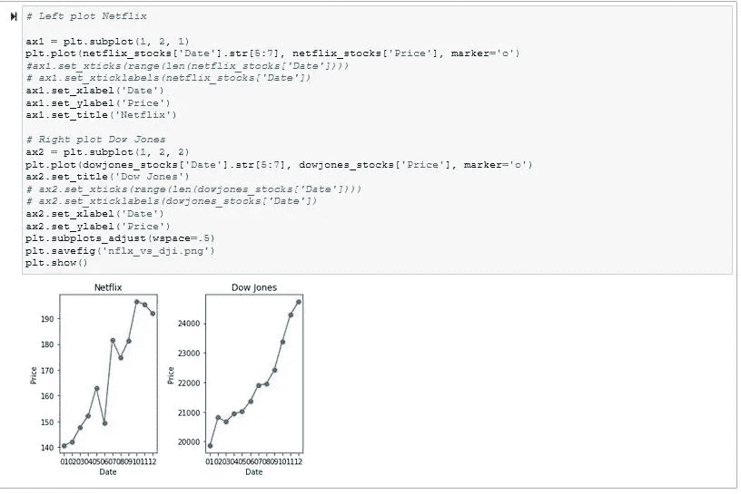

# 网飞& Plot:用 Seaborn、Matplotlib 和 Python 可视化股票

> 原文：<https://medium.com/geekculture/netflix-plot-visualizing-stocks-with-seaborn-matplotlib-and-python-2f4b9a6a1c27?source=collection_archive---------0----------------------->

when netflix and chill isn’t enough

大多数从业者不喜欢提到它，但我只是跟着钱走，没有什么像钱一样影响数据科学。富人可能喜欢宣扬白手起家的故事，但没有什么比硬币更不利于冒险，如果数据科学不是对一个人的处境最无风险的理解，那它是什么？如果你花过时间使用 python 来分析数据，你就会知道 data scientist 对自然界有多么大的启示。在这篇文章中，让我们把它应用到市场中。同志们，我是来给资产阶级的生活方式传播一点光明的。

在这篇文章中，我将了解网飞的股价分布、季度收益、实际与估计收益，以及与 2017 年道琼斯平均指数的比较。我将使用 *matplotlib* 、*熊猫*、 *seaborn、*和 three。csv 文件。一个是网飞、网飞股票季刊，第三个是道琼斯指数。

我注意到“Adj Close”一栏只是资产阶级的说法，指的是经股息和拆分调整后的股票期末价格。我就用**吧。rename()** 函数将其更改为‘Price’。

> *网飞 _ 股票.重命名(column={'Adj Close': 'Price'}，inplace=True)*

好了，现在我想看看网飞股票的季度表现，seaborn 有一个很好的小提琴图来展示这一点。2017 年，我可以看到价值稳步上升。最不寻常的是 Q3 的范围。尽管总体上波动性较小，但波动幅度要大得多。这让我想知道在第三季度(7 月、8 月、9 月)前后消费者发生了什么，或者是否有任何重要的业务举措。

那么，网飞股票的表现是否符合资产阶级的预期呢？我将使用 matplotlib 中的散点图来表示实际收入和估计收入。

对 Q2 和第四季度收益的预测非常接近，而且准确无误。

现在我对网飞有了很好的了解，他们的收入呢？网飞赚取的数字令人印象深刻，但制作所有这些内容也不便宜。我想看收入和收益的条形图比较，matplotlib 正好有这个工具。

等等，什么？我没看错吧？我的意思是收入确实增加了，但是收入也增加了，收入已经比原来高了两倍！我想在这个水平上，一开始都是垄断资金。

让我们看看网飞与道琼斯其他指数相比表现如何。为此，我可以使用 *matplotlib* 并排绘制两个图形。

道琼斯指数似乎更加稳定，我可以从之前的小提琴图上看出第三季度的大幅度波动。网飞当然在回报早期投资者，并且在快速攀升。快，我的无产者同胞们，是时候兑现那些免税的资本收益了！

要分析的东西还很多，我们还可以分析市场的许多其他部分。Python 让你的知识更进一步变得容易，我非常鼓励你花一些时间去学习像这样适用的项目。谁知道你会发现什么！