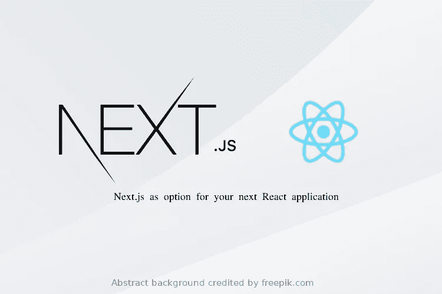

# 接下来…Next.js

> 原文：<https://medium.com/geekculture/next-up-next-js-7b5eca81d212?source=collection_archive---------14----------------------->

如何使用 **Next.js** 将你的 **React** 应用带到下一个层次……生产层次。

用屡试不爽的 create-react-app 命令让 **React** 应用程序没有错。尤其是如果它是小而轻的东西，没有太多的流量或需求。然而，利用 **Next.js** 可以让你的应用程序以更快的加载速度、更好的用户体验和更高的 SEO 效率运行。将其提升到生产质量水平。

# 服务器端渲染与客户端渲染

这些术语用于描述应用程序代码在哪里运行。

简单地解释一下，服务器端在幕后工作，管理呈现的数据，正如你所猜测的，它运行在服务器上。客户端涉及与客户端或用户的 web 浏览器交互的软件数据的显示。

正常使用 React 时，您的站点将在客户端加载。Next.js 的优势在于它有服务器端加载。它使得信息在你的浏览器上加载得更快。我们在这里谈论毫秒！因为它建立在 **React** 库的基础上，所以它拥有与单独使用 **React** 相同的能力和优势，但为了更快的性能对其进行了优化。

有了这个能力，难怪像**星巴克**、**优步**、 **Twitch** 、**网飞**这样的科技巨头都用上了！正是像这样的小优势让这些大牌年复一年地保持领先。

# 自动静态优化

**Next.js** 如何能交付这些闪电般的快速加载时间，就是因为自动静态优化。它确定页面是否可以预呈现(静态)或者是否没有数据块要求。

这允许 **Next.js** 显示包含静态呈现和服务器呈现页面的应用程序。

它实际上是在页面中寻找`getServerSideProps`或`getInitialProps`，如果其中一个出现了，那么 **Next.js** 会将渲染切换到按需(服务器端)。如果它们不存在，它将通过将页面预先呈现为静态 HTML 来自动静态优化页面。

这可以带来快速的特征生产、高性能和简单的用户体验。

# 搜索引擎优化

这种服务器端呈现也有助于您的网站在搜索引擎结果中显示得更靠前，让您在 SEO 上获得优势。由于网站加载速度更快，更多的网站内容可以被搜索引擎优化跟踪扫描。

你也可以编辑一个站点的 HTML 的`<head>`标签，这是 SEO 排名的核心部分。这在常规的**反应**中通常是不允许的，可以被你利用。

对于那些不熟悉搜索引擎优化的人来说，这里有一些好处:

*   为客户或顾客提供更好的可视性
*   为网站带来更多的有机流量
*   关键词可以排名更高
*   竞争优势

# Next.js 10

在 **Next.js** 的加号栏中的另一个标记是他们在不断努力改进。最新的更新添加了大量的新功能，使一个伟大的产品变得更好。以下是开发人员在最新版本中所做的一些新改进的简短列表， **Next.js** 10:

*   [**内置图像组件和自动图像优化**](https://nextjs.org/blog/next-10#built-in-image-component-and-automatic-image-optimization) :使用新的`next/image`组件自动优化图像
*   [**国际化路由**](https://nextjs.org/blog/next-10#internationalized-routing) :用内置原语开始国际化您的 Next.js 应用程序
*   [**next . js Analytics**](https://nextjs.org/blog/next-10#nextjs-analytics):衡量真实用户表现并采取行动
*   [**next . js Commerce**](https://nextjs.org/blog/next-10#nextjs-commerce):高性能电子商务网站的一体化入门套件
*   [**React 17 支持**](https://nextjs.org/blog/next-10#react-17-support) :最新的 React 版本完全兼容 Next.js
*   [**从第三方 React 组件**](https://nextjs.org/blog/next-10#importing-css-from-third-party-react-components) 导入 CSS:现在支持从 npm 导入组件所需的 CSS

你可以在他们的网站[Nextjs.org](https://nextjs.org/blog/next-10)上查看改进/增加的完整列表及其深入的解释。

# 结论

我认为 **Next.js** 保留了一个严格 React 站点的所有精彩特性，但是增加了一些特性来帮助你的项目脱颖而出。精英团队一直在寻找一种方法来提供更好的支持和新功能， **Next.js** 肯定不会很快消失。

希望这对于那些希望在他们的下一个项目中使用 **Next.js** 或者为他们的堆栈添加新内容的人来说是有益的。如果你喜欢这些内容，可以看看我的其他博客，也可以在我的 LinkedIn 上和我联系。编码快乐！

 [## Jamon Dixon -熨斗学校-德克萨斯州奥斯汀大都会区| LinkedIn

### 全栈式 web 开发人员，对事物的工作原理充满好奇，并具有解决问题的能力。拥有强大的…

www.linkedin.com](https://www.linkedin.com/in/jamondixon/)