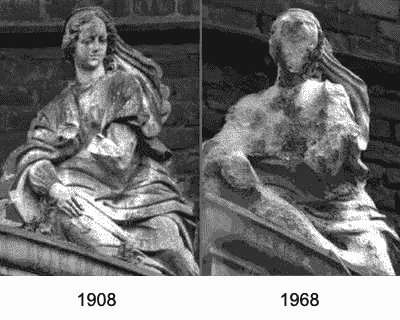

# 没有记忆可以永恒

> 原文：<https://medium.com/geekculture/no-memory-can-last-forever-5d703a0a1431?source=collection_archive---------54----------------------->

在大数据时代保存信息可能是一项非常具有挑战性的任务

Photo by [Joshua Sortino](https://unsplash.com/@sortino?utm_source=medium&utm_medium=referral) on [Unsplash](https://unsplash.com?utm_source=medium&utm_medium=referral)

在一个著名的虚构故事中， [*Funes el memorioso*](http://vigeland.caltech.edu/ist4/lectures/funes%20borges.pdf) ，**Jorge Luis Borges**(1899–1986)讲述了 Ireneo Funes 的故事，他从马背上摔下来，头部受到严重冲击，突然获得了惊人的记忆力。富内斯绝对能够记住他所经历的一切:*他知道 1882 年 4 月 30 日早晨南方天空中的云的形状，他可以将记忆中的云与他只看过一次的一本书的大理石装帧中的纹理进行比较*，博尔赫斯写道。

记忆行为在人类生活中至关重要，记忆的丧失会导致巨大的痛苦，就像老年人患痴呆症一样。然而，即使是在一个完全健康的人的情况下，无论记忆的对象有多重要，记忆往往会随着时间的推移而减弱，这是一个共同的经历。第一个系统研究这一现象的人可能是普鲁士哲学家赫尔曼·艾宾浩斯(1850-1909)，他对人类记忆的持久性进行了一系列研究，最终在 1885 年出版了一本名为《记忆:对实验心理学的贡献》的书。艾宾浩斯发现了“遗忘曲线”，这是一条指数递减的曲线，表明记忆能力，除非不断加强，否则往往每小时左右减半。

不仅人类的记忆注定会随着时间而消失，而且实物、人工制品、纪念碑和景观也需要定期维护，以平衡时间的影响，从而改变形状和层次差异(如图 1 所示)，遵循熵增加的普遍趋势。

Figure 1

> 数字存储器也不例外。当人们对使用大量数字数据来塑造我们文明的发展寄予厚望时，与保存这些数据相关的方面必须引起每个人的注意。

在数字设备中，信息通常以二进制数的形式存储，其中“0”位的值与“1”位相同，通常使用这种设备的抽象表示，表示为动态系统，具有两个能量相等的稳定状态，由一个势垒隔开(见图 2)。势垒将两个逻辑状态(x <0, representing bit “0” and x> 0，表示位“1”)分开，并将动态限制在一个状态内，如记忆过程所要求的。这显然是一种非平衡状态，在系统弛豫时间内演变为热平衡。随着这一过程的发生，存储误差累积到当达到热平衡时，所存储的比特在统计上丢失的程度。

Figure 2

因此，为了防止信息丢失，通常在存储器件中建立一个与弛豫过程相反的过程。在实际的数字存储器中，这是通过循环刷新操作实现的，包括以周期性间隔执行的读取和重写存储过程。

诸如:为了防止数字存储器的内容丢失，你需要多久刷新一次？数字记忆的保存需要多少能量？一段记忆有最长持续时间吗？必须非常小心地接近它们。

在最近的工作中( [D. Chiuchi、M. López-Suárez、I. Neri、M. C. Diamantini 和 L. GammaitoniPhys. Rev. A 97，052108，2018](https://arxiv.org/pdf/1703.05544) )在 NiPS(物理系统中的噪声)实验室，我们通过采用一种基于存在波动的双稳态势的动力学模型解决了这些问题。

> 我们得出的结论很有趣，而且在某些方面出乎意料。

**第一个结论是好消息**:为了以给定的错误概率在给定的时间内保持记忆，只要刷新过程执行得任意频繁或接近热平衡，确实有可能花费任意少量的能量。

第二个结论不是那么好的消息:无论我们投入多少精力，多久刷新一次，或者我们的操作有多接近平衡，在一个有限的时间之后，任何记忆都将不可挽回地丢失。

实际上，典型的刷新时间对于 DRAM 是毫秒级的，对于 eDRAM 是微秒级的。根据我们愿意在记忆中容忍的错误概率，会有一个与记忆本身相关的最大持续时间。只是给你一个想法，如果我们要制造微机电存储器，其中逻辑位被编码在可观察的位置，并且两个逻辑状态相距 1 nm，那么在室温下，百万分之一的可接受误差概率将给出 2 年的最大持续时间。如果我们愿意接受万分之一的误差概率，那么最大持续时间将是 200 年。我们等待的时间越长，出错的概率就越大。

任何可能的存储介质都有一个最大持续时间，这可能会令人吃惊。另一方面，我们习惯了构成过去时代记忆的古代文物和绘画。每个记忆的有限持续时间法则也适用于他们。它们是模拟记忆，记录着其他人在其他时间编码的信息。

> 每种形式的存储器都有其必要的刷新周期和最大持续时间，这取决于制造它的材料支持的特定性质。如果不进行刷新，对于电子数字存储器来说，它可以是几秒钟，对于精心保存的纪念碑来说，它可以是几十万年。

我们能够保存我们社会产生的大量数字数据吗？如果是这样，会持续多久？

我们必须意识到，如果我们决定建立一个基于数字数据的未来社会，那么最好意识到它不会永远持续下去:我们的记忆越不稳定、越容易出错，它们的持续时间就越短。因此，这将发生在我们的社会。